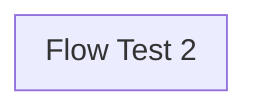

# ADR-002: Flow Test 2

## Status

Rascunho — 2026-07-07

## Contexto

Design gerado a partir do canvas "Flow Test 2". Esta documentação foi gerada automaticamente e precisa de revisão.

## Decisão

<!-- Descreva aqui as decisões técnicas tomadas neste design -->

## Diagrama

## Componentes

<!-- Lista de componentes envolvidos -->

| Componente | Tipo | Provedor |
|------------|------|----------|
| _(auto-preenchido)_ | — | — |

## Consequências

<!-- Impactos positivos e negativos desta decisão -->

- **Positivas**: (pendente)
- **Negativas**: (pendente)
- **Riscos**: (pendente)
