# CloudBuilder — Arquitetura do Sistema

**Versão**: 1.0.0  
**Última atualização**: 2026-06-17  
**Framework**: FAANg (Future Autonomous AI Network for Engineering)  
**Stack**: React 19 + Java 21 + Go 1.22 + PostgreSQL 16

---

## 1. Visão Geral da Arquitetura

CloudBuilder é uma plataforma de **Platform Engineering** completa e **100% nativa** — sem dependências de ferramentas externas como Grafana, Prometheus, Datadog, Terraform Cloud ou OpenTelemetry. Tudo é implementado diretamente na plataforma.


### Stack Completo

| Camada | Tecnologia | Versão |
|--------|-----------|--------|
| **Frontend** | React + TypeScript + Vite | 19.1.0 / 5.x |
| **Canvas** | ReactFlow (@xyflow/react) | 12.6.0 |
| **State** | Zustand | 5.0.3 |
| **UI** | shadcn/ui + Tailwind CSS | 4.x |
| **Icons** | lucide-react | 0.474.x |
| **Charts** | Recharts | 3.8.x |
| **Backend** | Java + Spring Boot + Modulith | 21 / 3.4.4 |
| **Build** | Maven | 3.9.x |
| **Engine** | Go + Cobra CLI + gRPC | 1.22 |
| **Database** | PostgreSQL / H2 (test) | 16 |
| **Cache** | Caffeine (in-process) | 3.x |
| **Auth** | JWT (jjwt 0.12.6) + Spring Security | — |

---

## 2. Arquitetura do Frontend

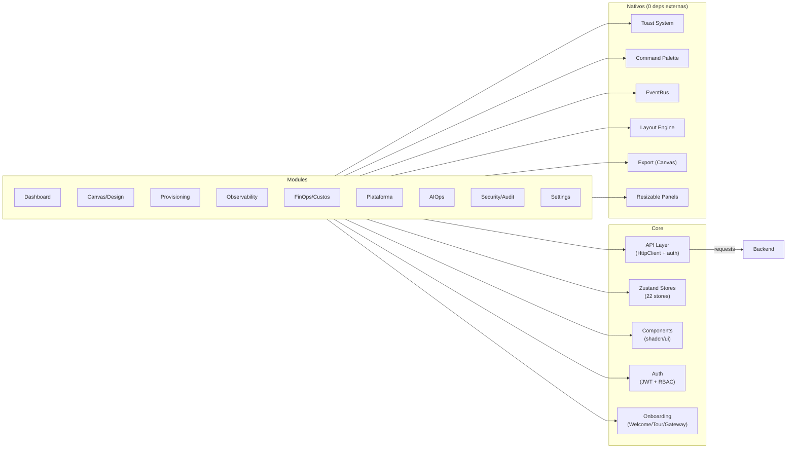

### Estrutura de Módulos

```
frontend/src/
├── modules/
│   ├── canvas/           ★ Completo — Canvas, Palette, Properties, Validation, AI Chat, Code Preview
│   ├── provisioning/     ★ Completo — Terraform executor, CI/CD, Deployment, GitOps, Import
│   ├── observability/    ✅ — Health, alerts, drift, DR, ServiceMap, Scorecard, Metrics, Traces, Logs, SLO
│   ├── finops/           ✅ — Cost dashboard, budgets, anomalies, projections, what-if
│   ├── platform/         ✅ — Catalog, marketplace
│   ├── ai/               ✅ — AI assistant, incident fix, runbooks, post-mortem
│   ├── security/         ✅ — Audit, IAM, Rego policies, compliance
│   ├── dashboard/        ✅ — Widgets, overview, analytics
│   └── settings/         ✅ — Configurations, feature flags, docs, repos
├── store/              22 Zustand stores
├── components/ui/      23 shadcn/ui wrappers
├── api/                API client layer (9 files)
├── lib/                Utils, Toast, Command
└── services/           Collaboration, EventBus
```

### Gerenciamento de Estado (Zustand)

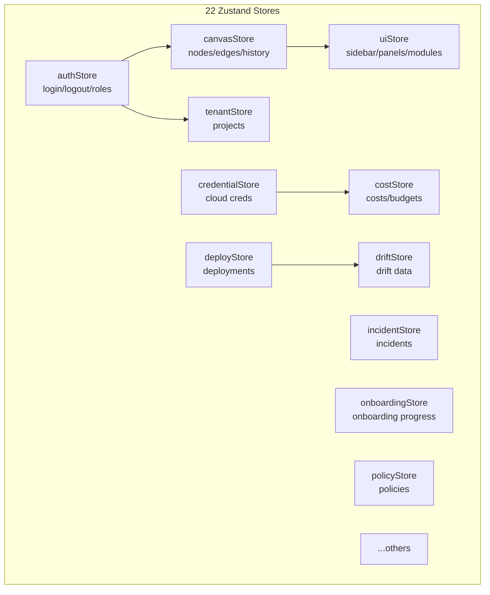

### Sistema de Toast Nativo (substituiu react-hot-toast)

```typescript
// Singleton emitter pattern — funciona fora do React
showSuccess('Design salvo!')  // 3s, verde-lime
showError('Falha na conexão')  // 4s, vermelho
showInfo('Processando...')     // 3s, ice-blue
showWarning('Atenção!')        // 4s, amarelo
showApiError(err)              // extrai mensagem de ApiError
```

O `ToastProvider` é montado no `App.tsx` e renderiza um portal fixo no canto inferior direito. Usa `useSyncExternalStore` para sincronizar o estado do singleton com o React.

---

## 3. Arquitetura do Backend

### Spring Modulith — Hexagonal por Módulo

Cada módulo segue arquitetura hexagonal (ports & adapters):

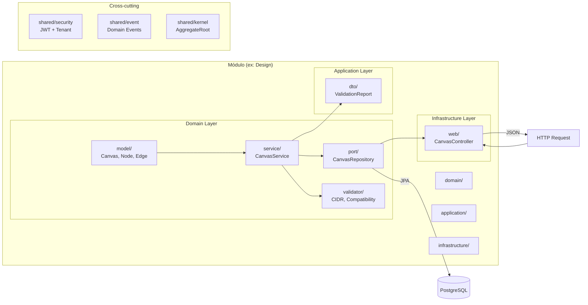

### Módulos do Backend

| Módulo | Status | Arquivos | Responsabilidade |
|--------|--------|----------|-----------------|
| **design** | ★ Complete | 26 | Canvas, Nodes, Edges, Versões, Validação |
| **provision** | ★ Complete | 47 | Code gen, Deploy, DR, Ephemeral, Import |
| **iam** | ★ Complete | 24 | User, Role, Permission, Tenant, JWT |
| **observe** | ✅ Complete | 10 | Alertas, Health, Service Health |
| **cost** | ✅ Complete | 7 | Budget, Cost Records, Otimização |
| **platform** | ✅ Complete | 10 | Catalog, Marketplace, Partners |
| **aiops** | ✅ Complete | 11 | Incidents, AI Query, Chat |
| **git** | ✅ Complete | 20 | Git Scanner, IaC Detector, Pipeline |
| **github** | ✅ Complete | 8 | GitHub OAuth, API Client |
| **multiregion** | ✅ Complete | 21 | Regions, DR Tests, Health |
| **tenant** | ✅ Complete | 9 | Projects, Members |
| **audit** | ✅ Complete | 5 | Audit Events |
| **apm** | ✅ Complete | 5 | Traces, Spans, Snapshots |
| **metrics** | ✅ Complete | 6 | Metrics, Resource Metrics |
| **codeanalysis** | ✅ Complete | 4 | Code Analysis |
| **credential** | ✅ Complete | — | Cloud Credentials, Secrets Encryption |
| **environment** | ✅ Complete | — | Managed Environments, State |
| **approval** | ✅ Complete | — | Approval Workflows, Gates |
| **deployment** | ✅ Complete | — | Deploy Pipeline, Ephemeral, Promote |
| **docs** | ✅ Complete | — | Doc Scanner, Auto-Documentation, ADR |
| **featureflags** | ✅ Complete | — | Feature Flags, Toggle, Cache |
| **search** | ✅ Complete | — | Full-Text Search, Indexing |
| **analytics** | ✅ Complete | — | Analytics Aggregation, Rollup |
| **observability** | ✅ Complete | — | Traces, Spans, APMSnapshot, Logs |

### Rotas da API

**Método** | **Path** | **Módulo**
-----------|----------|-----------
POST/GET/PUT/DELETE | `/api/v1/canvases` | Design
POST/PUT/DELETE | `/api/v1/canvases/{id}/nodes` | Design
POST/DELETE | `/api/v1/canvases/{id}/edges` | Design
POST | `/api/v1/canvases/{id}/validate` | Design
POST | `/api/v1/canvases/{id}/generate` | Provision
POST | `/api/v1/environments/{id}/sync` | Provision
GET/POST | `/api/v1/environments/{id}/drift` | Provision
GET | `/api/v1/observe/dashboard/{id}` | Observe
GET | `/api/v1/observe/alerts/{id}` | Observe
GET | `/api/v1/cost/overview/{id}` | Cost
GET/POST | `/api/v1/cost/budgets` | Cost
GET/POST/PUT/DELETE | `/api/v1/platform/catalog` | Platform
GET/POST | `/api/v1/platform/marketplace` | Platform
POST | `/api/v1/aiops/query` | AIOps
POST/GET | `/api/v1/auth/**` | IAM
GET | `/api/v1/audit/events` | Audit
GET | `/api/v1/metrics/**` | Metrics
GET/POST | `/api/v1/regions/**` | MultiRegion
GET/POST | `/api/v1/git/**` | Git
GET/POST | `/api/v1/github/**` | GitHub
GET/POST | `/api/v1/projects/**` | Tenant
GET/POST | `/api/v1/apm/**` | APM
POST | `/api/v1/code-analysis/**` | CodeAnalysis

---

## 4. Fluxo de Autenticação e Autorização

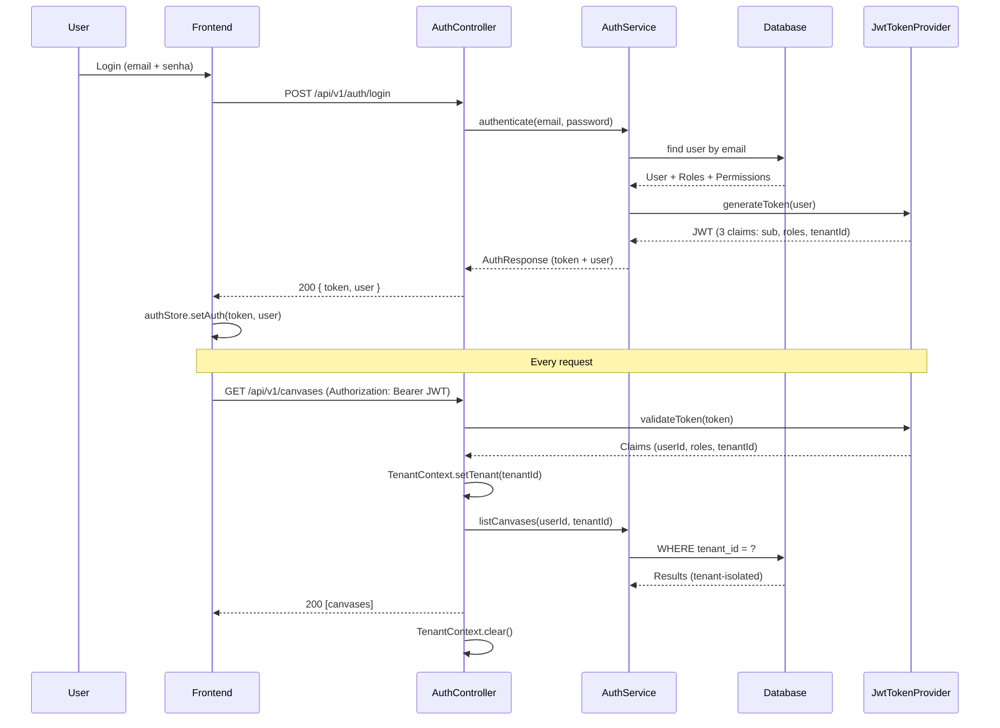

### RBAC — Papéis e Permissões

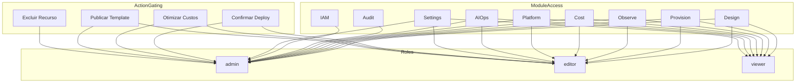

### Multi-tenancy

- Isolamento por `tenantId` em todas as tabelas
- `TenantFilter` — filtro automático via JPA
- `TenantContext` — ThreadLocal propagado por toda a request
- Headers: `X-Tenant-Id` (opcional, detectado do JWT se ausente)

---

## 5. Fluxo de Dados — Design → Provision → Deploy

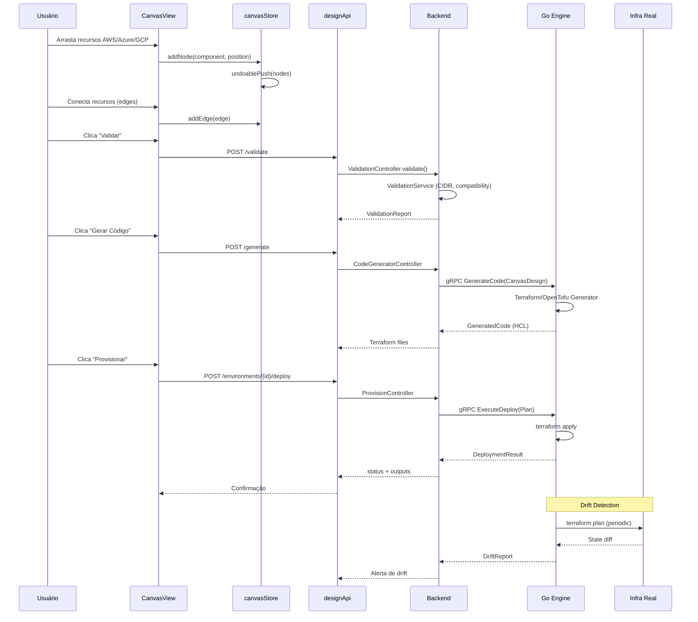

---

## 6. Onboarding Flow

Implementado em 3 estágios:

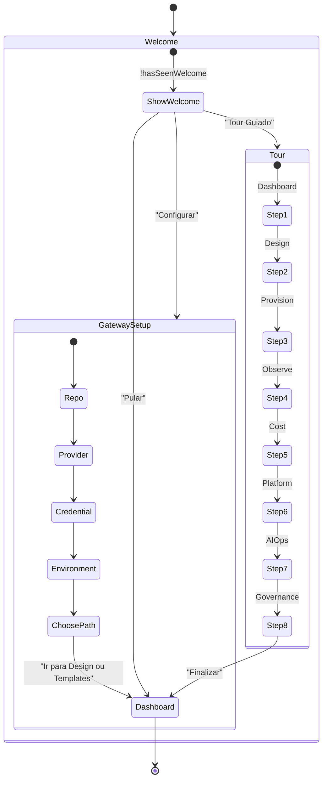

### Personas (docs/personas/README.md)

| Persona | Perfil | Preferência Onboarding |
|---------|--------|----------------------|
| **Rafael** | Arquiteto de soluções | Configurar plataforma → Gateway Setup |
| **Marina** | DevOps Sênior | Tour completo → Setup |
| **Diego** | Dev Júnior | Tour guiado |
| **Carla** | Head de Plataforma | Pular onboarding → Dashboard |

---

## 7. Observabilidade Nativa

A plataforma substituiu Grafana, Prometheus, OpenTelemetry e Datadog por implementação própria:

```mermaid
graph TD
    subgraph Ingestion["Coleta de Dados"]
        LOG[PostgresLogAppender<br/>Async Logback]
        MET[MetricsService<br/>Micrometer + PostgreSQL]
        TRACE[TraceContext<br/>ThreadLocal + AOP]
        HC[HealthCheckService<br/>Scheduled]
    end

    subgraph Storage["Armazenamento"]
        PG[(PostgreSQL 16)]
        PART["Particionamento Mensal<br/>metrics_ts, traces, logs"]
        COMP["Índices compostos<br/>tenant + time-range"]
    end

    subgraph Alerting["Alertas"]
        AE[AlertEvaluationService<br/>@Scheduled 30s]
        AR[AlertRule<br/>threshold/percentil]
        INC[Incident<br/>Ack / Resolve]
        NOTIF[Notification<br/>Channel]
    end

    subgraph SLO["SLO Framework"]
        SLO[SloService<br/>@Scheduled hourly]
        SLI["SLI Metrics<br/>latency, availability"]
        BUDGET["Error Budget<br/>consumption tracking"]
    end

    subgraph UI["Dashboards"]
        DASH["6 Views<br/>Métricas, Traces, Logs<br/>Alertas, Incidentes, SLO"]
        SSE[useSSE Hook<br/>Streaming real-time]
        CHART["Chart Components<br/>Recharts + Brand"]
    end

    LOG --> PG
    MET --> PG
    TRACE --> PG
    HC --> PG
    PG --> AE
    AE --> INC
    INC --> NOTIF
    PG --> SLO
    PG --> UI
    UI --> SSE
    UI --> CHART
    MET --> CHART
```

---

## 8. Provision Engine (Go)

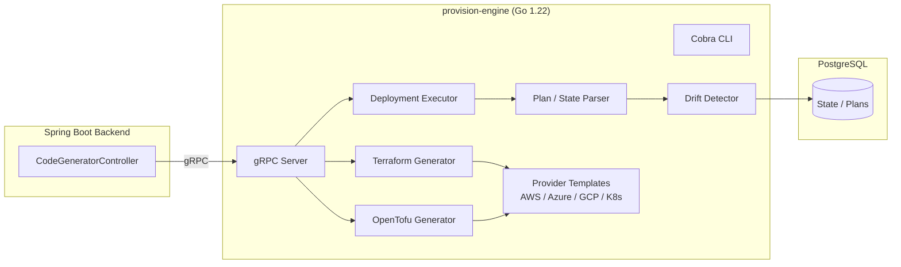

---

## 9. Deployment & Infraestrutura

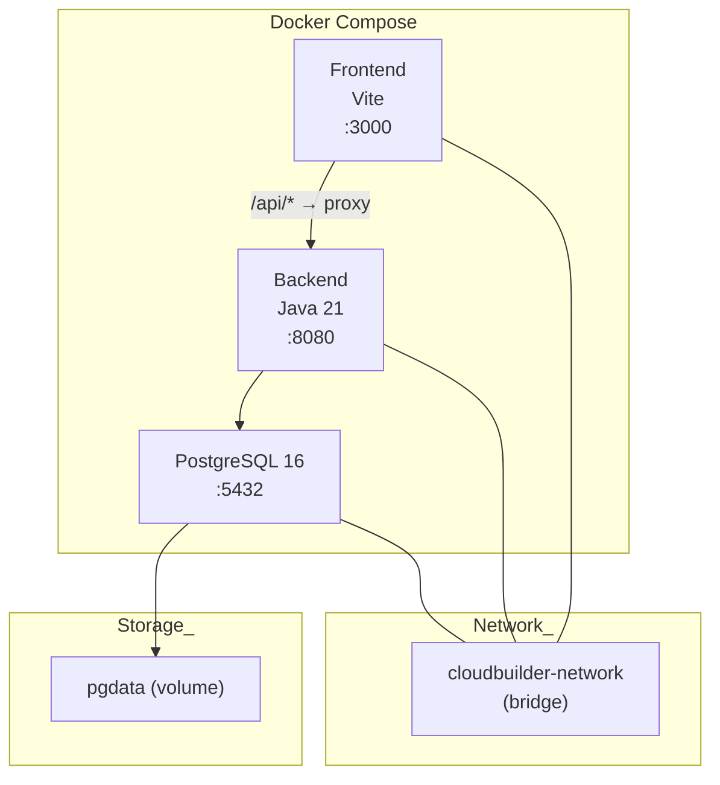

### Docker Compose (pós-cleanup)

| Serviço | Porta | Imagem | Dependências |
|---------|-------|--------|-------------|
| PostgreSQL | 5432 | postgres:16-alpine | — |
| Backend | 8080 | Dockerfile (backend/) | PostgreSQL |
| Frontend | 3000 | Dockerfile (frontend/) | Backend |

### Serviços removidos (Phase 4 — $0 infra cleanup)

| Serviço | Motivo | Substituição |
|---------|--------|-------------|
| Kafka + Zookeeper | Custo operacional | Spring events (in-process) |
| Redis | Custo de memória | Caffeine in-process |
| OpenTelemetry Collector | Dependência externa | Native metrics (PostgreSQL) |
| Prometheus | Dependência externa | Native metrics service |
| Grafana | Dependência externa | Native dashboard views |
| OPA | Dependência externa | Rego policies via in-process evaluation |
| Provision Engine | Custo operacional | Backend code generation (Spring) |

---

## 10. Dependências Nativas (Phase 4)

Todas as dependências npm substituídas por implementações nativas:

| Biblioteca Externa | Substituição Nativa | Arquivo | Data |
|-------------------|-------------------|---------|------|
| `dagre` | `simpleDagreLayout()` — topological-sort | `canvasStore.ts` | 2026-06-17 |
| `html-to-image` | Canvas API + foreignObject SVG | `DesignModule.tsx` | 2026-06-17 |
| `react-resizable-panels` | CSS Grid + drag handles | `resizable.tsx` | 2026-06-17 |
| `react-hot-toast` | Singleton emitter + Portal | `toast.tsx` | 2026-06-17 |
| `cmdk` | React state + keyboard nav | `command.tsx` | 2026-06-17 |
| `yjs` | Native EventBus + WebSocket JSON | `yjsBridge.ts` | 2026-06-17 |

**Total de dependências removidas**: 7 (incluindo `y-websocket`)  
**Redução de bundle**: ~322KB gzip (medido anteriormente)  
**Estratégia**: Singleton emitter para utilities (toast), substituição direta para componentes (command, resizable), refatoração inline para algoritmos (dagre, export)

---

## 11. Métricas de Performance

| Métrica | Valor | Alvo |
|---------|-------|------|
| **Bundle principal** | 322KB gzip | < 400KB |
| **Módulos TS** | 2.829 | — |
| **Build time** | 8.84s | < 15s |
| **Testes frontend** | 62 (5 suites) | 100% pass |
| **Testes backend** | 479 (33 suites) | 98.7% pass (6 pre-existing failures) |
| **Testes Go** | 23 | 100% pass |
| **E2E Playwright** | 5 (smoke) | 100% pass |
| **TypeScript** | 0 erros | 0 erros |

---

## 12. Architecture Decision Records

| ADR | Título | Status |
|-----|--------|--------|
| ADR-008 | [Observabilidade Nativa](adr-008-native-observability.md) | ✅ Implementado |
| ADR-009 | [Auto-Documentation Feature](adr-009-auto-documentation.md) | ✅ Implementado |
| ADR-010 | [Backend Quality Gate](adr-010-backend-quality-gate.md) | ✅ Implementado |
| ADR-011 | [Cost Preview Persistence](adr-011-cost-preview-persistence.md) | ✅ Implementado |
| ADR-012 | [Q3 Operations Architecture](adr-012-q3-operations-architecture.md) | ✅ Implementado |
| ADR-013 | [LLM Provider Abstraction](adr-013-llm-provider-abstraction.md) | ✅ Implementado |
| ADR-014 | [Catalog Version History](adr-014-catalog-version-history.md) | ✅ Implementado |
| ADR-015 | [Marketplace Browser Architecture](adr-015-marketplace-browser-architecture.md) | ✅ Implementado |
| ADR-016 | [GitOps Webhook Event-Driven](adr-016-gitops-webhook-event-driven.md) | ✅ Implementado |
| ADR-017 | [Hybrid Auto-Remediation](adr-017-hybrid-auto-remediation.md) | ✅ Implementado |
| ADR-018 | [TOTP MFA + JWT Refresh Rotation](adr-018-totp-mfa-jwt-refresh-rotation.md) | ✅ Implementado |
| ADR-019 | [Multi-Region Logical Replication](adr-019-multi-region-logical-replication.md) | ✅ Implementado |
| ADR-020 | [Policy-as-Code OPA](adr-020-policy-as-code-opa.md) | ❌ Não Implementado |
| ADR-021 | [Search Hexagonal Architecture](adr-021-search-hexagonal-architecture.md) | 📝 Proposto |
| ADR-022 | [API Versioning Strategy](adr-022-api-versioning-strategy.md) | 📝 Proposto |
| ADR-023 | [Circuit Breaker External Clients](adr-023-circuit-breaker-external-clients.md) | 📝 Proposto |
| ADR-024 | [Analytics Aggregation Strategy](adr-024-analytics-aggregation-strategy.md) | ⚠️ Implementado (com bugs) |
| ADR-025 | [SSO Authentication Flow](adr-025-sso-authentication-flow.md) | ⚠️ Implementado (com bugs) |
| ADR-026 | [Enterprise Identity SCIM Provisioning](adr-026-enterprise-identity-provisioning.md) | 📝 Proposto |
| ADR-027 | [Performance Optimization Strategy](adr-027-performance-optimization-strategy.md) | 📝 Proposto |
| ADR-028 | [Security Hardening & Secrets](adr-028-security-hardening-secrets-management.md) | 📝 Proposto |
| ADR-029 | [Compliance & Governance Framework](adr-029-compliance-governance-framework.md) | 📝 Proposto |
| ADR-030 | [Production Readiness & Stabilization](adr-030-production-readiness-stabilization.md) | 📝 Proposto |

**Total: 23 ADRs** (008-030) — 12 implementados ✅, 2 implementados com bugs ⚠️ (024-025), 1 não implementado ❌ (ADR-020 OPA), 8 propostos 📝 (021-023, 026-030)

---

### Summary by Release

| Release | ADRs | Status |
|---------|------|--------|
| **Q2 2026 — Foundation** (Sprints 1-8) | 008-012 | ✅ 5 implementados |
| **Q3 2026 — Operations** (Sprints 9-14) | 012-019 | ✅ 8 implementados |
| **Q4 2026 — Intelligence** (Sprints 15-21) | 020-025 | 1 implementado, 2 implementados com bugs, 1 não imp., 2 propostos |
| **Q1 2027 — Scale** (Sprints 22-30) | 026-030 | 📝 5 propostos |

---

## 13. Roadmap (12 Meses)


---

## 14. Padrões e Convenções

### Frontend
- UI text em **PT-BR** (labels, tooltips, placeholders, erros)
- Ícones: **lucide-react** (nunca Material Icons)
- Classes condicionais: `cn()` de `@/lib/utils`
- Cores: `brand-navy` (#0a1128), `brand-lime` (#ccff00), `brand-ice-blue` (#E3E2FD)
- Estado: **Zustand** stores
- IDs: **nanoid** (string)
- Canvas: `XYPosition` (typed x/y)

### Backend
- **Sem Lombok** (JDK 25 incompatível)
- Getters/setters explícitos
- Hexagonal architecture: `domain/` → `application/` → `infrastructure/`
- UUID para IDs (`java.util.UUID`)
- JSON string para `properties` (`columnDefinition = "TEXT"`)
- `@NullMarked` em todos os pacotes
- Multi-tenant via `tenantId` + `TenantFilter`

### Go Engine
- Module: `github.com/cloudbuilder/provision-engine`
- Go 1.22 + toolchain go1.22.10
- Cobra CLI + gRPC server
- Zerolog para logging

---

## 15. Arquitetura EDA — Diagramas (Planejado — ADR-035)

> **Status**: Kafka foi removido na Phase 1 ($0 infra cleanup). A reintrodução está planejada via ADR-035 (Event-Driven Architecture). Os diagramas abaixo documentam a arquitetura EDA pretendida para quando o Kafka for reintegrado.

CloudBuilder adota uma arquitetura orientada a eventos (Event-Driven Architecture) baseada em Apache Kafka. Esta seção apresenta os 10 diagramas Mermaid que documentam a arquitetura EDA completa. Para documentação detalhada, consulte [EDA README](./eda/README.md) e [ADR-035](./adr-035-production-event-driven-architecture.md).

### 15.1 External Systems → Kafka

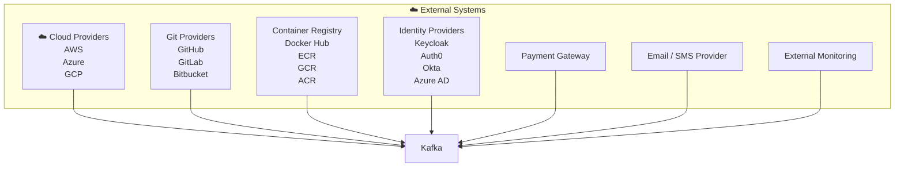

### 15.2 Internal Producers → Kafka

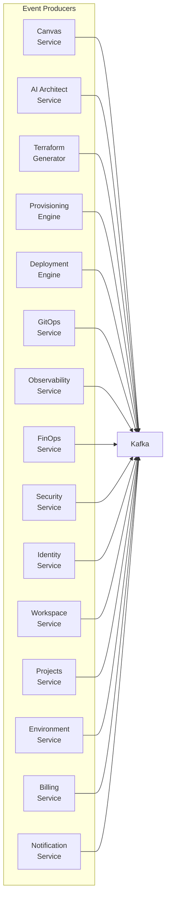

### 15.3 Kafka Cluster Internals

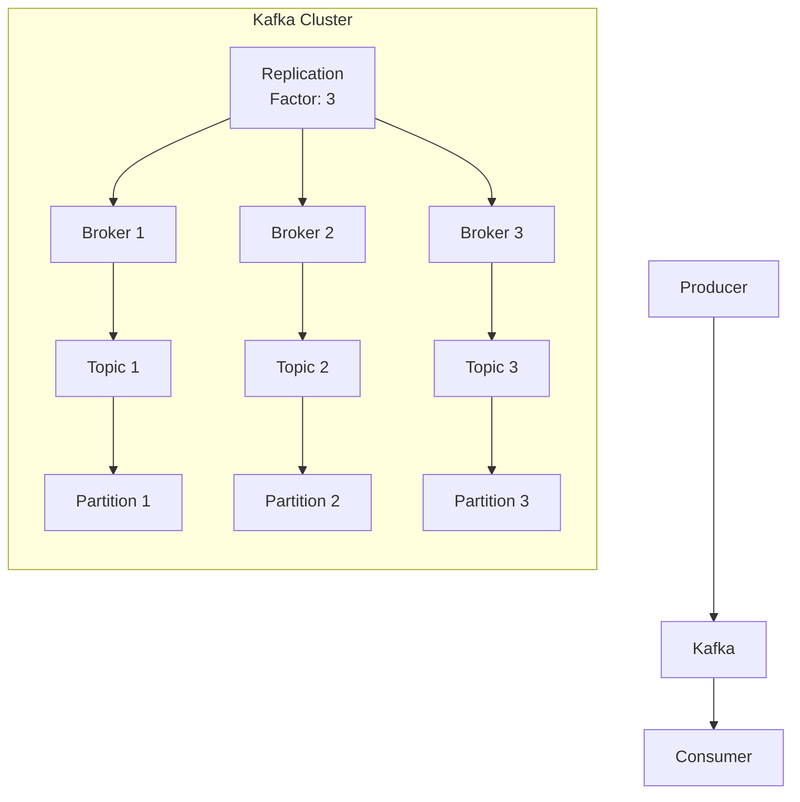

### 15.4 Event Topics Catalog (20 Topics)

```mermaid
flowchart TB
    Kafka["Apache Kafka\nEvent Bus"]

    Kafka --> canvas_events["canvas.events"]
    Kafka --> architecture_events["architecture.events"]
    Kafka --> terraform_events["terraform.events"]
    Kafka --> provisioning_events["provisioning.events"]
    Kafka --> deployment_events["deployment.events"]
    Kafka --> gitops_events["gitops.events"]
    Kafka --> kubernetes_events["kubernetes.events"]
    Kafka --> resource_events["resource.events"]
    Kafka --> observability_events["observability.events"]
    Kafka --> finops_events["finops.events"]
    Kafka --> billing_events["billing.events"]
    Kafka --> security_events["security.events"]
    Kafka --> identity_events["identity.events"]
    Kafka --> notification_events["notification.events"]
    Kafka --> audit_events["audit.events"]
    Kafka --> ai_events["ai.events"]
    Kafka --> policy_events["policy.events"]
    Kafka --> inventory_events["inventory.events"]
    Kafka --> system_events["system.events"]
    Kafka --> cost_events["cost.events"]
```

### 15.5 Consumer Services

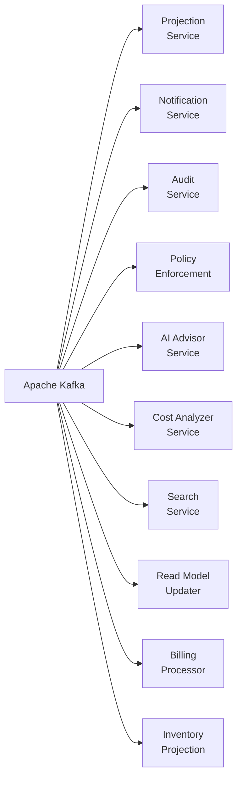

### 15.6 Projection Storage (Read Models)

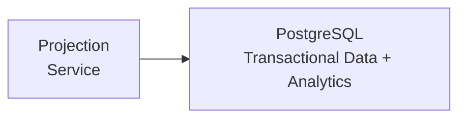

### 15.7 Reliability Patterns (Outbox → Inbox → Saga → DLQ)

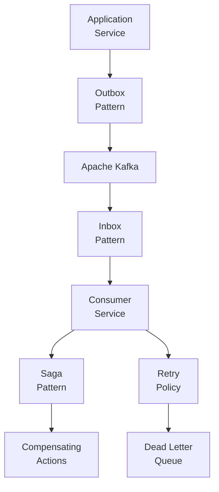

### 15.8 Cross-cutting Concerns

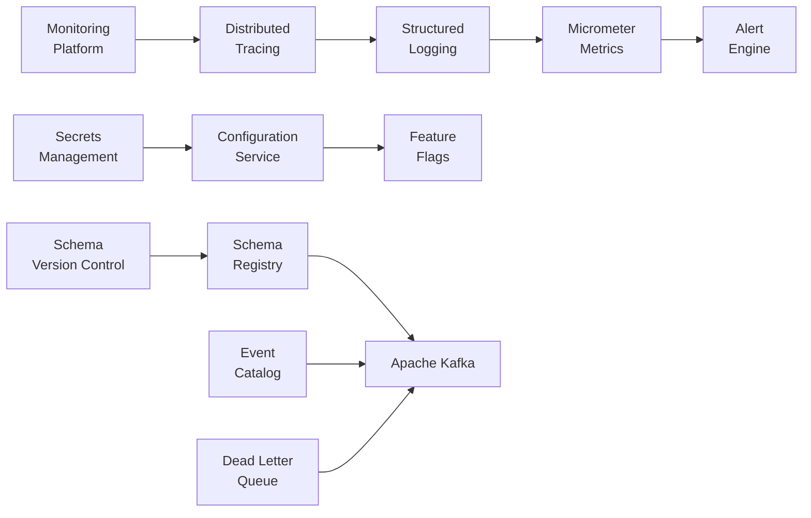

### 15.9 Event Flow Sequence

```mermaid
sequenceDiagram
    participant Producer as Producer Service
    participant Kafka as Apache Kafka
    participant Consumer as Consumer Service
    participant ReadModel as Read Model Store
    participant User as End User

    Producer->>Kafka: Publish Event
    Kafka-->>Consumer: Consume Event
    Consumer->>Consumer: Business Logic
    Consumer->>ReadModel: Update Projection
    ReadModel-->>User: Updated Eventually
```

### 15.10 High-Level Architecture Overview

```mermaid
flowchart LR
    User["👤 User"]

    User --> Producers["Event\nProducers"]
    Producers --> Kafka["Apache\nKafka"]
    Kafka --> Consumers["Event\nConsumers"]
    Consumers --> ReadModels["Read\nModels"]
    ReadModels --> UI["🖥️ UI\nDashboard"]

    Consumers --> Notification["📧 Notification\nService"]
    Consumers --> Audit["📋 Audit\nService"]
    Consumers --> AI["🤖 AI\nAdvisor"]
    Consumers --> Cost["💰 Cost\nAnalyzer"]
    Consumers --> Search["🔍 Search\nService"]
```

---

## 16. Configurações da Plataforma — Diagramas

Diagramas de configuração do sistema e do usuário, documentando a hierarquia de settings, RBAC, contas cloud e integrações. Para documentação detalhada, consulte [Platform Settings DIAGRAMS](./platform-settings/DIAGRAMS.md).

### 16.1 Platform Administration

```mermaid
flowchart TB
    subgraph PlatformAdministration["⚙️ Platform Administration"]
        direction TB
        Settings["System Settings"]
        FeatureFlags["Feature Flags"]
        Identity["Identity Providers"]
        CloudProviders["Cloud Providers"]
        Billing["Billing"]
        Notifications["Notifications"]
        Security["Security Policies"]
        Audit["Audit Settings"]
        Observability["Observability"]
        AI["AI Configuration"]
        Integrations["Integrations"]
    end

    Admin["Platform Administrator"]

    Admin --> Settings

    Settings --> FeatureFlags
    Settings --> Identity
    Settings --> CloudProviders
    Settings --> Billing
    Settings --> Notifications
    Settings --> Security
    Settings --> Audit
    Settings --> Observability
    Settings --> AI
    Settings --> Integrations
```

### 16.2 Platform Modules Overview

```mermaid
flowchart LR
    Platform["CloudBuilder\nPlatform"]

    Platform --> Authentication["Authentication"]
    Platform --> Authorization["Authorization"]
    Platform --> Cloud["Cloud\nProviders"]
    Platform --> Events["Event\nBus"]
    Platform --> Observability["Observability"]
    Platform --> AI["AI\nEngine"]
    Platform --> Billing["Billing"]
    Platform --> Security["Security"]
    Platform --> Notifications["Notifications"]
    Platform --> Marketplace["Marketplace"]
    Platform --> Integrations["Integrations"]
```

### 16.3 User Settings

```mermaid
flowchart TB
    User["👤 User"]

    subgraph UserSettings["⚙️ User Settings"]
        direction TB
        Profile["Profile"]
        Preferences["Preferences"]
        Notifications["Notifications"]
        APIKeys["API Keys"]
        Tokens["Tokens"]
        SSHKeys["SSH Keys"]
        MFA["MFA"]
        Sessions["Sessions"]
        PersonalAccessTokens["Personal Access Tokens"]
        Theme["Theme"]
        Language["Language"]
    end

    User --> Profile
    User --> Preferences
    User --> Notifications
    User --> APIKeys
    User --> Tokens
    User --> SSHKeys
    User --> MFA
    User --> Sessions
    User --> PersonalAccessTokens
    User --> Theme
    User --> Language
```

### 16.4 Organization Settings

```mermaid
flowchart TB
    Organization["🏢 Organization"]

    Organization --> General["General"]
    Organization --> Members["Members"]
    Organization --> Teams["Teams"]
    Organization --> Roles["Roles"]
    Organization --> Permissions["Permissions"]
    Organization --> Projects["Projects"]
    Organization --> Environments["Environments"]
    Organization --> CloudAccounts["Cloud Accounts"]
    Organization --> Billing["Billing"]
    Organization --> Audit["Audit"]
    Organization --> Policies["Policies"]
```

### 16.5 Organization Teams

```mermaid
flowchart LR
    Organization["🏢 Organization"]

    Organization --> Team["Team"]

    Team --> Developers["Developers"]
    Team --> DevOps["DevOps"]
    Team --> Architects["Architects"]
    Team --> QA["QA"]
    Team --> Viewers["Viewers"]

    Developers --> Projects["Projects"]
    DevOps --> Environments["Environments"]
    Architects --> Canvas["Canvas"]
    QA --> Deployments["Deployments"]
    Viewers --> Dashboards["Dashboards"]
```

### 16.6 RBAC Roles

```mermaid
flowchart TB
    RBAC["🔐 RBAC"]

    RBAC --> Owner["Owner"]
    RBAC --> Admin["Admin"]
    RBAC --> PlatformAdmin["Platform Admin"]
    RBAC --> BillingAdmin["Billing Admin"]
    RBAC --> SecurityAdmin["Security Admin"]
    RBAC --> Developer["Developer"]
    RBAC --> DevOps["DevOps"]
    RBAC --> QA["QA"]
    RBAC --> Viewer["Viewer"]
```

### 16.7 Cloud Accounts

```mermaid
flowchart TB
    CloudAccounts["☁️ Cloud Accounts"]

    CloudAccounts --> AWS["AWS"]
    CloudAccounts --> Azure["Azure"]
    CloudAccounts --> GCP["GCP"]

    AWS --> IAMRole["IAM Role"]
    AWS --> OIDC["OIDC"]
    AWS --> AccessKey["Access Key"]

    Azure --> ServicePrincipal["Service Principal"]

    GCP --> ServiceAccount["Service Account"]

    IAMRole --> SecretsManager["Secrets Manager"]
    OIDC --> SecretsManager
    AccessKey --> SecretsManager
    ServicePrincipal --> SecretsManager
    ServiceAccount --> SecretsManager
```

### 16.8 Integrations

```mermaid
flowchart LR
    Integrations["🔗 Integrations"]

    Integrations --> GitHub["GitHub"]
    Integrations --> GitLab["GitLab"]
    Integrations --> Bitbucket["Bitbucket"]
    Integrations --> DockerHub["Docker Hub"]
    Integrations --> ECR["AWS ECR"]
    Integrations --> GCR["Google GCR"]
    Integrations --> ACR["Azure ACR"]
    Integrations --> Slack["Slack"]
    Integrations --> MicrosoftTeams["Microsoft Teams"]
    Integrations --> Discord["Discord"]
    Integrations --> Jira["Jira"]
    Integrations --> AzureDevOps["Azure DevOps"]
```

### 16.9 User Journey Flow

```mermaid
flowchart TB
    User["👤 User"]

    User --> Login["Login"]
    Login --> Organization["🏢 Organization"]
    Organization --> Team["👥 Team"]
    Team --> Permissions["🔐 Permissions"]
    Permissions --> Project["📁 Project"]
    Project --> Environment["🌍 Environment"]
    Environment --> CloudAccount["☁️ Cloud Account"]
    CloudAccount --> Secrets["🔑 Secrets"]
    Secrets --> Provisioning["⚙️ Provisioning"]
    Provisioning --> Deployment["🚀 Deployment"]
    Deployment --> Observability["📊 Observability"]
    Observability --> FinOps["💰 FinOps"]
    FinOps --> AIAdvisor["🤖 AI Advisor"]
```

### 16.10 Platform Foundation Overview

```mermaid
flowchart TB
    subgraph PlatformFoundation["🏗️ Platform Foundation"]
        direction TB
        subgraph Identity["Identity"]
            Authentication["Authentication"]
            Authorization["Authorization"]
            MFA["MFA"]
            Sessions["Sessions"]
            APITokens["API Tokens"]
        end

        subgraph UserModule["User"]
            Profile["Profile"]
            Preferences["Preferences"]
            UserNotifications["Notifications"]
            SSHKeys["SSH Keys"]
            UserAPIKeys["API Keys"]
        end

        subgraph OrganizationModule["Organization"]
            Tenant["Tenant"]
            Members["Members"]
            OrgTeams["Teams"]
            OrgRoles["Roles"]
            Policies["Policies"]
            OrgBilling["Billing"]
        end

        subgraph PlatformSettings["Platform Settings"]
            PlatformFeatureFlags["Feature Flags"]
            AIConfig["AI"]
            SecurityConfig["Security"]
            PlatformCloudProviders["Cloud Providers"]
            PlatformIntegrations["Integrations"]
            PlatformNotifications["Notifications"]
            AuditConfig["Audit"]
            ObservabilityConfig["Observability"]
        end

        subgraph CloudAccountsModule["Cloud Accounts"]
            PlatformAWS["AWS"]
            PlatformAzure["Azure"]
            PlatformGCP["GCP"]
            Credentials["Credentials"]
            SecretsModule["Secrets"]
        end
    end
```

---

## 18. Frontend Architecture — Diagrams

Diagramas detalhados da arquitetura frontend: módulos, componentes, navegação, RBAC e fluxos. Para documentação completa, consulte [Frontend DIAGRAMS](./frontend/DIAGRAMS.md).

### 18.1 High-Level Architecture

```mermaid
flowchart TB
    User["👤 User"]

    subgraph CloudBuilderFrontend["CloudBuilder Frontend"]
        direction TB
        Authentication["Authentication"]
        Onboarding["Onboarding"]
        Dashboard["Dashboard"]
        Workspace["Workspace"]
        Projects["Projects"]
        Canvas["Canvas"]
        AI["AI"]
        Environments["Environments"]
        Deployments["Deployments"]
        GitOps["GitOps"]
        Observability["Observability"]
        FinOps["FinOps"]
        Security["Security"]
        Notifications["Notifications"]
        Settings["Settings"]
        Administration["Administration"]
    end

    User --> Authentication
    Authentication --> Dashboard
    Dashboard --> Workspace
    Workspace --> Projects
    Projects --> Canvas
    Projects --> AI
    Projects --> Environments
    Projects --> Deployments
    Projects --> GitOps
    Projects --> Observability
    Projects --> FinOps
    Projects --> Security
    Projects --> Notifications
    Projects --> Settings
    Settings --> Administration
```

### 18.2 User Journey

```mermaid
journey
    title CloudBuilder User Journey
    section Authentication
        Login: 5: User
        MFA: 5: User
    section Workspace
        Choose Workspace: 5: User
        Create Project: 5: User
    section Architecture
        Open Canvas: 5: User
        Generate Architecture: 5: AI
        Validate: 5: AI
        Generate Terraform: 5: AI
    section Provisioning
        Provision: 5: Engine
    section Deployment
        Deploy: 5: Engine
    section Operations
        Observe: 5: User
        Optimize Cost: 5: AI
```

### 18.3 Directory Structure

```
src/
├── app/
├── shared/
├── core/
├── features/
│   ├── authentication/     ├── onboarding/
│   ├── dashboard/          ├── workspace/
│   ├── organizations/      ├── teams/
│   ├── projects/           ├── architecture/
│   ├── canvas/             ├── ai/
│   ├── terraform/          ├── environments/
│   ├── provisioning/       ├── deployments/
│   ├── gitops/             ├── observability/
│   ├── finops/             ├── security/
│   ├── notifications/      ├── billing/
│   ├── audit/              ├── settings/
│   └── administration/
├── widgets/
├── design-system/
├── hooks/
├── services/
├── store/
├── router/
└── layouts/
```

---

## 19. Glossário

| Termo | Definição |
|-------|-----------|
| **ADR** | Architecture Decision Record |
| **AIOps** | AI-powered Operations (incident diagnosis + fix) |
| **Canvas** | Visual design surface com ReactFlow |
| **Drift** | Divergência entre estado desejado (canvas) e real (infra) |
| **DR** | Disaster Recovery |
| **FAANg** | Future Autonomous AI Network for Engineering |
| **IaC** | Infrastructure as Code (Terraform, OpenTofu) |
| **Modulith** | Modular Monolith (Spring Modulith) |
| **RBAC** | Role-Based Access Control |
| **SSE** | Server-Sent Events (streaming real-time) |
| **SLO/SLI** | Service Level Objective / Indicator |
