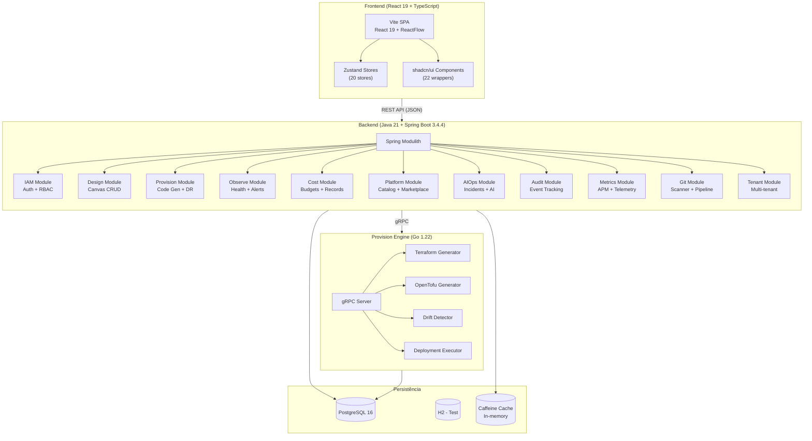
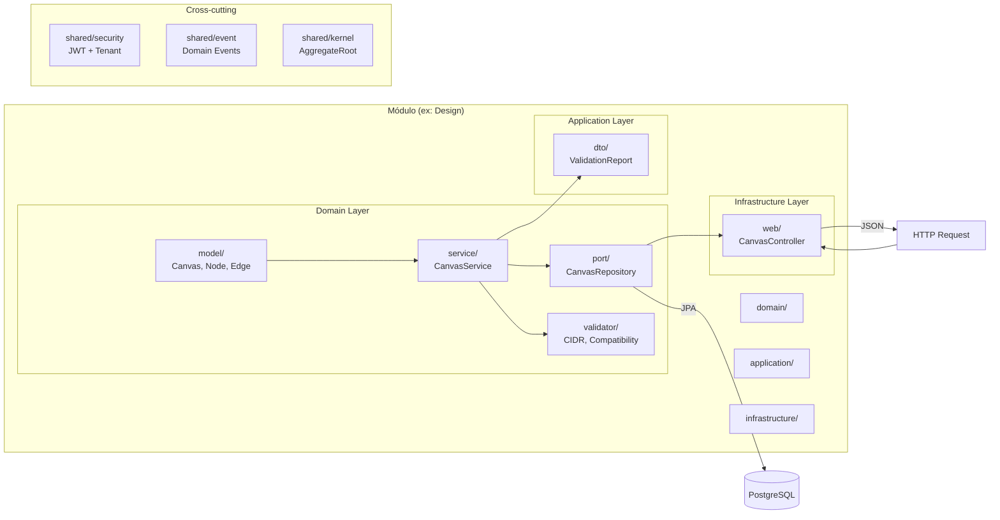
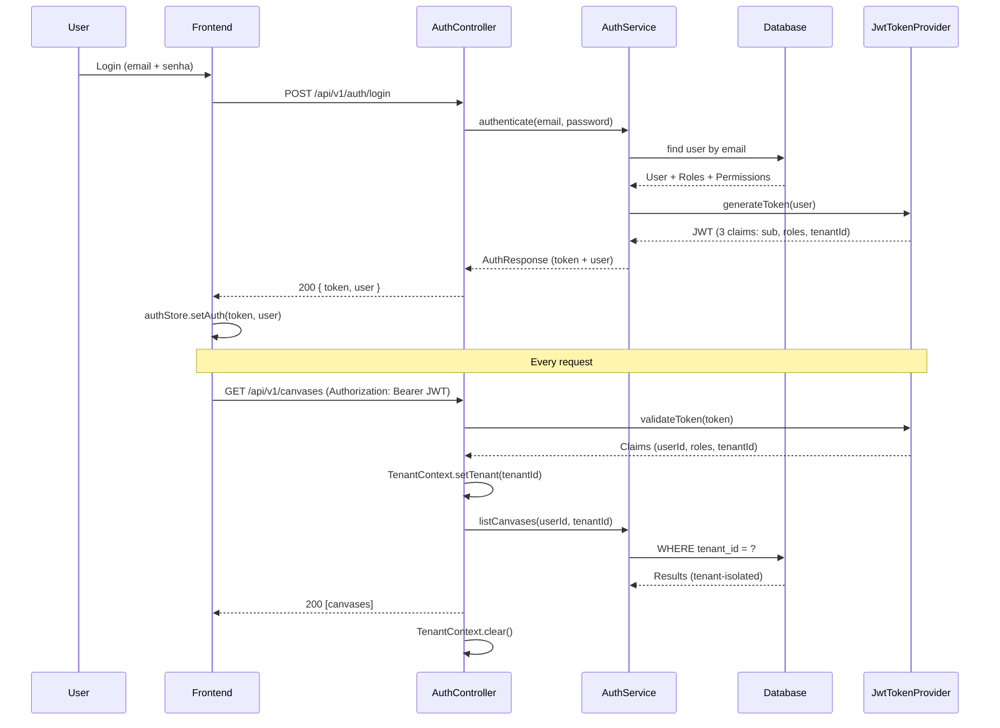
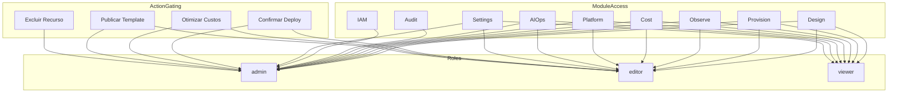
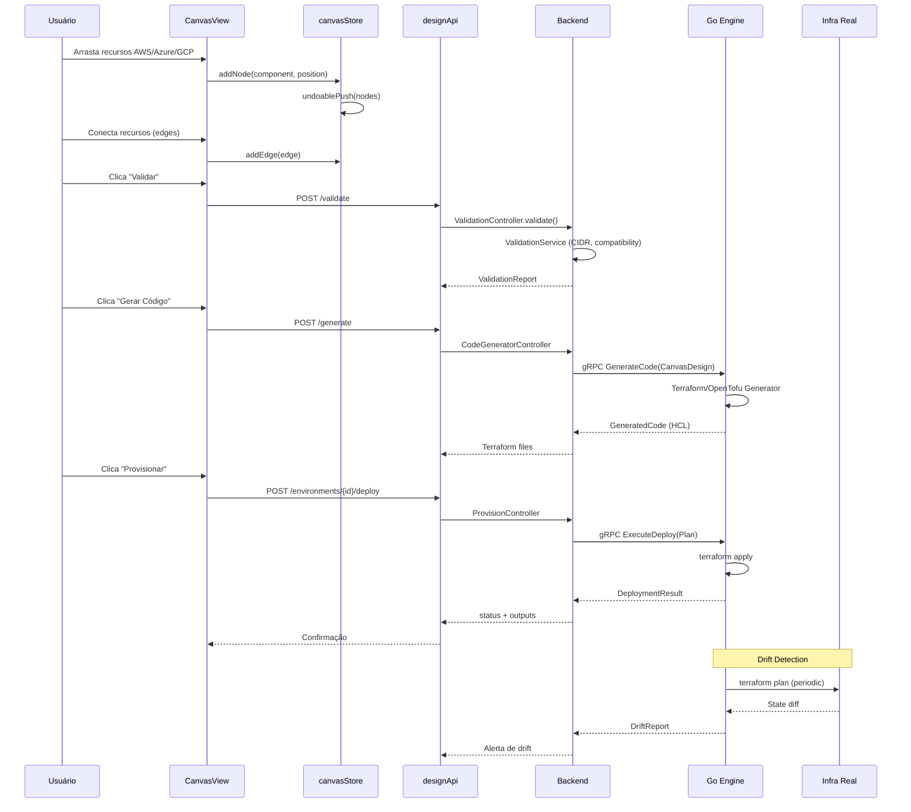
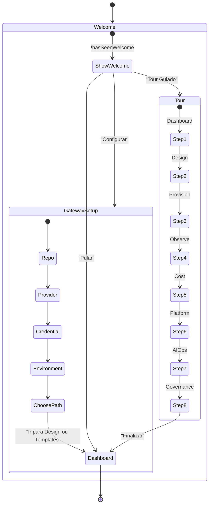
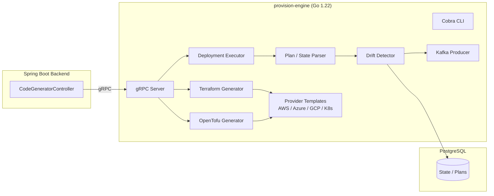
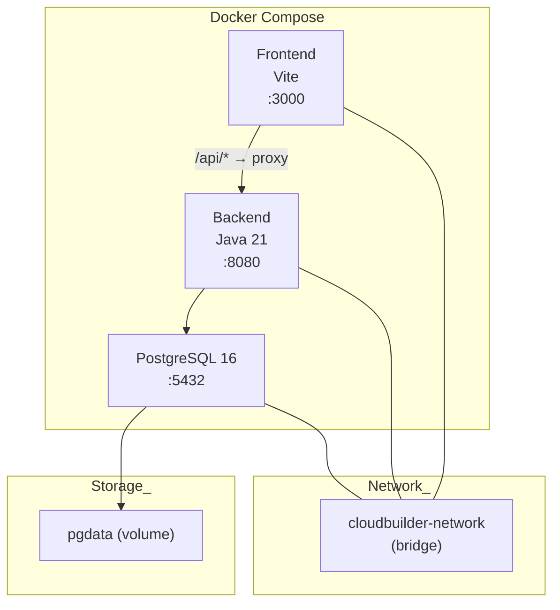
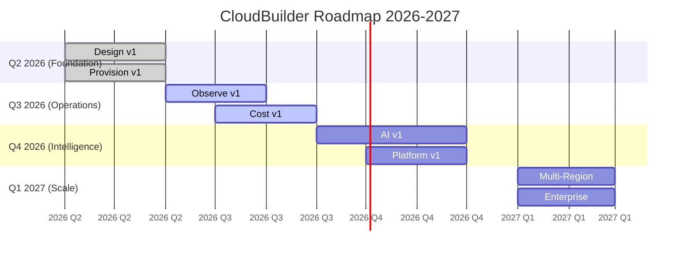

# CloudBuilder — Arquitetura do Sistema

**Versão**: 1.0.0  
**Última atualização**: 2026-06-17  
**Framework**: FAANg (Future Autonomous AI Network for Engineering)  
**Stack**: React 19 + Java 21 + Go 1.22 + PostgreSQL 16

---

## 1. Visão Geral da Arquitetura

CloudBuilder é uma plataforma de **Platform Engineering** completa e **100% nativa** — sem dependências de ferramentas externas como Grafana, Prometheus, Datadog, Terraform Cloud ou OpenTelemetry. Tudo é implementado diretamente na plataforma.



### Stack Completo

| Camada | Tecnologia | Versão |
|--------|-----------|--------|
| **Frontend** | React + TypeScript + Vite | 19.1.0 / 5.x |
| **Canvas** | ReactFlow (@xyflow/react) | 12.6.0 |
| **State** | Zustand | 5.0.3 |
| **UI** | shadcn/ui + Tailwind CSS | 4.x |
| **Icons** | lucide-react | 0.474.x |
| **Charts** | Recharts | 3.8.x |
| **Backend** | Java + Spring Boot + Modulith | 21 / 3.4.4 |
| **Build** | Maven | 3.9.x |
| **Engine** | Go + Cobra CLI + gRPC | 1.22 |
| **Database** | PostgreSQL / H2 (test) | 16 |
| **Cache** | Caffeine (in-process) | 3.x |
| **Auth** | JWT (jjwt 0.12.6) + Spring Security | — |

---

## 2. Arquitetura do Frontend


### Estrutura de Módulos

```
frontend/src/
├── modules/
│   ├── design/          ★ Completo — Canvas, Palette, Properties (54 files)
│   ├── provision/       ★ Completo — Terraform executor, CI/CD (10 files)
│   ├── observe/         ✅ — Health, alerts, drift, DR (3 files)
│   ├── cost/            ✅ — Dashboard, otimizações (1 file)
│   ├── platform/        ✅ — Catalog, marketplace (1 file)
│   ├── aiops/           ✅ — AI assistant, incident fix (2 files)
│   ├── audit/           ✅ — Auditoria (1 file)
│   ├── auth/            ★ Completo — Login, Register, Password (4 files)
│   ├── dashboard/       ✅ — Widgets, overview (3 files)
│   ├── iam/             🔧 Stub — Identity management (1 file)
│   ├── settings/        ✅ — Configurations (3 files)
│   └── onboarding/      ✅ — Welcome, Tour, Gateway Setup (3 files)
├── store/              20 Zustand stores
├── components/ui/      22 shadcn/ui wrappers
├── api/                API client layer (8 files)
├── lib/                Utils, Toast, Command
└── services/           Collaboration, EventBus
```

### Gerenciamento de Estado (Zustand)


### Sistema de Toast Nativo (substituiu react-hot-toast)

```typescript
// Singleton emitter pattern — funciona fora do React
showSuccess('Design salvo!')  // 3s, verde-lime
showError('Falha na conexão')  // 4s, vermelho
showInfo('Processando...')     // 3s, ice-blue
showWarning('Atenção!')        // 4s, amarelo
showApiError(err)              // extrai mensagem de ApiError
```

O `ToastProvider` é montado no `App.tsx` e renderiza um portal fixo no canto inferior direito. Usa `useSyncExternalStore` para sincronizar o estado do singleton com o React.

---

## 3. Arquitetura do Backend

### Spring Modulith — Hexagonal por Módulo

Cada módulo segue arquitetura hexagonal (ports & adapters):



### Módulos do Backend

| Módulo | Status | Arquivos | Responsabilidade |
|--------|--------|----------|-----------------|
| **design** | ★ Complete | 26 | Canvas, Nodes, Edges, Versões, Validação |
| **provision** | ★ Complete | 47 | Code gen, Deploy, DR, Ephemeral, Import |
| **iam** | ★ Complete | 24 | User, Role, Permission, Tenant, JWT |
| **observe** | ✅ Complete | 10 | Alertas, Health, Service Health |
| **cost** | ✅ Complete | 7 | Budget, Cost Records, Otimização |
| **platform** | ✅ Complete | 10 | Catalog, Marketplace, Partners |
| **aiops** | ✅ Complete | 11 | Incidents, AI Query, Chat |
| **git** | ✅ Complete | 20 | Git Scanner, IaC Detector, Pipeline |
| **github** | ✅ Complete | 8 | GitHub OAuth, API Client |
| **multiregion** | ✅ Complete | 21 | Regions, DR Tests, Health |
| **tenant** | ✅ Complete | 9 | Projects, Members |
| **audit** | ✅ Complete | 5 | Audit Events |
| **apm** | ✅ Complete | 5 | Traces, Spans, Snapshots |
| **metrics** | ✅ Complete | 6 | Metrics, Resource Metrics |
| **codeanalysis** | ✅ Complete | 4 | Code Analysis |

### Rotas da API

**Método** | **Path** | **Módulo**
-----------|----------|-----------
POST/GET/PUT/DELETE | `/api/v1/canvases` | Design
POST/PUT/DELETE | `/api/v1/canvases/{id}/nodes` | Design
POST/DELETE | `/api/v1/canvases/{id}/edges` | Design
POST | `/api/v1/canvases/{id}/validate` | Design
POST | `/api/v1/canvases/{id}/generate` | Provision
POST | `/api/v1/environments/{id}/sync` | Provision
GET/POST | `/api/v1/environments/{id}/drift` | Provision
GET | `/api/v1/observe/dashboard/{id}` | Observe
GET | `/api/v1/observe/alerts/{id}` | Observe
GET | `/api/v1/cost/overview/{id}` | Cost
GET/POST | `/api/v1/cost/budgets` | Cost
GET/POST/PUT/DELETE | `/api/v1/platform/catalog` | Platform
GET/POST | `/api/v1/platform/marketplace` | Platform
POST | `/api/v1/aiops/query` | AIOps
POST/GET | `/api/v1/auth/**` | IAM
GET | `/api/v1/audit/events` | Audit
GET | `/api/v1/metrics/**` | Metrics
GET/POST | `/api/v1/regions/**` | MultiRegion
GET/POST | `/api/v1/git/**` | Git
GET/POST | `/api/v1/github/**` | GitHub
GET/POST | `/api/v1/projects/**` | Tenant
GET/POST | `/api/v1/apm/**` | APM
POST | `/api/v1/code-analysis/**` | CodeAnalysis

---

## 4. Fluxo de Autenticação e Autorização



### RBAC — Papéis e Permissões



### Multi-tenancy

- Isolamento por `tenantId` em todas as tabelas
- `TenantFilter` — filtro automático via JPA
- `TenantContext` — ThreadLocal propagado por toda a request
- Headers: `X-Tenant-Id` (opcional, detectado do JWT se ausente)

---

## 5. Fluxo de Dados — Design → Provision → Deploy



---

## 6. Onboarding Flow

Implementado em 3 estágios:



### Personas (docs/personas/README.md)

| Persona | Perfil | Preferência Onboarding |
|---------|--------|----------------------|
| **Rafael** | Arquiteto de soluções | Configurar plataforma → Gateway Setup |
| **Marina** | DevOps Sênior | Tour completo → Setup |
| **Diego** | Dev Júnior | Tour guiado |
| **Carla** | Head de Plataforma | Pular onboarding → Dashboard |

---

## 7. Observabilidade Nativa

A plataforma substituiu Grafana, Prometheus, OpenTelemetry e Datadog por implementação própria:

```mermaid
graph TD
    subgraph Ingestion["Coleta de Dados"]
        LOG[PostgresLogAppender<br/>Async Logback]
        MET[MetricsService<br/>Micrometer + PostgreSQL]
        TRACE[TraceContext<br/>ThreadLocal + AOP]
        HC[HealthCheckService<br/>Scheduled]
    end

    subgraph Storage["Armazenamento"]
        PG[(PostgreSQL 16)]
        PART["Particionamento Mensal<br/>metrics_ts, traces, logs"]
        COMP["Índices compostos<br/>tenant + time-range"]
    end

    subgraph Alerting["Alertas"]
        AE[AlertEvaluationService<br/>@Scheduled 30s]
        AR[AlertRule<br/>threshold/percentil]
        INC[Incident<br/>Ack / Resolve]
        NOTIF[Notification<br/>Channel]
    end

    subgraph SLO["SLO Framework"]
        SLO[SloService<br/>@Scheduled hourly]
        SLI["SLI Metrics<br/>latency, availability"]
        BUDGET["Error Budget<br/>consumption tracking"]
    end

    subgraph UI["Dashboards"]
        DASH["6 Views<br/>Métricas, Traces, Logs<br/>Alertas, Incidentes, SLO"]
        SSE[useSSE Hook<br/>Streaming real-time]
        CHART["Chart Components<br/>Recharts + Brand"]
    end

    LOG --> PG
    MET --> PG
    TRACE --> PG
    HC --> PG
    PG --> AE
    AE --> INC
    INC --> NOTIF
    PG --> SLO
    PG --> UI
    UI --> SSE
    UI --> CHART
    MET --> CHART
```

---

## 8. Provision Engine (Go)



---

## 9. Deployment & Infraestrutura



### Docker Compose (pós-cleanup)

| Serviço | Porta | Imagem | Dependências |
|---------|-------|--------|-------------|
| PostgreSQL | 5432 | postgres:16-alpine | — |
| Backend | 8080 | Dockerfile (backend/) | PostgreSQL |
| Frontend | 3000 | Dockerfile (frontend/) | Backend |

### Serviços removidos (Phase 4 — $0 infra cleanup)

| Serviço | Motivo | Substituição |
|---------|--------|-------------|
| Kafka + Zookeeper | Custo operacional | Spring events + gRPC |
| Redis | Custo de memória | Caffeine in-process |
| OpenTelemetry Collector | Dependência externa | Native metrics (PostgreSQL) |
| Prometheus | Dependência externa | Native metrics service |
| Grafana | Dependência externa | Native dashboard views |

---

## 10. Dependências Nativas (Phase 4)

Todas as dependências npm substituídas por implementações nativas:

| Biblioteca Externa | Substituição Nativa | Arquivo | Data |
|-------------------|-------------------|---------|------|
| `dagre` | `simpleDagreLayout()` — topological-sort | `canvasStore.ts` | 2026-06-17 |
| `html-to-image` | Canvas API + foreignObject SVG | `DesignModule.tsx` | 2026-06-17 |
| `react-resizable-panels` | CSS Grid + drag handles | `resizable.tsx` | 2026-06-17 |
| `react-hot-toast` | Singleton emitter + Portal | `toast.tsx` | 2026-06-17 |
| `cmdk` | React state + keyboard nav | `command.tsx` | 2026-06-17 |
| `yjs` | Native EventBus + WebSocket JSON | `yjsBridge.ts` | 2026-06-17 |

**Total de dependências removidas**: 7 (incluindo `y-websocket`)  
**Redução de bundle**: ~322KB gzip (medido anteriormente)  
**Estratégia**: Singleton emitter para utilities (toast), substituição direta para componentes (command, resizable), refatoração inline para algoritmos (dagre, export)

---

## 11. Métricas de Performance

| Métrica | Valor | Alvo |
|---------|-------|------|
| **Bundle principal** | 322KB gzip | < 400KB |
| **Módulos TS** | 2.829 | — |
| **Build time** | 8.84s | < 15s |
| **Testes frontend** | 62 (5 suites) | 100% pass |
| **Testes backend** | 40 (4 suites) | 100% pass |
| **Testes Go** | 23 | 100% pass |
| **E2E Playwright** | 5 (smoke) | 100% pass |
| **TypeScript** | 0 erros | 0 erros |

---

## 12. Architecture Decision Records

| ADR | Título | Status |
|-----|--------|--------|
| ADR-008 | [Observabilidade Nativa](adr-008-native-observability.md) | ✅ Implementado |
| ADR-009 | Auto-Documentation Feature | 📝 Proposto |

---

## 13. Roadmap (12 Meses)



---

## 14. Padrões e Convenções

### Frontend
- UI text em **PT-BR** (labels, tooltips, placeholders, erros)
- Ícones: **lucide-react** (nunca Material Icons)
- Classes condicionais: `cn()` de `@/lib/utils`
- Cores: `brand-navy` (#0a1128), `brand-lime` (#ccff00), `brand-ice-blue` (#E3E2FD)
- Estado: **Zustand** stores
- IDs: **nanoid** (string)
- Canvas: `XYPosition` (typed x/y)

### Backend
- **Sem Lombok** (JDK 25 incompatível)
- Getters/setters explícitos
- Hexagonal architecture: `domain/` → `application/` → `infrastructure/`
- UUID para IDs (`java.util.UUID`)
- JSON string para `properties` (`columnDefinition = "TEXT"`)
- `@NullMarked` em todos os pacotes
- Multi-tenant via `tenantId` + `TenantFilter`

### Go Engine
- Module: `github.com/cloudbuilder/provision-engine`
- Go 1.22 + toolchain go1.22.10
- Cobra CLI + gRPC server
- Zerolog para logging

---

## 15. Glossário

| Termo | Definição |
|-------|-----------|
| **ADR** | Architecture Decision Record |
| **AIOps** | AI-powered Operations (incident diagnosis + fix) |
| **Canvas** | Visual design surface com ReactFlow |
| **Drift** | Divergência entre estado desejado (canvas) e real (infra) |
| **DR** | Disaster Recovery |
| **FAANg** | Future Autonomous AI Network for Engineering |
| **IaC** | Infrastructure as Code (Terraform, OpenTofu) |
| **Modulith** | Modular Monolith (Spring Modulith) |
| **RBAC** | Role-Based Access Control |
| **SSE** | Server-Sent Events (streaming real-time) |
| **SLO/SLI** | Service Level Objective / Indicator |
