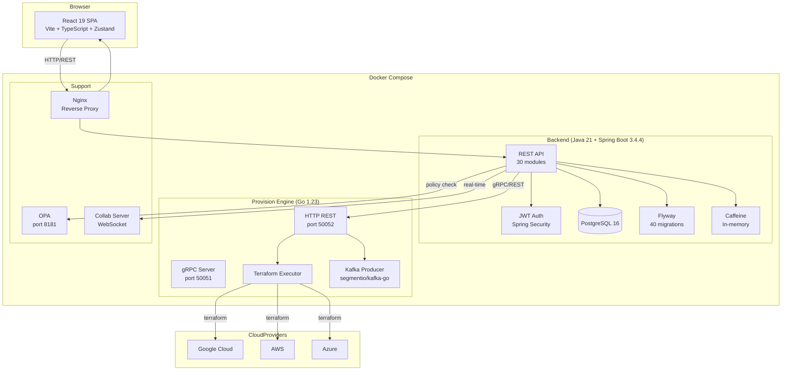

# System Architecture

> Status: Draft | Owner: Engineering | Last Updated: 2026-08-14 | Source of Truth: Codebase

## Current Architecture

CloudBuilder runs as a modular monolith with 30 Spring Modulith modules, a React SPA frontend, and a Go-based provision engine.



## Backend Modules (Spring Modulith)

| Module | Purpose | Maturity |
|--------|---------|----------|
| `iam` | Identity, auth, users, roles, tenants | Production |
| `design` | Canvas CRUD, nodes, edges, versions | Production |
| `provision` | Code generation, credential injection, provision orchestration | Production |
| `credential` | Cloud provider credential management | Production |
| `observability` | Metrics, logs, traces, SLOs, alerts, incidents | Functional |
| `aiops` | Anomaly detection, log analysis, NL query | Functional |
| `cost` | Cost estimation, forecasting, budgets | Functional |
| `approval` | Approval gates, promotion workflows | Functional |
| `policy` | OPA integration, compliance checks | Functional |
| `deployment` | Deployment tracking, status | Functional |
| `environment` | Environment management, ephemeral envs | Functional |
| `audit` | Audit logging, activity feed | Functional |
| `billing` | Billing logic (placeholder) | Prototype |
| `git` | Git integration, webhooks | Functional |
| `github` | GitHub OAuth, repo browsing | Functional |
| `notification` | Notification system | Functional |
| `search` | Resource search | Functional |
| `platform` | Platform configuration | Functional |
| `project` | Project management | Functional |
| `tenant` | Multi-tenant management | Production |
| `shared` | Cross-cutting: security, encryption, events | Production |
| `analytics` | Analytics and reporting | Prototype |
| `metrics` | System metrics collection | Functional |
| `featureflags` | Feature flag management | Functional |
| `marketplace` | Integration marketplace | Prototype |
| `multiregion` | Multi-region deployment | Functional |
| `codeanalysis` | Code review, analysis | Functional |
| `docs` | Documentation generation | Functional |
| `workspace` | Workspace management | Functional |
| `sso` | SSO integration (SAML/OIDC) | Prototype |
| `integration` | Third-party integrations | Functional |

## Frontend Modules

| Module | Purpose | Components |
|--------|---------|------------|
| `canvas` | Visual architecture designer | CanvasView, ComponentPalette, PropertiesPanel, ProvisionPanel, CodePreview, ObservabilityPanel, CostEstimation |
| `provisioning` | Provision workflows | ProvisionModule, DeployModal, EnvironmentPipeline, GitOps, EphemeralEnvs, ApprovalGate |
| `observability` | Monitoring dashboards | Metrics, Logs, Traces, SLOs, Alerts, Incidents |
| `ai` | AI assistant | AIChatPanel, anomaly visualization |
| `finops` | Cost management | CostViews, BudgetComparison, AnomalyView |
| `dashboard` | Main dashboard | DashboardModule |
| `settings` | Platform settings | SystemSettings |
| `security` | Security view | Security module |
| `platform` | Platform config | Platform settings |
| `projects` | Project management | Project views |
| `blog` | Content blog | Blog views |
| `docs` | Documentation | Doc viewer |
| `sso` | SSO config | SSO setup |
| `workspace` | Workspace | Workspace management |

## Data Layer

### PostgreSQL Schema (40 Flyway Migrations)

Key tables (from migrations V001–V040):
- `canvas_designs`, `canvas_nodes`, `canvas_edges` — Visual design persistence
- `component_definitions` — Cloud resource type catalog
- `credentials` — Encrypted cloud provider credentials
- `environments` — Target environments (dev, staging, prod)
- `deployments` — Deployment records and status
- `iam_users`, `tenants`, `teams` — Identity and access
- `drift_reports`, `managed_resources` — Infrastructure state tracking
- `slo_definitions`, `alert_rules`, `incidents` — Observability
- `audit_logs`, `activity_events` — Audit trail
- `feature_flags` — Feature toggles
- `event_inbox`, `dlq_events` — Event processing

### Caching
- Caffeine in-memory cache for hot data (component definitions, user sessions)
- Cache invalidation on write-through

## APIs

### REST API (Backend — port 8080)

```
/api/v1/
├── auth/           # Login, register, refresh, logout
├── canvases/       # CRUD + generate + provision
├── component-definitions/  # Cloud resource catalog
├── credentials/    # Cloud provider credentials
├── environments/   # Environment management
├── deployments/    # Deployment tracking
├── drift/          # Drift detection
├── observability/  # Metrics, logs, traces
├── aiops/          # AI operations
├── cost/           # Cost management
├── approval/       # Approval workflows
├── policy/         # Policy checks
├── audit/          # Audit logs
├── notifications/  # Notifications
├── projects/       # Projects
├── teams/          # Team management
├── integrations/   # Third-party integrations
└── health/         # Health checks
```

### Go Engine API (port 50052)

```
/healthz           # Health check
/readyz            # Readiness check
/api/v1/provision/apply     # Execute terraform
/api/v1/provision/plan      # Plan only
/api/v1/provision/validate  # Validate only
/api/v1/provision/destroy   # Destroy resources
```

## Auth Architecture

```
User → Login (email/password) → JWT Token
     ↓
Request → Bearer Token → Spring Security Filter
     ↓
TenantContext.setTenantId() → TenantFilter (JPA @Filter)
     ↓
@PreAuthorize → RBAC check (OWNER/ADMIN/EDITOR/VIEWER)
     ↓
Controller → Service → Repository (scoped to tenant)
```

- **JWT tokens** via jjwt 0.12.6
- **Multi-tenant** via `tenantId` column + JPA `@Filter`
- **RBAC** via `@PreAuthorize` annotations
- **Encryption** for credentials at rest

## Infrastructure

```yaml
# docker-compose.yml — 7 services
PostgreSQL:   5432  # postgres:16-alpine
Backend:      8080  # Spring Boot (Dockerfile)
Frontend:     3000  # Vite/React (Dockerfile)
Go Engine:    50052 # REST + gRPC :50051
Collab:       8765  # WebSocket server
OPA:          8181  # Policy engine
Nginx:        80/443 # Reverse proxy
```

## Target Architecture

### Near-term (3–6 months)
- Complete provision loop: Canvas → Terraform → Real cloud execution
- Auto-observe: provisioned resources auto-register in observability
- Cost feedback: estimated cost shown on canvas before provisioning

### Medium-term (6–12 months)
- AI copilot: natural language → canvas design → provision
- GitOps: canvas changes → Git commit → auto-provision via CI/CD
- Multi-environment promotion: dev → staging → prod with approval gates
- Drift auto-remediation: detect drift → recommend fix → auto-apply with approval

### Long-term (12+ months)
- Autonomous infrastructure agent: manages routine ops (scaling, patching, cost optimization)
- Marketplace: community templates, policies, integrations
- Enterprise: SSO, SCIM, audit export, SLA, private deployment
