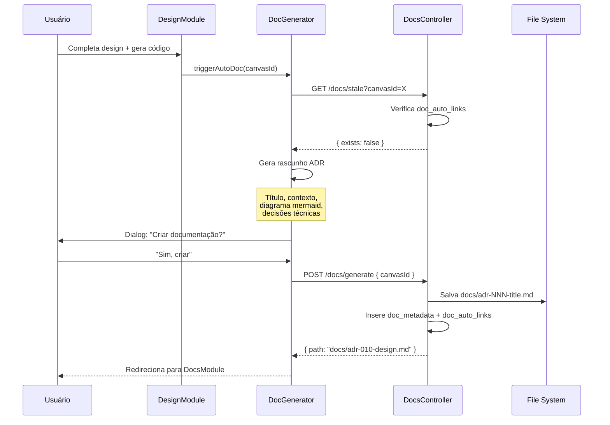

# ADR-009: Auto-Documentation Feature

## Status
Proposto — 2026-06-17

## Context
O CloudBuilder possui documentação rica em `docs/` (roadmap, ADRs, personas, jornadas, análises competitivas) e o `AGENTS.md` central. No entanto:

1. **Documentação estática**: Os arquivos `.md` existem no repositório mas não são visíveis dentro da plataforma — o usuário precisa sair do CloudBuilder para ler
2. **Sem descoberta**: Novos usuários não encontram a documentação existente
3. **Sem sincronismo**: Ao criar designs, provisionar recursos ou configurar ambientes, a documentação não reflete as mudanças
4. **Sem importação**: Se o projeto já tem documentação externa, não há como importá-la

O usuário explicitamente pediu: **"a feature de já ir documentando tudo, caso não haja documentação do projeto, se já tiver, aceitar importação"**.

## Problema
Construir um sistema de **auto-documentação** que:
1. Escaneie o diretório do projeto em busca de arquivos `.md` existentes
2. Renderize a documentação em uma interface de navegação dentro da plataforma
3. Detecte mudanças na arquitetura (design, provisionamento) e **atualize ou sugira atualizações** na documentação
4. Permita importar documentação existente (upload de arquivos `.md` ou scan de diretório)
5. Ofereça um template de documentação para projetos novos (zero-docs)

## Stack
- **Frontend**: React 19 + TypeScript + Tailwind + Zustand
- **Backend**: Java 21 + Spring Boot 3.4.4
- **Armazenamento**: PostgreSQL (metadados) + file system (arquivos .md)
- **Renderização**: Markdown-to-HTML nativo (sem marked.js ou react-markdown — implementação leve customizada)

## Decisão
**Criar um módulo `docs/` no frontend e backend** com as seguintes capacidades:

### Frontend — DocsModule
- Sidebar com árvore de navegação da documentação
- Viewer que renderiza Markdown como HTML estilizado (brand colors)
- Barra de busca textual
- Botão "Importar Documentação" (upload ou scan)
- Indicador de documentação desatualizada (diff entre docs e estado atual do canvas)
- Auto-geração de ADRs a partir de mudanças no design

### Backend — Docs Module
- `DocScannerService`: varre o sistema de arquivos em busca de `.md` em diretórios configurados
- `DocsController`: endpoints REST para CRUD de documentação
- `AutoDocService`: gera trechos de documentação automaticamente a partir de designs provision

### Auto-Generation
Quando o usuário conclui um design e gera código, o sistema:
1. Verifica se existe documentação para aquele design
2. Se não existir → pergunta "Deseja criar documentação para este design?"
3. Se existir → pergunta "Deseja atualizar a documentação com as mudanças recentes?"
4. Gera um ADR rascunho com: título, contexto, decisões, componentes envolvidos

## Alternativas Consideradas

### Alternativa A — GitBook/Docusaurus externo
**Descrição**: Apontar para um GitBook ou Docusaurus externo com a documentação.
**Prós**: Ferramenta madura, busca full-text, versionamento.
**Contras**: Sai da plataforma, requer deploy separado, sem integração com canvas/design.

### Alternativa B — README.md único
**Descrição**: Manter um README.md gigante no repositório.
**Prós**: Simples, zero implementação.
**Contras**: Sem navegação, sem busca, sem versionamento, sem auto-geração.

### Alternativa C — Módulo Nativo (ESCOLHIDA)
**Descrição**: Módulo `docs` nativo no CloudBuilder com scan, viewer, importação e auto-geração.
**Prós**: 
- Integrado à plataforma
- Navegação hierárquica com busca
- Auto-geração a partir de designs
- Importação de documentação existente
- 100% nativo (zero dependências externas)
**Contras**:
- Implementação de renderizador Markdown customizado
- Precisa de parser de frontmatter para metadados
- Editor WYSIWYG não incluso (apenas viewer + auto-geração)

## Arquitetura Detalhada

### API REST

| Método | Path | Descrição |
|--------|------|-----------|
| `GET` | `/api/v1/docs/tree` | Árvore de documentação (diretórios + arquivos) |
| `GET` | `/api/v1/docs/content?path=...` | Conteúdo de um arquivo .md |
| `POST` | `/api/v1/docs/scan` | Escaneia diretório em busca de .md |
| `POST` | `/api/v1/docs/import` | Importa arquivo .md (upload) |
| `POST` | `/api/v1/docs/generate` | Gera documentação automática a partir de design |
| `PUT` | `/api/v1/docs/content?path=...` | Salva/atualiza conteúdo de arquivo .md |
| `DELETE` | `/api/v1/docs/content?path=...` | Remove arquivo de documentação |
| `GET` | `/api/v1/docs/search?q=...` | Busca textual em toda documentação |
| `GET` | `/api/v1/docs/stale` | Lista documentação desatualizada vs designs |

### Modelo de Dados (Banco)

```sql
CREATE TABLE doc_metadata (
    id         UUID DEFAULT gen_random_uuid(),
    tenant_id  VARCHAR(64) NOT NULL,
    path       VARCHAR(512) NOT NULL,
    title      VARCHAR(256),
    summary    TEXT,
    tags       JSONB DEFAULT '[]',
    last_modified TIMESTAMPTZ,
    checksum   VARCHAR(64),  -- hash SHA-256 do conteúdo
    created_at TIMESTAMPTZ NOT NULL DEFAULT NOW(),
    updated_at TIMESTAMPTZ NOT NULL DEFAULT NOW(),
    UNIQUE (tenant_id, path)
);

CREATE TABLE doc_auto_links (
    id         UUID DEFAULT gen_random_uuid(),
    doc_path   VARCHAR(512) NOT NULL,
    entity_type VARCHAR(32) NOT NULL,  -- 'canvas', 'environment', 'template'
    entity_id  UUID NOT NULL,
    tenant_id  VARCHAR(64) NOT NULL,
    last_sync  TIMESTAMPTZ,
    created_at TIMESTAMPTZ NOT NULL DEFAULT NOW(),
    UNIQUE (doc_path, entity_type, entity_id)
);
```

### Componentes Frontend

```
DocsModule (container)
├── DocsSidebar
│   ├── SearchBar (busca textual)
│   ├── DocTree (árvore de navegação)
│   ├── ImportButton (scan diretório / upload)
│   └── GenerateButton (auto-gerar para design atual)
├── DocViewer (renderização Markdown)
│   ├── TOC (índice automático)
│   ├── Content (HTML renderizado + brand styles)
│   └── StaleBadge (se doc está desatualizada)
└── GenerateDialog
    ├── TemplateSelector (ADR, Guia, Visão Geral)
    └── PreviewModal
```

### Renderizador Markdown Nativo

Leve e customizado para suportar:
- Headers `#` → `##` → `###`
- Listas ordenadas e não ordenadas
- Code blocks com syntax highlight (linguagens: yaml, json, typescript, java, go, sql)
- Tabelas
- Links
- Bold/Italic
- Mermaid diagrams (pré-renderizados no backend ou client-side)

### Fluxo de Auto-Geração



## Consequências

### Positivas
- Documentação visível dentro da plataforma
- Auto-geração reduz atrito de documentar
- Importação aceita documentação pré-existente
- Busca textual em toda documentação
- Integração com o fluxo de design → provision → documentar
- Zero dependências externas de documentação

### Negativas
- Renderizador Markdown customizado (em vez de react-markdown/marked)
- Precisa gerenciar sincronia entre docs e estado real
- Editor WYSIWYG não incluso — apenas auto-geração + viewer
- Documentação gerada é rascunho — precisa revisão humana

### Riscos
- **R1**: Parsing de Markdown complexo (tabelas, code blocks) pode ter bugs  
  **Mitigação**: Começar com subset do Markdown, expandir gradualmente
- **R2**: Auto-geração pode produzir documentação genérica/ruim  
  **Mitigação**: Sempre apresentar como rascunho, nunca publicar automaticamente
- **R3**: Scan de diretório pode expor arquivos sensíveis  
  **Mitigação**: Whitelist de diretórios (docs/, AGENTS.md apenas)
