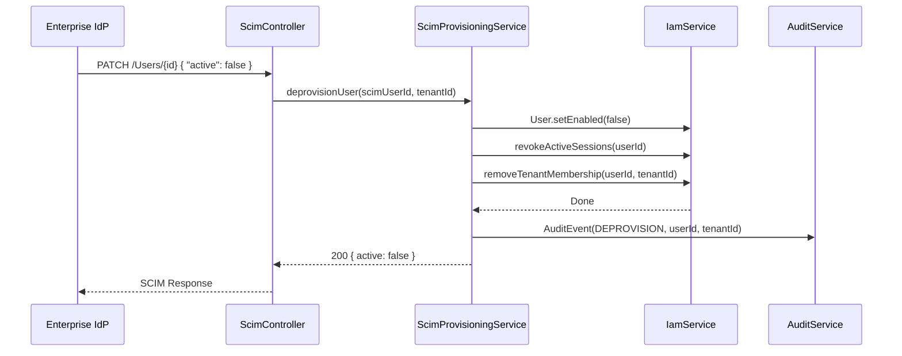

# ADR-026: Enterprise Identity Provisioning — SCIM 2.0

**Status**: Proposed
**Date**: 2026-06-22
**Author**: Platform Engineering Team

## Context

CloudBuilder has a complete IAM module with 24 files supporting:

- `User`, `Role`, `Permission`, `Tenant`, `TenantUser` — domain entities
- `AuthService` / `IamService` — authentication and identity management
- `AuthController` / `IAMController` — REST endpoints for identity CRUD
- JWT with jjwt 0.12.6, Spring Security, role-based `@PreAuthorize`
- SSO via `SsoProviderConfig` with OAuth2 Authorization Code + PKCE (ADR-025)
- Multi-tenant with `TenantFilter` and `TenantContext` (ThreadLocal)

However, **enterprise identity provisioning is not automated**. When a new employee joins an organization that uses CloudBuilder:

1. An admin must manually create the user via the IAM UI or API
2. Role assignments must be configured per user
3. Group memberships are not synced from the enterprise IdP (Okta, Azure AD, Google Workspace)
4. De-provisioning is a manual delete — no automated offboarding
5. There is no SCIM (System for Cross-domain Identity Management) endpoint for IdP-driven provisioning

As the roadmap targets Sprints 24-25 (Enterprise Features) in Q1 2027, CloudBuilder needs SCIM 2.0 support for automated user provisioning and de-provisioning.

## Problem

How to implement SCIM 2.0 (RFC 7643/RFC 7644) enterprise identity provisioning that:

1. Integrates with major IdPs (Okta, Azure AD, Google Workspace, JumpCloud)
2. Automates user creation, update, and deactivation based on IdP events
3. Supports group (role) mapping from IdP groups to CloudBuilder roles
4. Works within the existing IAM Modulith module and multi-tenant architecture
5. Can be enabled/disabled per tenant (opt-in enterprise feature)
6. Does not require external dependencies beyond Spring Boot

## Alternatives Considered

| Alternative | Pros | Cons |
|-------------|------|------|
| **Spring Security SCIM extension** | Battle-tested, RFC-compliant | No official Spring SCIM module; unmaintained forks; opinionated |
| **Custom minimal SCIM implementation** | Full control, no deps, ~300 lines | Must implement RFC ourselves; schema negotiation complexity |
| **Third-party SCIM bridge (Okta Workflows)** | Zero code | External dependency; per-workflow cost; no automation |
| **Manual provisioning only** | Simplest implementation | No enterprise automation; requires admin for every user change |
| **Custom SCIM implementation** | Full control, tenant-aware, reuses existing IAM | Implementation effort; RFC compliance testing |

**Rationale for custom SCIM implementation**:
- We already have IAM entities (User, Role, Tenant, TenantUser) — SCIM is just a mapping layer
- Spring Boot makes REST endpoint creation trivial
- SCIM 2.0 is a well-documented standard (RFC 7643/7644)
- No mature SCIM library for Spring Boot exists that fits our Modulith architecture
- Custom implementation allows full tenant isolation and role mapping customization

## Decision

### 1. SCIM 2.0 Core Endpoints

Implement the 5 required SCIM 2.0 REST endpoints per RFC 7644:

```
SCIM Base Path: /api/v1/scim/v2

Users:
  POST   /Users          → Create user
  GET    /Users          → List users (paginated, filtered)
  GET    /Users/{id}     → Get user by ID
  PUT    /Users/{id}     → Update user (full replacement)
  PATCH  /Users/{id}     → Partial update
  DELETE /Users/{id}     → Deactivate user

Groups:
  POST   /Groups         → Create group
  GET    /Groups         → List groups
  GET    /Groups/{id}    → Get group by ID
  PUT    /Groups/{id}    → Update group
  PATCH  /Groups/{id}    → Partial update
  DELETE /Groups/{id}    → Delete group

ServiceProviderConfig:
  GET    /ServiceProviderConfig → SCIM metadata

Schemas:
  GET    /Schemas        → Schema discovery
```

### 2. User Mapping (SCIM → CloudBuilder)

```java
// SCIM User → CloudBuilder User mapping
public class ScimUserMapping {
    // SCIM core schema (urn:ietf:params:scim:schemas:core:2.0:User)
    "userName"           → User.email
    "name.givenName"     → User.firstName
    "name.familyName"    → User.lastName
    "emails[type=work].value" → User.email (primary)
    "active"             → User.enabled
    "externalId"         → User.scimExternalId (NEW field)
    
    // CloudBuilder extension (urn:cloudbuilder:params:scim:schemas:extension:2.0:User)
    "urn:cloudbuilder:...:User:tenantId"     → TenantUser.tenantId
    "urn:cloudbuilder:...:User:defaultRole"  → TenantUser.roleId
}
```

### 3. Group → Role Mapping

SCIM groups map to CloudBuilder roles via configurable rules:

```java
// Tenant-level SCIM group → role mapping
@Table(name = "scim_group_mappings")
public class ScimGroupMapping {
    String id;
    String tenantId;
    String scimGroupId;      // IdP group ID (e.g., Okta group ID)
    String scimGroupName;    // IdP group name (e.g., "CloudBuilder-Admins")
    String cloudBuilderRoleId; // Target CloudBuilder role ID
    boolean autoProvision;   // Auto-create users in this group
}
```

When a user is assigned via SCIM to a group:
1. Look up `ScimGroupMapping` by `scimGroupId`
2. Create/link user with the mapped `cloudBuilderRoleId`
3. If `autoProvision` is true, auto-create tenant membership

### 4. De-provisioning Flow



On de-provisioning:
1. User is disabled (`enabled = false`)
2. Active JWT sessions are revoked (token blacklist in Caffeine cache)
3. Tenant membership is removed (TenantUser record deleted)
4. Audit event is created
5. User record is preserved for audit trail (soft delete)

### 5. Tenant Isolation

Each SCIM request carries the tenant context:
- SCIM endpoints are scoped to `X-Tenant-Id` header (same as existing API)
- The SCIM base path could include tenant: `/api/v1/scim/v2/{tenantId}`
- SCIM auth uses a separate Bearer token (SCIM token, not user JWT)
- Token is stored per-tenant in `SsoProviderConfig` or new `ScimConfig` entity

### 6. Configuration

```yaml
cloudbuilder:
  scim:
    enabled: false          # Disabled by default (opt-in enterprise feature)
    token-ttl: 3600         # SCIM bearer token expiration (seconds)
    auto-provision: false    # Auto-create users on SCIM push
    group-mapping:           # Tenant-level group mapping
      enabled: true
      default-role: viewer   # Default role if no group mapping matches
```

```java
@Configuration
@ConditionalOnProperty(name = "cloudbuilder.scim.enabled", havingValue = "true")
public class ScimConfiguration {
    // SCIM controllers and services loaded only when enabled
}
```

### 7. Schema Discovery

SCIM 2.0 requires schema discovery endpoints:

```java
@GetMapping("/Schemas")
public List<ScimSchema> getSchemas() {
    return List.of(
        ScimSchema.coreUserSchema(),    // urn:ietf:params:scim:schemas:core:2.0:User
        ScimSchema.coreGroupSchema(),   // urn:ietf:params:scim:schemas:core:2.0:Group
        ScimSchema.cloudBuilderExtension() // CloudBuilder custom attributes
    );
}
```

Custom extension schema adds CloudBuilder-specific fields:
- `tenantId` — string (required)
- `defaultRole` — string (optional, defaults to "viewer")
- `ssoOnly` — boolean (inherits from existing User entity)

## Trade-offs

- **Compliance vs. simplicity**: Full SCIM 2.0 compliance requires implementing pagination (`startIndex`, `count`), filtering (`filter` attribute with operator expressions), and attribute negotiation (`attributes`, `excludedAttributes`). Skipping these breaks IdP integration. The implementation must support at least `eq` filter operator and pagination.

- **Security vs. convenience**: Auto-provisioning (creating users on first SCIM push) is convenient for large organizations but allows any SCIM-authorized IdP to create accounts. Mitigated by: (a) SCIM disabled by default, (b) per-tenant SCIM tokens, (c) `auto-provision: false` default.

- **Group mapping vs. direct role assignment**: Group mapping is more flexible (IdP admins manage groups, not CloudBuilder roles) but adds complexity. Direct role assignment is simpler but requires IdP to know CloudBuilder role IDs. Implement both: group mapping with fallback to default role.

- **SCIM path isolation**: `/api/v1/scim/v2/{tenantId}` vs. header-based tenant context. Path-based is more explicit for SCIM clients (which often can't set custom headers). Header-based is consistent with existing API. Support both.

## Consequences

1. **New**: `ScimController.java` in `iam/infrastructure/web/` — SCIM 2.0 REST endpoints
2. **New**: `ScimProvisioningService.java` in `iam/domain/service/` — SCIM user/group provisioning logic
3. **New**: `ScimGroupMapping.java` entity + `ScimGroupMappingRepository` — group-to-role mapping
4. **New**: `ScimConfig.java` entity — per-tenant SCIM configuration (enabled, token, auto-provision)
5. **Modified**: `User.java` — add `scimExternalId` field (String, nullable)
6. **New**: `ScimConfiguration.java` — `@ConditionalOnProperty(name = "cloudbuilder.scim.enabled", havingValue = "true")`
7. **New**: SCIM schema definitions — `ScimUserSchema.java`, `ScimGroupSchema.java`, `ScimCloudBuilderExtension.java`
8. **Modified**: `IamService.java` — add `revokeActiveSessions(userId)` method
9. **New**: Caffeine cache entry for SCIM bearer token validation
10. **Configuration**: `cloudbuilder.scim.enabled=false` by default in `application.yml`
11. **Testing**: Unit tests for SCIM→User mapping, group mapping, de-provisioning; integration tests for SCIM endpoints with mock IdP

## References

- RFC 7643 — SCIM: Core Schema: https://tools.ietf.org/html/rfc7643
- RFC 7644 — SCIM: Protocol: https://tools.ietf.org/html/rfc7644
- Okta SCIM Integration Guide: https://developer.okta.com/docs/concepts/scim/
- Azure AD SCIM Provisioning: https://learn.microsoft.com/en-us/azure/active-directory/app-provisioning/use-scim-to-provision-users-and-groups
- ADR-018: TOTP MFA + JWT Refresh Rotation (existing auth infrastructure)
- ADR-025: SSO Authentication Flow — OAuth2 Authorization Code + PKCE
- CloudBuilder Roadmap — Sprints 24-25 (Enterprise Features)
