# CloudBuilder — Diagramas de Arquitetura

## Visão Geral do Sistema

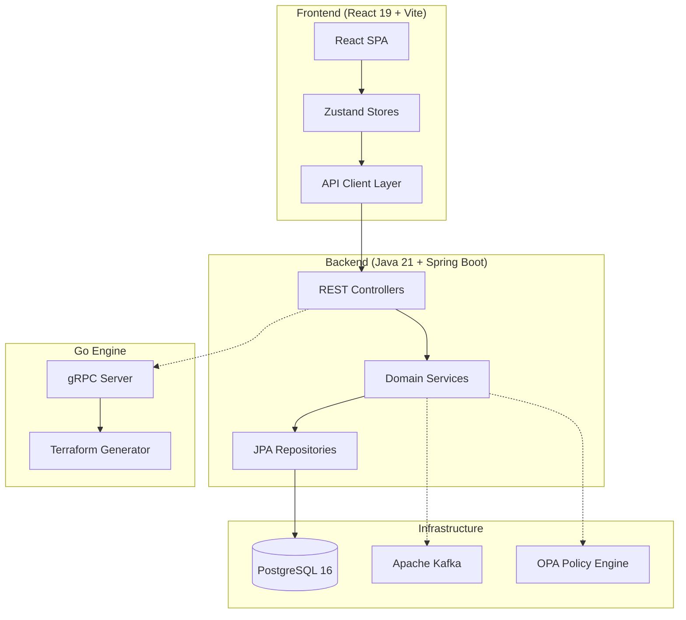
```mermaid
graph TB
    subgraph "Frontend (React 19 + Vite)"
        UI[React SPA]
        Stores[Zustand Stores]
        API[API Client Layer]
    end

    subgraph "Backend (Java 21 + Spring Boot)"
        Controllers[REST Controllers]
        Services[Domain Services]
        Repositories[JPA Repositories]
    end

    subgraph "Infrastructure"
        PG[(PostgreSQL 16)]
        Kafka[Apache Kafka]
        OPA[OPA Policy Engine]
    end

    subgraph "Go Engine"
        GRPC[gRPC Server]
        Terraform[Terraform Generator]
    end

    UI --> Stores
    Stores --> API
    API --> Controllers
    Controllers --> Services
    Services --> Repositories
    Repositories --> PG
    Services -.-> Kafka
    Services -.-> OPA
    Controllers -.-> GRPC
    GRPC --> Terraform
```

---

## Diagrama 1: Configuração de Credenciais

### Fluxo de Dados - Credenciais

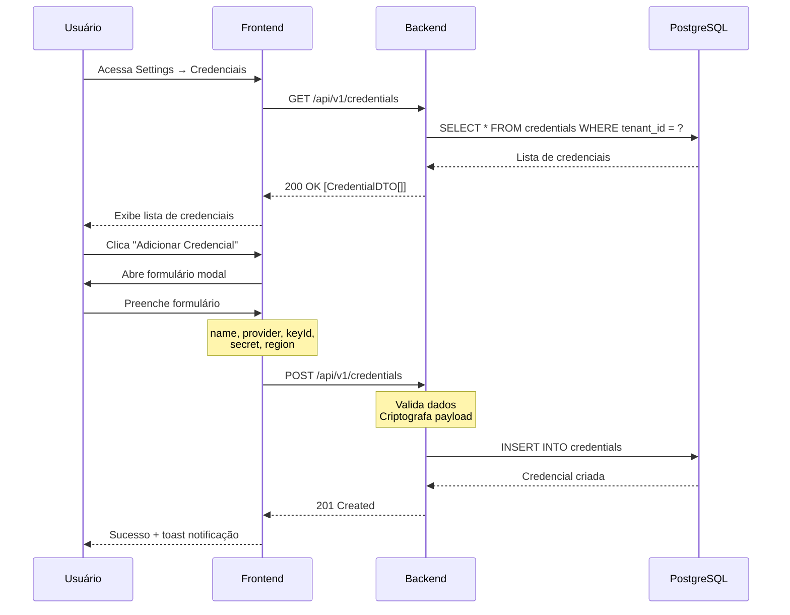
```mermaid
sequenceDiagram
    participant U as Usuário
    participant FE as Frontend
    participant BE as Backend
    participant DB as PostgreSQL

    U->>FE: Acessa Settings → Credenciais
    FE->>BE: GET /api/v1/credentials
    BE->>DB: SELECT * FROM credentials WHERE tenant_id = ?
    DB-->>BE: Lista de credenciais
    BE-->>FE: 200 OK [CredentialDTO[]]
    FE-->>U: Exibe lista de credenciais

    U->>FE: Clica "Adicionar Credencial"
    FE->>U: Abre formulário modal

    U->>FE: Preenche formulário
    Note over FE: name, provider, keyId,<br/>secret, region

    FE->>BE: POST /api/v1/credentials
    Note over BE: Valida dados<br/>Criptografa payload
    BE->>DB: INSERT INTO credentials
    DB-->>BE: Credencial criada
    BE-->>FE: 201 Created
    FE-->>U: Sucesso + toast notificação
```

### Modelo de Dados - Credenciais

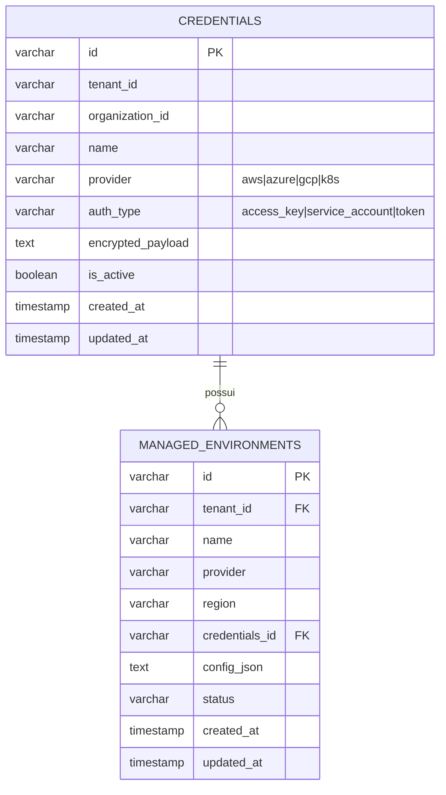
```mermaid
erDiagram
    CREDENTIALS {
        varchar id PK
        varchar tenant_id
        varchar organization_id
        varchar name
        varchar provider "aws|azure|gcp|k8s"
        varchar auth_type "access_key|service_account|token"
        text encrypted_payload
        boolean is_active
        timestamp created_at
        timestamp updated_at
    }

    MANAGED_ENVIRONMENTS {
        varchar id PK
        varchar tenant_id FK
        varchar name
        varchar provider
        varchar region
        varchar credentials_id FK
        text config_json
        varchar status
        timestamp created_at
        timestamp updated_at
    }

    CREDENTIALS ||--o{ MANAGED_ENVIRONMENTS : "possui"
```

### Arquitetura do Módulo - Credenciais

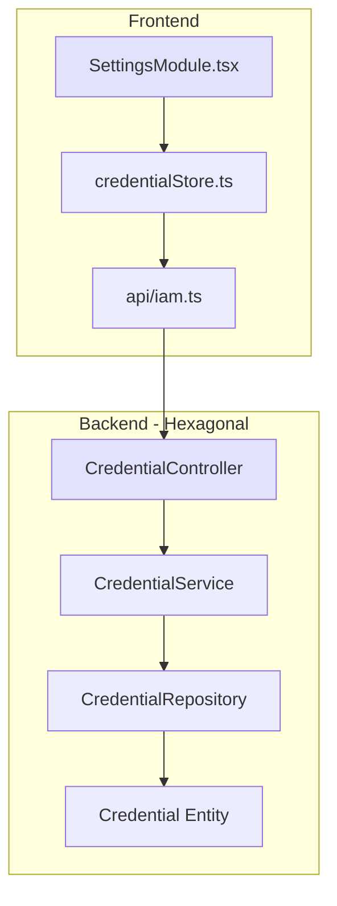
```mermaid
graph TB
    subgraph "Frontend"
        SM[SettingsModule.tsx]
        CS[credentialStore.ts]
        API_C[api/iam.ts]
    end

    subgraph "Backend - Hexagonal"
        CC[CredentialController]
        CVS[CredentialService]
        CR[CredentialRepository]
        CE[Credential Entity]
    end

    SM --> CS
    CS --> API_C
    API_C --> CC
    CC --> CVS
    CVS --> CR
    CR --> CE

    style SM fill:#E3E2FD
    style CC fill:#E3E2FD
```

---

## Diagrama 2: Configuração de Ambientes

### Fluxo de Dados - Ambientes

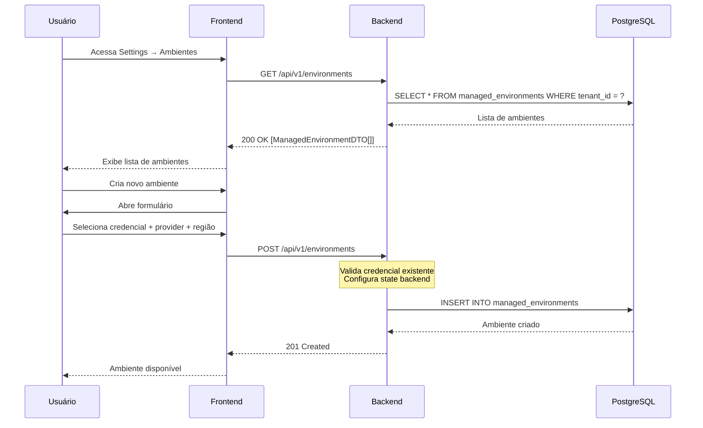
```mermaid
sequenceDiagram
    participant U as Usuário
    participant FE as Frontend
    participant BE as Backend
    participant DB as PostgreSQL

    U->>FE: Acessa Settings → Ambientes
    FE->>BE: GET /api/v1/environments
    BE->>DB: SELECT * FROM managed_environments WHERE tenant_id = ?
    DB-->>BE: Lista de ambientes
    BE-->>FE: 200 OK [ManagedEnvironmentDTO[]]
    FE-->>U: Exibe lista de ambientes

    U->>FE: Cria novo ambiente
    FE->>U: Abre formulário

    U->>FE: Seleciona credencial + provider + região
    FE->>BE: POST /api/v1/environments
    Note over BE: Valida credencial existente<br/>Configura state backend
    BE->>DB: INSERT INTO managed_environments
    DB-->>BE: Ambiente criado
    BE-->>FE: 201 Created
    FE-->>U: Ambiente disponível
```

### Modelo de Dados - Ambientes

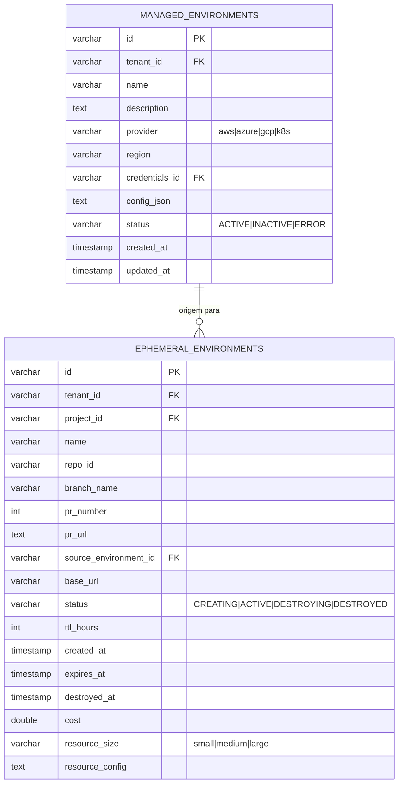
```mermaid
erDiagram
    MANAGED_ENVIRONMENTS {
        varchar id PK
        varchar tenant_id FK
        varchar name
        text description
        varchar provider "aws|azure|gcp|k8s"
        varchar region
        varchar credentials_id FK
        text config_json
        varchar status "ACTIVE|INACTIVE|ERROR"
        timestamp created_at
        timestamp updated_at
    }

    EPHEMERAL_ENVIRONMENTS {
        varchar id PK
        varchar tenant_id FK
        varchar project_id FK
        varchar name
        varchar repo_id
        varchar branch_name
        int pr_number
        text pr_url
        varchar source_environment_id FK
        varchar base_url
        varchar status "CREATING|ACTIVE|DESTROYING|DESTROYED"
        int ttl_hours
        timestamp created_at
        timestamp expires_at
        timestamp destroyed_at
        double cost
        varchar resource_size "small|medium|large"
        text resource_config
    }

    MANAGED_ENVIRONMENTS ||--o{ EPHEMERAL_ENVIRONMENTS : "origem para"
```

---

## Diagrama 3: Configurações do Usuário

### Fluxo de Dados - Perfil do Usuário

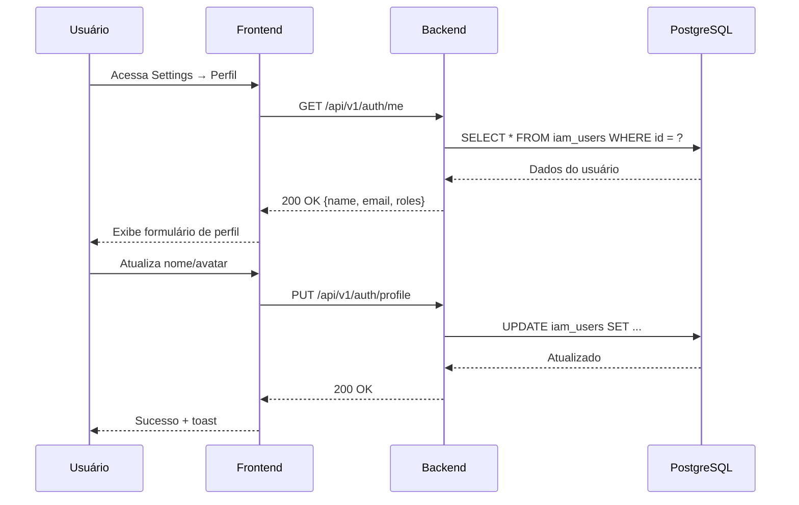
```mermaid
sequenceDiagram
    participant U as Usuário
    participant FE as Frontend
    participant BE as Backend
    participant DB as PostgreSQL

    U->>FE: Acessa Settings → Perfil
    FE->>BE: GET /api/v1/auth/me
    BE->>DB: SELECT * FROM iam_users WHERE id = ?
    DB-->>BE: Dados do usuário
    BE-->>FE: 200 OK {name, email, roles}
    FE-->>U: Exibe formulário de perfil

    U->>FE: Atualiza nome/avatar
    FE->>BE: PUT /api/v1/auth/profile
    BE->>DB: UPDATE iam_users SET ...
    DB-->>BE: Atualizado
    BE-->>FE: 200 OK
    FE-->>U: Sucesso + toast
```

### Modelo de Dados - Usuário

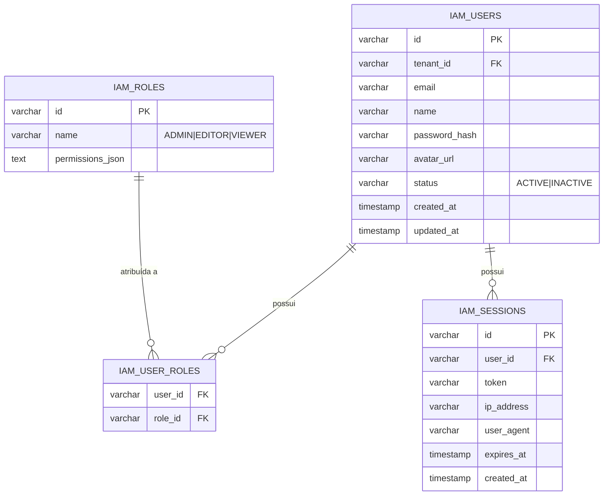
```mermaid
erDiagram
    IAM_USERS {
        varchar id PK
        varchar tenant_id FK
        varchar email
        varchar name
        varchar password_hash
        varchar avatar_url
        varchar status "ACTIVE|INACTIVE"
        timestamp created_at
        timestamp updated_at
    }

    IAM_ROLES {
        varchar id PK
        varchar name "ADMIN|EDITOR|VIEWER"
        text permissions_json
    }

    IAM_USER_ROLES {
        varchar user_id FK
        varchar role_id FK
    }

    IAM_SESSIONS {
        varchar id PK
        varchar user_id FK
        varchar token
        varchar ip_address
        varchar user_agent
        timestamp expires_at
        timestamp created_at
    }

    IAM_USERS ||--o{ IAM_USER_ROLES : "possui"
    IAM_ROLES ||--o{ IAM_USER_ROLES : "atribuída a"
    IAM_USERS ||--o{ IAM_SESSIONS : "possui"
```

---

## Diagrama 4: Configurações do Sistema

### Fluxo de Dados - System Settings

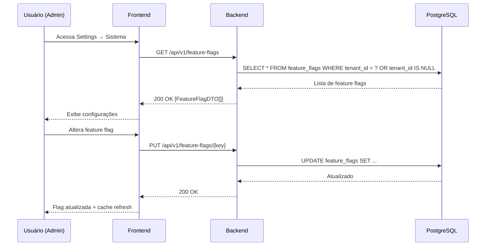
```mermaid
sequenceDiagram
    participant U as Usuário (Admin)
    participant FE as Frontend
    participant BE as Backend
    participant DB as PostgreSQL

    U->>FE: Acessa Settings → Sistema
    FE->>BE: GET /api/v1/feature-flags
    BE->>DB: SELECT * FROM feature_flags WHERE tenant_id = ? OR tenant_id IS NULL
    DB-->>BE: Lista de feature flags
    BE-->>FE: 200 OK [FeatureFlagDTO[]]
    FE-->>U: Exibe configurações

    U->>FE: Altera feature flag
    FE->>BE: PUT /api/v1/feature-flags/{key}
    BE->>DB: UPDATE feature_flags SET ...
    DB-->>BE: Atualizado
    BE-->>FE: 200 OK
    FE-->>U: Flag atualizada + cache refresh
```

### Modelo de Dados - Feature Flags

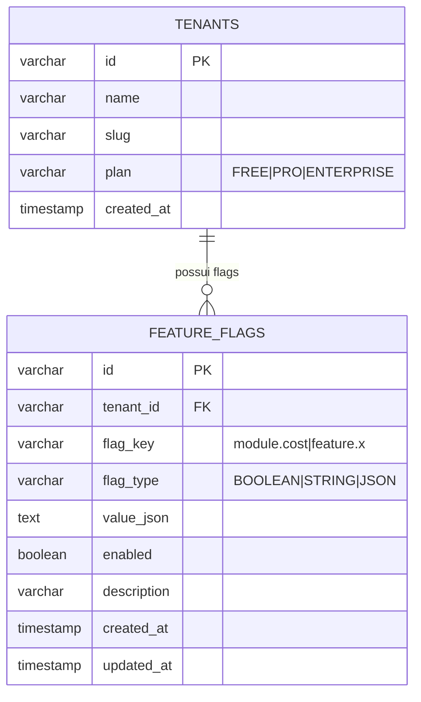
```mermaid
erDiagram
    FEATURE_FLAGS {
        varchar id PK
        varchar tenant_id FK
        varchar flag_key "module.cost|feature.x"
        varchar flag_type "BOOLEAN|STRING|JSON"
        text value_json
        boolean enabled
        varchar description
        timestamp created_at
        timestamp updated_at
    }

    TENANTS {
        varchar id PK
        varchar name
        varchar slug
        varchar plan "FREE|PRO|ENTERPRISE"
        timestamp created_at
    }

    TENANTS ||--o{ FEATURE_FLAGS : "possui flags"
```

---

## Diagrama 5: Arquitetura do Frontend

### Estrutura de Módulos

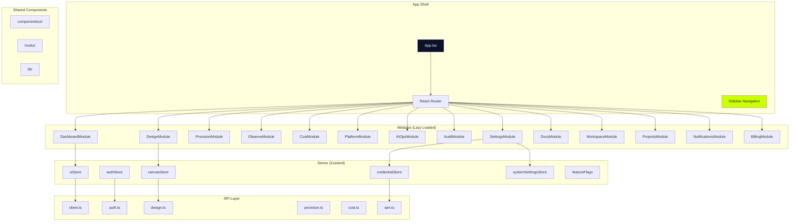
```mermaid
graph TB
    subgraph "App Shell"
        APP[App.tsx]
        ROUTER[React Router]
        NAV[Sidebar Navigation]
    end

    subgraph "Módulos (Lazy Loaded)"
        DASH[DashboardModule]
        CANVAS[DesignModule]
        PROV[ProvisionModule]
        OBS[ObserveModule]
        COST[CostModule]
        PLAT[PlatformModule]
        AI[AIOpsModule]
        AUDIT[AuditModule]
        SETT[SettingsModule]
        DOCS[DocsModule]
        WS[WorkspaceModule]
        PROJ[ProjectsModule]
        NOTIF[NotificationsModule]
        BILL[BillingModule]
    end

    subgraph "Stores (Zustand)"
        US[uiStore]
        AS[authStore]
        CS[canvasStore]
        CRED[credentialStore]
        SYS[systemSettingsStore]
        FF[featureFlags]
    end

    subgraph "API Layer"
        CLIENT[client.ts]
        AUTH_API[auth.ts]
        DESIGN_API[design.ts]
        PROV_API[provision.ts]
        COST_API[cost.ts]
        IAM_API[iam.ts]
    end

    subgraph "Shared Components"
        UI[components/ui/]
        HOOKS[hooks/]
        LIB[lib/]
    end

    APP --> ROUTER
    ROUTER --> DASH
    ROUTER --> CANVAS
    ROUTER --> PROV
    ROUTER --> OBS
    ROUTER --> COST
    ROUTER --> PLAT
    ROUTER --> AI
    ROUTER --> AUDIT
    ROUTER --> SETT
    ROUTER --> DOCS
    ROUTER --> WS
    ROUTER --> PROJ
    ROUTER --> NOTIF
    ROUTER --> BILL

    DASH --> US
    CANVAS --> CS
    SETT --> CRED
    SETT --> SYS

    US --> CLIENT
    AS --> AUTH_API
    CS --> DESIGN_API
    CRED --> IAM_API

    style APP fill:#0a1128,color:#fff
    style NAV fill:#ccff00
```

### Fluxo de Autenticação

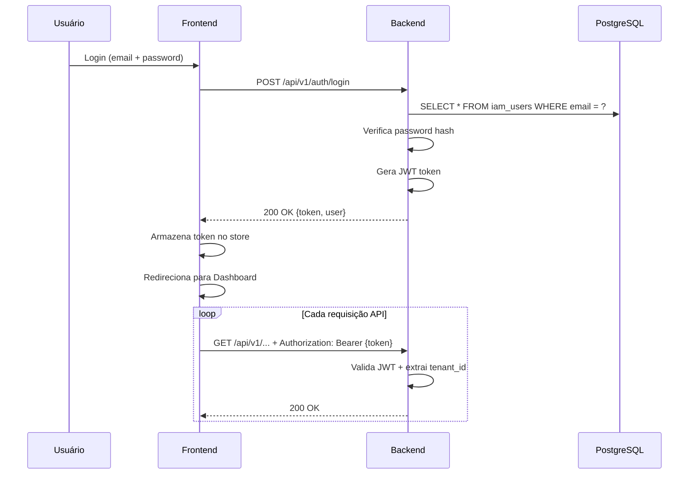
```mermaid
sequenceDiagram
    participant U as Usuário
    participant FE as Frontend
    participant BE as Backend
    participant DB as PostgreSQL

    U->>FE: Login (email + password)
    FE->>BE: POST /api/v1/auth/login
    BE->>DB: SELECT * FROM iam_users WHERE email = ?
    BE->>BE: Verifica password hash
    BE->>BE: Gera JWT token
    BE-->>FE: 200 OK {token, user}
    FE->>FE: Armazena token no store
    FE->>FE: Redireciona para Dashboard

    loop Cada requisição API
        FE->>BE: GET /api/v1/... + Authorization: Bearer {token}
        BE->>BE: Valida JWT + extrai tenant_id
        BE-->>FE: 200 OK
    end
```

---

## Diagrama 6: Arquitetura do Backend

### Estrutura Hexagonal

```mermaid
graph TB
    subgraph "Infrastructure Layer"
        CTRL[Controllers]
        REPO[JPA Repositories]
        CONFIG[Configuration]
        EVENTS[Event Listeners]
    end

    subgraph "Application Layer"
        DTO[DTOs / Request/Response]
        SERVICES[Domain Services]
        PORTS[Port Interfaces]
    end

    subgraph "Domain Layer"
        ENTITIES[Entities / Aggregates]
        RULES[Business Rules]
        EVENTS_D[Domain Events]
    end

    subgraph "Modules"
        M1[design]
        M2[provision]
        M3[cost]
        M4[observe]
        M5[iam]
        M6[credential]
        M7[environment]
        M8[approval]
        M9[deployment]
        M10[aiops]
        M11[audit]
        M12[platform]
        M13[docs]
        M14[featureflags]
        M15[search]
        M16[analytics]
        M17[codeanalysis]
        M18[git]
        M19[github]
        M20[metrics]
        M21[multiregion]
        M22[observability]
        M23[tenant]
        M24[shared]
    end

    CTRL --> SERVICES
    SERVICES --> REPO
    SERVICES --> ENTITIES
    REPO --> PORTS

    M1 --> CTRL
    M2 --> CTRL
    M3 --> CTRL
    M4 --> CTRL
    M5 --> CTRL
    M6 --> CTRL
    M7 --> CTRL
    M8 --> CTRL
    M9 --> CTRL
    M10 --> CTRL
    M11 --> CTRL
    M12 --> CTRL
    M13 --> CTRL
    M14 --> CTRL
    M15 --> CTRL
    M16 --> CTRL
    M17 --> CTRL
    M18 --> CTRL
    M19 --> CTRL
    M20 --> CTRL
    M21 --> CTRL
    M22 --> CTRL
    M23 --> CTRL
    M24 --> CTRL

    style ENTITIES fill:#ccff00
    style SERVICES fill:#E3E2FD
    style CTRL fill:#0a1128,color:#fff
```

### Fluxo de Requisição API

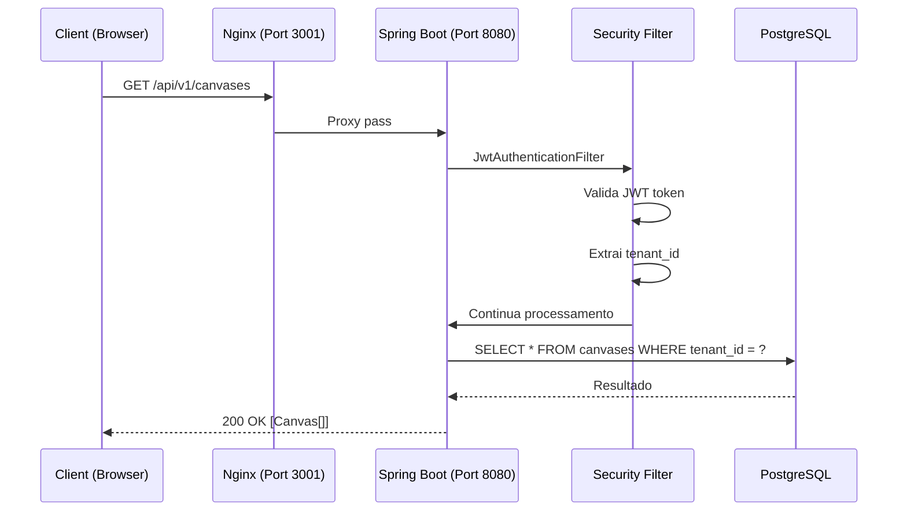
```mermaid
sequenceDiagram
    participant C as Client (Browser)
    participant NG as Nginx (Port 3001)
    participant BE as Spring Boot (Port 8080)
    participant SEC as Security Filter
    participant DB as PostgreSQL

    C->>NG: GET /api/v1/canvases
    NG->>BE: Proxy pass
    BE->>SEC: JwtAuthenticationFilter
    SEC->>SEC: Valida JWT token
    SEC->>SEC: Extrai tenant_id
    SEC->>BE: Continua processamento
    BE->>DB: SELECT * FROM canvases WHERE tenant_id = ?
    DB-->>BE: Resultado
    BE-->>C: 200 OK [Canvas[]]
```

---

## Diagrama 7: Integração Backend-Frontend

### Fluxo Completo - Design to Provision

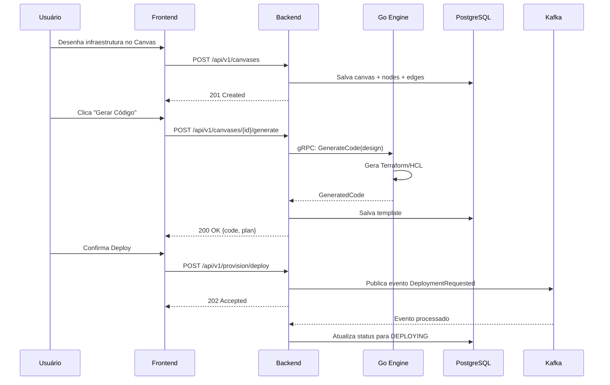
```mermaid
sequenceDiagram
    participant U as Usuário
    participant FE as Frontend
    participant BE as Backend
    participant GO as Go Engine
    participant DB as PostgreSQL
    participant K as Kafka

    U->>FE: Desenha infraestrutura no Canvas
    FE->>BE: POST /api/v1/canvases
    BE->>DB: Salva canvas + nodes + edges
    BE-->>FE: 201 Created

    U->>FE: Clica "Gerar Código"
    FE->>BE: POST /api/v1/canvases/{id}/generate
    BE->>GO: gRPC: GenerateCode(design)
    GO->>GO: Gera Terraform/HCL
    GO-->>BE: GeneratedCode
    BE->>DB: Salva template
    BE-->>FE: 200 OK {code, plan}

    U->>FE: Confirma Deploy
    FE->>BE: POST /api/v1/provision/deploy
    BE->>K: Publica evento DeploymentRequested
    BE-->>FE: 202 Accepted
    K-->>BE: Evento processado
    BE->>DB: Atualiza status para DEPLOYING
```

### Fluxo de Observabilidade

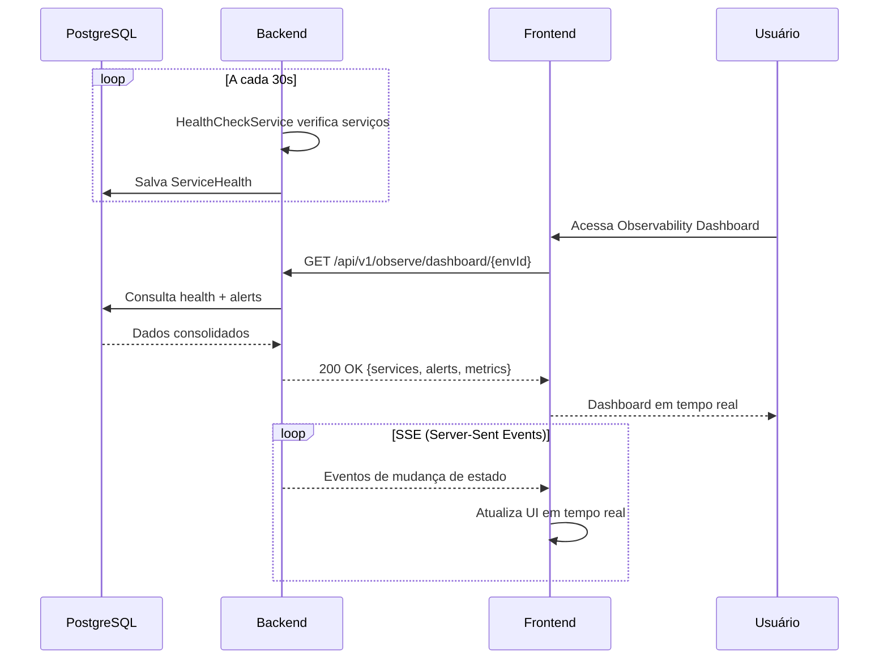
```mermaid
sequenceDiagram
    participant DB as PostgreSQL
    participant BE as Backend
    participant FE as Frontend
    participant U as Usuário

    loop A cada 30s
        BE->>BE: HealthCheckService verifica serviços
        BE->>DB: Salva ServiceHealth
    end

    U->>FE: Acessa Observability Dashboard
    FE->>BE: GET /api/v1/observe/dashboard/{envId}
    BE->>DB: Consulta health + alerts
    DB-->>BE: Dados consolidados
    BE-->>FE: 200 OK {services, alerts, metrics}
    FE-->>U: Dashboard em tempo real

    loop SSE (Server-Sent Events)
        BE-->>FE: Eventos de mudança de estado
        FE->>FE: Atualiza UI em tempo real
    end
```

---

## Diagrama 8: Segurança e Multi-Tenancy

### Fluxo de Isolamento por Tenant

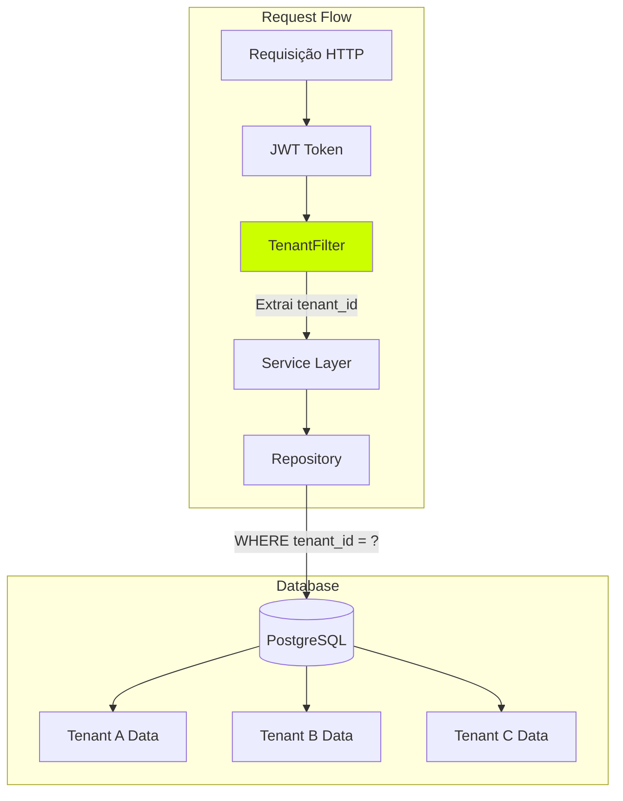
```mermaid
graph TB
    subgraph "Request Flow"
        REQ[Requisição HTTP]
        JWT[JWT Token]
        FILTER[TenantFilter]
        SVC[Service Layer]
        REPO[Repository]
    end

    subgraph "Database"
        PG[(PostgreSQL)]
        T1[Tenant A Data]
        T2[Tenant B Data]
        T3[Tenant C Data]
    end

    REQ --> JWT
    JWT --> FILTER
    FILTER -->|Extrai tenant_id| SVC
    SVC --> REPO
    REPO -->|WHERE tenant_id = ?| PG
    PG --> T1
    PG --> T2
    PG --> T3

    style FILTER fill:#ccff00
```

### Modelo de RBAC

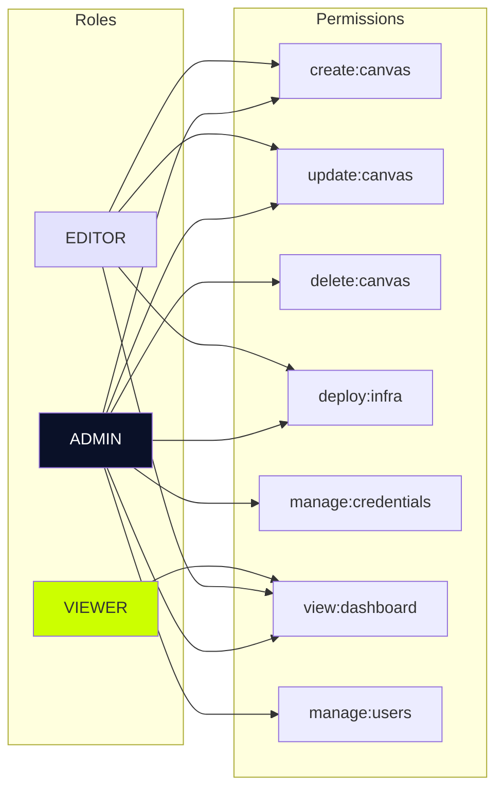
```mermaid
graph LR
    subgraph "Roles"
        ADMIN[ADMIN]
        EDITOR[EDITOR]
        VIEWER[VIEWER]
    end

    subgraph "Permissions"
        P1[create:canvas]
        P2[update:canvas]
        P3[delete:canvas]
        P4[deploy:infra]
        P5[manage:credentials]
        P6[view:dashboard]
        P7[manage:users]
    end

    ADMIN --> P1
    ADMIN --> P2
    ADMIN --> P3
    ADMIN --> P4
    ADMIN --> P5
    ADMIN --> P6
    ADMIN --> P7

    EDITOR --> P1
    EDITOR --> P2
    EDITOR --> P4
    EDITOR --> P6

    VIEWER --> P6

    style ADMIN fill:#0a1128,color:#fff
    style EDITOR fill:#E3E2FD
    style VIEWER fill:#ccff00
```

---

---

## Diagrama 9: Todos os Módulos do Backend (25 módulos)

### Responsabilidades dos Módulos

| # | Módulo | Camada | Responsabilidade |
|---|--------|--------|-----------------|
| M1 | design | Domain | Canvas CRUD, Nodes, Edges, Versões, Validação |
| M2 | provision | Domain | Code Gen, Deploy, DR, Ephemeral, Import |
| M3 | cost | Domain | Budget, Cost Records, Otimização |
| M4 | observe | Domain | Alertas, Health, Service Health |
| M5 | iam | Domain | User, Role, Permission, Tenant, JWT |
| M6 | credential | Domain | Cloud Credentials, Secrets Encryption |
| M7 | environment | Domain | Managed Environments, State |
| M8 | approval | Domain | Approval Workflows, Gates |
| M9 | deployment | Domain | Deploy Pipeline, Ephemeral, Promote |
| M10 | aiops | Domain | Incidents, AI Query, Chat, RCA |
| M11 | audit | Domain | Audit Events, Compliance |
| M12 | platform | Domain | Catalog, Marketplace, Partners |
| M13 | docs | Domain | Doc Scanner, Auto-Documentation, ADR |
| M14 | featureflags | Domain | Feature Flags, Toggle, Cache |
| M15 | search | Domain | Full-Text Search, Indexing |
| M16 | analytics | Domain | Analytics Aggregation, Rollup |
| M17 | codeanalysis | Domain | Code Analysis, Quality Metrics |
| M18 | git | Domain | Git Scanner, IaC Detector, Pipeline Gen |
| M19 | github | Domain | GitHub OAuth, API Client |
| M20 | metrics | Domain | Metrics Collection, Resource Metrics |
| M21 | multiregion | Domain | Regions, DR Tests, Region Health |
| M22 | observability | Domain | Traces, Spans, APMSnapshot, Logs |
| M23 | tenant | Domain | Projects, Project Members |
| M24 | shared | Cross-cutting | Security (JWT, Tenant), Events, Kernel |

### Frontend Sub-Módulos (componentes compartilhados)

| Sub-módulo | Importado por | Responsabilidade |
|------------|--------------|-----------------|
| deployment/ | ProvisionModule, SettingsModule | AppDeployFlow, ApprovalDialog, CiCdPipeline, EphemeralEnvironments, PromoteDialog |
| gitops/ | ProvisionModule | GitOpsSection, Pipeline Runs, Webhooks |

---

## Referências

- **Backend API**: `backend/src/main/java/com/cloudbuilder/*/infrastructure/web/`
- **Frontend Modules**: `frontend/src/modules/*/`
- **Database Migrations**: `backend/src/main/resources/db/migration/`
- **Type Definitions**: `frontend/src/types/`
- **Stores**: `frontend/src/store/`
