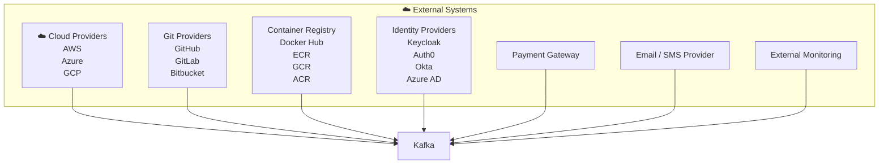
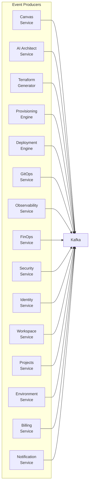
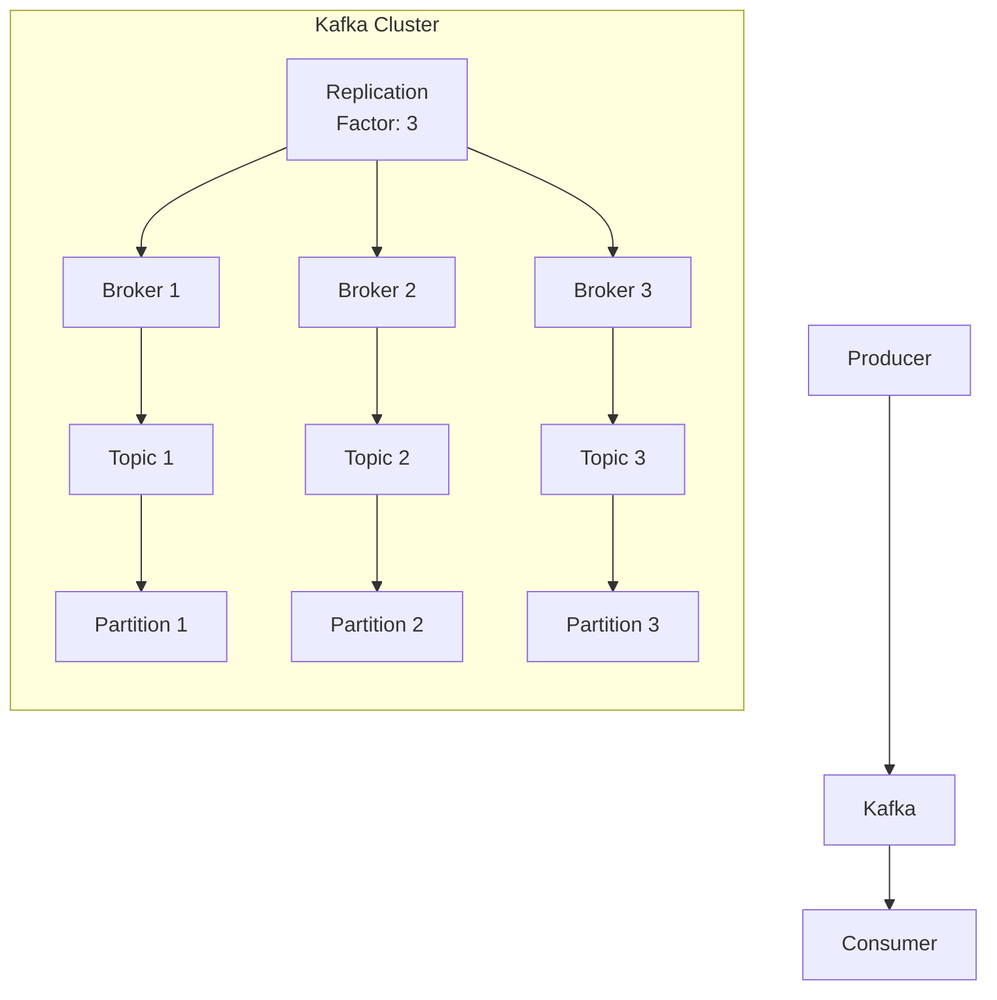
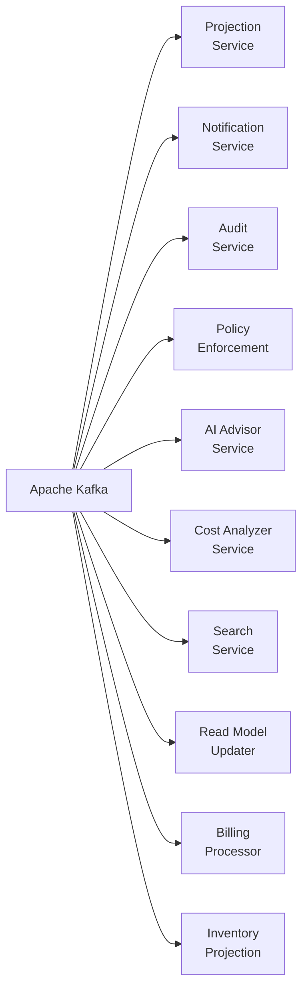
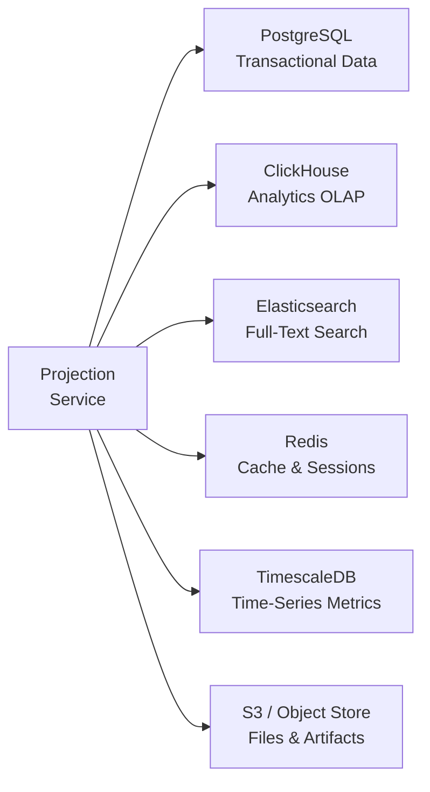
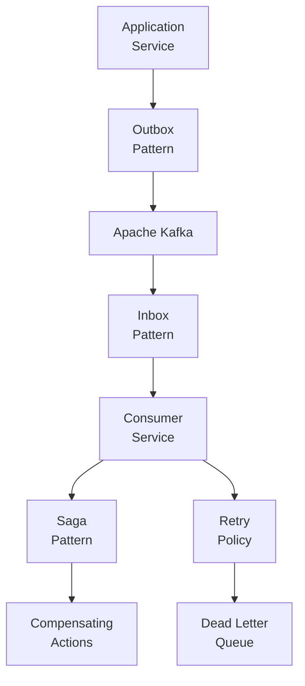
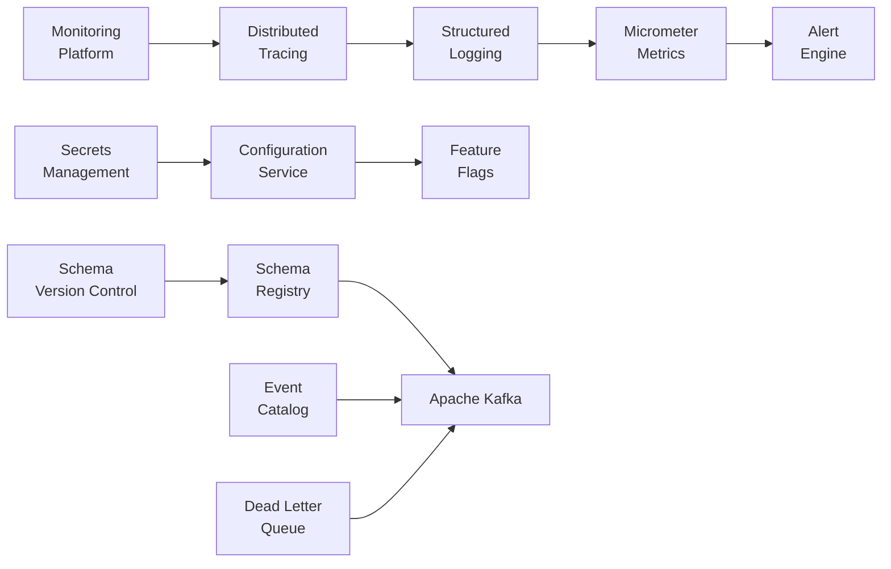
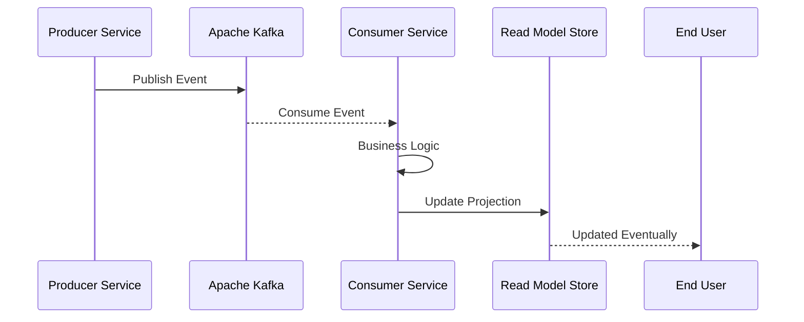
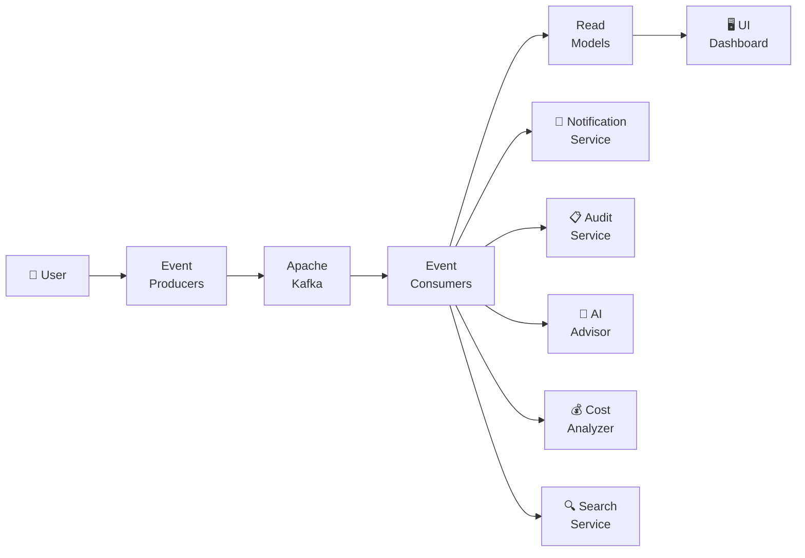

# CloudBuilder — EDA Architecture Diagrams

**Versão**: 1.0.0
**Última atualização**: 2026-06-28
**ADR**: ADR-035 (Production Event-Driven Architecture)
**Framework**: FAANg (Future Autonomous AI Network for Engineering)

---

## 1. External Systems → Kafka

Diagrama mostrando como sistemas externos se conectam ao Kafka como event sources.



---

## 2. Internal Producers → Kafka

Diagrama mostrando todos os producers internos da plataforma que publicam eventos no Kafka.



---

## 3. Kafka Cluster Internals

Diagrama mostrando a arquitetura interna do cluster Kafka com brokers, tópicos, partições e replicação.



---

## 4. Event Topics Catalog

Diagrama mostrando todos os 20 tópicos Kafka utilizados pela plataforma.

```mermaid
flowchart TB
    Kafka["Apache Kafka\nEvent Bus"]

    Kafka --> canvas_events["canvas.events"]
    Kafka --> architecture_events["architecture.events"]
    Kafka --> terraform_events["terraform.events"]
    Kafka --> provisioning_events["provisioning.events"]
    Kafka --> deployment_events["deployment.events"]
    Kafka --> gitops_events["gitops.events"]
    Kafka --> kubernetes_events["kubernetes.events"]
    Kafka --> resource_events["resource.events"]
    Kafka --> observability_events["observability.events"]
    Kafka --> finops_events["finops.events"]
    Kafka --> billing_events["billing.events"]
    Kafka --> security_events["security.events"]
    Kafka --> identity_events["identity.events"]
    Kafka --> notification_events["notification.events"]
    Kafka --> audit_events["audit.events"]
    Kafka --> ai_events["ai.events"]
    Kafka --> policy_events["policy.events"]
    Kafka --> inventory_events["inventory.events"]
    Kafka --> system_events["system.events"]
    Kafka --> cost_events["cost.events"]
```



### Topic Specifications

| Topic | Partitions | Replication | Retention | Descrição |
|-------|------------|-------------|-----------|-----------|
| `canvas.events` | 3 | 3 | 7 days | Eventos de criação/edição de infraestrutura |
| `architecture.events` | 3 | 3 | 7 days | Eventos de geração de arquiteturas |
| `terraform.events` | 3 | 3 | 30 days | Eventos de geração de código IaC |
| `provisioning.events` | 6 | 3 | 30 days | Eventos de provisionamento de recursos |
| `deployment.events` | 6 | 3 | 30 days | Eventos de deploy de aplicações |
| `gitops.events` | 3 | 3 | 7 days | Eventos de sincronização GitOps |
| `kubernetes.events` | 3 | 3 | 7 days | Eventos de recursos Kubernetes |
| `resource.events` | 6 | 3 | 30 days | Eventos de recursos gerenciados |
| `observability.events` | 3 | 3 | 7 days | Eventos de métricas e logs |
| `finops.events` | 3 | 3 | 30 days | Eventos de análise de custos |
| `billing.events` | 3 | 3 | 365 days | Eventos de faturamento |
| `security.events` | 3 | 3 | 90 days | Eventos de segurança e compliance |
| `identity.events` | 3 | 3 | 90 days | Eventos de usuários e permissões |
| `notification.events` | 3 | 3 | 7 days | Eventos de notificações |
| `audit.events` | 3 | 3 | 365 days | Eventos de auditoria |
| `ai.events` | 3 | 3 | 7 days | Eventos de IA e insights |
| `policy.events` | 3 | 3 | 90 days | Eventos de políticas |
| `inventory.events` | 3 | 3 | 30 days | Eventos de inventário |
| `system.events` | 3 | 3 | 7 days | Eventos de sistema |
| `cost.events` | 3 | 3 | 30 days | Eventos de custos |

---

## 5. Consumer Services

Diagrama mostrando todos os serviços consumidores que processam eventos do Kafka.



### Consumer Responsibilities

| Consumer | Topics | Group ID | Responsabilidade |
|----------|--------|----------|-----------------|
| **ProjectionService** | `canvas.events`, `deployment.events` | `projection-service` | Atualizar Read Models (Materialized Views) |
| **NotificationService** | `deployment.events`, `security.events`, `finops.events` | `notification-service` | Enviar notificações (e-mail, SMS, Slack, Webhooks) |
| **AuditService** | `*.events` (wildcard) | `audit-service` | Armazenar trilhas de auditoria imutáveis |
| **PolicyService** | `canvas.events`, `deployment.events` | `policy-service` | Aplicar políticas e regras de segurança |
| **AIAdvisor** | `observability.events`, `finops.events` | `ai-advisor-service` | Gerar insights e recomendações via IA |
| **CostAnalyzer** | `finops.events`, `cost.events` | `cost-analyzer-service` | Processar eventos de custos e detectar anomalias |
| **SearchService** | `*.events` (wildcard) | `search-service` | Indexar eventos para busca e relatórios |
| **ReadModelUpdater** | `*.events` (wildcard) | `read-model-updater` | Sincronizar projeções em tempo real |
| **BillingProcessor** | `billing.events`, `identity.events` | `billing-processor` | Processar faturamento e assinaturas |
| **InventoryProjection** | `resource.events`, `inventory.events` | `inventory-projection` | Manter inventário de recursos atualizado |

---

## 6. Projection Storage (Read Models)

Diagrama mostrando os destinos de dados onde os Read Models são persistidos.



### Storage Selection Rationale

| Store | Use Case | Query Pattern | Retention |
|-------|----------|---------------|-----------|
| **PostgreSQL** | Canvas configs, deployments, IAM | ACID transactions, FK relations | Permanent |
| **ClickHouse** | Cost analytics, usage metrics | OLAP aggregations, columnar | 90 days |
| **Elasticsearch** | Event search, audit logs | Full-text search, faceted | 30 days |
| **Redis** | Session cache, feature flags | Key-value, pub/sub | 24 hours |
| **TimescaleDB** | Infrastructure metrics | Time-series, continuous aggregates | 1 year |
| **S3** | Terraform state, artifacts | Object storage, versioning | Permanent |

---

## 7. Reliability Patterns (Outbox → Inbox → Saga → DLQ)

Diagrama mostrando os padrões de confiabilidade implementados para garantir entrega e processamento confiável de eventos.



### Pattern Details

#### Outbox Pattern
- **Problema**: Garantir publicação confiável de eventos mesmo com falhas no banco
- **Solução**: Persistir evento em tabela `event_outbox` antes do commit, depois publicar via Kafka
- **Implementation**: `OutboxSweeper`(@Scheduled 30s) varre eventos PENDING e publica

#### Inbox Pattern
- **Problema**: Garantir processamento idempotente de eventos duplicados
- **Solução**: Rastrear IDs de eventos processados em tabela `event_inbox` e ignorar duplicatas
- **Implementation**: `InboxProcessor` verifica existência antes de processar

#### Saga Pattern
- **Problema**: Transações distribuídas que envolvem múltiplos serviços
- **Solução**: Implementar Saga com compensating actions para rollback
- **Implementation**: `DeploymentSaga` com 3 steps (plan → approve → apply) + compensação

#### Dead Letter Queue (DLQ)
- **Problema**: Eventos que falharam após múltiplas tentativas
- **Solução**: Enviar eventos com falha para DLQ (`{topic}.dlq`) para investigação manual
- **Implementation**: `DLQHandler` persiste evento + alerta time de operações

#### Retry Policy
- **Problema**: Falhas transitivas (rede, timeout, etc.)
- **Solução**: Retry com backoff exponencial (1s → 2s → 4s → DLQ)
- **Implementation**: `@Retryable(maxAttempts=3, backoff=@Backoff(delay=1000, multiplier=2))`

---

## 8. Cross-cutting Concerns

Diagrama mostrando as preocupações transversais que suportam toda a plataforma EDA.



### Cross-cutting Components

| Component | Technology | Responsabilidade |
|-----------|-----------|-----------------|
| **Distributed Tracing** | OpenTelemetry + Jaeger | Rastreamento ponta-a-ponta de requests |
| **Structured Logging** | Logback + JSON | Logs estruturados para ELK/Datadog |
| **Micrometer Metrics** | Micrometer + Prometheus | Métricas de JVM, Kafka, HTTP |
| **Alert Engine** | Custom + PagerDuty | Alertas baseados em SLO/SLA |
| **Secrets Management** | HashiCorp Vault / AWS SM | Armazenamento seguro de credenciais |
| **Configuration** | Spring Cloud Config | Configuração centralizada por ambiente |
| **Feature Flags** | Custom + LaunchDarkly | Feature flags para rollouts graduais |
| **Schema Registry** | Confluent Schema Registry | Validação e versionamento de schemas |
| **Event Catalog** | Custom | Catálogo navegável de todos os eventos |
| **Dead Letter Queue** | Kafka DLQ topics | Eventos com falha para investigação |

---

## 9. Event Flow Sequence

Diagrama de sequência mostrando o fluxo completo de um evento desde a publicação até a atualização do Read Model.



### Flow Description

1. **Producer publishes event** → Service that originated the event publishes to appropriate Kafka topic
2. **Kafka delivers to consumer** → Consumer service subscribed to the topic receives the event
3. **Consumer processes business logic** → Validates, transforms, and applies business rules
4. **Consumer updates read model** → Writes projection to appropriate data store (PostgreSQL, ClickHouse, etc.)
5. **User sees eventual update** → UI reflects changes via SSE polling or refresh

---

## 10. High-Level Architecture Overview

Diagrama de visão geral mostrando o fluxo completo de dados na plataforma.



### Architecture Layers

| Layer | Components | Technology |
|-------|-----------|------------|
| **User Interface** | React SPA, Zustand stores, SSE | React 19, Vite, Tailwind |
| **API Gateway** | REST controllers, JWT auth | Spring Boot, Spring Security |
| **Event Producers** | Canvas, Provisioning, Deployment, etc. | Spring Modulith, Go Engine |
| **Event Bus** | Kafka cluster, Schema Registry | Apache Kafka 3.7, KRaft |
| **Event Consumers** | Projection, Notification, Audit, etc. | Spring Kafka, @KafkaListener |
| **Read Models** | PostgreSQL, ClickHouse, ES, Redis | Multiple stores per use case |
| **Cross-cutting** | Tracing, Metrics, Alerts, DLQ | OpenTelemetry, Micrometer |

---

## Appendix A: Event Naming Convention

```
{domain}.{entity}.{action}
```

### Examples

| Event Type | Domain | Entity | Action |
|------------|--------|--------|--------|
| `canvas.infra.created` | canvas | infra | created |
| `deployment.started` | deployment | — | started |
| `security.policy.violated` | security | policy | violated |
| `finops.cost.anomaly` | finops | cost | anomaly |
| `identity.user.registered` | identity | user | registered |
| `provisioning.resource.provisioned` | provisioning | resource | provisioned |

---

## Appendix B: Correlation ID Strategy

Every event includes correlation IDs for distributed tracing:

```json
{
  "eventId": "evt_01HXYZ...",
  "correlationId": "corr_01HXYZ...",
  "causationId": "evt_01ABCD...",
  "tenantId": "tenant_123",
  "eventType": "deployment.completed"
}
```

- **eventId**: Unique identifier for this event (ULID format)
- **correlationId**: Groups all events in a single user request flow
- **causationId**: References the event/command that caused this event
- **tenantId**: Multi-tenant isolation identifier

---

## Appendix C: Schema Versioning Rules

| Change Type | Compatibility | Action |
|-------------|--------------|--------|
| Add optional field | BACKWARD | Safe to deploy |
| Remove optional field | FORWARD | Safe to deploy |
| Add required field | BREAKING | New event version required |
| Remove required field | BREAKING | New event version required |
| Change field type | BREAKING | New event version required |

---

## References

- [Apache Kafka Documentation](https://kafka.apache.org/documentation/)
- [Confluent Schema Registry](https://docs.confluent.io/platform/current/schema-registry/)
- [Enterprise Integration Patterns](https://www.enterpriseintegrationpatterns.com/)
- [Designing Event-Driven Systems](https://www.confluent.io/designing-event-driven-systems/)
- [Kafka: The Definitive Guide](https://www.confluent.io/resources/kafka-the-definitive-guide/)
- [ADR-035: Production Event-Driven Architecture](../adr-035-production-event-driven-architecture.md)
- [EDA README](./README.md)
