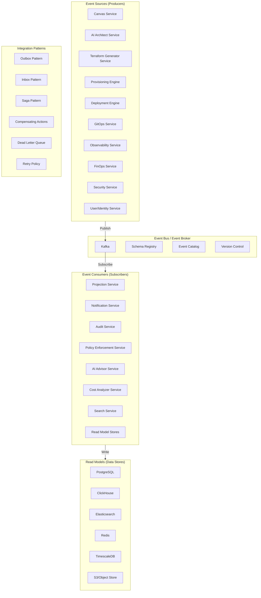
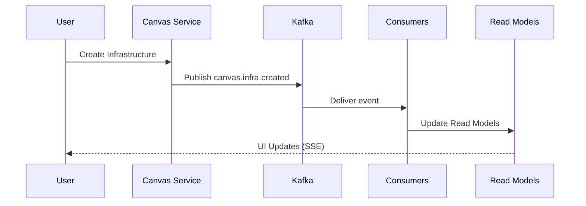

# CloudBuilder — Event-Driven Architecture (EDA)

**Versão**: 1.0.0  
**Última atualização**: 2026-06-28  
**ADR**: ADR-035 (Production Event-Driven Architecture)  
**Framework**: FAANg (Future Autonomous AI Network for Engineering)

---

## 1. Visão Geral

CloudBuilder adota uma arquitetura orientada a eventos (Event-Driven Architecture) baseada em Apache Kafka para comunicação assíncrona entre serviços. Esta arquitetura permite:

- **Desacoplamento completo** entre serviços
- **Escalabilidade horizontal** ilimitada
- **Resiliência** com retry, DLQ e idempotência
- **Evolução de contratos** via versionamento
- **Observabilidade ponta a ponta** via correlation IDs

### Princípios EDA

1. **Event First**: Todos os fluxos de dados começam com eventos
2. **Loose coupling**: Serviços não se conhecem diretamente
3. **High cohesion**: Cada serviço é responsável por seu domínio
4. **Async by Default**: Comunicação assíncrona por padrão
5. **Eventual Consistency**: Consistência eventual é aceitável
6. **Idempotência**: Processamento idempotente é obrigatório
7. **Imutabilidade**: Eventos são imutáveis após publicação
8. **Retry & Resilience**: Falhas são tratadas com retry e DLQ
9. **Observabilidade**: Rastreabilidade ponta a ponta
10. **Evolutionary Design**: Contratos evoluem compativelmente

---

## 2. Arquitetura

### 2.1 Componentes Principais



### 2.2 Fluxo de Eventos



---

## 3. Kafka Topics

### 3.1 Especificação dos Tópicos

| Topic | Partitions | Replication | Retention | Descrição |
|-------|------------|-------------|-----------|-----------|
| `canvas.events` | 3 | 3 | 7 days | Eventos de criação/edição de infraestrutura |
| `architecture.events` | 3 | 3 | 7 days | Eventos de geração de arquiteturas |
| `terraform.events` | 3 | 3 | 30 days | Eventos de geração de código IaC |
| `provisioning.events` | 6 | 3 | 30 days | Eventos de provisionamento de recursos |
| `deployment.events` | 6 | 3 | 30 days | Eventos de deploy de aplicações |
| `gitops.events` | 3 | 3 | 7 days | Eventos de sincronização GitOps |
| `kubernetes.events` | 3 | 3 | 7 days | Eventos de recursos Kubernetes |
| `resource.events` | 6 | 3 | 30 days | Eventos de recursos gerenciados |
| `security.events` | 3 | 3 | 90 days | Eventos de segurança e compliance |
| `identity.events` | 3 | 3 | 90 days | Eventos de usuários e permissões |
| `observability.events` | 3 | 3 | 7 days | Eventos de métricas e logs |
| `finops.events` | 3 | 3 | 30 days | Eventos de análise de custos |
| `billing.events` | 3 | 3 | 365 days | Eventos de faturamento |
| `notification.events` | 3 | 3 | 7 days | Eventos de notificações |
| `audit.events` | 3 | 3 | 365 days | Eventos de auditoria |
| `ai.events` | 3 | 3 | 7 days | Eventos de IA e insights |
| `policy.events` | 3 | 3 | 90 days | Eventos de políticas |
| `cost.events` | 3 | 3 | 30 days | Eventos de custos |
| `inventory.events` | 3 | 3 | 30 days | Eventos de inventário |
| `system.events` | 3 | 3 | 7 days | Eventos de sistema |

### 3.2 Naming Convention

```
{domain}.{entity}.{action}
```

Exemplos:
- `canvas.infra.created`
- `deployment.started`
- `security.policy.violated`
- `finops.cost.processed`

### 3.3 Partitioning Strategy

```java
// Key partitioning por aggregateId para ordenação garantida
producer.send(new ProducerRecord<>(
    topic,
    event.getAggregateId(),  // partition key
    event
));
```

---

## 4. Event Contracts (JSON Schema)

### 4.1 Base Event Schema

```json
{
  "$schema": "http://json-schema.org/draft-07/schema#",
  "title": "CloudBuilderEvent",
  "type": "object",
  "required": ["eventId", "eventType", "aggregateId", "aggregateType", "version", "occurredAt", "correlationId", "causationId"],
  "properties": {
    "eventId": {
      "type": "string",
      "pattern": "^evt_[a-zA-Z0-9]{21}$",
      "description": "Unique event identifier (ULID format)"
    },
    "eventType": {
      "type": "string",
      "pattern": "^[a-z]+\\.[a-z]+\\.[a-z]+$",
      "description": "Event type (domain.entity.action)"
    },
    "aggregateId": {
      "type": "string",
      "description": "Aggregate root identifier"
    },
    "aggregateType": {
      "type": "string",
      "description": "Aggregate root type"
    },
    "version": {
      "type": "integer",
      "minimum": 1,
      "description": "Event schema version"
    },
    "occurredAt": {
      "type": "string",
      "format": "date-time",
      "description": "Event timestamp (ISO 8601)"
    },
    "correlationId": {
      "type": "string",
      "pattern": "^corr_[a-zA-Z0-9]{21}$",
      "description": "Correlation ID for distributed tracing"
    },
    "causationId": {
      "type": "string",
      "pattern": "^(evt|cmd)_[a-zA-Z0-9]{21}$",
      "description": "Causation ID (event or command that caused this)"
    },
    "tenantId": {
      "type": "string",
      "description": "Tenant identifier (multi-tenancy)"
    },
    "metadata": {
      "type": "object",
      "description": "Additional metadata"
    },
    "data": {
      "type": "object",
      "description": "Event-specific payload"
    }
  }
}
```

### 4.2 Canvas Event Schema

```json
{
  "$schema": "http://json-schema.org/draft-07/schema#",
  "title": "CanvasInfraCreatedEvent",
  "type": "object",
  "allOf": [{"$ref": "#/definitions/BaseEvent"}],
  "properties": {
    "eventType": {
      "const": "canvas.infra.created"
    },
    "data": {
      "type": "object",
      "required": ["canvasId", "canvasName", "nodeCount", "edgeCount"],
      "properties": {
        "canvasId": {"type": "string"},
        "canvasName": {"type": "string"},
        "nodeCount": {"type": "integer"},
        "edgeCount": {"type": "integer"},
        "providers": {
          "type": "array",
          "items": {"type": "string"}
        }
      }
    }
  }
}
```

### 4.3 Deployment Event Schema

```json
{
  "$schema": "http://json-schema.org/draft-07/schema#",
  "title": "DeploymentStartedEvent",
  "type": "object",
  "allOf": [{"$ref": "#/definitions/BaseEvent"}],
  "properties": {
    "eventType": {
      "const": "deployment.started"
    },
    "data": {
      "type": "object",
      "required": ["deploymentId", "environmentId", "status", "resourceCount"],
      "properties": {
        "deploymentId": {"type": "string"},
        "environmentId": {"type": "string"},
        "status": {
          "type": "string",
          "enum": ["INIT", "PLANNING", "PLANNED", "APPLYING", "APPLIED", "FAILED", "ROLLED_BACK"]
        },
        "resourceCount": {"type": "integer"},
        "provider": {"type": "string"},
        "region": {"type": "string"}
      }
    }
  }
}
```

### 4.4 Drift Detection Event Schema

```json
{
  "$schema": "http://json-schema.org/draft-07/schema#",
  "title": "DriftDetectedEvent",
  "type": "object",
  "allOf": [{"$ref": "#/definitions/BaseEvent"}],
  "properties": {
    "eventType": {
      "const": "observability.drift.detected"
    },
    "data": {
      "type": "object",
      "required": ["environmentId", "reportId", "driftCount", "severity"],
      "properties": {
        "environmentId": {"type": "string"},
        "reportId": {"type": "string"},
        "driftCount": {"type": "integer"},
        "severity": {
          "type": "string",
          "enum": ["LOW", "MEDIUM", "HIGH", "CRITICAL"]
        },
        "affectedResources": {
          "type": "array",
          "items": {"type": "string"}
        }
      }
    }
  }
}
```

### 4.5 Cost Event Schema

```json
{
  "$schema": "http://json-schema.org/draft-07/schema#",
  "title": "CostAnomalyEvent",
  "type": "object",
  "allOf": [{"$ref": "#/definitions/BaseEvent"}],
  "properties": {
    "eventType": {
      "const": "finops.cost.anomaly"
    },
    "data": {
      "type": "object",
      "required": ["environmentId", "budgetId", "currentSpend", "threshold", "deviationPercent"],
      "properties": {
        "environmentId": {"type": "string"},
        "budgetId": {"type": "string"},
        "currentSpend": {"type": "number"},
        "threshold": {"type": "number"},
        "deviationPercent": {"type": "number"},
        "timeWindow": {"type": "string"}
      }
    }
  }
}
```

---

## 5. Integration Patterns

### 5.1 Outbox Pattern

**Problema**: Garantir publicação confiável de eventos mesmo com falhas no banco de dados.

**Solução**: Persistir evento em tabela `event_outbox` antes do commit, depois publicar via Kafka.

```java
@Entity
@Table(name = "event_outbox")
public class EventOutbox {
    @Id
    private String id;
    private String eventType;
    private String aggregateId;
    private String payload;
    private Instant createdAt;
    private Instant publishedAt;
    private int retryCount;
    private String status; // PENDING, PUBLISHED, FAILED
}

@Component
public class OutboxSweeper {
    @Scheduled(fixedDelay = 30000)
    public void sweep() {
        List<EventOutbox> pending = outboxRepository.findByStatus("PENDING");
        for (EventOutbox event : pending) {
            try {
                kafkaTemplate.send(event.getEventType(), event.getAggregateId(), event.getPayload());
                event.setStatus("PUBLISHED");
                event.setPublishedAt(Instant.now());
            } catch (Exception e) {
                event.setRetryCount(event.getRetryCount() + 1);
                if (event.getRetryCount() >= 3) {
                    event.setStatus("FAILED");
                }
            }
            outboxRepository.save(event);
        }
    }
}
```

### 5.2 Inbox Pattern

**Problema**: Garantir processamento idempotente de eventos duplicados.

**Solução**: Rastrear IDs de eventos processados e ignorar duplicatas.

```java
@Entity
@Table(name = "event_inbox")
public class EventInbox {
    @Id
    private String eventId;
    private String eventType;
    private Instant processedAt;
    private String status; // PROCESSED, DUPLICATE
}

@Component
public class InboxProcessor {
    public void process(String eventId, String eventType, String payload) {
        if (inboxRepository.existsById(eventId)) {
            log.warn("Duplicate event: {}", eventId);
            return;
        }
        
        // Process event
        processEvent(eventType, payload);
        
        // Mark as processed
        EventInbox inbox = new EventInbox();
        inbox.setEventId(eventId);
        inbox.setEventType(eventType);
        inbox.setProcessedAt(Instant.now());
        inbox.setStatus("PROCESSED");
        inboxRepository.save(inbox);
    }
}
```

### 5.3 Saga Pattern

**Problema**: Transações distribuídas que envolvem múltiplos serviços.

**Solução**: Implementar Saga com compensating actions para rollback.

```java
@Service
public class DeploymentSaga {
    
    @SagaStep(order = 1)
    public void planDeployment(DeploymentEvent event) {
        // Step 1: Plan deployment
        deployService.plan(event.getEnvironmentId());
    }
    
    @SagaStep(order = 2)
    public void approveDeployment(DeploymentEvent event) {
        // Step 2: Approval (async wait)
        approvalService.requestApproval(event.getDeploymentId());
    }
    
    @SagaStep(order = 3, compensate = "rollbackPlan")
    public void applyDeployment(DeploymentEvent event) {
        // Step 3: Apply deployment
        deployService.apply(event.getDeploymentId());
    }
    
    public void rollbackPlan(DeploymentEvent event) {
        // Compensating action: rollback plan
        deployService.cancelPlan(event.getDeploymentId());
    }
}
```

### 5.4 Dead Letter Queue (DLQ)

**Problema**: Eventos que falharam após múltiplas tentativas.

**Solução**: Enviar eventos com falha para DLQ para investigação manual.

```java
@Component
public class DLQHandler {
    
    @KafkaListener(topics = "deployment.events.dlq")
    public void handleDLQ(ConsumerRecord<String, String> record) {
        DLQEvent dlqEvent = new DLQEvent();
        dlqEvent.setOriginalTopic(record.topic());
        dlqEvent.setOriginalPartition(record.partition());
        dlqEvent.setOriginalOffset(record.offset());
        dlqEvent.setPayload(record.value());
        dlqEvent.setFailureReason(extractFailureReason(record));
        dlqEvent.setFailedAt(Instant.now());
        
        dlqRepository.save(dlqEvent);
        
        // Alert operations team
        alertService.raiseAlert(
            "DLQ_EVENT",
            "Event failed after retries: " + record.key(),
            AlertSeverity.HIGH
        );
    }
}
```

### 5.5 Retry Policy

**Problema**: Falhas transitivas (rede, timeout, etc.).

**Solução**: Retry com backoff exponencial.

```java
@Component
public class RetryPolicy {
    
    @Retryable(
        retryFor = {TransientException.class},
        maxAttempts = 3,
        backoff = @Backoff(delay = 1000, multiplier = 2)
    )
    public void processWithRetry(Event event) {
        processEvent(event);
    }
    
    @Recover
    public void recoverFromRetry(Exception e, Event event) {
        // Send to DLQ after max retries
        dlqHandler.sendToDLQ(event, e.getMessage());
    }
}
```

---

## 6. Event Versioning

### 6.1 Versioning Strategy

CloudBuilder usa **semantic versioning** para eventos:

```
{eventType}.v{version}
```

Exemplos:
- `canvas.infra.created.v1`
- `canvas.infra.created.v2`

### 6.2 Schema Compatibility

| Compatibilidade | Descrição | Uso |
|----------------|-----------|-----|
| **BACKWARD** | Novo schema lê dados antigos | Novos consumers podem ler eventos antigos |
| **FORWARD** | Schema antigo lê dados novos | Consumers antigos podem ler eventos novos |
| **FULL** | Bidirecional | Máxima compatibilidade |

### 6.3 Migration Rules

1. **Adicionar campo opcional**: BACKWARD compatible
2. **Remover campo opcional**: FORWARD compatible
3. **Adicionar campo obrigatório**: BREAKING (novo evento necessário)
4. **Remover campo obrigatório**: BREAKING (novo evento necessário)
5. **Mudar tipo de campo**: BREAKING (novo evento necessário)

### 6.4 Schema Registry Integration

```java
@Configuration
public class KafkaSchemaConfig {
    
    @Bean
    public KafkaTemplate<String, String> kafkaTemplate() {
        // Schema Registry automatically validates schemas
        return new KafkaTemplate<>(producerFactory());
    }
    
    @Bean
    public ProducerFactory<String, String> producerFactory() {
        Map<String, Object> config = new HashMap<>();
        config.put(ProducerConfig.BOOTSTRAP_SERVERS_CONFIG, "localhost:9092");
        config.put("schema.registry.url", "http://localhost:8081");
        config.put(ProducerConfig.KEY_SERIALIZER_CLASS_CONFIG, StringSerializer.class);
        config.put(ProducerConfig.VALUE_SERIALIZER_CLASS_CONFIG, KafkaAvroSerializer.class);
        return new DefaultKafkaProducerFactory<>(config);
    }
}
```

---

## 7. Consumer Implementation Guide

### 7.1 Projection Service

**Responsabilidade**: Atualizar Read Models (Materialized Views).

```java
@Service
public class ProjectionService {
    
    @KafkaListener(topics = "canvas.events", groupId = "projection-service")
    public void handleCanvasEvent(ConsumerRecord<String, String> record) {
        CanvasEvent event = objectMapper.readValue(record.value(), CanvasEvent.class);
        
        switch (event.getEventType()) {
            case "canvas.infra.created":
                updateCanvasReadModel(event);
                break;
            case "canvas.infra.updated":
                updateCanvasReadModel(event);
                break;
            case "canvas.infra.deleted":
                deleteCanvasReadModel(event);
                break;
        }
    }
    
    private void updateCanvasReadModel(CanvasEvent event) {
        CanvasReadModel readModel = new CanvasReadModel();
        readModel.setId(event.getAggregateId());
        readModel.setName(event.getData().get("canvasName"));
        readModel.setNodeCount(event.getData().get("nodeCount"));
        readModel.setUpdatedAt(event.getOccurredAt());
        
        canvasReadModelRepository.save(readModel);
    }
}
```

### 7.2 Notification Service

**Responsabilidade**: Enviar notificações (e-mails, SMS, Slack, Webhooks).

```java
@Service
public class NotificationService {
    
    @KafkaListener(topics = {"deployment.events", "security.events"}, groupId = "notification-service")
    public void handleEvent(ConsumerRecord<String, String> record) {
        Event event = objectMapper.readValue(record.value(), Event.class);
        
        if (shouldNotify(event)) {
            Notification notification = createNotification(event);
            sendNotification(notification);
        }
    }
    
    private boolean shouldNotify(Event event) {
        // Filter based on event type and severity
        return switch (event.getEventType()) {
            case "deployment.started", "deployment.completed" -> true;
            case "security.policy.violated" -> true;
            case "finops.cost.anomaly" -> true;
            default -> false;
        };
    }
    
    private void sendNotification(Notification notification) {
        // Send to multiple channels
        emailService.send(notification);
        slackService.send(notification);
        webhookService.send(notification);
    }
}
```

### 7.3 Audit Service

**Responsabilidade**: Armazenar trilhas de auditoria imutáveis.

```java
@Service
public class AuditService {
    
    @KafkaListener(topics = "*.events", groupId = "audit-service")
    public void auditEvent(ConsumerRecord<String, String> record) {
        AuditEvent auditEvent = new AuditEvent();
        auditEvent.setId(UUID.randomUUID().toString());
        auditEvent.setEventId(record.key());
        auditEvent.setEventType(record.topic());
        auditEvent.setPayload(record.value());
        auditEvent.setTimestamp(Instant.now());
        auditEvent.setPartition(record.partition());
        auditEvent.setOffset(record.offset());
        
        // Store in append-only audit log
        auditEventRepository.save(auditEvent);
    }
}
```

### 7.4 Policy Enforcement Service

**Responsabilidade**: Aplicar políticas e regras de segurança.

```java
@Service
public class PolicyEnforcementService {
    
    @KafkaListener(topics = {"canvas.events", "deployment.events"}, groupId = "policy-service")
    public void enforcePolicy(ConsumerRecord<String, String> record) {
        Event event = objectMapper.readValue(record.value(), Event.class);
        
        List<PolicyViolation> violations = policyEngine.evaluate(event);
        
        for (PolicyViolation violation : violations) {
            // Block deployment if critical violation
            if (violation.getSeverity() == Severity.CRITICAL) {
                blockDeployment(event.getAggregateId());
            }
            
            // Log violation
            auditService.logViolation(violation);
            
            // Notify security team
            notificationService.notifySecurityTeam(violation);
        }
    }
}
```

### 7.5 AI Advisor Service

**Responsabilidade**: Consome eventos para gerar insights e recomendações.

```java
@Service
public class AIAdvisorService {
    
    @KafkaListener(topics = {"observability.events", "finops.events"}, groupId = "ai-advisor-service")
    public void analyzeEvent(ConsumerRecord<String, String> record) {
        Event event = objectMapper.readValue(record.value(), Event.class);
        
        // Collect context
        List<Event> recentEvents = eventStore.getRecentEvents(event.getAggregateId(), 10);
        
        // Generate insights
        AIInsight insight = aiEngine.analyze(event, recentEvents);
        
        if (insight != null && insight.getConfidence() > 0.8) {
            // Store insight
            insightRepository.save(insight);
            
            // Notify relevant stakeholders
            notificationService.notifyInsight(insight);
        }
    }
}
```

### 7.6 Cost Analyzer Service

**Responsabilidade**: Processa eventos de custos e detecta anomalias.

```java
@Service
public class CostAnalyzerService {
    
    @KafkaListener(topics = "finops.events", groupId = "cost-analyzer-service")
    public void analyzeCost(ConsumerRecord<String, String> record) {
        CostEvent event = objectMapper.readValue(record.value(), CostEvent.class);
        
        // Update cost aggregates
        updateCostAggregate(event);
        
        // Detect anomalies
        CostAnomaly anomaly = anomalyDetector.detect(event);
        
        if (anomaly != null) {
            // Publish anomaly event
            kafkaTemplate.send("finops.events", anomaly);
            
            // Alert if budget exceeded
            if (anomaly.isBudgetExceeded()) {
                alertService.raiseAlert("BUDGET_EXCEEDED", anomaly);
            }
        }
    }
}
```

### 7.7 Search Service

**Responsabilidade**: Indexa eventos para busca e relatórios.

```java
@Service
public class SearchService {
    
    @KafkaListener(topics = "*.events", groupId = "search-service")
    public void indexEvent(ConsumerRecord<String, String> record) {
        Event event = objectMapper.readValue(record.value(), Event.class);
        
        // Index in Elasticsearch
        IndexRequest request = new IndexRequest("events")
            .id(event.getEventId())
            .source(objectMapper.convertValue(event, Map.class));
        
        elasticsearchClient.index(request);
    }
    
    public List<Event> search(String query, String eventType, Instant from, Instant to) {
        SearchRequest request = new SearchRequest("events");
        // Build search query with filters
        return elasticsearchClient.search(request);
    }
}
```

---

## 8. Observabilidade

### 8.1 Correlation IDs

Todos os eventos incluem `correlationId` para rastreamento distribuído:

```java
@Component
public class CorrelationInterceptor implements HandlerInterceptor {
    
    private static final ThreadLocal<String> correlationId = new ThreadLocal<>();
    
    @Override
    public void preHandle(HttpServletRequest request, HttpServletResponse response, Object handler) {
        String corrId = request.getHeader("X-Correlation-Id");
        if (corrId == null) {
            corrId = "corr_" + UlidCreator.getUlid();
        }
        correlationId.set(corrId);
        MDC.put("correlationId", corrId);
    }
    
    public static String getCorrelationId() {
        return correlationId.get();
    }
}
```

### 8.2 Event Metrics

```java
@Component
public class EventMetrics {
    
    private final MeterRegistry registry;
    
    public void recordEventPublished(String topic, String eventType) {
        Counter.builder("kafka.events.published")
            .tag("topic", topic)
            .tag("eventType", eventType)
            .register(registry)
            .increment();
    }
    
    public void recordEventConsumed(String topic, String consumerGroup) {
        Counter.builder("kafka.events.consumed")
            .tag("topic", topic)
            .tag("consumerGroup", consumerGroup)
            .register(registry)
            .increment();
    }
    
    public void recordEventProcessingTime(String topic, long durationMs) {
        Timer.builder("kafka.events.processing.time")
            .tag("topic", topic)
            .register(registry)
            .record(Duration.ofMillis(durationMs));
    }
}
```

### 8.3 Distributed Tracing

```java
@Component
public class TracingConfig {
    
    @Bean
    public Tracer tracer() {
        return new Tracer() {
            @Override
            public Span startSpan(String name) {
                Span span = tracer.spanBuilder()
                    .setName(name)
                    .setAttribute("correlationId", CorrelationInterceptor.getCorrelationId())
                    .startSpan();
                return span;
            }
        };
    }
}
```

---

## 9. Segurança

### 9.1 Event Encryption

```java
@Component
public class EventEncryption {
    
    private final SecretKey secretKey;
    
    public String encrypt(String payload) {
        Cipher cipher = Cipher.getInstance("AES/GCM/NoPadding");
        cipher.init(Cipher.ENCRYPT_MODE, secretKey);
        byte[] encrypted = cipher.doFinal(payload.getBytes());
        return Base64.getEncoder().encodeToString(encrypted);
    }
    
    public String decrypt(String encryptedPayload) {
        Cipher cipher = Cipher.getInstance("AES/GCM/NoPadding");
        cipher.init(Cipher.DECRYPT_MODE, secretKey);
        byte[] decrypted = cipher.doFinal(Base64.getDecoder().decode(encryptedPayload));
        return new String(decrypted);
    }
}
```

### 9.2 Event Signing

```java
@Component
public class EventSigning {
    
    private final PrivateKey privateKey;
    
    public String sign(String payload) {
        try {
            Signature signature = Signature.getInstance("SHA256withRSA");
            signature.initSign(privateKey);
            signature.update(payload.getBytes());
            return Base64.getEncoder().encodeToString(signature.sign());
        } catch (Exception e) {
            throw new EventSigningException("Failed to sign event", e);
        }
    }
    
    public boolean verify(String payload, String signatureStr) {
        try {
            Signature signature = Signature.getInstance("SHA256withRSA");
            signature.initVerify(publicKey);
            signature.update(payload.getBytes());
            return signature.verify(Base64.getDecoder().decode(signatureStr));
        } catch (Exception e) {
            return false;
        }
    }
}
```

---

## 10. Testes

### 10.1 Integration Tests

```java
@SpringBootTest
@EmbeddedKafka(partitions = 1, topics = {"test.events"})
public class EventIntegrationTest {
    
    @Autowired
    private KafkaTemplate<String, String> kafkaTemplate;
    
    @Autowired
    private EventRepository eventRepository;
    
    @Test
    public void shouldPublishAndConsumeEvent() throws Exception {
        // Given
        Event event = createTestEvent();
        
        // When
        kafkaTemplate.send("test.events", event.getAggregateId(), objectMapper.writeValueAsString(event));
        
        // Then
        await().atMost(5, TimeUnit.SECONDS).untilAsserted(() -> {
            List<Event> events = eventRepository.findByAggregateId(event.getAggregateId());
            assertThat(events).hasSize(1);
        });
    }
}
```

### 10.2 Consumer Tests

```java
@SpringBootTest
@EmbeddedKafka(partitions = 1, topics = {"test.events"})
public class ProjectionServiceTest {
    
    @Autowired
    private ProjectionService projectionService;
    
    @Autowired
    private CanvasReadModelRepository readModelRepository;
    
    @Test
    public void shouldUpdateReadModelOnCanvasCreated() throws Exception {
        // Given
        Event event = createCanvasCreatedEvent();
        
        // When
        projectionService.handleCanvasEvent(new ConsumerRecord<>("test.events", 0, 0, "key", objectMapper.writeValueAsString(event)));
        
        // Then
        CanvasReadModel readModel = readModelRepository.findById(event.getAggregateId()).orElse(null);
        assertThat(readModel).isNotNull();
        assertThat(readModel.getName()).isEqualTo(event.getData().get("canvasName"));
    }
}
```

---

## 11. Deploy

### 11.1 Docker Compose

```yaml
version: '3.8'
services:
  zookeeper:
    image: confluentinc/cp-zookeeper:7.5.0
    environment:
      ZOOKEEPER_CLIENT_PORT: 2181

  kafka:
    image: confluentinc/cp-kafka:7.5.0
    depends_on:
      - zookeeper
    environment:
      KAFKA_BROKER_ID: 1
      KAFKA_ZOOKEEPER_CONNECT: zookeeper:2181
      KAFKA_ADVERTISED_LISTENERS: PLAINTEXT://kafka:9092
      KAFKA_OFFSETS_TOPIC_REPLICATION_FACTOR: 1
      KAFKA_NUM_PARTITIONS: 3

  schema-registry:
    image: confluentinc/cp-schema-registry:7.5.0
    depends_on:
      - kafka
    environment:
      SCHEMA_REGISTRY_HOST_NAME: schema-registry
      SCHEMA_REGISTRY_KAFKASTORE_BOOTSTRAP_SERVERS: kafka:9092
```

### 11.2 Kubernetes

```yaml
apiVersion: kafka.strimzi.io/v1beta2
kind: Kafka
metadata:
  name: cloudbuilder-kafka
spec:
  kafka:
    version: 3.6.0
    replicas: 3
    listeners:
      - name: plain
        port: 9092
        type: internal
        tls: false
    config:
      offsets.topic.replication.factor: 3
      transaction.state.log.replication.factor: 3
      transaction.state.log.min.isr: 2
    storage:
      type: jbod
      volumes:
        - id: 0
          type: persistent-claim
          size: 100Gi
          deleteClaim: false
  zookeeper:
    replicas: 3
    storage:
      type: persistent-claim
      size: 20Gi
      deleteClaim: false
  entityOperator:
    topicOperator: {}
    userOperator: {}
```

---

## 12. Diagramas

Para visualizações detalhadas da arquitetura EDA, consulte:
- **[DIAGRAMS.md](./DIAGRAMS.md)** — 10 diagramas Mermaid completos (External Systems, Producers, Kafka Cluster, Topics, Consumers, Storage, Reliability Patterns, Cross-cutting, Sequence, Overview)

---

## 13. Referências

- [Apache Kafka Documentation](https://kafka.apache.org/documentation/)
- [Confluent Schema Registry](https://docs.confluent.io/platform/current/schema-registry/)
- [Enterprise Integration Patterns](https://www.enterpriseintegrationpatterns.com/)
- [Designing Event-Driven Systems](https://www.confluent.io/designing-event-driven-systems/)
- [Kafka: The Definitive Guide](https://www.confluent.io/resources/kafka-the-definitive-guide/)
- [ADR-035: Production Event-Driven Architecture](../adr-035-production-event-driven-architecture.md)
- [EDA Diagrams](./DIAGRAMS.md)
