# CloudBuilder — Frontend Architecture Diagrams

Documentação completa da arquitetura frontend com diagramas Mermaid, jornada do usuário e estrutura de diretórios.

---

## 1. CloudBuilder Frontend — High-Level Architecture

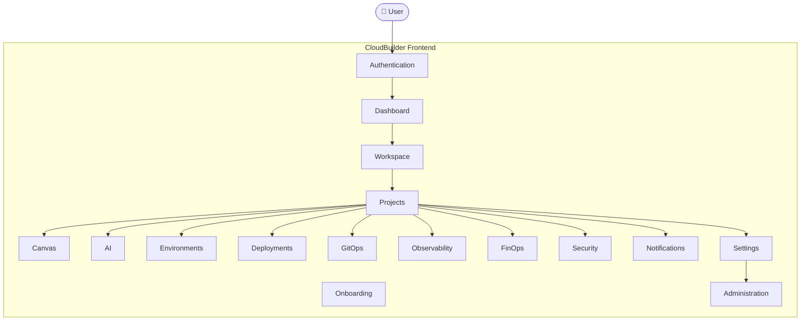

---

## 2. Authentication Flow

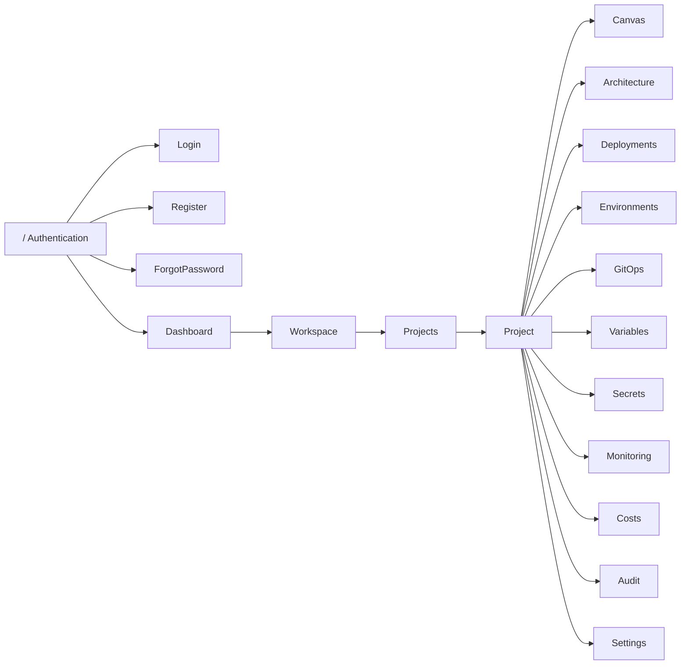

---

## 3. Frontend Module Organization

```mermaid
flowchart TB
    Frontend["Frontend"]

    Frontend --> Identity["Identity"]
    Frontend --> WorkspaceM["Workspace"]
    Frontend --> ProjectM["Project"]
    Frontend --> Provisioning["Provisioning"]
    Frontend --> Deployment["Deployment"]
    Frontend --> Operations["Operations"]
    Frontend --> Administration["Administration"]

    Identity --> Login["Login"]
    Identity --> Register["Register"]
    Identity --> MFA["MFA"]

    WorkspaceM --> Organizations["Organizations"]
    WorkspaceM --> Teams["Teams"]
    WorkspaceM --> Members["Members"]

    ProjectM --> Canvas["Canvas"]
    ProjectM --> AI["AI"]
    ProjectM --> Environments["Environments"]
    ProjectM --> Variables["Variables"]
    ProjectM --> Secrets["Secrets"]

    Provisioning --> Terraform["Terraform"]
    Provisioning --> Cloud["Cloud"]

    Deployment --> GitOps["GitOps"]
    Deployment --> Pipelines["Pipelines"]
    Deployment --> Releases["Releases"]

    Operations --> Metrics["Metrics"]
    Operations --> Logs["Logs"]
    Operations --> Traces["Traces"]
    Operations --> Alerts["Alerts"]

    Administration --> Billing["Billing"]
    Administration --> Security["Security"]
    Administration --> Integrations["Integrations"]
```

---

## 4. Dashboard

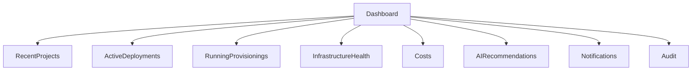

---

## 5. Workspace

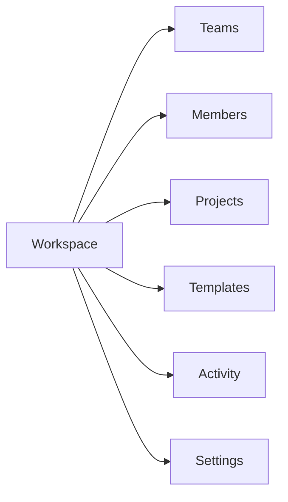

---

## 6. Project

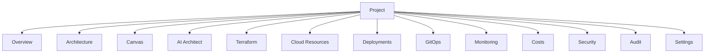

---

## 7. Canvas

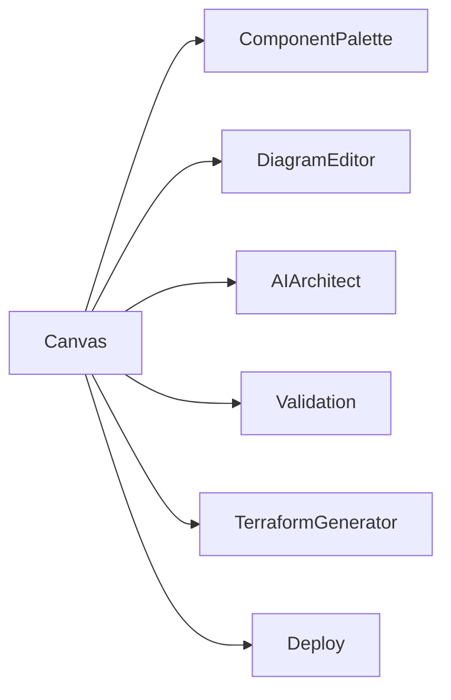

---

## 8. Deployments

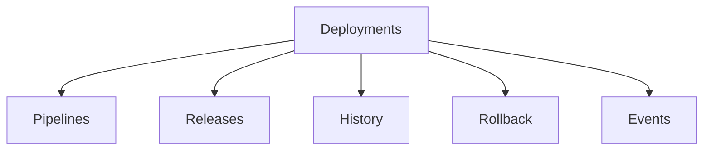

---

## 9. Observability

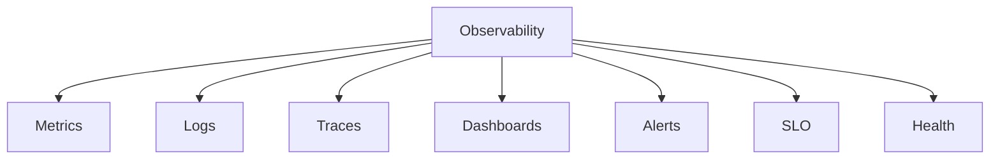

---

## 10. FinOps

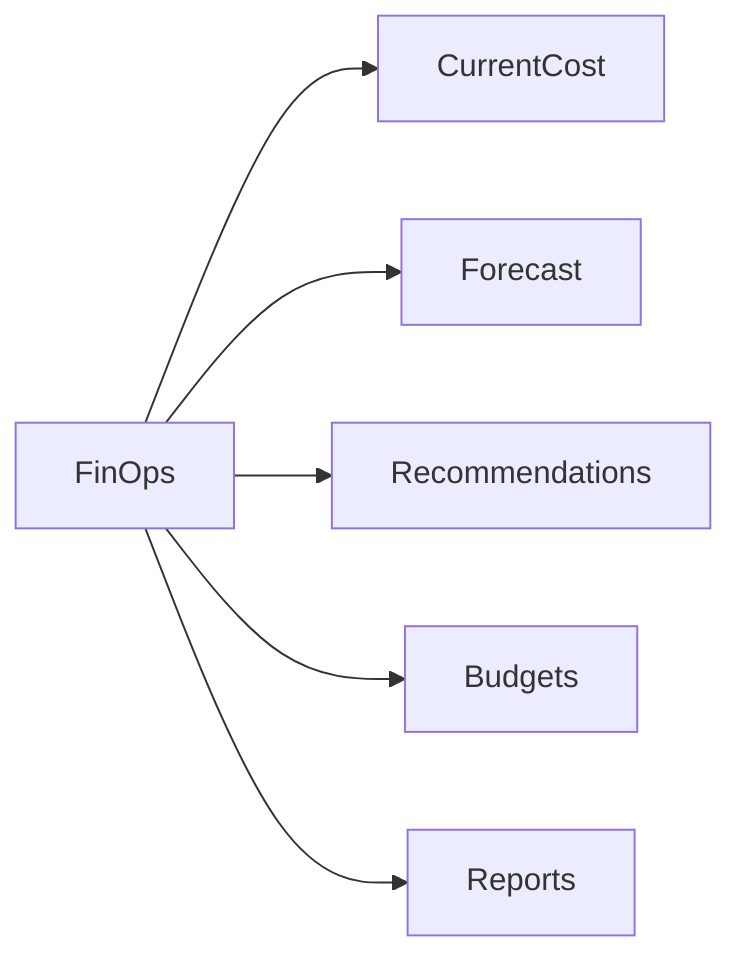

---

## 11. Security

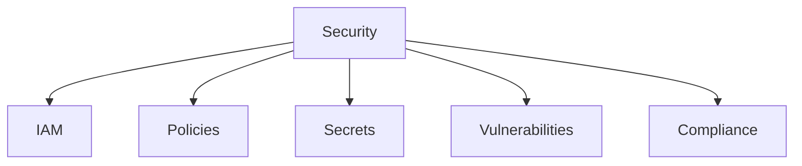

---

## 12. Settings

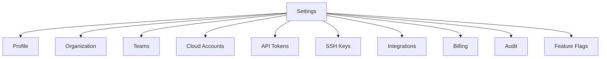

---

## 13. Administration

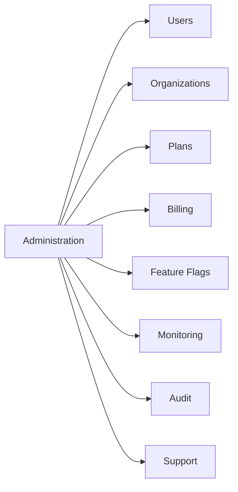

---

## 14. User Journey

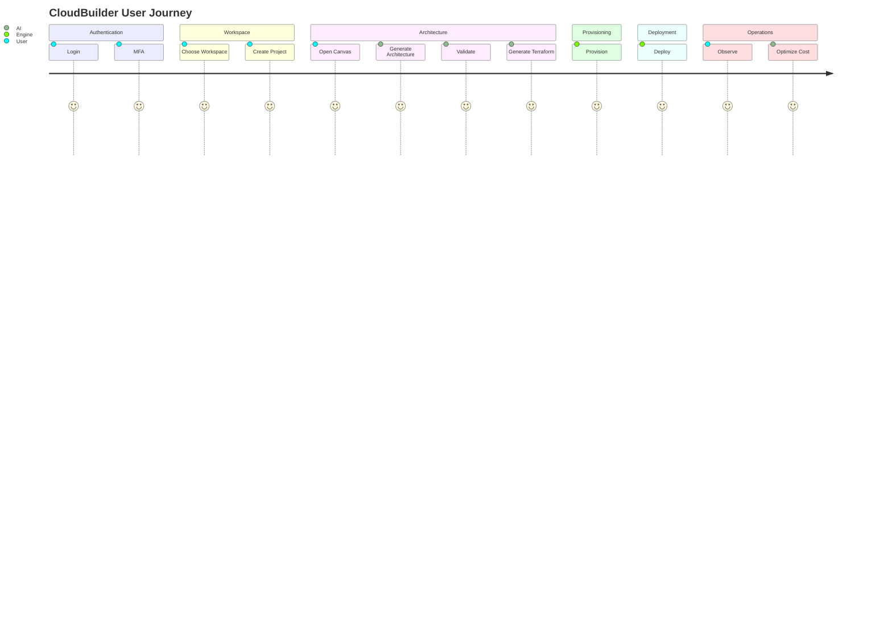

---

## 15. Frontend Directory Structure

```
src/
├── app/
├── shared/
├── core/
├── features/
│   ├── authentication/
│   ├── onboarding/
│   ├── dashboard/
│   ├── workspace/
│   ├── organizations/
│   ├── teams/
│   ├── projects/
│   ├── architecture/
│   ├── canvas/
│   ├── ai/
│   ├── terraform/
│   ├── environments/
│   ├── provisioning/
│   ├── deployments/
│   ├── gitops/
│   ├── observability/
│   ├── finops/
│   ├── security/
│   ├── notifications/
│   ├── billing/
│   ├── audit/
│   ├── settings/
│   └── administration/
├── widgets/
├── design-system/
├── hooks/
├── services/
├── store/
├── router/
└── layouts/
```

### Feature Module Structure

```
features/
└── projects/
    ├── pages/
    ├── components/
    ├── hooks/
    ├── services/
    ├── store/
    ├── schemas/
    ├── routes/
    ├── api/
    ├── tests/
    └── index.ts
```

---

## 16. Feature Module Reference

| Feature | Responsibility | Key Components |
|---------|---------------|----------------|
| **authentication** | Login, Register, ForgotPassword, MFA | LoginPage, RegisterPage, MFASetup, PasswordResetPage |
| **onboarding** | Welcome, Tour, Gateway Setup | WelcomeScreen, TourGuide, GatewaySetupWizard |
| **dashboard** | Overview widgets, quick actions | DashboardLayout, WidgetGrid, QuickActions |
| **workspace** | Organization/Team management | WorkspaceSelector, TeamList, MemberTable |
| **organizations** | Org CRUD, settings | OrgSettingsPage, OrgMembersPage |
| **teams** | Team CRUD, permissions | TeamSettingsPage, TeamRolesPage |
| **projects** | Project CRUD, overview | ProjectListPage, ProjectDetailPage |
| **architecture** | Architecture visualization | ArchitectureView, DependencyGraph |
| **canvas** | Visual design surface | CanvasView, ComponentPalette, PropertiesPanel |
| **ai** | AI Architect, recommendations | AIChatPanel, RecommendationCards |
| **terraform** | Code generation, preview | CodePreviewPanel, TerraformDiff |
| **environments** | Env management, variables | EnvironmentListPage, VariableEditor |
| **provisioning** | Provision flow, status | ProvisionFlowView, ProvisionStatus |
| **deployments** | Deploy pipelines, history | DeploymentListPage, PipelineView |
| **gitops** | Git integration, webhooks | GitOpsConfigPage, WebhookSettings |
| **observability** | Metrics, logs, traces, alerts | MetricsView, LogsView, TraceView, AlertListPage |
| **finops** | Cost management, budgets | CostDashboard, BudgetEditor, ForecastView |
| **security** | IAM, policies, secrets | SecurityDashboard, PolicyListPage, SecretManager |
| **notifications** | Notification center | NotificationCenter, NotificationPreferences |
| **billing** | Plans, invoices | BillingPage, InvoiceListPage |
| **audit** | Audit log, events | AuditLogPage, AuditEventDetailPage |
| **settings** | User/org settings | ProfilePage, OrganizationSettingsPage |
| **administration** | Platform admin | AdminDashboard, UserManagementPage |

---

## 17. Navigation Flow

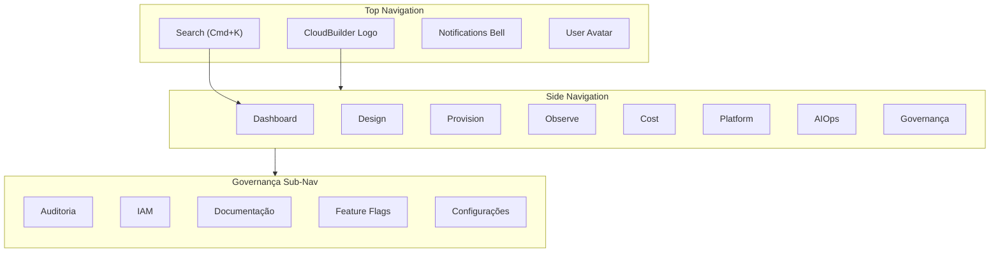

---

## 18. State Management Architecture

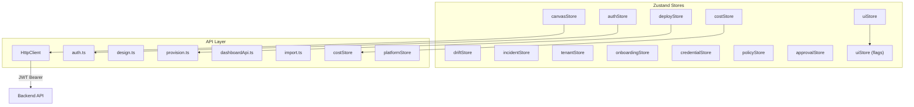

---

## 19. Component Hierarchy

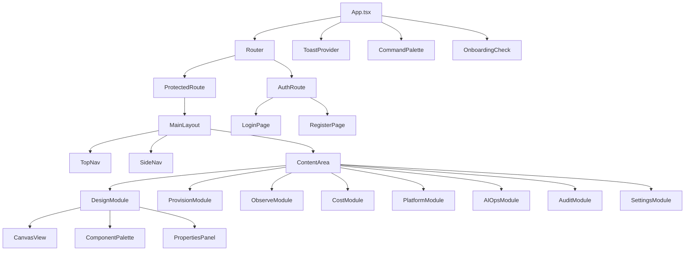

---

## 20. Auth Flow Sequence

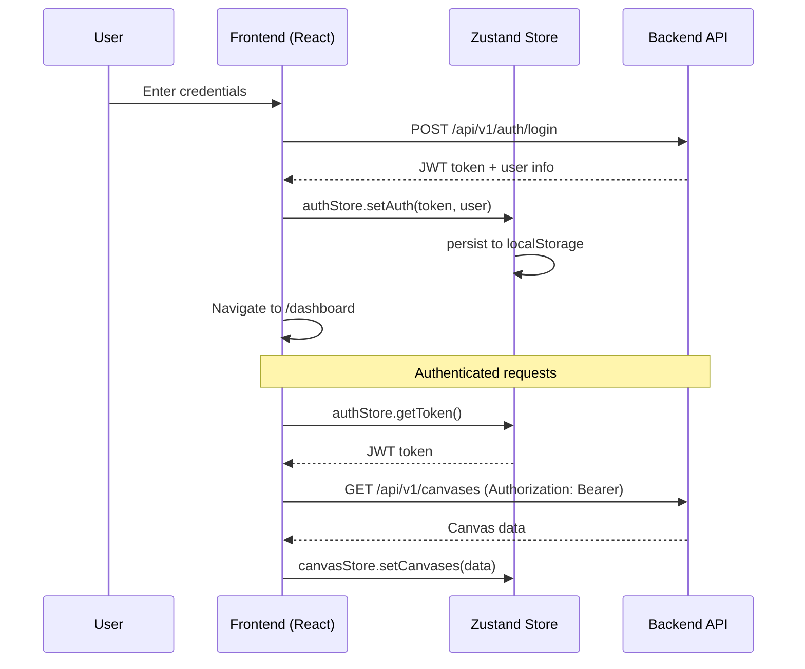

---

## 21. Design Module Deep Dive

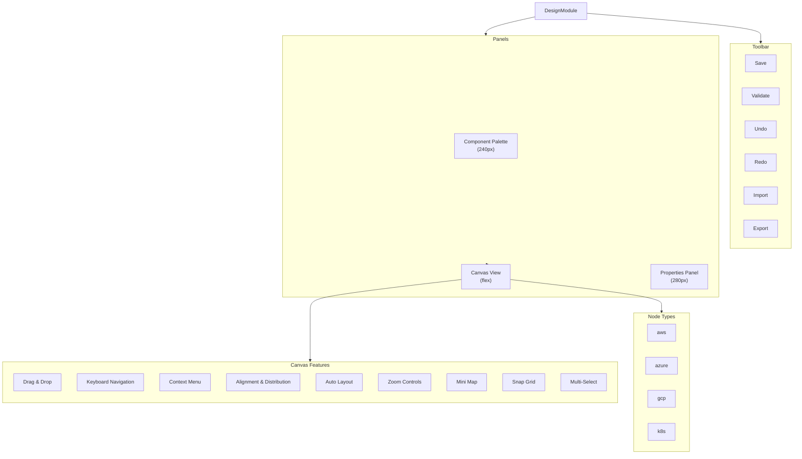

---

## 22. Module Gating (RBAC + Feature Flags)

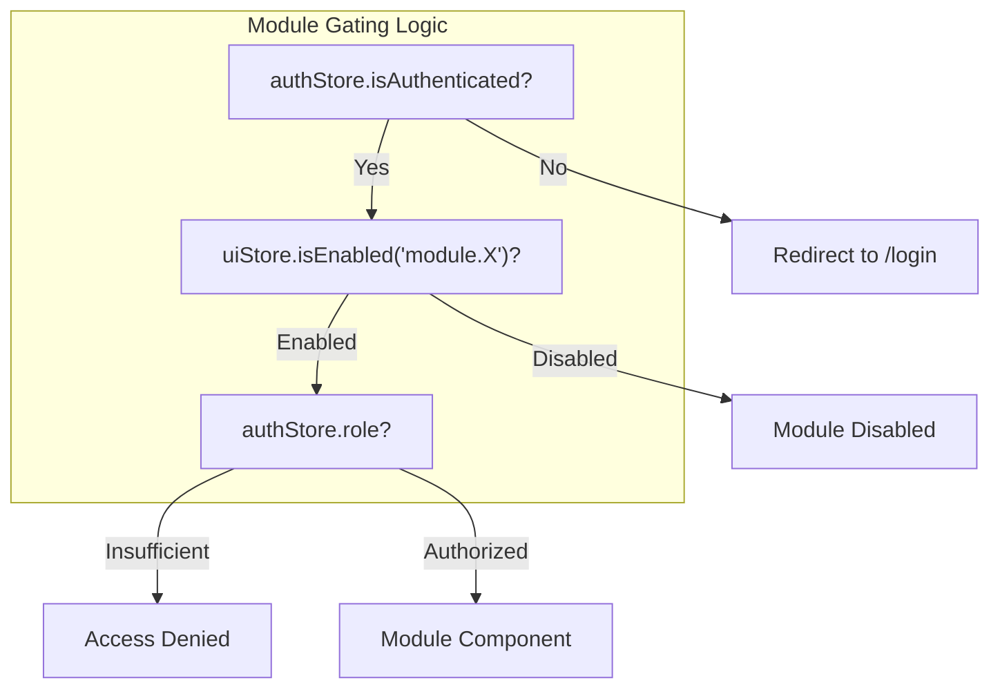

| Module | Auth Required | Roles | Feature Flag |
|--------|--------------|-------|--------------|
| Design | ✅ | all | — |
| Provision | ✅ | all | — |
| Observe | ✅ | all | — |
| Cost | ✅ | all | module.cost |
| Platform | ✅ | all | module.platform |
| AIOps | ✅ | all | module.aiops |
| Audit | ✅ | admin only | module.audit |
| IAM | ✅ | admin only | module.iam |
| Settings | ✅ | all | — |
| Administration | ✅ | admin only | — |

---

## 23. Responsive Layout

```mermaid
flowchart LR
    subgraph Desktop["Desktop (>1280px)"]
        direction LR
        SideNavD["SideNav\n(expanded)"]
        ContentD["Content"]
        PropertiesD["Properties Panel"]
    end

    subgraph Tablet["Tablet (768-1280px)"]
        direction LR
        SideNavT["SideNav\n(icon only)"]
        ContentT["Content"]
    end

    subgraph Mobile["Mobile (<768px)"]
        direction TB
        TopBarM["TopBar"]
        ContentM["Content\n(full width)"]
        BottomNavM["Bottom Nav"]
    end
```
