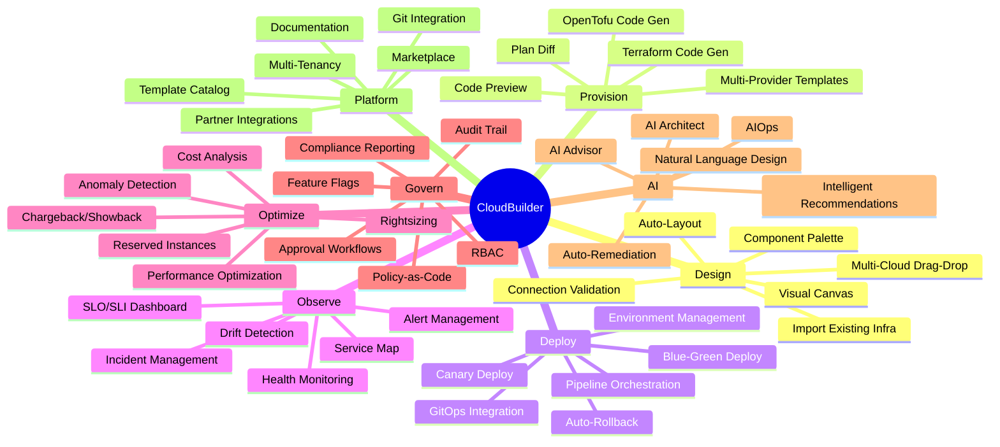
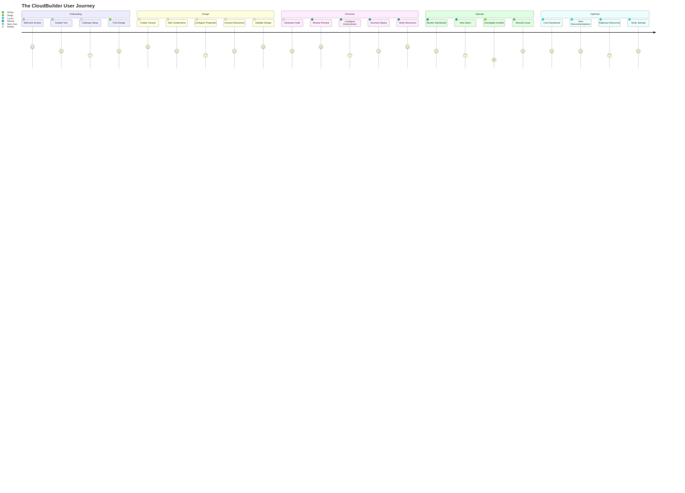
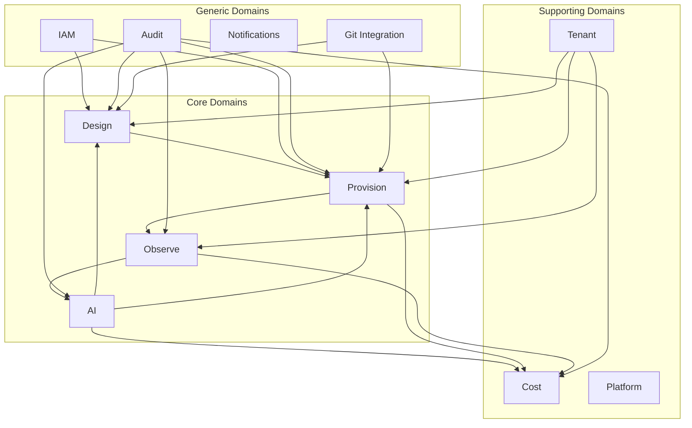
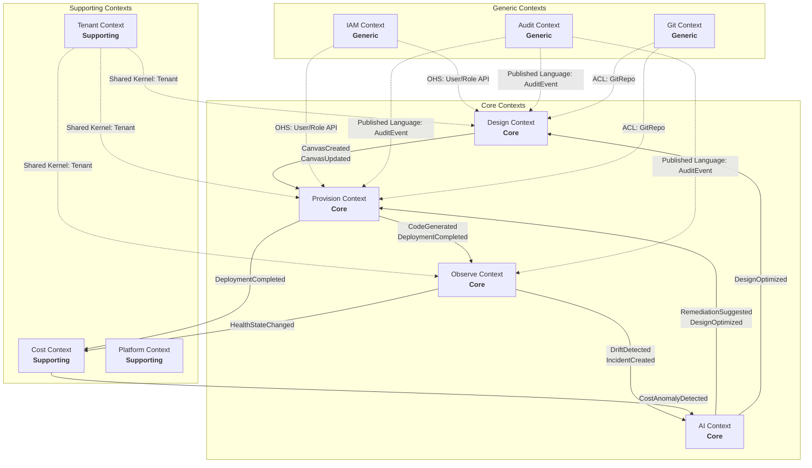
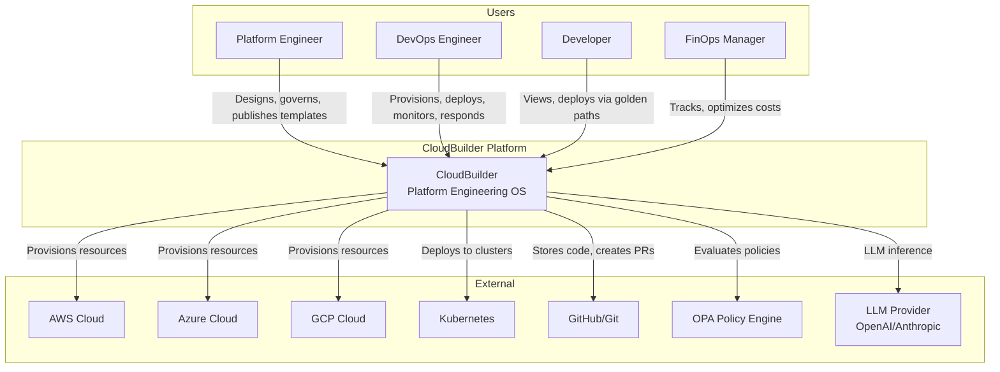
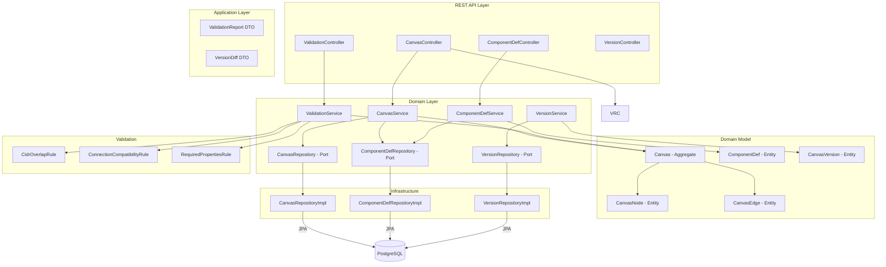
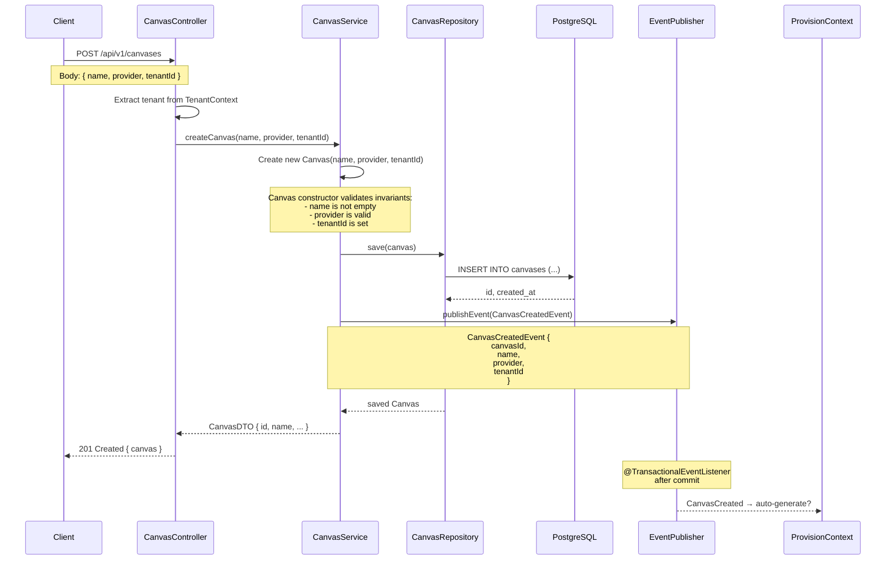
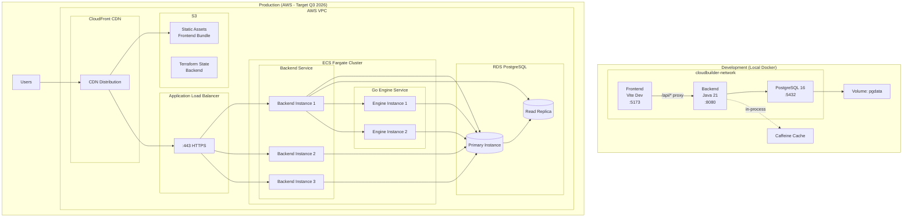
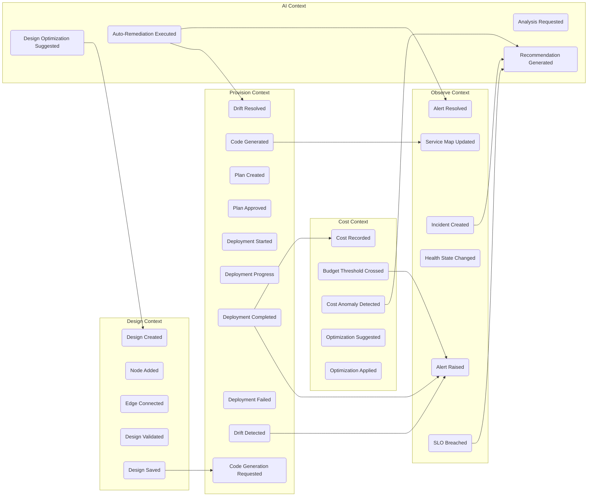

# CloudBuilder — Architecture Manifesto

**Version**: 1.0.0  
**Date**: 2026-06-28  
**Authority**: Principal Software Architect  
**Framework**: FAANg (Future Autonomous AI Network for Engineering)  
**Stack**: React 19 + Java 21 + Go 1.22 + PostgreSQL 16

---

> *"CloudBuilder is not a Terraform UI. CloudBuilder is not a Kubernetes dashboard. CloudBuilder is not another DevOps tool. CloudBuilder is a Platform Engineering Operating System."*

---

## Table of Contents

1. [Architecture Manifesto](#part-i-architecture-manifesto)
2. [Product Vision](#part-ii-product-vision)
3. [Strategic Domain-Driven Design](#part-iii-strategic-domain-driven-design)
4. [C4 Architecture](#part-iv-c4-architecture)
5. [Event-Driven Architecture](#part-v-event-driven-architecture)
6. [Architecture Compliance Checklist](#part-vi-architecture-compliance-checklist)

---

# PART I: ARCHITECTURE MANIFESTO

## Mission of the Architecture

The architecture of CloudBuilder exists to serve a single mission:

> **Enable engineering organizations to design, provision, deploy, observe, optimize, and govern cloud infrastructure through visual workflows, automation, and AI — with zero context switching, zero tool fragmentation, and maximal developer velocity.**

This mission drives every architectural decision. When a trade-off arises, the option that brings us closer to this mission wins.

### Core Architectural Values

| Value | Meaning |
|-------|---------|
| **Domain Integrity** | Business rules are inviolable. Infrastructure is replaceable. |
| **Evolutionary Design** | The architecture evolves, never freezes. Every decision includes a migration path. |
| **Operational Simplicity** | If a system is hard to operate, it will fail in production. Complexity must be justified. |
| **Strategic Consistency** | Every component advances the platform vision. We do not optimize for features at the expense of coherence. |

---

## Vision Statement

A world where every engineering team can design, provision, and manage cloud infrastructure with the same fluency and speed they write application code — through a unified platform that abstracts cloud complexity, enforces best practices, and learns from every deployment.

### What CloudBuilder Is

- A **Platform Engineering Operating System** that orchestrates the entire infrastructure lifecycle
- A **Visual Infrastructure Designer** where architecture is drawn, not YAML'd
- A **Multi-Cloud Code Generator** that produces production-grade Terraform/OpenTofu from visual designs
- A **Continuous Drift Detection Engine** that keeps desired state and actual state synchronized
- An **Event-Driven Automation Platform** that reacts to infrastructure changes in real time
- An **AI-Augmented Engineering Co-pilot** that diagnoses, remediates, and optimizes

### What CloudBuilder Is Not

- ❌ A Terraform wrapper — we generate Terraform, but the platform is the abstraction
- ❌ A Kubernetes dashboard — we support K8s, but the platform is cloud-agnostic
- ❌ Yet another monitoring tool — observability is native, not bolted on
- ❌ A low-code toy — we serve professional engineers building production infrastructure

---

## 14 Architectural Principles

### Principle 1: Domain-Driven Design First

**Statement**: Every module is organized around business capabilities, not technical layers. Ubiquitous Language is shared across frontend, backend, and engine. Strategic design (Bounded Contexts, Context Mapping) precedes tactical implementation.

**Deep explanation**: The codebase is not organized as `controllers/`, `services/`, `repositories/` at the top level. It is organized as `design/`, `provision/`, `observe/`, `iam/`, `cost/`, `platform/`, `aiops/`, `audit/`, `tenant/`, `multiregion/` — each a Bounded Context with its own domain model. This means a developer working on "provisioning" never needs to understand "observability" internals. Each context owns its persistence, its validation rules, and its event contracts.

**Trade-offs**:
- Higher initial modeling cost: domains must be understood before code is written
- Potential duplication: two contexts may model similar concepts (e.g., "Environment" in provision vs. "Environment" in observe). This is acceptable — each context has different invariants
- Eventual consistency: contexts communicate via events, not direct DB access. Simpler than distributed transactions, but requires saga patterns for multi-context workflows

**Anti-patterns**:
- **Anemic Domain Model**: entities with only getters/setters, business logic in services
- **Shared Database**: two contexts accessing the same table directly
- **Infrastructure Leakage**: SQL, HTTP, or serialization concerns in domain entities

**References**: Eric Evans, *Domain-Driven Design* (2003); Vaughn Vernon, *Implementing Domain-Driven Design* (2013)

---

### Principle 2: Cloud Native First

**Statement**: The platform itself runs on cloud-native principles — stateless, containerized, immutable, observable, and horizontally scalable. We eat our own dog food.

**Deep explanation**: CloudBuilder is deployed as containers (Docker Compose today, Kubernetes tomorrow). Every service is stateless (state lives in PostgreSQL). Immutable infrastructure means we never SSH into a running container — we redeploy. All services expose health checks, metrics, and structured logs. Horizontal scaling is designed from day one: the Go engine can run N instances consuming from the same queue; the backend can run multiple replicas behind a load balancer.

**Trade-offs**:
- $0 infra today (Phase 4 cleanup) means we removed Kafka/Redis. This limits scale to single-JVM event processing until we reintroduce them
- Docker Compose is not Kubernetes. Migration to K8s (Q1 2027) will require Helm charts, service mesh, and pod autoscaling
- Cloud-agnosticism is a spectrum. We optimize for AWS first (target deployment), but templates exist for Azure/GCP/K8s

**Anti-patterns**:
- **Pet servers**: stateful instances that cannot be replaced
- **Environment drift**: dev/staging/prod configurations that differ
- **Infrastructure immobility**: vendor lock-in without abstraction layer

**References**: *The Twelve-Factor App* (Heroku, 2011); *Kubernetes Patterns* (Burns & Villalba, 2019)

---

### Principle 3: API First

**Statement**: Every capability is exposed through a well-defined API contract before any UI is built. APIs are the platform; the frontend is a consumer.

**Deep explanation**: The backend REST API (`/api/v1/`) is the primary interface to CloudBuilder. Every frontend action flows through it. This means:
1. The API contract is the source of truth — frontend and backend teams can work in parallel
2. External integrations (CI/CD pipelines, CLI tools, Terraform providers) use the same APIs
3. API versioning via header strategy (`Accept: application/vnd.cloudbuilder.v1+json`) ensures backward compatibility

**Trade-offs**:
- API-first slows initial feature delivery (UI must wait for API to stabilize)
- REST with JSON is simple but verbose. gRPC is used for the Go engine bridge where streaming is needed
- Versioning adds overhead to every endpoint change

**Anti-patterns**:
- **UI-driven APIs**: APIs shaped by what the UI needs rather than what the domain requires
- **Leaky abstractions**: exposing internal entity structures instead of domain DTOs
- **No versioning strategy**: breaking changes without migration path

---

### Principle 4: Event First

**Statement**: Cross-module communication happens through domain events, not synchronous RPC. Events are the backbone of the platform's reactivity.

**Deep explanation**: When a deployment completes, it does not call the Observe module's API directly. It publishes a `DeploymentEvent`. The Observe module listens, updates its service map, and raises alerts if thresholds are breached. This decoupling means:
1. The deployment context does not need to know about the observe context
2. New modules can react to existing events without modifying existing code
3. Events can be logged, audited, and replayed

**Trade-offs**:
- Eventual consistency: after a deployment completes, the service map may not update for ~1 second
- Debugging event chains is harder than debugging synchronous calls
- Without a persistent broker (Kafka removed), events are lost on JVM restart. Outbox pattern mitigates for critical events

**Anti-patterns**:
- **Event-as-RPC**: expecting a response from an event (use async request-response instead)
- **God events**: one event type carrying all data for all consumers
- **No event versioning**: consumer crashes when producer adds fields

---

### Principle 5: AI First

**Statement**: AI is not a feature module. AI is embedded into every capability — from design recommendations to cost optimization to incident remediation.

**Deep explanation**: AI in CloudBuilder is layered:
- **AI Architect**: generates infrastructure designs from natural language prompts
- **AI Advisor**: analyzes existing designs for security, cost, and performance improvements
- **AIOps**: diagnoses incidents, suggests remediation, and auto-heals common patterns
- **Cost Optimization**: recommends rightsizing, reserved instances, and spot fleet conversions

The LLM Provider Abstraction (ADR-013) ensures we are not locked into any single AI provider. The AI module speaks to an abstraction layer that can route to OpenAI, Anthropic, or local models.

**Trade-offs**:
- AI responses are non-deterministic — every design recommendation must be human-verifiable
- Latency: LLM calls take 2-10 seconds. UI must handle this gracefully (optimistic updates, loading states)
- Cost: every AI call costs money. Caching and batching are essential

**Anti-patterns**:
- **AI washing**: calling a simple rules engine "AI"
- **Black box decisions**: AI recommendations without explanation or justification
- **No fallback**: AI-only features with no manual alternative

---

### Principle 6: Engineering Oriented to the Domain

**Statement**: The architecture mirrors the business domain. Every technical decision is evaluated by how well it serves the domain model.

**Deep explanation**: The primary decomposition of the system is by domain (Design, Provision, Observe, Cost, Platform, AIOps, IAM, Audit, Tenant), not by technical layer (Frontend, Backend, Database). Each domain has its own:
- Bounded Context with explicit boundaries
- Ubiquitous Language shared by engineers, product managers, and stakeholders
- Domain model that encapsulates business rules
- Test strategy aligned with domain complexity

**Trade-offs**:
- Requires deep domain understanding from every engineer
- Cross-domain features (e.g., "deploy cost optimization") require coordination across contexts
- Some concerns (authentication, audit, notifications) are truly cross-cutting and resist pure domain isolation

**Anti-patterns**:
- **Technical decomposition**: organizing by "database layer", "service layer", "API layer"
- **CRUD-only design**: exposing every entity as a REST resource without domain logic
- **Service-oriented architecture at wrong granularity**: distributed monolith with chatty services

---

### Principle 7: Developer Experience (DX) First

**Statement**: The platform is a product for developers. Every API, every UI interaction, every error message is designed for developer happiness and productivity.

**Deep explanation**: This principle applies at two levels:
1. **External DX**: CloudBuilder users (platform engineers, DevOps, developers) must have a delightful experience — clear error messages, undo/redo in design canvas, keyboard shortcuts, command palette, instant feedback
2. **Internal DX**: CloudBuilder engineers must be productive — clean CI/CD (3 jobs: Java, React, Go), fast build times (Vite 8.84s, Maven incremental), comprehensive tests (479 backend, 73 frontend, 23 Go), zero TypeScript errors

**Trade-offs**:
- Good DX requires engineering investment with no direct feature value
- Error messages in PT-BR (our market) versus internationalization
- Developer tooling (storybook, API playground) adds maintenance cost

**Anti-patterns**:
- **Bare error messages**: "Error 500" instead of "Cannot deploy: environment staging has 3 unresolved drift items"
- **No undo**: destructive actions without confirmation or history
- **Silent failures**: operations that fail without user notification

---

### Principle 8: Platform Engineering

**Statement**: CloudBuilder itself is an Internal Developer Platform (IDP). Every capability is a reusable platform service with self-service APIs, Golden Paths, and automated governance.

**Deep explanation**: The platform provides:
- **Golden Paths**: pre-approved infrastructure patterns (VPC with public/private subnets, EKS cluster with node groups, RDS with read replicas) that follow best practices by default
- **Self-Service**: engineers design, provision, and deploy without ticket queues or manual approvals (for permitted actions)
- **Guardrails**: Policy-as-Code (OPA, ADR-020) enforces compliance — no engineer can provision a publicly accessible S3 bucket or an unencrypted RDS instance
- **Templates**: reusable architecture blueprints in the Catalog + Marketplace

**Trade-offs**:
- Golden Paths constrain creativity. Engineers who need non-standard architectures will find the platform limiting
- Self-service requires mature CI/CD and automated testing. Without it, self-service becomes self-service-incident
- Policy-as-Code adds complexity to every provisioning flow

**Anti-patterns**:
- **Paved road that leads to a cliff**: Golden Paths that are maintained poorly or have hidden issues
- **Self-service without guardrails**: allowing any action without cost/compliance/security checks
- **Template library with no governance**: 200 templates with varying quality, none reviewed

**References**: *Team Topologies* (Skelton & Pais, 2019); *Platform Strategy* (Evans & Basole, 2023)

---

### Principle 9: Scalability by Design

**Statement**: Scalability is not an afterthought. Every component is designed for horizontal scale from day one, even when the MVP runs on a single instance.

**Deep explanation**: The architecture anticipates three scaling vectors:
1. **Users/tenants**: multi-tenant by design with `tenantId` isolation in every query, Caffeine cache per tenant, and no shared mutable state between tenants
2. **Infrastructure managed**: the Go engine and drift detection operate asynchronously. Multiple Go engine instances can process deployments in parallel
3. **Event volume**: Spring Modulith events handle current volume. When volume exceeds single-JVM capacity, events route to Kafka (already designed, removed for $0 infra) without changing event contracts

**Trade-offs**:
- Premature scaling optimization is waste. We intentionally chose single-JVM events for MVP
- Caffeine cache (in-process) means cache is per-instance. Horizontal scaling requires distributed cache (Redis)
- PostgreSQL will become the bottleneck before compute does. Vertical scaling first, then read replicas, then sharding

**Anti-patterns**:
- **Scale-first architecture**: designing for 10M users when you have 10
- **Shared-state all the things**: every instance reading/writing the same cache without partitioning
- **Database as queue**: using PostgreSQL for job queues without proper indexing or cleanup

---

### Principle 10: Security by Design

**Statement**: Security is not a bolt-on feature. It is a property of the architecture — authentication, authorization, encryption, audit, and compliance are embedded at every layer.

**Deep explanation**: The security model has five layers:
1. **Authentication**: JWT (jjwt 0.12.6) with Spring Security. SSO (OAuth2/OIDC) for enterprise. MFA (TOTP) for admin actions. JWT refresh rotation (ADR-018)
2. **Authorization**: RBAC with 3 roles (admin, editor, viewer) × feature flags (AND logic). Policy-as-Code (OPA) for fine-grained resource-level control (ADR-020)
3. **Encryption**: AES-256 for secrets at rest via SecretEncryptionConverter. PBKDF2 600K iterations for password hashing. TLS for all network communication
4. **Audit**: every domain event is logged with correlation ID, causation ID, tenant ID, timestamp, and user identity
5. **Compliance**: LGPD/GDPR readiness (data anonymization, retention policies, consent management)

**Trade-offs**:
- Strong security adds friction: MFA interrupts workflow, RBAC restricts actions, audit adds write overhead
- Zero Trust is expensive to implement fully in an MVP. We start with perimeter security + RBAC and evolve toward Zero Trust
- Encryption at rest adds complexity to backups and disaster recovery

**Anti-patterns**:
- **Security theater**: CAPTCHA on every action without actual threat protection
- **Hardcoded secrets**: credentials in source code, config files, or environment variables without encryption
- **Over-privileged service accounts**: the backend connecting to PostgreSQL as `root` instead of least-privilege user

---

### Principle 11: Observability by Default

**Statement**: Every component exposes health, metrics, logs, and traces by default — not as an optional add-on.

**Deep explanation**: CloudBuilder's observability is 100% native (no Grafana, Prometheus, or OpenTelemetry — all removed in Phase 4 $0 infra cleanup):
- **Logs**: structured JSON via Logback, stored in PostgreSQL with monthly partitioning
- **Metrics**: Micrometer counters published to `metrics_ts` table. RED metrics (Rate, Errors, Duration) for every API endpoint. USE metrics (Utilization, Saturation, Errors) for system resources
- **Traces**: correlation ID propagated via ThreadLocal + MDC through every request. Causation ID for event chains
- **Health checks**: `/actuator/health` with liveness + readiness probes. Go engine gRPC health check
- **Alerting**: AlertEvaluationService (30s schedule) evaluates rules against metrics. Alerts become Incidents. Incidents trigger notifications
- **SLO**: hourly SLO computation with error budget tracking

**Trade-offs**:
- Native observability means building everything ourselves instead of using off-the-shelf tools. Trade-off: zero external cost vs. more implementation work
- PostgreSQL as observability store works for MVP but will not scale to enterprise volumes. Migration to dedicated observability backend (VictoriaMetrics or similar) is in the roadmap
- Every log/metric/trace adds write load. Sampling and aggregation are essential at scale

**Anti-patterns**:
- **Observability as an afterthought**: adding metrics after a production incident
- **Dashboard grid**: 40 panels nobody looks at
- **Alert fatigue**: paging humans for every warning, drowning out real incidents
- **No SLO**: operating without target reliability, making every outage equally critical

---

### Principle 12: Continuous Evolution

**Statement**: The architecture is never "done." Every component has a current state, a next evolution, and a future migration path. We do not freeze architecture.

**Deep explanation**: Every ADR includes three states: current, next, future. For example:
| Component | Current | Next (6 months) | Future (12+ months) |
|-----------|---------|-----------------|-------------------|
| Event Bus | Spring Modulith in-process | Spring + Outbox pattern | Kafka distributed event bus |
| Cache | Caffeine in-process | Caffeine + Redis (distributed) | Redis Cluster |
| Deployment | Docker Compose | ECS Fargate | EKS (Kubernetes) |
| Observability Store | PostgreSQL partitioned | TimescaleDB | Dedicated observability backend |
| Auth | JWT + Spring Security | SSO + MFA | SCIM + Federation |
| Frontend | Vite SPA | Module Federation | Micro-frontends |

**Trade-offs**:
- Continuous evolution means never having a "final" architecture. Some engineers find this unsettling
- Migration paths cost engineering time that could be spent on features
- Eventually, the gap between current and target architecture becomes technical debt

**Anti-patterns**:
- **Big Bang rewrite**: throwing away the current architecture for a new one
- **Architecture paralysis**: endless planning without execution
- **Legacy accumulation**: never evolving, leaving components to rot

---

### Principle 13: Event-Driven Reactivity

**Statement**: The platform reacts to state changes through events, not polling. Cross-module workflows are expressed as event chains, not synchronous orchestration.

**Deep explanation**: Every meaningful state change in CloudBuilder is a domain event:
- `DesignCreated` → Provision module can generate code
- `CodeGenerated` → Auto-documentation can update docs (ADR-009, ADR-034)
- `DeploymentCompleted` → Observe module updates service map, Cost records deployment expense
- `DriftDetected` → Observe raises alert, AIOps evaluates auto-remediation
- `CostAnomalyDetected` → Alert raised, notification sent, optimization suggested
- `IncidentCreated` → Metrics updated, audit logged, SSE pushed to frontend

Events follow a three-layer architecture:
1. **Go Engine Events** → gRPC streaming → Backend Java
2. **Backend Domain Events** → Spring `ApplicationEventPublisher` → `@TransactionalEventListener` handlers
3. **Frontend Events** → SSE (`EventStreamController`) → Zustand stores

**Trade-offs**:
- Eventual consistency: events are processed asynchronously, so state across contexts may be briefly inconsistent
- Debug complexity: an event chain (Deploy → Observe → Cost → Alert) involves 4 contexts and 3+ seconds
- Testing: event-driven flows require integration tests with `awaitility` patterns

**Anti-patterns**:
- **Synchronous event publishing**: publishing events inside database transactions that roll back
- **Missing idempotency**: processing the same event twice causing duplicate state changes
- **Cascading failures**: one slow event consumer blocking all event processing

**References**: *Enterprise Integration Patterns* (Hohpe & Woolf, 2003); ADR-034 (Event-Driven Architecture for MVP)

---

### Principle 14: Self-Service Autonomy

**Statement**: Users accomplish their goals without leaving the platform. Every cross-system operation is self-service — no tickets, no Slack messages, no manual handoffs.

**Deep explanation**: The platform eliminates "the handoff problem" in infrastructure delivery:
- **From design to deploy**: a single platform journey — design on canvas → validate → generate code → preview → deploy → observe. No exporting Terraform to a separate pipeline
- **From alert to fix**: AIOps detects incident → diagnoses root cause → suggests or auto-applies fix → verifies resolution. No paging an SRE who then pages another team
- **From cost anomaly to optimization**: anomaly detected → rightsizing recommendation → preview cost impact → apply change → verify savings. No exporting data to a spreadsheet

**Trade-offs**:
- Self-service requires trust in automation. Every auto-action must be reversible
- Full self-service requires deep integrations (Git providers, cloud APIs, secret stores) that take time to build
- Some organizations want guardrails that block self-service for certain actions. We support both modes

**Anti-patterns**:
- **Self-service without automation**: portals that generate tickets instead of executing actions
- **Automation without safety**: self-service that can accidentally delete production
- **Guarded to death**: so many approvals and checks that self-service is slower than manual

---

## Architecture Quality Expectations

| Quality Attribute | Target | Measurement |
|------------------|--------|-------------|
| **Modularity** | Modules independently deployable | Spring Modulith verification passes |
| **Testability** | All layers testable in isolation | Unit + integration + E2E pyramid |
| **Maintainability** | Any module understandable in 30 minutes | Cyclomatic complexity < 15, file length < 400 lines |
| **Performance** | API P99 < 200ms (cached), < 2s (non-cached) | k6 load tests in CI |
| **Security** | Zero high-severity vulnerabilities | OWASP dependency check + SAST in CI |
| **Observability** | Every endpoint has RED metrics | Micrometer counters verified |
| **Resilience** | No single point of failure | Chaos engineering experiments |
| **Scalability** | 10x current load without redesign | Load tests at 1000 concurrent users |

---

## Architectural References

### Official Documentation (Tier 0)
- [Spring Modulith Reference](https://docs.spring.io/spring-modulith/reference/)
- [ReactFlow Documentation](https://reactflow.dev/api-reference)
- [Zustand State Management](https://github.com/pmndrs/zustand)
- [jjwt JWT Library](https://github.com/jwtk/jjwt)
- [Go gRPC Documentation](https://grpc.io/docs/languages/go/)
- [PostgreSQL 16 Documentation](https://www.postgresql.org/docs/16/)

### Engineering Blogs (Tier 1)
- Netflix Tech Blog — microservices, resilience patterns
- Uber Engineering — domain-oriented architecture, geo-distribution
- AWS Architecture Blog — Well-Architected Framework
- Cloudflare Engineering — edge computing, DDoS mitigation
- Nubank Engineering (BR) — event-driven architecture, DDD in practice

### Research Papers (Tier 2)
- *Dynamo: Amazon's Highly Available Key-value Store* — eventual consistency patterns
- *Kafka: A Distributed Messaging System for Log Processing* — event streaming design
- *Spanner: Google's Globally Distributed Database* — multi-region consistency
- *Borg: Google's Cluster Management* — container orchestration principles

### Open Source (Tier 3)
- Kubernetes — container orchestration patterns
- ArgoCD — GitOps deployment patterns
- Terraform — infrastructure as code providers
- OpenTofu — open-source Terraform alternative

### Key Architects & Authors (Tier 4)
- **Martin Fowler** — DDD, refactoring, continuous delivery
- **Sam Newman** — microservices, platform engineering
- **Martin Kleppmann** — data systems, streaming, consistency
- **Gregor Hohpe** — enterprise integration, event-driven architecture
- **Kelsey Hightower** — Kubernetes, cloud native

---

# PART II: PRODUCT VISION

## Market Problem

Organizations managing cloud infrastructure at scale face a **fragmentation crisis**:

1. **Tool sprawl**: A typical engineering organization uses 7-12 separate tools to manage infrastructure: Terraform (provisioning), GitHub Actions (CI/CD), Prometheus/Grafana (monitoring), Datadog (observability), PagerDuty (incident response), CloudHealth (cost), Vault (secrets), OPA (policy), Backstage (developer portal). Each tool has its own UI, API, authentication, and workflow.

2. **Context switching**: Engineers jump between tools for every task. A deploy involves: design in Draw.io → code in VS Code → PR in GitHub → plan in Terraform → monitor in Grafana → cost-check in CloudHealth. Each jump loses context and introduces delay.

3. **Drift is silent**: Infrastructure drifts from its intended state silently. Teams discover drift only during incidents. No tool connects "what was designed" with "what is deployed."

4. **Knowledge silos**: Infrastructure knowledge lives in tickets, Slack threads, and engineers' heads — not in a platform. When the senior DevOps engineer leaves, the knowledge leaves.

5. **AI is reactive, not proactive**: Current AI tools analyze existing infrastructure. None help design infrastructure from scratch based on requirements.

**CloudBuilder solves all five problems with a unified platform.**

## Personas

| Persona | Title | Profile | Pain Points | CloudBuilder Value |
|---------|-------|---------|-------------|-------------------|
| **Rafael** | Solutions Architect | Designs multi-cloud architectures, creates reusable patterns | Tool sprawl, manual diagram-to-code translation, no golden path enforcement | Visual canvas → production code in one click. Reusable templates. Built-in best practices |
| **Marina** | DevOps Engineer | Manages CI/CD pipelines, Terraform state, observability | Drift detection is reactive, incident response is manual, cost optimization is quarterly | Continuous drift detection, AIOps auto-remediation, real-time cost optimization |
| **Diego** | Junior Developer | Deploys services to staging/production via platform | Fears breaking production, doesn't understand infra, waits for DevOps approval | Golden paths with guardrails, self-service deploys, safe by default |
| **Carla** | Head of Platform | Defines platform strategy, manages platform team, reports to CTO | No visibility into engineering effectiveness, cannot enforce governance, nobody uses the portal she built | Complete governance (cost, security, compliance), adoption analytics, platform as product |
| **Lucas** | FinOps Manager | Tracks cloud spend, optimizes resource allocation | Spreadsheets, manual tagging, no connection between architecture decisions and cost | Real-time cost visibility per design, AI rightsizing recommendations, chargeback/showback |

## Ideal Customer Profile (ICP)

**Primary ICP**: Mid-market to enterprise engineering organizations ($50M–$5B revenue) running multi-cloud infrastructure on AWS/Azure/GCP with:
- 20-200 engineers deploying infrastructure
- Existing Terraform usage (100+ modules)
- Platform engineering initiative in progress or planned
- DevOps team of 3-15 people
- Cloud spend of $500K–$10M/month
- Compliance requirements (SOC2, ISO 27001, LGPD)

**Secondary ICP**: Cloud-native startups ($10M–$50M revenue) with:
- 10-50 engineers
- Greenfield infrastructure
- Strong DevOps culture
- Need for fast provisioning without hiring platform engineers

## Jobs To Be Done

| JTBD | Trigger | Success Criteria |
|------|---------|-----------------|
| **"Design infrastructure visually"** | Starting a new project requiring cloud infrastructure | Complete architecture designed in <30 minutes, exportable as Terraform |
| **"Provision infrastructure from a design"** | Design is complete and needs to become real infrastructure | Resources provisioned in target cloud with zero manual steps |
| **"Detect and fix drift"** | Suspecting infrastructure has changed outside IaC | Drift report generated, fix applied or PR created |
| **"Optimize cloud costs"** | Monthly cloud bill exceeds forecast | Specific, actionable recommendations with estimated savings |
| **"Respond to incidents"** | Production alert fires | Incident diagnosed, remediated, and post-mortem generated |
| **"Enforce compliance"** | Audit finding or new regulatory requirement | Policy created and enforced across all future provisionings |
| **"Deploy with confidence"** | Code change needs to reach production | Preview shows exact changes, deploy with auto-rollback on failure |
| **"Onboard new team member"** | New engineer joins the platform team | Engineer productive in <1 hour with guided tour and golden paths |
| **"Create reusable infrastructure patterns"** | Team identifies a common infrastructure pattern multiple times | Pattern published to internal catalog with governance and versioning |

## Product Objectives

| Objective | Metric | Current | Target (12mo) |
|-----------|--------|---------|---------------|
| **Unified Infrastructure Lifecycle** | % of lifecycle managed in-platform | 40% (Design→Provision) | 90% (Design→Provision→Observe→Optimize) |
| **Self-Service Adoption** | % of deploys via platform | 0% (beta) | 60% of non-production deploys |
| **Drift Coverage** | % of managed resources with drift detection | 0% | 100% |
| **Cost Optimization** | % of recommendations applied | 0% | 40% |
| **Incident Auto-Remediation** | % of common incidents auto-resolved | 0% | 50% |
| **Platform Engineering Maturity** | IDP capabilities (per Gartner) | 2/10 | 7/10 |
| **User Satisfaction** | NPS | N/A | 40+ |

## Business Capabilities



## Use Cases

| Use Case | Actors | Flow |
|----------|--------|------|
| **Visual Cloud Design** | Rafael (Architect) | New → Select Provider → Drag resources → Configure properties → Connect → Validate → Save |
| **Code Generation** | Rafael, Marina | Open design → Generate Terraform → Preview code → Download or push to repo |
| **Infrastructure Provisioning** | Marina | Select environment → Review plan → Confirm → Monitor progress → Verify resources |
| **Drift Detection & Resolution** | Marina | Scheduled drift scan → View report → Accept or reject changes → Auto-sync |
| **Cost Optimization** | Lucas (FinOps) | Dashboard → View top spenders → AI recommendations → Preview savings → Apply changes |
| **Incident Response** | Diego, Marina | Alert fires → AI diagnosis → Suggested fix → Approve → Auto-remediate → Post-mortem |
| **Policy Enforcement** | Carla (Head) | Create policy → Assign to environments → Block non-compliant deploys → Generate compliance report |
| **Template Publishing** | Rafael, Carla | Design golden path → Publish to catalog → Version → Review usage → Update |
| **Multi-Region Disaster Recovery** | Marina | Define regions → Configure replication → Test failover → Monitor DR health → Run drills |
| **Developer Onboarding** | Diego, Carla | Welcome → Tour → First design → Deploy sandbox → View documentation |

## User Journey



## Architectural Roadmap

```mermaid
timeline
    title CloudBuilder Architectural Evolution

    section Q2 2026 : Foundation
      Design v1 : Canvas, Palette, Properties, Validation, AI Chat
      Provision v1 : Code Gen, Deploy Flow, CI/CD, Ephemeral Envs
      Auth v1 : JWT, RBAC, Multi-Tenant, TenantSelector
      $0 Infra Cleanup : Remove Kafka/Redis/OTel, Native replacements

    section Q3 2026 : Operations
      Observe v1 : Health, Alerts, Service Map, Drift Detection, Scorecards
      Cost v1 : Dashboard, Budget, Anomalies, What-If, Optimization
      Event Bus v1 : Domain Events, @EventListener, SSE streaming
      Go Engine DAG : Pipeline architecture, 8 components

    section Q4 2026 : Intelligence
      AI v1 : AI Architect, AIOps, Auto-Remediation, RAG Knowledge Base
      Platform v1 : Catalog, Marketplace, Partner Integrations
      Multi-Region : DR replication, failover testing, region health
      FinOps : Chargeback, Showback, Forecast, Rightsizing AI

    section Q1 2027 : Scale
      K8s Migration : EKS, Helm, Autoscaling, Service Mesh
      Distributed Cache : Redis Cluster for multi-instance caching
      Kafka Event Bus : Distributed events, replay, partitioning
      Enterprise SSO : SCIM, SAML, Okta/Azure AD, Federation
```

## Five-Year Vision

### Year 1 (2026-2027): Platform Foundation
- **Design → Provision** lifecycle complete and production-tested
- **Observe** and **Cost** modules operational
- **AIOps** handles 50% of common incidents
- **10+ paying customers** in beta program
- **200+ Terraform templates** across 4 providers (AWS, Azure, GCP, K8s)

### Year 2 (2027-2028): Enterprise Scale
- **Multi-region DR** production-ready
- **Marketplace** with 50+ partner integrations
- **SSO/SCIM** enterprise identity management
- **Kubernetes-native** deployment option
- **100+ paying customers**
- **SOC2 Type II** certification

### Year 3 (2028-2029): Intelligence Layer
- **AI Architect** designs 80% of common patterns without manual input
- **Predictive cost optimization** reduces customer cloud spend by 30% average
- **Self-healing infrastructure** — 80% of common incidents auto-resolved
- **Global platform** with multi-region active-active deployment
- **500+ paying customers**

### Year 4 (2029-2030): Ecosystem Platform
- **CloudBuilder becomes the control plane** for its customers' entire cloud operations
- **Partner marketplace** generates 30% of revenue
- **Custom plugin SDK** enables community providers
- **Open source** core engine (Go engine DAG pipeline)
- **2000+ paying customers**

### Year 5 (2030-2031): Autonomous Cloud Operations
- **Human-in-the-loop becomes optional** for 90% of operations
- **AI-native** — the platform designs, provisions, and optimizes infrastructure autonomously within user-defined guardrails
- **Cloud-agnostic operating system** — customers manage any cloud, any region, any resource from a single pane of glass
- **Industry standard** for platform engineering reference architecture
- **10,000+ paying customers**

---

# PART III: STRATEGIC DOMAIN-DRIVEN DESIGN

## Domain Vision

CloudBuilder's domain is **cloud infrastructure lifecycle management** — the end-to-end process of designing, provisioning, deploying, observing, optimizing, and governing cloud infrastructure across multiple providers, with intelligent automation and AI augmentation at every step.

## Subdomain Classification

### Core Domains (Competitive Advantage, Custom Development)

| Domain | Rationale | Investment |
|--------|-----------|------------|
| **Design** | Visual infrastructure modeling is the primary differentiator. No competitor combines canvas + code gen + multi-cloud with validation | ★★★★★ |
| **Provision** | Code generation and deployment execution are the core value proposition — turning designs into running infrastructure | ★★★★★ |
| **Observe** | Native observability that correlates infrastructure state with design intent. Drift detection is unique to CloudBuilder | ★★★★☆ |
| **AI** | Embedded AI across the lifecycle — from design generation to incident remediation — is the moat | ★★★★★ |

### Supporting Domains (Important, Custom Development)

| Domain | Rationale | Investment |
|--------|-----------|------------|
| **Cost** | Tightly coupled to provision/observe (cost data comes from provisioned resources). Differentiation through AI optimization | ★★★★☆ |
| **Platform** | Catalog and Marketplace depend on provision module. Enable community and partner contributions | ★★★☆☆ |
| **Tenant** | Multi-tenancy is a platform requirement, not a product feature. Used by all other modules | ★★★☆☆ |

### Generic Domains (Commodity, Buy or Integrate)

| Domain | Rationale | Strategy |
|--------|-----------|----------|
| **IAM** | Authentication and authorization are well-solved domains. JWT + Spring Security + OPA cover our needs. Custom RBAC for product-specific needs | Integrate |
| **Audit** | Event sourcing for compliance. Generic audit trail with domain-specific events | Build thin |
| **Notifications** | Email, Slack, PagerDuty integrations. Could use third-party (SendGrid, etc.) | Integrate |

## Business Capabilities per Domain



## Context Map



### Context Descriptions

#### 1. Design Context (Core)
**Why it exists**: Visual infrastructure design is the entry point and primary differentiator. It provides a canvas where engineers drag-drop cloud resources, configure properties, and connect them into architectures.

**Boundary**: Owns Canvas, CanvasNode, CanvasEdge, ComponentDefinition. Does not know how code is generated or infrastructure is provisioned. Publishes `CanvasUpdated` event when design changes.

**Ubiquitous Language**: Canvas, node, edge, component, provider, palette, connection, validation, resource type, property, position

**Relationships**:
- **Customer/Supplier** (Design is Customer, Provision is Supplier): Design sends Canvas to Provision. Provision generates code. Design does not depend on Provision's internal model.
- **Shared Kernel** with Tenant: both access the Tenant entity for multi-tenant isolation
- **Open Host Service** from IAM: consumes user/role API for permission checks

#### 2. Provision Context (Core)
**Why it exists**: Code generation and deployment execution are the core value engine. This context converts visual designs into Terraform/OpenTofu code and orchestrates deployments.

**Boundary**: Owns TerraformTemplate, ManagedResource, Environment, Deployment, DriftReport. Consumes Canvas from Design. Publishes `CodeGenerated`, `DeploymentEvent`.

**Ubiquitous Language**: Code generation, deployment, environment, drift, plan, apply, resource, template, state, provisioner

**Relationships**:
- **Customer/Supplier** (Design's Supplier): receives CanvasDesign DTO, returns GeneratedCode
- **Published Language**: `DeploymentEvent` is consumed by Observe and Cost
- **Anti-Corruption Layer** over GitContext: Provision communicates with Git through the ACL, never directly accessing Git repository internals

#### 3. Observe Context (Core)
**Why it exists**: Native observability correlates infrastructure health with design intent. Drift detection (comparing desired state from Design with actual state from Provision) is unique to CloudBuilder.

**Boundary**: Owns Alert, ServiceHealth, DriftReport (event view), Incident. Consumes events from Provision and publishes events for AIOps.

**Ubiquitous Language**: Alert, health, service map, drift, incident, SLO, SLI, error budget, dashboard, metric, trace

**Relationships**:
- **Customer/Supplier** (Provision's downstream): consumes `DeploymentEvent` and `DriftReport`
- **Published Language**: `DriftDetected`, `IncidentCreated` events consumed by AI
- **Shared Kernel** with Tenant for multi-tenant observability data isolation

#### 4. AI Context (Core)
**Why it exists**: AI augmentation across the lifecycle is the long-term competitive moat. AI Architect generates designs, AI Advisor reviews them, AIOps handles incidents.

**Boundary**: Owns Incident (investigation), Analysis, Recommendation. Does not own infrastructure. Published events suggest actions, never execute without approval.

**Ubiquitous Language**: LLM, prompt, embedding, RAG, knowledge base, agent, recommendation, remediation, analysis

**Relationships**:
- **Customer/Supplier** (downstream from Observe): receives incidents for analysis
- **Open Host Service**: exposes AI capabilities via REST API consumed by Design (AI Chat), Provision (recommendations), Cost (optimization suggestions)

#### 5. Cost Context (Supporting)
**Why it exists**: Tightly coupled to provisioned resources. Cost data without infrastructure context is meaningless. Differentiated through AI-powered optimization recommendations.

**Boundary**: Owns Budget, CostRecord, OptimizationSuggestion. Consumes `DeploymentEvent` to record deployment costs. Publishes `CostAnomalyDetected` for AI analysis.

**Ubiquitous Language**: Budget, cost, anomaly, forecast, optimization, rightsizing, reserved instance, chargeback, showback

**Relationships**:
- **Customer/Supplier** (Provision's downstream): receives deployment data
- **Published Language**: `CostAnomalyEvent` consumed by AI for optimization suggestions

#### 6. Platform Context (Supporting)
**Why it exists**: Enables community and partner contributions through Catalog and Marketplace. Depends on Provision context for template/publication execution.

**Boundary**: Owns CatalogItem, MarketplaceListing, PartnerIntegration. Does not execute deployments — delegates to Provision.

**Ubiquitous Language**: Catalog, marketplace, listing, partner, template, publishing, version, rating

#### 7. Tenant Context (Supporting)
**Why it exists**: Multi-tenancy is a cross-cutting concern. Centralizing tenant management prevents each context from implementing its own isolation logic.

**Boundary**: Owns Project, ProjectMember. Provides tenant identity and membership verification to all other contexts.

**Ubiquitous Language**: Project, member, tenant, organization, workspace, invitation

**Relationships**: **Shared Kernel** with all contexts — the Tenant entity is shared across the system via TenantFilter

#### 8. IAM Context (Generic)
**Why it exists**: Authentication and authorization are well-solved problems. We use standard JWT + Spring Security + RBAC. Custom only where product requires.

**Boundary**: Owns User, Role, Permission, TenantUser, PasswordResetToken, Session. Provides authentication (login, register, SSO, MFA) and authorization (role/permission check).

**Ubiquitous Language**: User, role, permission, login, register, JWT, SSO, MFA, tenant, session

**Relationships**: **Open Host Service** — IAM exposes a stable REST API consumed by all contexts

#### 9. Audit Context (Generic)
**Why it exists**: Compliance and governance require immutable audit trails. Generic enough to be a shared service, but needs domain-specific event types.

**Boundary**: Owns AuditEvent. Consumes domain events from all contexts and persists them as immutable audit records.

**Ubiquitous Language**: Audit event, timestamp, actor, action, resource, change

**Relationships**: **Published Language** — AuditEvent is the standard format all contexts must use for audit records

#### 10. Git Context (Generic)
**Why it exists**: Git integration (connect repos, scan IaC, detect drift) is a standard capability. We integrate via GitHub OAuth and git CLI.

**Boundary**: Owns GitRepository scan results, IaC detection models, pipeline configurations.

**Ubiquitous Language**: Repository, branch, commit, pull request, webhook, pipeline, IaC, scanner

**Relationships**: **Anti-Corruption Layer** — Provision and Design access Git through an ACL that translates Git concepts to CloudBuilder domain concepts

### Shared Kernel

The **Tenant** entity is the single shared kernel across the system. Every table includes `tenantId`, every query filters by it, and `TenantContext` propagates it through every request thread.

**Why shared**: Multi-tenant data isolation cannot be delegated per-context without risking data leaks. A single, authoritative tenant identification mechanism is essential.

**Contract**:
- `TenantContext.setTenant(tenantId)` — called at request entry (filter)
- `TenantContext.getTenant()` — available throughout the request
- `TenantContext.clear()` — called at request exit
- All entities must have `tenantId` column
- All `JpaRepository` queries must include `WHERE tenant_id = :tenantId`

### Domain Events Catalog

| Event | Producer | Consumers | Description | Critical? |
|-------|----------|-----------|-------------|-----------|
| `CanvasCreated` | Design | Provision | New design saved | No |
| `CanvasUpdated` | Design | Provision | Design modified | No |
| `CodeGenerated` | Provision | Observe, Cost | Terraform code generated from design | No |
| `DeploymentStarted` | Provision | Observe, Cost | Deployment initiated | Yes |
| `DeploymentCompleted` | Provision | Observe, Cost | Deployment finished successfully | Yes |
| `DeploymentFailed` | Provision | Observe | Deployment failed | Yes |
| `DriftDetected` | Observe | AI | Infrastructure drift identified | Yes |
| `DriftResolved` | Observe | AI | Drift corrected | No |
| `IncidentCreated` | Observe | AI, Audit | Alert escalated to incident | Yes |
| `IncidentResolved` | Observe | AI, Audit | Incident closed | Yes |
| `CostAnomalyDetected` | Cost | AI, Observe | Cost threshold breached | Yes |
| `OptimizationApplied` | Cost | AI | Rightsizing recommendation executed | No |
| `HealthStateChanged` | Observe | Cost, Audit | Service health transitioned | Yes |
| `PolicyViolation` | Provision | Audit, IAM | OPA policy blocked an action | Yes |
| `FlagToggled` | FeatureFlags | Audit | Admin changed a feature flag | Yes |
| `TenantProvisioned` | Tenant | All | New tenant onboarded | Yes |

---

# PART IV: C4 ARCHITECTURE

## Level 1: System Context



## Level 2: Container Diagram

```mermaid
graph TB
    subgraph SinglePageApp["Single-Page Application<br/>React 19 + TypeScript + Vite"]
        SPASRC[src/<br/>modules, stores, api<br/>components, lib]
    end

    subgraph WebServer["Web Server<br/>Vite Dev Server / Nginx"]
        WS[Static file serving<br/>API proxy to /api/*]
    end

    subgraph JavaBackend["Java Backend<br/>Spring Boot 3.4.4 + Modulith"]
        REST_API[REST API<br/>:8080/api/v1/*]
        AUTH_MOD[IAM Module<br/>Auth + RBAC]
        DESIGN_MOD[Design Module<br/>Canvas CRUD]
        PROVISION_MOD[Provision Module<br/>Code Gen + DR]
        OBSERVE_MOD[Observe Module<br/>Health + Alerts]
        COST_MOD[Cost Module<br/>Budgets + Costs]
        PLATFORM_MOD[Platform Module<br/>Catalog + Marketplace]
        AIOPS_MOD[AIOps Module<br/>Incidents + AI]
        AUDIT_MOD[Audit Module<br/>Events]
        SHARED_EVENTS[Shared Event Bus<br/>Domain Events]
        SHARED_SEC[Shared Security<br/>JWT + Tenant Filter]
    end

    subgraph GoEngine["Go Engine<br/>Go 1.22 + Cobra + gRPC"]
        G_GRPC[gRPC Server<br/>:50051]
        G_GEN_TF[Terraform Generator]
        G_GEN_TOFU[OpenTofu Generator]
        G_DRIFT[Drift Detector]
        G_PLAN[Plan Parser]
        G_STATE[State Manager]
        G_PROTO[Proto Service Definitions]
    end

    subgraph Database["Database<br/>PostgreSQL 16"]
        DB[(CloudBuilder DB<br/>Schema: public)]
        DB_EVT[(Event Outbox<br/>Schema: event_outbox)]
    end

    subgraph Cache["Cache<br/>Caffeine (in-process)"]
        CACHE[(JVM Heap Cache<br/>Feature Flags, Templates)]
    end

    SPASRC -->|"HTTP/REST<br/>:5173→:8080"| REST_API
    SPASRC -->|"SSE<br/>/api/v1/events/stream"| SHARED_EVENTS

    REST_API --> AUTH_MOD
    REST_API --> DESIGN_MOD
    REST_API --> PROVISION_MOD
    REST_API --> OBSERVE_MOD
    REST_API --> COST_MOD
    REST_API --> PLATFORM_MOD
    REST_API --> AIOPS_MOD
    REST_API --> AUDIT_MOD

    PROVISION_MOD -->|"gRPC"| G_GRPC
    OBSERVE_MOD -->|"gRPC (drift)"| G_GRPC

    DESIGN_MOD --> DB
    PROVISION_MOD --> DB
    OBSERVE_MOD --> DB
    COST_MOD --> DB
    PLATFORM_MOD --> DB
    AIOPS_MOD --> DB
    AUDIT_MOD --> DB
    AUTH_MOD --> DB

    DESIGN_MOD --> CACHE
    PROVISION_MOD --> CACHE
    COST_MOD --> CACHE

    SHARED_EVENTS -->|"@TransactionalEventListener"| DESIGN_MOD
    SHARED_EVENTS --> PROVISION_MOD
    SHARED_EVENTS --> OBSERVE_MOD
    SHARED_EVENTS --> COST_MOD
    SHARED_EVENTS --> AIOPS_MOD
    SHARED_EVENTS --> AUDIT_MOD

    G_GEN_TF -->|"HCL output"| PROVISION_MOD
    G_DRIFT -->|"DriftReport"| OBSERVE_MOD
```



## Level 3: Component Diagram (Design Module Example)



### Component Descriptions (Design Module)

| Component | Type | Responsibility |
|-----------|------|----------------|
| **Canvas** | Aggregate Root | Encapsulates a visual design with its nodes and edges. Enforces business rules: name uniqueness, ownership |
| **CanvasNode** | Entity | A single resource placed on the canvas (e.g., AWS EC2, Azure VM). Has type, position, properties |
| **CanvasEdge** | Entity | A connection between two nodes. Has source, target, and optional edge type (default/animated/dashed) |
| **ComponentDefinition** | Entity | A resource type template (e.g., "AWS EC2 Instance"). Defines available properties, defaults, validations |
| **CanvasVersion** | Entity | Immutable snapshot of a canvas at a point in time |
| **CanvasService** | Domain Service | Business logic for canvas operations: create, add/remove nodes/edges, validate constraints, compute diffs |
| **ValidationService** | Domain Service | Orchestrates validation rules against a canvas |
| **CidrOverlapRule** | Policy/Validator | Ensures no two VPC/subnet CIDR blocks overlap |
| **ConnectionCompatibilityRule** | Policy/Validator | Ensures connections are between compatible resource types (e.g., EC2 can connect to SG, not to S3) |
| **RequiredPropertiesRule** | Policy/Validator | Ensures all required properties are filled for each resource type |
| **VersionService** | Domain Service | Creates and retrieves canvas versions, computes version diffs |
| **CanvasController** | REST Controller | HTTP endpoints for canvas CRUD + validation |
| **CanvasRepository** | Repository Port | Interface for Canvas persistence — Adapter pattern for JPA |
| **ComponentDefinitionRepository** | Repository Port | Interface for ComponentDefinition persistence |

### Key Decisions (Non-Anemic Model)

1. **Canvas is an Aggregate Root** — it owns its nodes and edges. You cannot create a node without a canvas. You cannot delete a canvas without validating it has no active deployments.
2. **ValidationService is a Domain Service** — validation logic does not live in controllers or repositories. It orchestrates multiple validation rules.
3. **ValidationRule is a Policy** — each rule implements the `ValidationRule` interface. New rules can be added without modifying existing code (Open/Closed Principle).
4. **Domain Events** — `CanvasCreated`, `CanvasUpdated` events are published by `CanvasService` when state changes. Other contexts react.

## Level 4: Code Diagram (CanvasService.createCanvas Example)



## Level 4: Deployment Diagram



### Deployment Container Descriptions

| Container | Technology | Purpose | Scaling Strategy |
|-----------|-----------|---------|-----------------|
| **Frontend** | React 19 + Vite | SPA served via CDN (prod) or Vite dev server | CDN (static), no compute scaling needed |
| **Backend** | Java 21 + Spring Boot | REST API server, domain logic, event bus | Horizontal: ECS Fargate with target group. Scale on CPU > 70% |
| **Go Engine** | Go 1.22 + gRPC | Code generation, drift detection, deployment execution | Horizontal: multiple instances behind gRPC load balancer. Each instance processes one deployment at a time |
| **PostgreSQL** | PostgreSQL 16 | All persistent state (RDS - prod, Docker - dev) | Vertical first (RDS instance size), then read replicas, then sharding |
| **Caffeine Cache** | In-process JVM | Feature flags, templates, component definitions (30s-5min TTL) | Per-instance. Requires Redis for distributed cache at scale |

---

# PART V: EVENT-DRIVEN ARCHITECTURE

## Event Storming (Design → Provision → Observe → AI)



## Event Schema Standard

Every domain event follows a strict schema:

```json
{
  "eventType": "DeploymentCompleted",
  "eventVersion": "1.0.0",
  "eventId": "550e8400-e29b-41d4-a716-446655440000",
  "correlationId": "7a1e8f90-3e5b-42a7-a892-9c2b8a5e1d00",
  "causationId": "b3c4d5e6-f7a8-90b1-c2d3-e4f506071829",
  "timestamp": "2026-06-28T14:30:00.000Z",
  "source": "provision",
  "tenantId": "tnt_abc123",
  "actor": "user_456",
  "data": {
    "deploymentId": "dep_789",
    "environmentId": "env_012",
    "status": "COMPLETED",
    "resourcesCreated": 5,
    "durationMs": 45000
  }
}
```

### Versioning Strategy

- Events use semantic versioning (`major.minor.patch`)
- **Major version** change = breaking change (field renamed, removed, or type changed)
- **Minor version** change = compatible addition (new field added, consumer ignores unknown fields)
- **Patch version** = bug fix, no schema change
- Consumers MUST handle unknown fields gracefully (ignore)
- Producers MUST NOT remove fields without major version bump

### Outbox Pattern

For critical events (deployments, cost anomalies, incidents), the Outbox pattern ensures at-least-once delivery:

```mermaid
flowchart LR
    S[Service Layer] -->|"1. Begin transaction"| DB[(Database)]
    S -->|"2. Publish domain event"| EPO[EventPublisher]
    EPO -->|"3. INSERT into event_outbox"| DB
    DB -->|"4. Commit transaction"| DB
    DB -->|"5. Event persisted"| OBS[OutboxSweeper<br/>@Scheduled 30s]
    OBS -->|"6. Mark as PROCESSING"| DB
    OBS -->|"7. Publish to ApplicationEventPublisher"| AEP[Spring Events]
    AEP -->|"8. @TransactionalEventListener"| CONSUMERS[Consumers]
    CONSUMERS -->|"9. Mark as PROCESSED"| DB
```

### Idempotency

Every event handler MUST be idempotent — processing the same event twice produces the same result:

```mermaid
flowchart TD
    IN[Event Received] --> CHECK{Already processed?}
    CHECK -->|"Yes (eventId in processed_events)"| SKIP[Skip]
    CHECK -->|"No"| LOCK[Acquire row lock (SELECT FOR UPDATE)]
    LOCK --> EXEC[Execute business logic]
    EXEC --> STORE[Store eventId in processed_events]
    STORE --> COMMIT[Commit transaction]
```

### Correlation ID & Causation ID

- **Correlation ID**: assigned at the start of a user-facing request. Propagated through every event in the chain. Enables tracing the entire flow (e.g., "Deploy button click" → all events)
- **Causation ID**: the `eventId` of the event that caused this event. Enables reconstructing event chains

Example chain:
```
Correlation ID: c7a9e82f (user clicked "Provisionar")
├── DeploymentRequested (causationId: initial)
│   └── DeploymentStarted (causationId: DeploymentRequested.id)
│       ├── CodeGenerated (causationId: DeploymentStarted.id)
│       ├── DriftCheckInitiated (causationId: DeploymentStarted.id)
│       └── DeploymentCompleted (causationId: DeploymentStarted.id)
│           ├── ServiceMapUpdated (causationId: DeploymentCompleted.id)
│           └── CostRecorded (causationId: DeploymentCompleted.id)
```

---

# PART VI: ARCHITECTURE COMPLIANCE CHECKLIST

## Domain-Driven Design

- [ ] All modules are organized by business capability, not technical layer
- [ ] Each Bounded Context has its own domain model — no shared entities
- [ ] Ubiquitous Language is consistent across code, API, UI, and documentation
- [ ] Domain entities encapsulate behavior (not anemic getters/setters)
- [ ] Infrastructure concerns (JPA, HTTP, JSON) do not appear in domain entities
- [ ] Aggregate roots enforce consistency boundaries
- [ ] Repositories return domain aggregates, not database primitives
- [ ] Factories exist for complex aggregate creation
- [ ] Domain events are published for every meaningful state change
- [ ] Context Map is documented and current
- [ ] Anti-Corruption Layers exist between contexts with incompatible models
- [ ] Published Language is versioned and backward-compatible

## Clean Architecture

- [ ] The Dependency Rule is respected: outer layers depend on inner layers, never vice versa
- [ ] Domain layer has zero dependencies on frameworks or infrastructure
- [ ] Application layer depends on domain layer abstractions (ports), not concrete adapters
- [ ] Controllers (inbound adapters) only handle HTTP concerns, never business logic
- [ ] Repositories (outbound adapters) only handle persistence concerns, never business logic
- [ ] DTOs exist at application boundaries — domain entities are never serialized directly
- [ ] Use cases in application layer orchestrate domain services without implementing business rules

## Hexagonal Architecture (Ports & Adapters)

- [ ] Every module has clear ports (domain interfaces) and adapters (infrastructure implementations)
- [ ] Primary ports (driving): REST controllers, gRPC servers, CLI commands
- [ ] Secondary ports (driven): Repository interfaces, event publishers, external service clients
- [ ] Adapters are swappable: JPA repository can be replaced with MongoDB without domain changes
- [ ] Tests use port mocks/stubs, never real adapters (unit tests)
- [ ] Business logic in domain services is fully testable without Spring/JPA

## Event-Driven Architecture

- [ ] Domain events represent business facts, not technical operations
- [ ] Events are immutable after publication
- [ ] Events are versioned with semantic versioning
- [ ] Consumers are idempotent (processing the same event twice is safe)
- [ ] At-least-once delivery via Outbox pattern for critical events
- [ ] Event schema has correlationId + causationId for traceability
- [ ] Dead Letter Queue exists for failed event processing
- [ ] Event handlers never block the publisher (async processing)
- [ ] SSE streaming provides real-time push to frontend
- [ ] Event bus has monitoring (event count, queue depth, latency)

## API Design

- [ ] API versioning strategy is defined and documented (header-based)
- [ ] All endpoints use RESTful resource naming conventions
- [ ] Error responses follow standard format (code, message, details)
- [ ] Pagination, sorting, and filtering are consistent across list endpoints
- [ ] API documentation exists and is auto-generated
- [ ] Rate limiting is applied to public endpoints
- [ ] Authentication is required for all endpoints (except public signup)
- [ ] gRPC is used for streaming and Go engine communication

## Security

- [ ] All endpoints require authentication (JWT or API key)
- [ ] Authorization checks (RBAC, feature flags) exist at every protected endpoint
- [ ] Secrets are encrypted at rest (AES-256 via SecretEncryptionConverter)
- [ ] Passwords are hashed (PBKDF2 600K iterations minimum)
- [ ] SQL injection prevention via parameterized queries
- [ ] XSS protection via Content Security Policy headers
- [ ] CORS is configured per-environment
- [ ] Rate limiting protects against brute force and DDoS
- [ ] Audit logging captures all security-relevant events
- [ ] Dependency scanning is part of CI pipeline
- [ ] SAST scanning is part of CI pipeline (semgrep, or similar)

## Observability

- [ ] Every API endpoint has RED metrics (Rate, Errors, Duration)
- [ ] Every Go engine operation has metrics
- [ ] Structured logging with correlation ID in every log line
- [ ] Health check endpoints exist for all services
- [ ] SLOs are defined for critical user journeys
- [ ] Error budgets are tracked and consumed
- [ ] Alerts fire before incidents occur (warning thresholds)
- [ ] Dashboards exist for each domain
- [ ] Trace visualization is possible via correlation ID
- [ ] Log retention and partitioning strategy exists

## Scalability & Performance

- [ ] Read-heavy endpoints are cached (Caffeine or Redis)
- [ ] Database queries are indexed for common access patterns
- [ ] N+1 query problem is avoided (batch fetching, joins)
- [ ] Frontend bundle size is measured and optimized (< 400KB gzip)
- [ ] Lazy loading for route-level code splitting
- [ ] Static assets are served via CDN in production
- [ ] API responses use pagination for list endpoints
- [ ] Long-running operations are asynchronous (deployments, code gen)
- [ ] Event processing is async and non-blocking

## Code Quality

- [ ] TypeScript compilation has zero errors
- [ ] Java compilation has zero errors
- [ ] Unit tests pass for all changed code
- [ ] Integration tests cover cross-module workflows
- [ ] Cyclomatic complexity < 15 per method
- [ ] File length < 400 lines (except configuration)
- [ ] No `any` or `@ts-ignore` in TypeScript
- [ ] No Lombok in Java (JDK 25 compatibility)
- [ ] All packages are `@NullMarked`
- [ ] UI text is in PT-BR
- [ ] Icons use lucide-react exclusively

## ADR Compliance

- [ ] Every significant architectural decision has an ADR
- [ ] ADR follows template: Context → Problem → Alternatives → Trade-offs → Decision → Consequences
- [ ] Decision is implemented (status can be Proposed, but implementation must track)
- [ ] ADR is referenced in code comments where relevant
- [ ] Outdated ADRs are marked as Superseded with reference to replacement

---

## Architecture Scorecard (Self-Assessment)

| Dimension | Score (0-10) | Notes |
|-----------|-------------|-------|
| **Domain-Driven Design** | 8 | Strong context mapping. Some contexts (Platform) have weaker domain models |
| **Clean Architecture** | 8 | Dependency rule respected. Some controllers contain more logic than ideal |
| **Hexagonal Architecture** | 9 | Consistent ports/adapters in all modules. Few exceptions in older modules |
| **Event-Driven Architecture** | 6 | MVP implementation works but lacks persistence (no Kafka). Outbox pattern exists |
| **Scalability Readiness** | 6 | Good foundation (multi-tenant, stateless). Distributed bottlenecks (single-JVM events, in-process cache) |
| **Security** | 7 | JWT, RBAC, encryption, audit all implemented. Zero Trust not yet achieved |
| **Observability** | 7 | Native observability works for MVP. Will need dedicated backend at scale |
| **Developer Experience** | 8 | Fast builds, 0 TS errors, comprehensive tests. Documentation could be improved |
| **Operational Simplicity** | 8 | Docker Compose, minimal moving parts. Future K8s migration will add complexity |
| **Future Readiness** | 7 | Migration paths documented. Most gaps are known and tracked. AI integration still maturing |

**Overall Architecture Health: 7.4 / 10** — Production-ready for beta with clear evolution path to enterprise scale.

---

*This manifest was prepared by the Principal Software Architect, CloudBuilder, as a living document defining the architectural principles, product vision, domain model, and long-term evolution strategy for the platform. All decisions are subject to review by the Architecture Review Board (ARB) and must be updated as the architecture evolves.*
