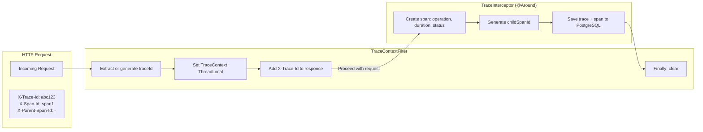
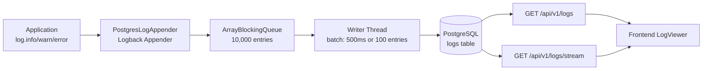
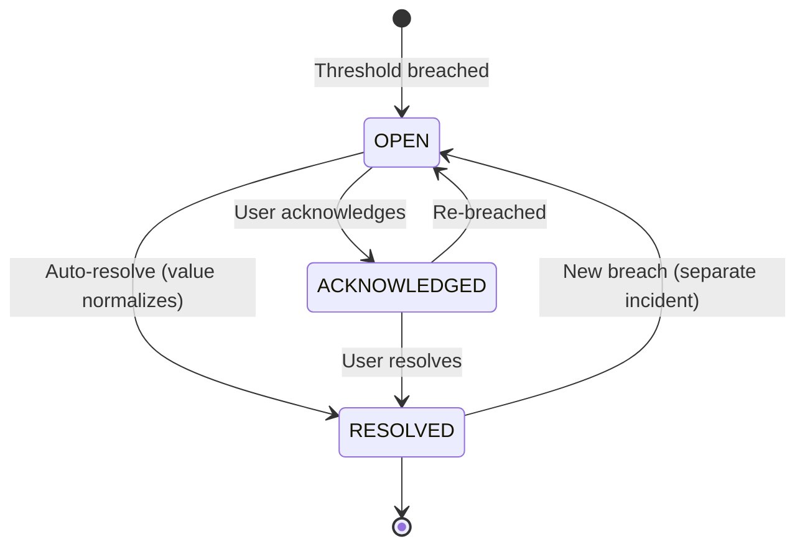
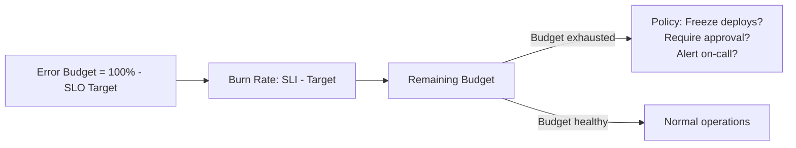
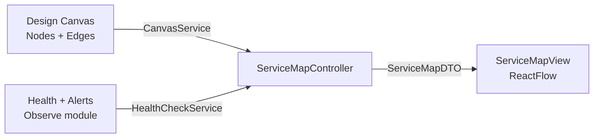
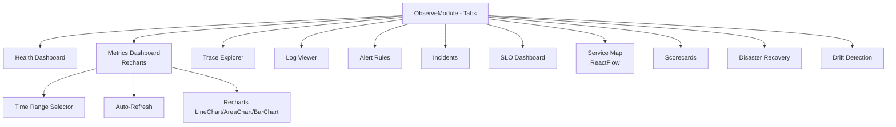

# CloudBuilder — Observability Architecture

**Version**: 1.0.0  
**Date**: 2026-06-28  
**Authority**: Principal Architect / SRE  
**Stack**: Java 21 + Spring Boot + PostgreSQL 16 + React 19 + Recharts

---

> *"Observability is not a tool. Observability is a property of the system — the ability to understand what is happening inside it by examining its outputs."*
>
> CloudBuilder's observability is **100% native** — no Prometheus, no Grafana, no OpenTelemetry, no Datadog. Everything runs on PostgreSQL + Spring Boot + React.

---

## Table of Contents

1. [Design Philosophy](#1-design-philosophy)
2. [Architecture Overview](#2-architecture-overview)
3. [Metrics Pipeline](#3-metrics-pipeline)
4. [Distributed Tracing](#4-distributed-tracing)
5. [Logging Engine](#5-logging-engine)
6. [Alerting Engine](#6-alerting-engine)
7. [SLO/SLI Framework](#7-slosli-framework)
8. [Real-Time Streaming (SSE)](#8-real-time-streaming-sse)
9. [Service Map & Scorecards](#9-service-map--scorecards)
10. [Dashboards & Visualization](#10-dashboards--visualization)
11. [PostgreSQL Time-Series Patterns](#11-postgresql-time-series-patterns)
12. [API Reference](#12-api-reference)
13. [Performance & Scale](#13-performance--scale)
14. [Migration from External Tools](#14-migration-from-external-tools)
15. [Roadmap](#15-roadmap)

---

## 1. Design Philosophy

### Why Native Observability?

| Aspect | External Stack (Prometheus/Grafana/OTel) | Native CloudBuilder |
|--------|------------------------------------------|---------------------|
| **Dependencies** | 3+ services to deploy and maintain | Zero — only PostgreSQL |
| **UX** | Fragmented (switch between tools) | Unified — everything in the platform |
| **Cost** | Infrastructure for 3 services + storage | Only PostgreSQL storage |
| **Multi-tenant** | Complex (per-tenant Prometheus?) | Built-in via tenantId column |
| **Customization** | Limited to Grafana's capabilities | Full control over every component |
| **Drift Correlation** | Impossible (no design context) | Native — canvas metrics correlated |
| **Operational Complexity** | High (retention, scaling, upgrades) | Low — just PostgreSQL |

### Core Principles

1. **PostgreSQL as the single observability store** — metrics, traces, logs, alerts, and SLOs all in one database
2. **Tenant isolation everywhere** — every table has `tenant_id` for automatic filtering
3. **Async instrumentation** — metrics collection never blocks the main request path
4. **Streaming by default** — SSE pushes observability data to the frontend in real time
5. **Correlation built-in** — traces, logs, and metrics share `trace_id` and `correlation_id`
6. **SLO-driven alerting** — alerts are based on SLO burn rate, not static thresholds

---

## 2. Architecture Overview

### Component Diagram

```mermaid
graph TB
    subgraph Backend["Backend (Spring Boot 3.4.4)"]
        direction TB
        
        subgraph Instrumentation["Instrumentation Layer"]
            MI[MetricsInterceptor<br/>@Aspect @Around]
            TI[TraceInterceptor<br/>@Aspect @Around]
            TCF[TraceContextFilter<br/>OncePerRequestFilter]
            PLA[PostgresLogAppender<br/>Async Logback]
        end
        
        subgraph Services["Services Layer"]
            MS[MetricsService]
            TS[TraceService]
            LS[LogService]
            AES[AlertEvaluationService<br/>@Scheduled 30s]
            SLO[SloService<br/>@Scheduled hourly]
            DS[DashboardService]
            NS[NotificationService]
        end
        
        subgraph API["REST + SSE Endpoints"]
            MQC[MetricsQueryController]
            TC[TraceController]
            LC[LogController]
            ARC[AlertRuleController]
            IC[IncidentController]
            SC[SloController]
            DC[DashboardController]
            OBC[ObserveController]
            SMC[ServiceMapController]
            SCC[ScorecardController]
        end
    end

    subgraph Database["PostgreSQL 16"]
        MT[(metrics_ts<br/>partitioned monthly)]
        TR[(traces + spans<br/>partitioned daily)]
        LG[(logs<br/>partitioned daily)]
        AR[(alert_rules<br/>+ evaluations)]
        IN[(incidents<br/>+ timeline)]
        SLO_DB[(slo_definitions<br/>+ snapshots)]
        NC[(notification_channels)]
        DB[(dashboards)]
    end

    subgraph Frontend["Frontend (React 19)"]
        OM[ObserveModule]
        MD[MetricsDashboard<br/>Recharts]
        TE[TraceExplorer]
        LV[LogViewer]
        AV[AlertRulesView]
        IV[IncidentsView]
        SD[SloDashboard]
        SM[ServiceMapView<br/>ReactFlow]
        SC[ScorecardView]
        SSE[useSSE Hook]
    end

    Instrumentation --> Services
    Services --> API
    Services --> Database
    API --> Frontend
    Frontend --> SSE
    SSE -->|SSE Stream| API
```

### Data Flow

```mermaid
flowchart LR
    REQ[HTTP Request] -->|MetricsInterceptor| MI[Metrics: +1 count, latency]
    REQ -->|TraceInterceptor| TI[Trace: traceId, spanId, duration]
    REQ -->|PostgresLogAppender| LOG[Log: async batch insert]
    
    MI -->|MetricsService.record()| PG[(PostgreSQL)]
    TI -->|TraceService.save()| PG
    LOG -->|batch every 500ms| PG
    
    PG -->|@Scheduled 30s| AES[AlertEvaluationService]
    AES -->|threshold breach| INC[→ Incident]
    INC -->|@Scheduled| NOT[NotificationService]
    
    PG -->|@Scheduled hourly| SLO_SVC[SloService]
    SLO_SVC -->|SLI computation| PG
    
    PG -->|SSE stream| FE[Frontend Recharts]
```

---

## 3. Metrics Pipeline

### Instrumentation

Metrics are captured automatically via Spring AOP and manually via `CustomMetrics`:

**Automatic (MetricsInterceptor)**:
```java
@Aspect
@Component
public class MetricsInterceptor {
    @Around("@annotation(io.micrometer.core.annotation.Timed)")
    public Object measureLatency(ProceedingJoinPoint pjp) throws Throwable {
        long start = System.nanoTime();
        try {
            return pjp.proceed();
        } finally {
            long duration = System.nanoTime() - start;
            metricsService.record("api." + metricName + ".latency", duration / 1_000_000,
                Tags.of("method", methodName, "status", statusCode));
        }
    }
}
```

**Manual (CustomMetrics)**:
```java
@Component
public class CustomMetrics {
    public void recordCanvasCreated(String tenantId) {
        metricsService.record("design.canvas.created", 1,
            Tags.of("tenant", tenantId));
    }
    public void recordDeploymentCompleted(String environmentId) {
        metricsService.record("provision.deploy.completed", 1,
            Tags.of("environment", environmentId));
    }
    public void recordDriftDetected(String resourceAddress) {
        metricsService.record("observe.drift.detected", 1,
            Tags.of("resource", resourceAddress));
    }
}
```

### Storage Schema

```sql
CREATE TABLE metrics_ts (
    id          UUID DEFAULT gen_random_uuid(),
    tenant_id   VARCHAR(64) NOT NULL,
    metric_name VARCHAR(128) NOT NULL,  -- e.g., "api.canvas.created.latency"
    tags        JSONB DEFAULT '{}',     -- e.g., {"method": "POST", "status": "201"}
    value       DOUBLE PRECISION NOT NULL,
    timestamp   TIMESTAMPTZ NOT NULL DEFAULT NOW(),
    PRIMARY KEY (timestamp, id)
) PARTITION BY RANGE (timestamp);

-- Monthly partitions auto-created
CREATE TABLE metrics_ts_2026_06 PARTITION OF metrics_ts
    FOR VALUES FROM ('2026-06-01') TO ('2026-07-01');

-- Query indexes
CREATE INDEX idx_metrics_lookup ON metrics_ts (tenant_id, metric_name, timestamp DESC);
CREATE INDEX idx_metrics_tags ON metrics_ts USING GIN (tags);
```

### Query Patterns

**Aggregation (percentile)**:
```sql
SELECT metric_name,
       percentile_cont(0.50) WITHIN GROUP (ORDER BY value) AS p50,
       percentile_cont(0.95) WITHIN GROUP (ORDER BY value) AS p95,
       percentile_cont(0.99) WITHIN GROUP (ORDER BY value) AS p99,
       AVG(value) AS avg,
       COUNT(*) AS count
FROM metrics_ts
WHERE tenant_id = ?
  AND metric_name LIKE 'api.%.latency'
  AND timestamp >= NOW() - INTERVAL '1 hour'
GROUP BY metric_name;
```

**Time-series (downsampling)**:
```sql
-- 1-hour buckets, 7-day range
SELECT date_trunc('hour', timestamp) AS bucket,
       AVG(value) AS avg_value,
       MAX(value) AS max_value
FROM metrics_ts
WHERE tenant_id = ?
  AND metric_name = ?
  AND timestamp >= NOW() - INTERVAL '7 days'
GROUP BY bucket
ORDER BY bucket;
```

### Dual-Write Strategy

During migration from Micrometer Prometheus export to native PostgreSQL storage:

```java
// MetricsService — dual-write during migration
public void record(String name, double value, Tags tags) {
    // 1. Native PostgreSQL storage (primary)
    metricsRepository.save(new MetricsTsEntity(tenantId, name, tags, value));
    
    // 2. Micrometer MeterRegistry (legacy, for monitoring the migration)
    Counter.builder(name).tags(tags).register(meterRegistry).increment(value);
}
```

Once migration is complete, the Micrometer export to `/actuator/prometheus` will be disabled.

### Registered Metrics (Domain)

| Metric Name | Type | Description |
|-------------|------|-------------|
| `design.canvas.created` | Counter | New canvas designs |
| `design.node.added` | Counter | Nodes added to canvases |
| `design.validation.ran` | Counter | Validation executions |
| `design.validation.passed` | Counter | Successful validations |
| `design.validation.failed` | Counter | Failed validations |
| `provision.code.generated` | Counter | Code generation requests |
| `provision.deploy.started` | Counter | Deployments started |
| `provision.deploy.completed` | Counter | Successful deployments |
| `provision.deploy.failed` | Counter | Failed deployments |
| `observe.drift.detected` | Counter | Drift events detected |
| `observe.alert.triggered` | Counter | Alert rule breaches |
| `aiops.incident.created` | Counter | New incidents |
| `aiops.remediation.executed` | Counter | Auto-remediation actions |
| `api.{method}.latency` | Timer | HTTP request latency (ms) |
| `api.{method}.errors` | Counter | HTTP error responses |

---

## 4. Distributed Tracing

### Trace Context Propagation



### Trace & Span Schema

```sql
CREATE TABLE traces (
    id           UUID DEFAULT gen_random_uuid(),
    trace_id     VARCHAR(32) NOT NULL,    -- global trace identifier
    tenant_id    VARCHAR(64) NOT NULL,
    service_name VARCHAR(128) NOT NULL,   -- cloudbuilder-backend
    operation    VARCHAR(256) NOT NULL,   -- CanvasController.createCanvas()
    start_time   TIMESTAMPTZ NOT NULL,
    duration_ms  INTEGER NOT NULL,
    status_code  INTEGER NOT NULL,
    is_error     BOOLEAN DEFAULT FALSE,
    metadata     JSONB DEFAULT '{}',
    PRIMARY KEY (start_time, id)
) PARTITION BY RANGE (start_time);

CREATE TABLE spans (
    id              UUID DEFAULT gen_random_uuid(),
    trace_id        VARCHAR(32) NOT NULL,
    span_id         VARCHAR(16) NOT NULL,
    parent_span_id  VARCHAR(16),            -- null for root span
    tenant_id       VARCHAR(64) NOT NULL,
    service_name    VARCHAR(128) NOT NULL,
    operation       VARCHAR(256) NOT NULL,
    start_time      TIMESTAMPTZ NOT NULL,
    duration_ms     INTEGER NOT NULL,
    status_code     INTEGER,
    status          VARCHAR(16),            -- OK, ERROR
    tags            JSONB DEFAULT '{}',
    PRIMARY KEY (start_time, id)
) PARTITION BY RANGE (start_time);
```

### Trace Query Patterns

**Find traces by tenant + time range**:
```sql
SELECT trace_id, operation, start_time, duration_ms, is_error
FROM traces
WHERE tenant_id = ?
  AND start_time >= NOW() - INTERVAL '1 hour'
ORDER BY start_time DESC
LIMIT 50;
```

**Get full trace detail**:
```sql
-- Root trace + all spans
SELECT * FROM traces WHERE trace_id = ?;
SELECT * FROM spans WHERE trace_id = ? ORDER BY start_time;
```

**Error traces (fast filter)**:
```sql
SELECT trace_id, operation, duration_ms, metadata
FROM traces
WHERE tenant_id = ?
  AND is_error = TRUE
  AND start_time >= NOW() - INTERVAL '24 hours'
ORDER BY duration_ms DESC;
```

---

## 5. Logging Engine

### Architecture



### PostgresLogAppender

```java
public class PostgresLogAppender extends AppenderBase<ILoggingEvent> {
    private final BlockingQueue<LogEntry> queue = new ArrayBlockingQueue<>(10_000);
    
    @Override
    protected void append(ILoggingEvent event) {
        if (!queue.offer(toLogEntry(event))) {
            // Queue full → log to stdout (fallback)
            System.err.println("Log queue full, dropping: " + event.getMessage());
        }
    }
    
    // Writer thread (started on appender start)
    private void writerLoop() {
        List<LogEntry> batch = new ArrayList<>(100);
        while (isStarted()) {
            try {
                LogEntry entry = queue.poll(500, TimeUnit.MILLISECONDS);
                if (entry != null) {
                    batch.add(entry);
                    queue.drainTo(batch, 100);
                    flushBatch(batch);
                    batch.clear();
                } else if (!batch.isEmpty()) {
                    flushBatch(batch);
                    batch.clear();
                }
            } catch (Exception e) {
                System.err.println("Log writer error: " + e.getMessage());
            }
        }
    }
}
```

### Log Schema

```sql
CREATE TABLE logs (
    id           UUID DEFAULT gen_random_uuid(),
    tenant_id    VARCHAR(64) NOT NULL,
    timestamp    TIMESTAMPTZ NOT NULL DEFAULT NOW(),
    level        VARCHAR(16) NOT NULL,         -- DEBUG, INFO, WARN, ERROR
    logger_name  VARCHAR(256) NOT NULL,
    thread_name  VARCHAR(128),
    message      TEXT NOT NULL,
    trace_id     VARCHAR(32),                  -- correlation with traces
    span_id      VARCHAR(16),
    stack_trace  TEXT,
    structured   JSONB DEFAULT '{}',           -- additional structured fields
    PRIMARY KEY (timestamp, id)
) PARTITION BY RANGE (timestamp);
```

### Full-Text Search

```sql
-- GIN index on Portuguese text
CREATE INDEX idx_logs_fts ON logs USING GIN (to_tsvector('portuguese', message));

-- Query
SELECT timestamp, level, logger_name, message
FROM logs
WHERE tenant_id = ?
  AND timestamp >= NOW() - INTERVAL '24 hours'
  AND to_tsvector('portuguese', message) @@ to_tsquery('portuguese', 'erro & deploy')
ORDER BY timestamp DESC
LIMIT 100;
```

---

## 6. Alerting Engine

### Architecture

```mermaid
flowchart TD
    AES[AlertEvaluationService<br/>@Scheduled 30s] --> LOAD[Load all enabled rules]
    LOAD --> EVAL{For each rule}
    EVAL --> QUERY[Query metric: current value]
    QUERY --> COMPARE{Breached threshold?}
    
    COMPARE -->|Yes: check duration| DURATION{Breached for<br/>duration_sec?}
    DURATION -->|Yes| EXIST{Open incident exists?}
    EXIST -->|No| CREATE[Create incident]
    EXIST -->|Yes| SKIP[Deduplicate]
    DURATION -->|No| WAIT[Log evaluation, wait]
    
    COMPARE -->|No| CLOSE[Auto-close open incident?]
    CLOSE --> RESOLVE[Resolve incident]
    
    CREATE --> NOTIFY[Send notifications]
    NOTIFY --> LOG_EVAL[Log evaluation]
    RESOLVE --> LOG_EVAL
    WAIT --> LOG_EVAL
    SKIP --> LOG_EVAL
```

### Alert Rule Schema

```sql
CREATE TABLE alert_rules (
    id              UUID DEFAULT gen_random_uuid(),
    tenant_id       VARCHAR(64) NOT NULL,
    name            VARCHAR(128) NOT NULL,
    description     TEXT,
    metric_name     VARCHAR(128) NOT NULL,    -- which metric to evaluate
    condition       VARCHAR(16) NOT NULL,      -- gt, lt, gte, lte, eq
    threshold       DOUBLE PRECISION NOT NULL,
    duration_sec    INTEGER NOT NULL DEFAULT 0, -- sustain duration before alerting
    severity        VARCHAR(16) NOT NULL,       -- info, warning, critical
    enabled         BOOLEAN DEFAULT TRUE,
    notify_channels JSONB DEFAULT '[]',         -- list of channel IDs
    created_at      TIMESTAMPTZ NOT NULL DEFAULT NOW(),
    updated_at      TIMESTAMPTZ NOT NULL DEFAULT NOW(),
    UNIQUE (tenant_id, name)
);
```

### Incident Lifecycle

```sql
CREATE TABLE incidents (
    id              UUID DEFAULT gen_random_uuid(),
    alert_rule_id   UUID REFERENCES alert_rules(id),
    tenant_id       VARCHAR(64) NOT NULL,
    title           VARCHAR(256) NOT NULL,
    description     TEXT,
    severity        VARCHAR(16) NOT NULL,
    status          VARCHAR(16) NOT NULL DEFAULT 'OPEN',  -- OPEN, ACKNOWLEDGED, RESOLVED
    current_value   DOUBLE PRECISION,
    threshold       DOUBLE PRECISION,
    started_at      TIMESTAMPTZ NOT NULL DEFAULT NOW(),
    acknowledged_at TIMESTAMPTZ,
    resolved_at     TIMESTAMPTZ,
    UNIQUE (alert_rule_id, status) WHERE status = 'OPEN'
);
```



### Notification Channels

| Type | Config | Example |
|------|--------|---------|
| Email | `smtpHost, smtpPort, fromAddress` | SMTP relay |
| Webhook | `url, secret` (encrypted) | Slack, PagerDuty, custom |
| Internal | Display in-platform notification | SSE push to frontend |

### Escalation

If an incident is not acknowledged within the configured escalation time (default: 15 minutes):
- Severity increases (warning → critical)
- Additional notification channels are triggered
- Event logged in `incident_timeline`

---

## 7. SLO/SLI Framework

### SLO Definition

```sql
CREATE TABLE slo_definitions (
    id              UUID DEFAULT gen_random_uuid(),
    tenant_id       VARCHAR(64) NOT NULL,
    name            VARCHAR(128) NOT NULL,
    description     TEXT,
    sli_type        VARCHAR(32) NOT NULL,     -- latency, availability, error_rate, custom
    metric_name     VARCHAR(128) NOT NULL,    -- base metric for SLI calculation
    target_pct      DOUBLE PRECISION NOT NULL, -- e.g., 99.9
    window_days     INTEGER NOT NULL DEFAULT 30,
    enabled         BOOLEAN DEFAULT TRUE,
    UNIQUE (tenant_id, name)
);
```

### SLI Computation

```java
// SloService — runs @Scheduled hourly
public void computeAllSliSnapshots() {
    for (SloDefinition slo : sloRepository.findByEnabledTrue()) {
        Instant windowStart = Instant.now().minus(slo.getWindowDays(), DAYS);
        
        MetricsQueryResult result = metricsService.query(slo.getMetricName(),
            windowStart, Instant.now(), tenantId);
        
        long totalCount = result.getCount();
        long goodCount = computeGoodCount(result, slo.getSliType());
        double sliPct = totalCount > 0 ? (double) goodCount / totalCount * 100 : 100.0;
        double errorBudgetPct = (100.0 - sliPct) / (100.0 - slo.getTargetPct()) * 100;
        
        sliSnapshotRepository.save(new SliSnapshot(
            slo.getId(), tenantId, windowStart, Instant.now(),
            goodCount, totalCount, sliPct, errorBudgetPct));
    }
}
```

### SLI Types

| Type | Metric | Good condition |
|------|--------|----------------|
| **Latency** | `api.{method}.latency` | duration ≤ 200ms (p99 target) |
| **Availability** | `api.{method}.errors` | status ≠ 5xx |
| **Error Rate** | `api.{method}.errors` | error rate ≤ 1% |
| **Custom** | any metric | user-defined threshold |

### Error Budget



**Example**: SLO target = 99.9%. Over 30 days:
- Error budget = 0.1% = 43m 12s of allowed downtime
- If actual SLI = 99.5%, burn rate = 0.4% → budget exhausted in 10.8 days
- At 50% consumption → warning alert
- At 100% consumption → critical alert

---

## 8. Real-Time Streaming (SSE)

### Architecture

Server-Sent Events provide real-time push from backend to frontend:

```mermaid
flowchart LR
    BACKEND[Backend<br/>EventBus<br/>ApplicationEventPublisher] --> SSE_EP[EventStreamController<br/>@GetMapping(produces=text/event-stream)]
    SSE_EP -->|SSE: data: {event}|| FE[Frontend useSSE Hook]
    FE -->|Auto-reconnect<br/>Last-Event-Id| SSE_EP
```

### Frontend Hook

```typescript
// hooks/useSSE.ts — generic SSE hook with auto-reconnect
function useSSE<T>(url: string, eventName?: string): {
    data: T | null;
    connected: boolean;
    error: string | null;
} {
    const [data, setData] = useState<T | null>(null);
    const [connected, setConnected] = useState(false);
    const [error, setError] = useState<string | null>(null);
    
    useEffect(() => {
        const source = new EventSource(url);
        
        source.onopen = () => setConnected(true);
        source.onerror = (e) => {
            setConnected(false);
            setError('SSE connection lost. Reconnecting...');
        };
        
        const handler = (event: MessageEvent) => {
            setData(JSON.parse(event.data));
            setError(null);
        };
        
        if (eventName) {
            source.addEventListener(eventName, handler);
        } else {
            source.onmessage = handler;
        }
        
        return () => source.close();
    }, [url]);
    
    return { data, connected, error };
}
```

### SSE Endpoints

| Endpoint | Event | Frequency | Payload |
|----------|-------|-----------|---------|
| `/api/v1/metrics/stream` | `metric` | Every 5s | Newest metric aggregation |
| `/api/v1/traces/stream` | `trace` | Real-time | New traces as they arrive |
| `/api/v1/logs/stream` | `log` | Real-time | New log entries |
| `/api/v1/incidents/stream` | `incident` | On change | Incident create/update |

---

## 9. Service Map & Scorecards

### Service Map

The Service Map bridges Design canvas topology with Observe health data:



**Rendering**: Nodes from the design canvas are displayed as a ReactFlow graph, with color-coded health indicators (green = healthy, yellow = warning, red = critical). Connections between nodes show relationship status.

### Scorecards

6 maturity criteria evaluated against each canvas design:

| Criteria | Max Score | Evaluation |
|----------|-----------|------------|
| **High Availability** | 10 | Redundancy, multi-AZ, auto-scaling |
| **Security** | 10 | Encryption, IAM, network ACLs |
| **Cost Optimization** | 10 | Reserved instances, right-sizing |
| **Scalability** | 10 | Horizontal scaling, load balancing |
| **Observability** | 10 | Monitoring, logging, alerting |
| **Documentation** | 10 | Tags, descriptions, runbooks |

```java
@GetMapping("/api/v1/scorecards/{canvasId}")
public ScorecardDTO getScorecard(@PathVariable String canvasId) {
    // Analyze canvas nodes and edges against maturity criteria
    // Returns per-criterion score + overall + recommendations
}
```

---

## 10. Dashboards & Visualization

### Frontend Components



### Chart Component (shadcn/ui style)

```tsx
<ChartContainer config={latencyConfig}>
    <LineChart data={metrics}>
        <CartesianGrid strokeDasharray="3 3" />
        <XAxis dataKey="timestamp" tickFormatter={formatTime} />
        <YAxis unit="ms" />
        <Tooltip content={<ChartTooltip />} />
        <Line type="monotone" dataKey="p50" stroke="#E3E2FD" name="P50" />
        <Line type="monotone" dataKey="p95" stroke="#ccff00" name="P95" />
        <Line type="monotone" dataKey="p99" stroke="#ff6b6b" name="P99" />
    </LineChart>
</ChartContainer>
```

### Available Dashboards

| Dashboard | Source | Refresh |
|-----------|--------|---------|
| **Health Overview** | ObserveController + HealthCheckService | 30s |
| **Metrics** | MetricsQueryController | 5s (SSE) |
| **Traces** | TraceController | Real-time |
| **Logs** | LogController | Real-time |
| **Alerts** | AlertRuleController + IncidentController | On change |
| **SLO** | SloController | Hourly (snapshot) |

---

## 11. PostgreSQL Time-Series Patterns

### Partitioning Strategy

| Table | Partition Key | Interval | Retention | Indexes |
|-------|--------------|----------|-----------|---------|
| `metrics_ts` | `timestamp` | Monthly | 6 months | B-tree (tenant, name, ts), GIN (tags) |
| `traces` | `start_time` | Daily | 7 days | B-tree (tenant, trace_id), (tenant, error, ts) |
| `spans` | `start_time` | Daily | 7 days | B-tree (trace_id) |
| `logs` | `timestamp` | Daily | 30 days | B-tree (tenant, level, ts), GIN (fts) |
| `alert_rule_evaluations` | `evaluated_at` | Monthly | 3 months | B-tree (alert_rule_id, evaluated_at) |

### Partition Maintenance

```sql
-- Monthly maintenance script (cron: 1st of each month)
-- Create new partitions for the upcoming month
CREATE TABLE metrics_ts_2026_07 PARTITION OF metrics_ts
    FOR VALUES FROM ('2026-07-01') TO ('2026-08-01');

-- Drop expired partitions (retention exceeded)
DROP TABLE IF EXISTS metrics_ts_2025_12; -- 6+ months old
```

### Query Optimization Tips

1. **Always filter by `tenant_id`** — drives partition pruning + index usage
2. **Always filter by `timestamp`** — enables partition pruning
3. **Use `date_trunc` for downsampling** — reduces row count for time charts
4. **Prefer BRIN indexes for time-series** — more space-efficient than B-tree for append-only data
5. **Materialized views for common aggregations** — pre-compute hourly/daily rollups

```sql
-- BRIN index for time-series (append-only, sorted by timestamp)
CREATE INDEX idx_metrics_ts_brin ON metrics_ts USING BRIN (timestamp)
    WITH (pages_per_range = 32);
```

### When to Add Dedicated Time-Series DB

The native PostgreSQL approach is sufficient for **MVP to early production** (up to ~10M metrics/min). Beyond that:

1. **TimescaleDB** — Drop-in PostgreSQL extension, same schema, auto-partitioning, compression
2. **VictoriaMetrics** — Dedicated time-series DB, Prometheus-compatible API, efficient storage
3. **ClickHouse** — Columnar analytics DB, excellent for observability queries

Current roadmap targets TimescaleDB or VictoriaMetrics for Q1 2027 if volume requires.

---

## 12. API Reference

### Metrics

| Method | Path | Description |
|--------|------|-------------|
| `GET` | `/api/v1/metrics/query` | Query metrics with aggregation |
| `POST` | `/api/v1/metrics/record` | Ingest a single metric data point |
| `GET` | `/api/v1/metrics/stream` | SSE stream of recent metrics |

### Traces

| Method | Path | Description |
|--------|------|-------------|
| `GET` | `/api/v1/traces` | List traces with filters (time range, error, operation) |
| `GET` | `/api/v1/traces/{traceId}` | Full trace detail with all spans |
| `GET` | `/api/v1/traces/errors` | Quick filter: traces with errors |
| `GET` | `/api/v1/traces/stream` | SSE stream of new traces |

### Logs

| Method | Path | Description |
|--------|------|-------------|
| `GET` | `/api/v1/logs` | Search logs with filters (level, time range, full-text) |
| `GET` | `/api/v1/logs/stream` | SSE stream of new log entries |

### Alerts & Incidents

| Method | Path | Description |
|--------|------|-------------|
| `GET/POST/PUT/DELETE` | `/api/v1/alert-rules` | CRUD alert rules |
| `GET` | `/api/v1/alert-rules/{id}/evaluations` | Evaluation history |
| `GET/POST` | `/api/v1/incidents` | List/create incidents |
| `POST` | `/api/v1/incidents/{id}/acknowledge` | Acknowledge |
| `POST` | `/api/v1/incidents/{id}/resolve` | Resolve |
| `GET` | `/api/v1/incidents/stream` | SSE: incident changes |

### SLO

| Method | Path | Description |
|--------|------|-------------|
| `GET/POST/PUT/DELETE` | `/api/v1/slos` | CRUD SLO definitions |
| `GET` | `/api/v1/slos/{id}/snapshots` | SLI history snapshots |
| `GET` | `/api/v1/slos/dashboard` | All SLOs with current status + error budget |

### Observe

| Method | Path | Description |
|--------|------|-------------|
| `GET` | `/api/v1/observe/dashboard/{environmentId}` | Environment health dashboard |
| `POST` | `/api/v1/observe/health` | Report health check |
| `GET` | `/api/v1/observe/alerts/{environmentId}` | Environment alerts |
| `GET` | `/api/v1/service-map/{canvasId}` | Service map for a design |
| `GET` | `/api/v1/scorecards/{canvasId}` | Maturity scorecard for a design |

---

## 13. Performance & Scale

### Storage Estimates

| Workload | Data per day | Monthly storage | Query latency (p95) |
|----------|-------------|-----------------|---------------------|
| Small (10 tenants, 100 req/s) | ~50 MB | 1.5 GB | < 50ms |
| Medium (50 tenants, 500 req/s) | ~250 MB | 7.5 GB | < 100ms |
| Large (200 tenants, 2000 req/s) | ~1 GB | 30 GB | < 200ms |
| Enterprise (1000+ tenants, 10K req/s) | ~5 GB | 150 GB | > 500ms (needs TSDB) |

### Bottlenecks

| Constraint | Limit | Mitigation |
|-----------|-------|------------|
| PostgreSQL write throughput | ~10K inserts/s per table | Batch inserts (PostgresLogAppender sends 100 at a time) |
| Partition pruning | Works best with timestamp filters | Always filter by time range in queries |
| Full-text search | Index build time increases with table size | Partition logs daily, search within time-bounded partitions |
| JSONB tag queries | No index for arbitrary tag paths | Use fixed tag keys, create partial indexes for common filters |

### Optimization Techniques

1. **Batch inserts** — Log appender accumulates 100 entries before flushing
2. **Async writes** — Metrics and logs are written asynchronously, never blocking the request
3. **Partition pruning** — Always filter by tenant_id + timestamp range
4. **Materialized views** — Pre-aggregate hourly/daily rollups for dashboards
5. **Caffeine cache** — Alert rules cached in-process (30s TTL)
6. **Downsampling in queries** — Use `date_trunc` for chart data, not raw points

---

## 14. Migration from External Tools

### What Was Removed (Phase 4 — $0 infra cleanup)

| Service | Removed Date | Replacement |
|---------|-------------|-------------|
| Prometheus | 2026-06-16 | PostgreSQL metrics_ts table |
| Grafana | 2026-06-16 | Native React + Recharts dashboards |
| OpenTelemetry Collector | 2026-06-16 | TraceInterceptor + TraceContext |
| Kafka | 2026-06-16 | Spring events + PostgreSQL |
| Redis (cache) | 2026-06-16 | Caffeine in-process |

### Data Migration

No data migration was needed — these tools were never populated with production data during MVP.

---

## 15. Roadmap

### Phase 1 — Foundation (Sprint 1-2) ✅

- [x] PostgreSQL schema (metrics_ts, traces, spans, logs, alert_rules, incidents, SLOs, dashboards, notification_channels)
- [x] JPA entities for all observability tables
- [x] Spring Data repositories with native queries
- [x] MetricsService (PostgreSQL + dual-write Micrometer)
- [x] TraceInterceptor + TraceContextFilter
- [x] MetricsQueryController, TraceController
- [x] useSSE hook + ChartContainer component
- [x] ObserveModule tabs (Metrics, Traces, Service Map, Scorecards)

### Phase 2 — Alerting (Sprint 3-4) ✅

- [x] AlertRule, AlertRuleEvaluation, Incident, SloDefinition entities
- [x] AlertEvaluationService (@Scheduled 30s)
- [x] SloService (@Scheduled hourly)
- [x] REST controllers for alerts, incidents, SLOs
- [x] NotificationService (webhook + email)
- [x] Frontend views (AlertRules, Incidents, SLO)

### Phase 3 — Logging (Sprint 5-6) ✅

- [x] LogEntry entity
- [x] PostgresLogAppender (async Logback appender)
- [x] LogController (ingest + search + stream)
- [x] LogViewer frontend with full-text search
- [x] traceId correlation in logs

### Phase 4 — Dashboards (Sprint 7-8) 🔧

- [ ] Dashboard entity + controller + service
- [ ] Custom dashboard builder (frontend drag-drop)
- [ ] Time range control with auto-refresh
- [ ] Drill-down from dashboard to trace/log detail
- [ ] Performance tuning (materialized views, partition management)
- [ ] Remove Micrometer Prometheus export (finalize migration)

### Future (Q3-Q4 2026)

- [ ] Anomaly detection (statistical threshold vs static)
- [ ] Flame graphs for trace visualization
- [ ] Log pattern analysis (group similar errors)
- [ ] Multi-region observability aggregation
- [ ] Custom metrics API for external agents

---

## References

- **ADR-008**: Native Observability Subsystem (full architecture + schema)
- **ADR-012**: Q3 Operations Architecture
- **Core Files**:
  - `MetricsService.java` — Metrics storage and query
  - `PostgresLogAppender.java` — Async log appender
  - `AlertEvaluationService.java` — Scheduled alert evaluation
  - `TraceInterceptor.java` — AOP trace instrumentation
  - `TraceContext.java` — ThreadLocal trace propagation
  - `useSSE.ts` — Frontend SSE hook
- **PostgreSQL**: Partitioning (PG 16), BRIN indexes, full-text search
- **Google SRE Book**: SLI/SLO/Error Budget patterns
- **Architecture Manifesto**: Principle 11 — Observability by Default
