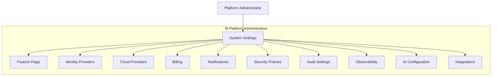
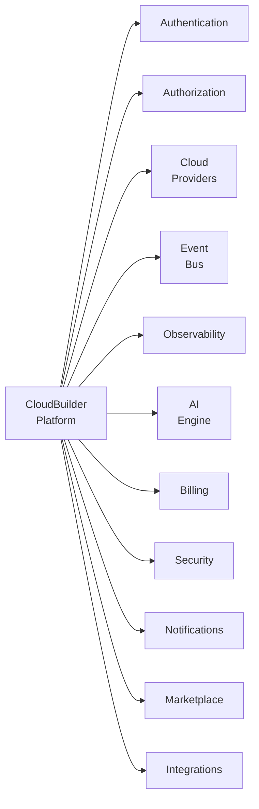
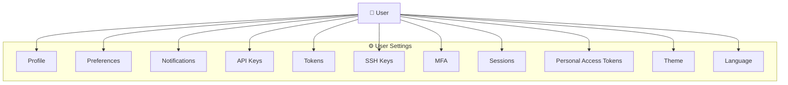
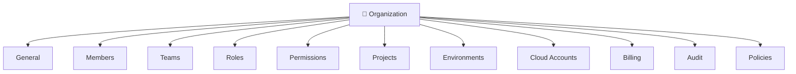
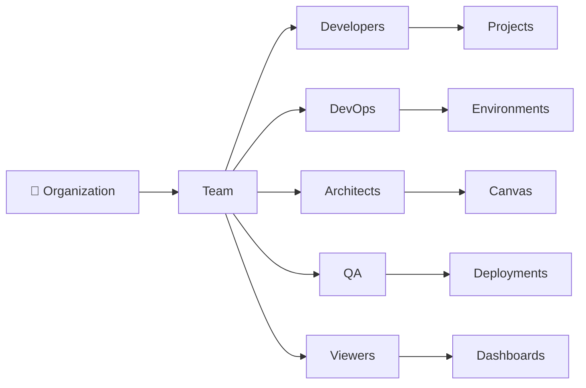
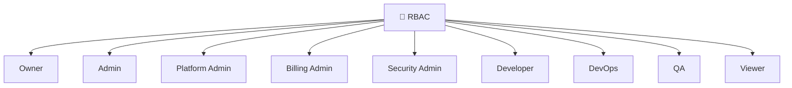
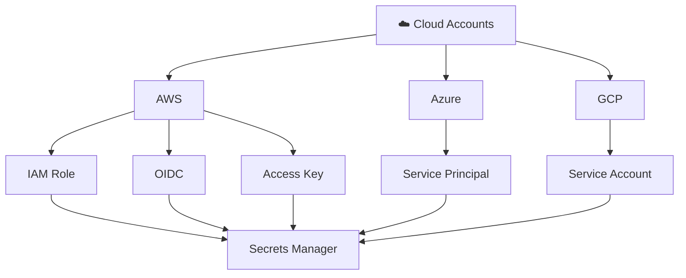
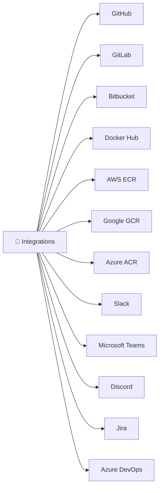
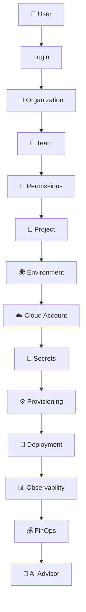
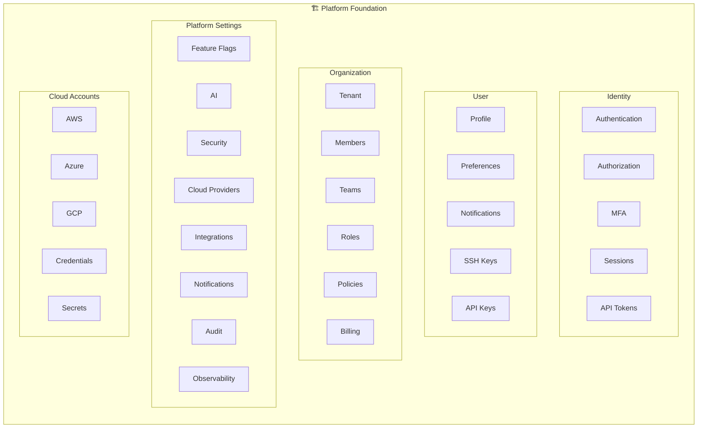

# CloudBuilder — Platform & User Settings Diagrams

**Versão**: 1.0.0
**Última atualização**: 2026-06-29
**ADR**: ADR-032 (Feature Flags) + ADR-035 (EDA)
**Framework**: FAANg (Future Autonomous AI Network for Engineering)

---

## 1. Platform Administration

Diagrama mostrando as configurações de administração da plataforma e seus sub-componentes.



### Platform Administration Components

| Component | Description | Module |
|-----------|-------------|--------|
| **System Settings** | Configurações globais da plataforma | settings |
| **Feature Flags** | Feature flags para rollouts graduais (ADR-032) | settings |
| **Identity Providers** | SSO OAuth2, SAML, LDAP (ADR-025) | iam |
| **Cloud Providers** | AWS, Azure, GCP credentials | credential |
| **Billing** | Planos, faturas, assinaturas | billing |
| **Notifications** | Canais de notificação (email, Slack, webhook) | notification |
| **Security Policies** | Regras de segurança e compliance | security |
| **Audit Settings** | Configurações de auditoria | audit |
| **Observability** | Métricas, traces, logs, alertas | observe |
| **AI Configuration** | Configurações de LLM providers | aiops |
| **Integrations** | GitHub, GitLab, Docker Hub, Slack | integration |

---

## 2. Platform Modules Overview

Diagrama de visão geral dos módulos da plataforma.



### Module Descriptions

| Module | Responsibility | Key Features |
|--------|---------------|--------------|
| **Authentication** | Login, registro, recuperação de senha | JWT, OAuth2, SSO |
| **Authorization** | RBAC, permissões, roles | Owner, Admin, Developer, Viewer |
| **Cloud** | Provedores cloud e credenciais | AWS, Azure, GCP, Vercel, Supabase |
| **Events** | Event-driven architecture | Kafka, Outbox, Inbox, DLQ |
| **Observability** | Métricas, traces, logs | PostgreSQL time-series, SSE |
| **AI** | Assistente IA, RCA, recomendações | OpenAI, Anthropic, Rule-based |
| **Billing** | Faturamento e planos | Stripe integration (futuro) |
| **Security** | Políticas, compliance, MFA | OPA, OWASP, encryption |
| **Notifications** | Alertas e notificações | Email, Slack, Webhooks |
| **Marketplace** | Catálogo de templates | Templates, partners |
| **Integrations** | Provedores externos | GitHub, GitLab, Bitbucket |

---

## 3. User Settings

Diagrama mostrando as configurações pessoais do usuário.



### User Settings Details

| Setting | Description | Storage |
|---------|-------------|---------|
| **Profile** | Nome, email, avatar, bio | User entity |
| **Preferences** | Notificações, dashboard layout | UserPreferences entity |
| **Notifications** | Canais preferidos, frequência | NotificationPreference entity |
| **API Keys** | Chaves de API para automação | ApiKey entity (encrypted) |
| **Tokens** | Tokens de acesso | Token entity |
| **SSH Keys** | Chaves SSH para Git | SshKey entity (encrypted) |
| **MFA** | Autenticação de dois fatores TOTP | MfaSettings entity |
| **Sessions** | Sessões ativas, logout remoto | Session entity |
| **Personal Access Tokens** | PATs para acesso programático | Pat entity |
| **Theme** | Tema visual (light/dark) | UserPreferences |
| **Language** | Idioma da interface (PT-BR/EN) | UserPreferences |

---

## 4. Organization Settings

Diagrama mostrando as configurações de organização.



### Organization Settings Details

| Setting | Description | RBAC Required |
|---------|-------------|---------------|
| **General** | Nome, slug, logo, configurações | Admin |
| **Members** | Convite, remoção, alteração de role | Admin |
| **Teams** | Squads, departamentos | Admin |
| **Roles** | Papéis customizados | Owner |
| **Permissions** | Permissões por role | Owner |
| **Projects** | Projetos da organização | Admin |
| **Environments** | Ambientes (dev, staging, prod) | Admin |
| **Cloud Accounts** | Credenciais cloud compartilhadas | Admin |
| **Billing** | Planos, faturas, uso | Owner |
| **Audit** | Logs de auditoria | Admin |
| **Policies** | Políticas de segurança | Owner |

---

## 5. Organization Teams

Diagrama mostrando a estrutura de times da organização.



### Team Responsibilities

| Team | Access | Primary Focus |
|------|--------|---------------|
| **Developers** | Projects, Canvas | Design e desenvolvimento |
| **DevOps** | Environments, Deployments | Provisionamento e deploy |
| **Architects** | Canvas, Code Generation | Arquitetura e design |
| **QA** | Deployments, Tests | Qualidade e testes |
| **Viewers** | Dashboards, Reports | Visualização e relatórios |

---

## 6. RBAC Roles

Diagrama mostrando os papéis de acesso (Role-Based Access Control).



### RBAC Role Matrix

| Role | Permissions | Scope |
|------|-------------|-------|
| **Owner** | Full access, delete org, manage billing | Organization |
| **Admin** | Manage members, teams, projects, settings | Organization |
| **Platform Admin** | Feature flags, system settings, integrations | Platform |
| **Billing Admin** | Manage plans, invoices, payment methods | Organization |
| **Security Admin** | Security policies, MFA enforcement, audit | Organization |
| **Developer** | Create/edit canvases, generate code, deploy | Projects |
| **DevOps** | Manage environments, deployments, drift | Environments |
| **QA** | View deployments, run tests, approve | Projects |
| **Viewer** | Read-only access to dashboards and reports | Organization |

---

## 7. Cloud Accounts

Diagrama mostrando as contas cloud e métodos de autenticação.



### Cloud Authentication Methods

| Provider | Method | Security Level | Use Case |
|----------|--------|----------------|----------|
| **AWS** | IAM Role (OIDC) | ⭐⭐⭐⭐⭐ | Production (recommended) |
| **AWS** | OIDC Federation | ⭐⭐⭐⭐ | Cross-account access |
| **AWS** | Access Key | ⭐⭐⭐ | Development/testing |
| **Azure** | Service Principal | ⭐⭐⭐⭐ | All environments |
| **GCP** | Service Account | ⭐⭐⭐⭐ | All environments |

### Secrets Storage

All cloud credentials are encrypted using `SecretEncryptionConverter` (AES-256-GCM) and stored in PostgreSQL. External Secrets Manager integration available for production.

---

## 8. Integrations

Diagrama mostrando as integrações externas disponíveis.



### Integration Categories

| Category | Integrations | Purpose |
|----------|-------------|---------|
| **Source Control** | GitHub, GitLab, Bitbucket | Git repositories, webhooks |
| **Container Registry** | Docker Hub, ECR, GCR, ACR | Container images |
| **Communication** | Slack, MS Teams, Discord | Notifications, alerts |
| **Project Management** | Jira, Azure DevOps | Issue tracking, pipelines |

---

## 9. User Journey Flow

Diagrama de sequência mostrando o fluxo completo do usuário na plataforma.



### User Journey Steps

| Step | Action | Output |
|------|--------|--------|
| 1. **Login** | Autenticação (email/password, SSO) | JWT token |
| 2. **Organization** | Selecionar/criar organização | Tenant context |
| 3. **Team** | Selecionar time | Team permissions |
| 4. **Permissions** | Verificar RBAC | Allowed actions |
| 5. **Project** | Selecionar/criar projeto | Project context |
| 6. **Environment** | Selecionar ambiente | Environment config |
| 7. **Cloud Account** | Conectar conta cloud | Credentials |
| 8. **Secrets** | Gerenciar segredos | Encrypted secrets |
| 9. **Provisioning** | Provisionar infraestrutura | IaC code |
| 10. **Deployment** | Deploy da aplicação | Running infra |
| 11. **Observability** | Monitorar | Metrics, logs, traces |
| 12. **FinOps** | Otimizar custos | Cost analysis |
| 13. **AI Advisor** | Obter insights | Recommendations |

---

## 10. Platform Foundation Overview

Diagrama de visão geral da fundação da plataforma com hierarquia de configurações.



### Platform Foundation Layers

| Layer | Components | Description |
|-------|-----------|-------------|
| **Identity** | Authentication, Authorization, MFA, Sessions, API Tokens | Controle de acesso e identidade |
| **User** | Profile, Preferences, Notifications, SSH Keys, API Keys | Configurações pessoais do usuário |
| **Organization** | Tenant, Members, Teams, Roles, Policies, Billing | Gestão organizacional |
| **Platform Settings** | Feature Flags, AI, Security, Cloud, Integrations, Notifications, Audit, Observability | Configurações globais da plataforma |
| **Cloud Accounts** | AWS, Azure, GCP, Credentials, Secrets | Contas e credenciais cloud |

---

## Appendix A: Settings Hierarchy

```
Platform (Global)
├── Identity (SSO, MFA, Sessions)
├── User (Profile, Preferences, Keys)
├── Organization (Tenant, Members, Teams)
│   ├── Teams (Developers, DevOps, Architects, QA, Viewers)
│   ├── Projects (Canvases, Code, Deployments)
│   ├── Environments (Dev, Staging, Prod)
│   └── Cloud Accounts (AWS, Azure, GCP)
├── Platform Settings (Feature Flags, AI, Security, Integrations)
└── Cloud Accounts (Credentials, Secrets)
```

## Appendix B: RBAC Permission Matrix

| Action | Owner | Admin | PlatformAdmin | Developer | DevOps | QA | Viewer |
|--------|-------|-------|---------------|-----------|--------|----|----|
| Manage Org | ✅ | ❌ | ❌ | ❌ | ❌ | ❌ | ❌ |
| Manage Members | ✅ | ✅ | ❌ | ❌ | ❌ | ❌ | ❌ |
| Manage Teams | ✅ | ✅ | ❌ | ❌ | ❌ | ❌ | ❌ |
| Feature Flags | ✅ | ❌ | ✅ | ❌ | ❌ | ❌ | ❌ |
| Security Policies | ✅ | ❌ | ✅ | ❌ | ❌ | ❌ | ❌ |
| Create Canvas | ✅ | ✅ | ✅ | ✅ | ✅ | ❌ | ❌ |
| Generate Code | ✅ | ✅ | ✅ | ✅ | ✅ | ❌ | ❌ |
| Deploy | ✅ | ✅ | ❌ | ❌ | ✅ | ✅ | ❌ |
| Manage Billing | ✅ | ❌ | ❌ | ❌ | ❌ | ❌ | ❌ |
| View Dashboard | ✅ | ✅ | ✅ | ✅ | ✅ | ✅ | ✅ |

---

## References

- [ADR-032: Feature Flags](../adr-032-feature-flags-public-beta.md)
- [ADR-035: Production Event-Driven Architecture](../adr-035-production-event-driven-architecture.md)
- [ADR-025: SSO Authentication Flow](../adr-025-sso-authentication-flow.md)
- [ADR-028: Security Hardening & Secrets](../adr-028-security-hardening-secrets-management.md)
- [EDA Diagrams](../eda/DIAGRAMS.md)
- [Architecture README](../README.md)
