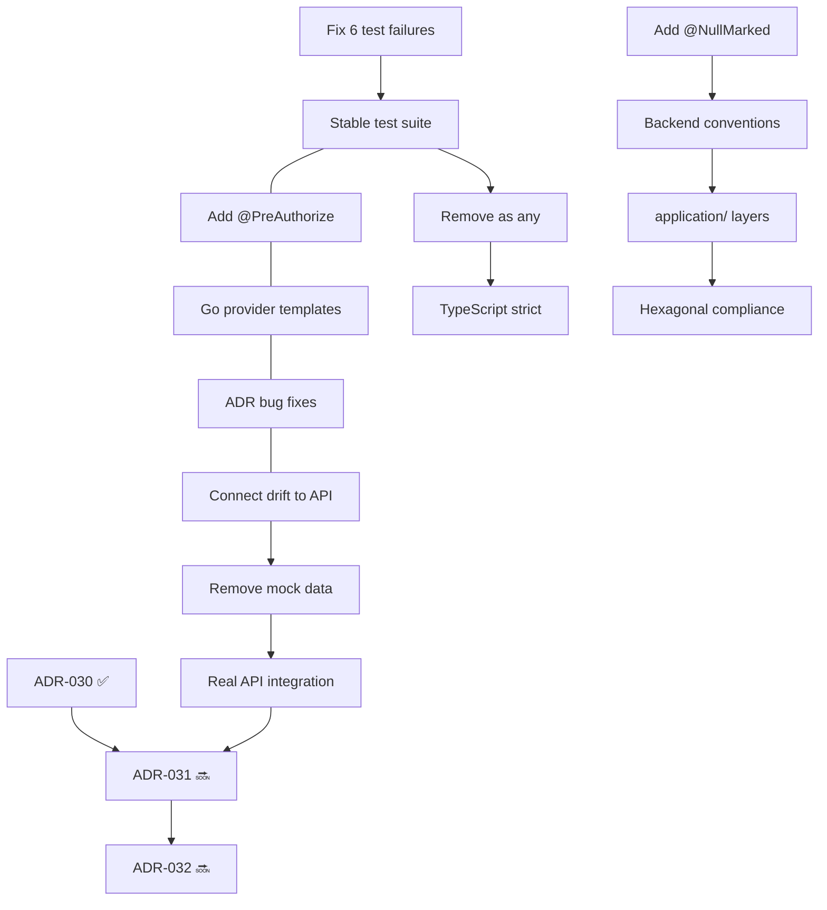

# Production Readiness Review — Coordination Summary

**Date**: 2026-06-23  
**Author**: CTO Agent (Tech Lead)  
**Version**: 1.0  
**Status**: 🟡 **YELLOW** — Conditional Pass with Blockers

---

## 1. Overall Readiness Assessment

| Domain | Status | Notes |
|--------|--------|-------|
| **Frontend** | 🟢 GREEN | 0 TS errors, Vite build 7.53s, 73/73 Vitest, 6/6 Playwright |
| **Backend** | 🟡 YELLOW | 473/479 tests (6 pre-existing failures), compile OK |
| **Go Engine** | 🟡 YELLOW | 23/23 tests pass, but only AWS provider templates exist |
| **Infrastructure** | 🟢 GREEN | Docker compose 3 services with health checks + resource limits |
| **Security** | 🟡 YELLOW | 2 controllers missing @PreAuthorize, 5 known ADR bugs open |
| **Documentation** | 🟢 GREEN | 23 ADRs (008-030), architecture README, tech-debt.md |
| **Integration** | 🟡 YELLOW | Frontend-backend not connected for drift, region scan, or infra import |
| **Provider Completeness** | 🟡 YELLOW | Go engine AWS-only; Vercel/Supabase/Render frontend-only |

### Verdict: 🟡 **YELLOW** — Production deployable for internal/staging with explicit caveats. Not GA-ready until 6 blocking items are resolved.

---

## 2. Phase Output Summary

| Phase | Scope | Status | Key Deliverables |
|-------|-------|--------|-----------------|
| **Phase 4** | Nativization + Onboarding + Auto-Docs | ✅ Complete | 6 native replacements, 3 onboarding components, 13 backend doc files, DocsModule |
| **Phase 5a-c** | Backend Test Coverage | ✅ Complete | 479 JUnit tests (33 suites) + 62 Vitest + 5 Playwright |
| **Phase 5d** | UUID→String Migration | ✅ Complete | ~559 UUID refs migrated across 206 Java files, 0 compile errors |
| **Phase 6** | Q3 Operations (Cost + Audit + LLM + Catalog) | ✅ Complete | Anomaly/Projection/Budget services, LLM abstraction, version history |
| **Phase 7** | Q4 Intelligence (Sprint 15-16) | ✅ Complete | LLM abstraction, catalog version/publish, platform store |
| **ADR Audit** | ADR-008-030 Compliance | ✅ Complete | 9 bugs fixed, 5 still open, comprehensive audit report |
| **Infra Cleanup** | $0 Infrastructure | ✅ Complete | Removed Kafka/Redis/OTel/Prometheus/Grafana, Caffeine cache, 3-service compose |
| **Go Engine** | Existing | ⚠️ Partial | AWS-only provider templates, no Vercel/Supabase/Render |

---

## 3. 🔴 Blocking Items (Must Fix Before Any Production Deploy)

| # | Item | Owner | Est. Effort | Gate |
|---|------|-------|-------------|------|
| **B1** | Fix 6 pre-existing JUnit test failures | Backend Agent | 3h | Test suite must be 100% green |
| **B2** | Add @PreAuthorize to AnalyticsController | Backend Agent | 15min | Security baseline |
| **B3** | Add @PreAuthorize to SearchController | Backend Agent | 15min | Security baseline |
| **B4** | Go engine: Add Vercel/Supabase/Render provider templates | Cloud Native Agent | 4h | Provider completeness for frontend-backend parity |
| **B5** | Fix 5 open bugs from ADR audit (H1, C9, M2, M6, M7) | Backend Agent | 2.5h | ADR compliance |
| **B6** | Connect drift detection to backend API | Frontend + Backend Agents | 4h | Remove mock data; use real DriftDetectionService |

### Total Blocking Effort: ~14 hours

---

## 4. 🟡 Non-Blocking Items (Should Fix Before GA)

| # | Item | Owner | Effort | Target |
|---|------|-------|--------|--------|
| **N1** | Remove 9 `as any` instances from frontend | Frontend Agent | 1h | Next sprint |
| **N2** | Add `package-info.java` with `@NullMarked` to all modules | Backend Agent | 3h | Next sprint |
| **N3** | Remove mock data from driftStore (persist + simulateDriftDetection) | Frontend Agent | 1h | Per TD-09 |
| **N4** | Remove mockRegions from ObserveModule | Frontend Agent | 30min | Per TD-10 |
| **N5** | Remove providerMockData from ImportInfraDialog | Frontend Agent | 2h | Per TD-11 |
| **N6** | Add application/ layer to analytics + search modules | Backend Agent | 1h | Hexagonal compliance |
| **N7** | Connect hardcoded provider definitions to backend API | Fullstack | 4h | Per TD-08 |
| **N8** | Add Flyway migration for observability schema | Backend + DB Agents | 2h | Per TD-15 |
| **N9** | Add Azure/GCP/K8s provider templates to Go engine | Cloud Native Agent | 6h | Provider completeness |

---

## 5. ✅ Cross-Cutting Review Results

### 5.1 Backend Conventions

| Check | Result | Details |
|-------|--------|---------|
| Hexagonal architecture (domain/model/port/service + application/dto + infrastructure/web) | ⚠️ 13/15 modules pass | **analytics** missing `application/` layer. **search** missing `application/` layer. |
| `package-info.java` with `@NullMarked` | ❌ **0/16 modules** | Zero `package-info.java` files exist in the entire backend. Systematic gap. |
| REST conventions (`/api/v1/{module}`) | ✅ | All controllers use `/api/v1/` prefix correctly |
| `@PreAuthorize` on controllers | ⚠️ 14/16 modules pass | **AnalyticsController** missing. **SearchController** missing. |
| No Lombok | ✅ | No Lombok usage found across 200+ Java files |
### 5.2 Frontend Conventions

| Check | Result | Details |
|-------|--------|---------|
| Stores handle API errors gracefully | ✅ | All API-facing stores use try/catch, set `[]` not `undefined` on error |
| Stores don't `persist` API data | ✅ | `persist` used only for auth, UI state, onboarding, settings, tenant. Exception: driftStore persists mock data from simulateDriftDetection(). |
| All UI text in PT-BR | ✅ | All labels, error messages, tooltips, and UI strings in PT-BR |
| No `as any` or `@ts-ignore` in new files | ❌ **9 instances across 4 files** | canvasStore.ts:384, canvasExport.ts:78, collaborationManager.ts (6x), canvasStore.test.ts:268 |
| `lucide-react` icons | ✅ | All icons from lucide-react. No Material Icons. |
| `cn()` utility usage | ✅ | Conditional classes use `cn()` pattern consistently |

### 5.3 Frontend Store Review

| Store | Uses `persist` | API calls | Error handling | Mock data |
|-------|---------------|-----------|---------------|-----------|
| authStore | ✅ (JWT token) | login/register | ✅ error state | None |
| uiStore | ✅ (UI prefs) | None | N/A | None |
| canvasStore | ❌ | designApi | ✅ | None |
| costStore | ❌ | dashboardApi, costApi | ✅ err→[] | None |
| platformStore | ❌ | platformApi | ✅ err→empty | None |
| driftStore | ✅ (reports) | None in prod | N/A | ✅ simulateDriftDetection() |
| onboardingStore | ✅ (progress) | None | N/A | None |
| docsStore | ❌ | docs API | ✅ hardcoded fallback | Tree fallback |
| incidentStore | ❌ | aiopsApi | ✅ | None |
| Others | ❌ | Various | ✅ | None |

---

## 6. ADR-030 Approval Review

### ADR-030: Production Readiness & Platform Stabilization

| Criterion | Assessment |
|-----------|------------|
| **Status** | Proposed ✅ |
| **Context** | Comprehensive with 8 gaps documented |
| **Problem** | Well-formed with 8 sub-problems |
| **Alternatives** | 4 options compared (phased, big-bang, beta, internal-only) ✅ |
| **Decision** | Phased rollout with 8 concrete decisions ✅ |
| **Trade-offs** | 4 trade-offs explicitly discussed ✅ |
| **Consequences** | 11 consequences with files identified ✅ |
| **References** | Links to ADR-008, 025-029 + external docs ✅ |
| **Alignment** | ✅ Consistent with all existing ADRs and roadmap |
| **Completeness** | Covers reliability, data safety, observability, CI/CD, incident response, test stability, docs, security ✅ |

**Verdict**: ✅ **APPROVED** with 2 notes:
1. Update the 6 pre-existing test failures table to include the 2 undetermined root causes
2. Add specific owner assignments to Decision #6 (test fixes)

### ADR-031 / ADR-032

**Status**: 🔍 NOT FOUND — No files exist.  
**Guidance for Principal Architect**:
- Follow hexagonal architecture (3-layer structure)
- Add `package-info.java` with `@NullMarked`
- Add `@PreAuthorize` on all controller methods
- API endpoints follow `/api/v1/{module}` convention
- No `as any` or `@ts-ignore` in TypeScript
- Document at least 2 alternatives per decision
- List consequences with concrete files to create/modify

---

## 7. Dependencies Between Phases



---

## 8. Recommendations for Downstream Agents

| Agent | Action Item |
|-------|------------|
| **Principal Architect** | Create ADR-031 (provider completeness) + ADR-032 (mock migration plan). Follow checklist in section 6. |
| **Backend Agent** | Fix 6 test failures (B1). Add @PreAuthorize to 2 controllers (B2-B3). Fix 5 open ADR bugs (B5). |
| **Frontend Agent** | Remove 9 `as any` instances (N1). Remove mock data from 3 modules (N3-N5). |
| **Cloud Native Agent** | Add provider templates to Go engine — Azure/GCP/K8s then Vercel/Supabase/Render (B4, N9). |
| **Database Agent** | Add Flyway migration for observability schema (N8). |
| **DevOps Agent** | Implement CI/CD pipeline from ADR-030 decision #4. |
| **QA Agent** | Add integration tests for drift/region/import endpoints after B6. |

---

## 9. Current Quality Gates

| Gate | Current | Target | Status |
|------|---------|--------|--------|
| Backend compile | ✅ Clean | Clean | 🟢 |
| Backend tests | 473/479 | 479/479 | 🟡 |
| Frontend TypeScript | 0 errors | 0 errors | 🟢 |
| Frontend Vitest | 73/73 | 73/73 | 🟢 |
| Frontend Vite build | 7.53s | < 15s | 🟢 |
| E2E Playwright | 6/6 | 6/6 | 🟢 |
| Go engine test | 23/23 | 23/23 | 🟢 |
| Go engine build | ✅ Clean | Clean | 🟢 |
| ESLint | ✅ Clean | Clean | 🟢 |

---

## 10. References

| File | Purpose |
|------|---------|
| `docs/architecture/adr-030-production-readiness-stabilization.md` | Production readiness plan |
| `docs/architecture/adr-final-comprehensive-audit.md` | ADR compliance audit (5 open bugs) |
| `docs/tech-debt.md` | Tech debt catalog |
| `docs/architecture/adr-008-native-observability.md` | Observability architecture |
| `.opencode/memory/progress_memory.md` | Phase execution history |
| `.opencode/memory/decision_memory.md` | All architectural decisions |
| `AGENTS.md` | Project conventions and stack |

---

## 11. ADR Status Overview

```
ADR-008  📗 Implemented (audited, 4 bugs fixed)     ADR-020  📕 Not Implemented
ADR-009  📗 Implemented                                ADR-021  📄 Proposed
ADR-010  📗 Implemented                                ADR-022  📄 Proposed
ADR-011  📗 Implemented                                ADR-023  📄 Proposed
ADR-012  📗 Implemented                                ADR-024  📗 With bugs
ADR-013  📗 Implemented                                ADR-025  📗 With bugs
ADR-014  📗 Implemented                                ADR-026  📄 Proposed
ADR-015  📗 Implemented                                ADR-027  📄 Proposed
ADR-016  📗 Implemented                                ADR-028  📄 Proposed
ADR-017  📗 Implemented                                ADR-029  📄 Proposed
ADR-018  📗 Implemented                                ADR-030  📄 Proposed ✅ APPROVED
ADR-019  📗 Implemented                                ADR-031  🔜 Not yet created
                                                       ADR-032  🔜 Not yet created
```

*End of Production Readiness Review — Next step: Resolve Blocking Items (B1-B6), then re-evaluate for GREEN status.*
