# CloudBuilder Provision Engine — Enterprise Architecture

> **Version**: 2.0.0  
> **Status**: Proposed  
> **Author**: Staff Software Engineer (Architecture)  
> **Date**: 2026-07-15  
> **Stack**: Go 1.24 · PostgreSQL 16 · Redis 7 · Kafka 3.7 · gRPC · OTel

---

## Table of Contents

1. [Executive Summary](#1-executive-summary)
2. [High-Level Architecture](#2-high-level-architecture)
3. [Detailed Architecture](#3-detailed-architecture)
4. [Directory Structure](#4-directory-structure)
5. [Domain Model](#5-domain-model)
6. [Go Interfaces](#6-go-interfaces)
7. [Provisioning Flow](#7-provisioning-flow)
8. [Rollback Flow](#8-rollback-flow)
9. [Drift Detection Flow](#9-drift-detection-flow)
10. [Parallel Execution Flow](#10-parallel-execution-flow)
11. [C4 Diagrams](#11-c4-diagrams)
12. [Sequence Diagrams](#12-sequence-diagrams)
13. [Event Model](#13-event-model)
14. [Database Model](#14-database-model)
15. [Queue Model](#15-queue-model)
16. [gRPC Contracts](#16-grpc-contracts)
17. [REST/OpenAPI Contracts](#17-restopenapi-contracts)
18. [Security Architecture](#18-security-architecture)
19. [Observability Architecture](#19-observability-architecture)
20. [Testing Strategy](#20-testing-strategy)
21. [Scalability Strategy](#21-scalability-strategy)
22. [Multi-Tenant Strategy](#22-multi-tenant-strategy)
23. [High Availability Strategy](#23-high-availability-strategy)
24. [Failover Strategy](#24-failover-strategy)
25. [Plugin Architecture](#25-plugin-architecture)
26. [Implementation Roadmap](#26-implementation-roadmap)

---

## 1. Executive Summary

The CloudBuilder Provision Engine is a **stateful, event-driven workflow engine** responsible for executing infrastructure provisioning across multiple cloud providers and IaC tools. It is the execution backbone — the AI layer generates the plan, the engine executes it.

### Design Principles

| Principle | Implementation |
|-----------|---------------|
| **Clean Architecture** | Domain core has zero external dependencies; infrastructure is injected via interfaces |
| **DDD** | Bounded contexts: Deployment, Workflow, Execution, Resource, State, Provider |
| **Hexagonal** | Core domain surrounded by adapters (PostgreSQL, Redis, Kafka, gRPC, REST) |
| **SOLID** | Single responsibility per package; open for extension via plugins |
| **Event-Driven** | Kafka backbone; every state transition emits a domain event |
| **CQRS** | Command path (writes) separated from Query path (reads) for deployments |
| **Plugin Architecture** | Providers, executors, hooks, policies, and resources are all pluggable |

### Capacity Targets

| Metric | Target |
|--------|--------|
| Concurrent deployments | 10,000+ |
| Resources under management | 1,000,000+ |
| Event throughput | 100,000 events/sec |
| Deployment latency (p99) | < 30s for plan, < 5min for apply |
| Availability | 99.99% (4 nines) |
| Recovery Time Objective | < 60 seconds |
| Recovery Point Objective | 0 (event-sourced state) |

---

## 2. High-Level Architecture


```mermaid
graph TB
    subgraph "Entry Points"
        REST[REST API<br/>:8080]
        GRPC[gRPC API<br/>:50051]
        WEBHOOK[Webhook Server<br/>:8081]
        CLI[CLI Gateway]
    end

    subgraph "API Layer"
        GW[API Gateway<br/>Auth • RBAC • Rate Limit • Validation]
    end

    subgraph "Core Engine"
        ORCH[Workflow Orchestrator]
        PLAN[Planner<br/>Dependency Graph • Resource Graph • Execution Graph]
        SCHED[Scheduler<br/>Priority Queue • Retry Queue • DLQ]
        POOL[Worker Pool<br/>N workers with backpressure]
    end

    subgraph "Executors"
        TF[Terraform]
        PU[Pulumi]
        HELM[Helm]
        DOCKER[Docker]
        K8S[Kubernetes]
        CF[CloudFormation]
        CP[Crossplane]
        ANSIBLE[Ansible]
        SCRIPT[Custom Scripts]
    end

    subgraph "Providers"
        AWS[AWS]
        AZ[Azure]
        GCP[GCP]
        OCI[Oracle]
        HETZNER[Hetzner]
        DO[DigitalOcean]
        CF2[Cloudflare]
        GH[GitHub]
        GL[GitLab]
        VERCEL[Vercel]
        RAILWAY[Railway]
        SUPABASE[Supabase]
    end

    subgraph "State Management"
        DESIRED[Desired State]
        CURRENT[Current State]
        DIFF[Diff Engine]
        DRIFT[Drift Detection]
        ROLLBACK[Rollback Manager]
        SNAP[Snapshot Manager]
        VER[Version Manager]
    end

    subgraph "Infrastructure"
        PG[(PostgreSQL)]
        REDIS[(Redis)]
        KAFKA[Kafka]
        MINIO[(MinIO)]
        VAULT[(Vault)]
    end

    subgraph "Observability"
        OTEL[OpenTelemetry]
        PROM[Prometheus]
        GRAF[Grafana]
        LOKI[Loki]
        TEMPO[Tempo]
    end

    subgraph "Security"
        OPA[OPA]
        IAM[IAM]
        RBAC2[RBAC]
        AUDIT[Audit]
        PM[Policy Engine]
    end

    REST --> GW
    GRPC --> GW
    WEBHOOK --> GW
    CLI --> GW
    GW --> ORCH
    ORCH --> PLAN
    PLAN --> SCHED
    SCHED --> POOL
    POOL --> TF & PU & HELM & DOCKER & K8S & CF & CP & ANSIBLE & SCRIPT
    TF & PU & HELM & DOCKER & K8S & CF & CP & ANSIBLE & SCRIPT --> AWS & AZ & GCP & OCI & HETZNER & DO & CF2 & GH & GL & VERCEL & RAILWAY & SUPABASE
    ORCH --> DESIRED & CURRENT
    DIFF --> DRIFT
    DRIFT --> ROLLBACK
    ORCH --> KAFKA
    KAFKA --> PG & REDIS
    ORCH --> OTEL
    GW --> OPA & IAM & RBAC2 & AUDIT & PM
```

---

## 3. Detailed Architecture

### 3.1 Layer Architecture

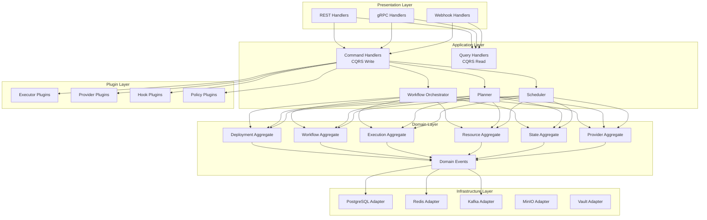
```mermaid
graph TB
    subgraph "Presentation Layer"
        REST2[REST Handlers]
        GRPC2[gRPC Handlers]
        WEBHOOK2[Webhook Handlers]
    end

    subgraph "Application Layer"
        CMD[Command Handlers<br/>CQRS Write]
        QUERY[Query Handlers<br/>CQRS Read]
        ORCH2[Workflow Orchestrator]
        PLAN2[Planner]
        SCHED2[Scheduler]
    end

    subgraph "Domain Layer"
        DEPLOY[Deployment Aggregate]
        WORKFLOW[Workflow Aggregate]
        EXEC[Execution Aggregate]
        RES[Resource Aggregate]
        STATE2[State Aggregate]
        PROV[Provider Aggregate]
        EVENTS[Domain Events]
    end

    subgraph "Infrastructure Layer"
        PG2[PostgreSQL Adapter]
        REDIS2[Redis Adapter]
        KAFKA2[Kafka Adapter]
        MINIO2[MinIO Adapter]
        VAULT2[Vault Adapter]
    end

    subgraph "Plugin Layer"
        EP[Executor Plugins]
        PP[Provider Plugins]
        HP[Hook Plugins]
        POL[Policy Plugins]
    end

    REST2 & GRPC2 & WEBHOOK2 --> CMD & QUERY
    CMD --> ORCH2 & PLAN2 & SCHED2
    ORCH2 & PLAN2 & SCHED2 --> DEPLOY & WORKFLOW & EXEC & RES & STATE2 & PROV
    DEPLOY & WORKFLOW & EXEC & RES & STATE2 & PROV --> EVENTS
    EVENTS --> PG2 & REDIS2 & KAFKA2
    CMD --> EP & PP & HP & POL
```

### 3.2 Bounded Contexts

| Context | Aggregate Root | Value Objects | Domain Events |
|---------|---------------|---------------|---------------|
| **Deployment** | `Deployment` | `DeploymentStatus`, `DeploymentConfig`, `Approval` | `DeploymentCreated`, `DeploymentApproved`, `DeploymentCompleted`, `DeploymentFailed` |
| **Workflow** | `Workflow` | `WorkflowStep`, `StepStatus`, `StepResult` | `WorkflowStarted`, `StepCompleted`, `WorkflowCompleted` |
| **Execution** | `Execution` | `ExecutionPlan`, `ExecutionResult`, `ExecutionLog` | `ExecutionStarted`, `ExecutionProgress`, `ExecutionCompleted` |
| **Resource** | `ManagedResource` | `ResourceType`, `ResourceState`, `ResourceConfig` | `ResourceCreated`, `ResourceUpdated`, `ResourceDeleted`, `ResourceDrifted` |
| **State** | `StateStore` | `DesiredState`, `CurrentState`, `StateDiff` | `StateChanged`, `DriftDetected`, `StateSynchronized` |
| **Provider** | `Provider` | `ProviderConfig`, `ProviderCapability`, `ProviderAuth` | `ProviderRegistered`, `ProviderHealthChanged` |

---

## 4. Directory Structure

```
provision-engine/
├── cmd/
│   ├── api/                    # REST + gRPC server entry point
│   │   └── main.go
│   ├── worker/                 # Worker pool entry point
│   │   └── main.go
│   ├── scheduler/              # Scheduler entry point
│   │   └── main.go
│   └── migration/              # Database migration tool
│       └── main.go
│
├── internal/
│   ├── api/                    # Presentation layer
│   │   ├── rest/               # HTTP handlers (chi router)
│   │   │   ├── handler.go
│   │   │   ├── middleware.go
│   │   │   ├── deployment.go
│   │   │   ├── workflow.go
│   │   │   ├── execution.go
│   │   │   ├── resource.go
│   │   │   ├── state.go
│   │   │   ├── provider.go
│   │   │   ├── audit.go
│   │   │   └── health.go
│   │   ├── grpc/               # gRPC handlers
│   │   │   ├── server.go
│   │   │   ├── deployment.go
│   │   │   ├── execution.go
│   │   │   ├── resource.go
│   │   │   └── stream.go
│   │   ├── webhook/            # Webhook handlers
│   │   │   ├── handler.go
│   │   │   ├── github.go
│   │   │   └── gitlab.go
│   │   └── graphql/            # GraphQL (optional future)
│   │       └── schema.go
│   │
│   ├── domain/                 # Domain layer (pure, no deps)
│   │   ├── deployment/
│   │   │   ├── aggregate.go        # Deployment aggregate root
│   │   │   ├── entity.go           # Deployment, DeploymentStep
│   │   │   ├── value_object.go     # DeploymentStatus, DeploymentConfig
│   │   │   ├── event.go            # Domain events
│   │   │   ├── repository.go       # Repository interfaces (ports)
│   │   │   └── service.go          # Domain services
│   │   ├── workflow/
│   │   │   ├── aggregate.go
│   │   │   ├── entity.go           # Workflow, WorkflowStep, StepDependency
│   │   │   ├── value_object.go
│   │   │   ├── event.go
│   │   │   ├── repository.go
│   │   │   └── service.go
│   │   ├── execution/
│   │   │   ├── aggregate.go
│   │   │   ├── entity.go           # Execution, ExecutionPlan, ExecutionLog
│   │   │   ├── value_object.go
│   │   │   ├── event.go
│   │   │   ├── repository.go
│   │   │   └── service.go
│   │   ├── resource/
│   │   │   ├── aggregate.go
│   │   │   ├── entity.go           # ManagedResource, ResourceRelation
│   │   │   ├── value_object.go     # ResourceType, ResourceState
│   │   │   ├── event.go
│   │   │   ├── repository.go
│   │   │   └── service.go
│   │   ├── state/
│   │   │   ├── aggregate.go
│   │   │   ├── entity.go           # StateEntry, StateVersion, StateDiff
│   │   │   ├── value_object.go
│   │   │   ├── event.go
│   │   │   ├── repository.go
│   │   │   └── service.go
│   │   ├── provider/
│   │   │   ├── aggregate.go
│   │   │   ├── entity.go           # Provider, ProviderConfig
│   │   │   ├── value_object.go
│   │   │   ├── event.go
│   │   │   ├── repository.go
│   │   │   └── service.go
│   │   ├── shared/                # Shared kernel
│   │   │   ├── aggregate_root.go
│   │   │   ├── entity_base.go
│   │   │   ├── value_object.go
│   │   │   ├── domain_event.go
│   │   │   ├── error.go
│   │   │   └── id.go
│   │   └── plugin/
│   │       ├── executor.go        # Executor plugin interface
│   │       ├── provider.go        # Provider plugin interface
│   │       ├── hook.go            # Hook plugin interface
│   │       ├── policy.go          # Policy plugin interface
│   │       └── registry.go        # Plugin registry
│   │
│   ├── application/            # Application layer (use cases)
│   │   ├── command/            # CQRS command handlers
│   │   │   ├── create_deployment.go
│   │   │   ├── approve_deployment.go
│   │   │   ├── cancel_deployment.go
│   │   │   ├── execute_workflow.go
│   │   │   ├── rollback_deployment.go
│   │   │   ├── import_resource.go
│   │   │   ├── destroy_resource.go
│   │   │   └── refresh_state.go
│   │   ├── query/              # CQRS query handlers
│   │   │   ├── get_deployment.go
│   │   │   ├── list_deployments.go
│   │   │   ├── get_execution.go
│   │   │   ├── get_resource.go
│   │   │   ├── list_resources.go
│   │   │   ├── get_state.go
│   │   │   └── get_audit_log.go
│   │   ├── planner/            # Plan generation
│   │   │   ├── planner.go
│   │   │   ├── dependency_graph.go
│   │   │   ├── resource_graph.go
│   │   │   ├── execution_graph.go
│   │   │   └── plan_generator.go
│   │   ├── orchestrator/       # Workflow orchestration
│   │   │   ├── orchestrator.go
│   │   │   ├── step_executor.go
│   │   │   ├── parallel_executor.go
│   │   │   └── compensation.go
│   │   ├── executor/           # Resource execution
│   │   │   ├── executor_pool.go
│   │   │   ├── worker.go
│   │   │   ├── task_dispatcher.go
│   │   │   └── result_collector.go
│   │   ├── scheduler/          # Job scheduling
│   │   │   ├── scheduler.go
│   │   │   ├── priority_queue.go
│   │   │   ├── retry_queue.go
│   │   │   ├── delayed_queue.go
│   │   │   └── dead_letter.go
│   │   ├── rollback/           # Rollback management
│   │   │   ├── rollback_manager.go
│   │   │   ├── snapshot_manager.go
│   │   │   └── version_manager.go
│   │   ├── drift/              # Drift detection
│   │   │   ├── drift_detector.go
│   │   │   ├── diff_engine.go
│   │   │   └── reconciliation.go
│   │   ├── events/             # Event processing
│   │   │   ├── event_handler.go
│   │   │   ├── event_publisher.go
│   │   │   ├── event_subscriber.go
│   │   │   └── event_store.go
│   │   └── security/           # Security use cases
│   │       ├── auth.go
│   │       ├── authorization.go
│   │       ├── policy.go
│   │       └── audit.go
│   │
│   ├── infrastructure/         # Infrastructure adapters
│   │   ├── persistence/
│   │   │   ├── postgres/
│   │   │   │   ├── db.go              # Connection pool
│   │   │   │   ├── migration.go       # Schema migrations
│   │   │   │   ├── deployment_repo.go
│   │   │   │   ├── workflow_repo.go
│   │   │   │   ├── execution_repo.go
│   │   │   │   ├── resource_repo.go
│   │   │   │   ├── state_repo.go
│   │   │   │   ├── provider_repo.go
│   │   │   │   ├── audit_repo.go
│   │   │   │   └── event_store_repo.go
│   │   │   ├── redis/
│   │   │   │   ├── client.go
│   │   │   │   ├── cache.go
│   │   │   │   ├── lock.go           # Distributed locks
│   │   │   │   ├── pubsub.go
│   │   │   │   └── session.go
│   │   │   └── minio/
│   │   │       ├── client.go
│   │   │       ├── snapshot_store.go
│   │   │       └── artifact_store.go
│   │   ├── messaging/
│   │   │   ├── kafka/
│   │   │   │   ├── producer.go
│   │   │   │   ├── consumer.go
│   │   │   │   ├── topic_router.go
│   │   │   │   └── schema_registry.go
│   │   │   ├── nats/
│   │   │   │   ├── publisher.go
│   │   │   │   └── subscriber.go
│   │   │   └── rabbitmq/
│   │   │       ├── publisher.go
│   │   │       └── consumer.go
│   │   ├── executor/               # Executor implementations
│   │   │   ├── terraform/
│   │   │   │   ├── executor.go
│   │   │   │   ├── parser.go
│   │   │   │   └── state.go
│   │   │   ├── pulumi/
│   │   │   │   └── executor.go
│   │   │   ├── helm/
│   │   │   │   └── executor.go
│   │   │   ├── docker/
│   │   │   │   └── executor.go
│   │   │   ├── kubernetes/
│   │   │   │   └── executor.go
│   │   │   ├── cloudformation/
│   │   │   │   └── executor.go
│   │   │   ├── crossplane/
│   │   │   │   └── executor.go
│   │   │   ├── ansible/
│   │   │   │   └── executor.go
│   │   │   └── script/
│   │   │       └── executor.go
│   │   ├── provider/               # Provider implementations
│   │   │   ├── aws/
│   │   │   │   ├── provider.go
│   │   │   │   ├── auth.go
│   │   │   │   ├── resources.go
│   │   │   │   └── pricing.go
│   │   │   ├── azure/
│   │   │   │   └── provider.go
│   │   │   ├── gcp/
│   │   │   │   └── provider.go
│   │   │   ├── oracle/
│   │   │   │   └── provider.go
│   │   │   ├── hetzner/
│   │   │   │   └── provider.go
│   │   │   ├── digitalocean/
│   │   │   │   └── provider.go
│   │   │   ├── cloudflare/
│   │   │   │   └── provider.go
│   │   │   ├── github/
│   │   │   │   └── provider.go
│   │   │   ├── gitlab/
│   │   │   │   └── provider.go
│   │   │   ├── vercel/
│   │   │   │   └── provider.go
│   │   │   ├── railway/
│   │   │   │   └── provider.go
│   │   │   └── supabase/
│   │   │       └── provider.go
│   │   ├── security/
│   │   │   ├── vault/
│   │   │   │   ├── client.go
│   │   │   │   └── secrets.go
│   │   │   ├── opa/
│   │   │   │   ├── client.go
│   │   │   │   └── evaluator.go
│   │   │   └── jwt/
│   │   │       └── provider.go
│   │   ├── observability/
│   │   │   ├── otel.go             # OpenTelemetry setup
│   │   │   ├── metrics.go          # Prometheus metrics
│   │   │   ├── tracing.go          # Distributed tracing
│   │   │   └── logging.go          # Structured logging
│   │   └── config/
│   │       └── config.go           # Configuration loader
│   │
│   └── plugins/                # Plugin system
│       ├── loader.go               # Plugin loader
│       ├── registry.go             # Plugin registry
│       ├── sandbox.go              # Plugin sandbox (optional WASM)
│       └── sdk/                    # SDK for plugin authors
│           ├── executor_sdk.go
│           ├── provider_sdk.go
│           ├── hook_sdk.go
│           └── policy_sdk.go
│
├── pkg/                        # Public API (importable)
│   ├── types/                  # Shared types
│   │   ├── deployment.go
│   │   ├── resource.go
│   │   ├── state.go
│   │   └── events.go
│   └── sdk/                    # SDK for external plugins
│       ├── executor.go
│       ├── provider.go
│       └── hook.go
│
├── proto/                      # gRPC/Protobuf definitions
│   ├── provision/
│   │   ├── v1/
│   │   │   ├── provision.proto
│   │   │   ├── deployment.proto
│   │   │   ├── execution.proto
│   │   │   ├── resource.proto
│   │   │   └── state.proto
│   │   └── buf.yaml
│   └── events/
│       └── v1/
│           └── events.proto
│
├── configs/                    # Configuration files
│   ├── config.yaml
│   ├── config.dev.yaml
│   ├── config.staging.yaml
│   ├── config.prod.yaml
│   └── policies/
│       ├── cost.rego
│       ├── security.rego
│       └── governance.rego
│
├── deployments/                # Deployment configurations
│   ├── docker/
│   │   └── Dockerfile
│   ├── kubernetes/
│   │   ├── base/
│   │   └── overlays/
│   └── helm/
│       └── provision-engine/
│
├── migrations/                 # Database migrations
│   ├── 001_initial_schema.up.sql
│   ├── 001_initial_schema.down.sql
│   └── ...
│
├── docs/                       # Documentation
│   ├── api/
│   │   └── openapi.yaml
│   ├── architecture/
│   └── adr/
│
├── test/                       # Test infrastructure
│   ├── integration/
│   ├── e2e/
│   ├── performance/
│   └── fixtures/
│
├── tools/                      # Development tools
│   ├── buf/
│   └── go generate/
│
├── .github/
│   └── workflows/
│       ├── ci.yml
│       ├── release.yml
│       └── plugin-ci.yml
│
├── go.mod
├── go.sum
├── Makefile
├── .golangci.yml
├── .goreleaser.yml
└── README.md
```

---

## 5. Domain Model

### 5.1 Aggregate Diagram

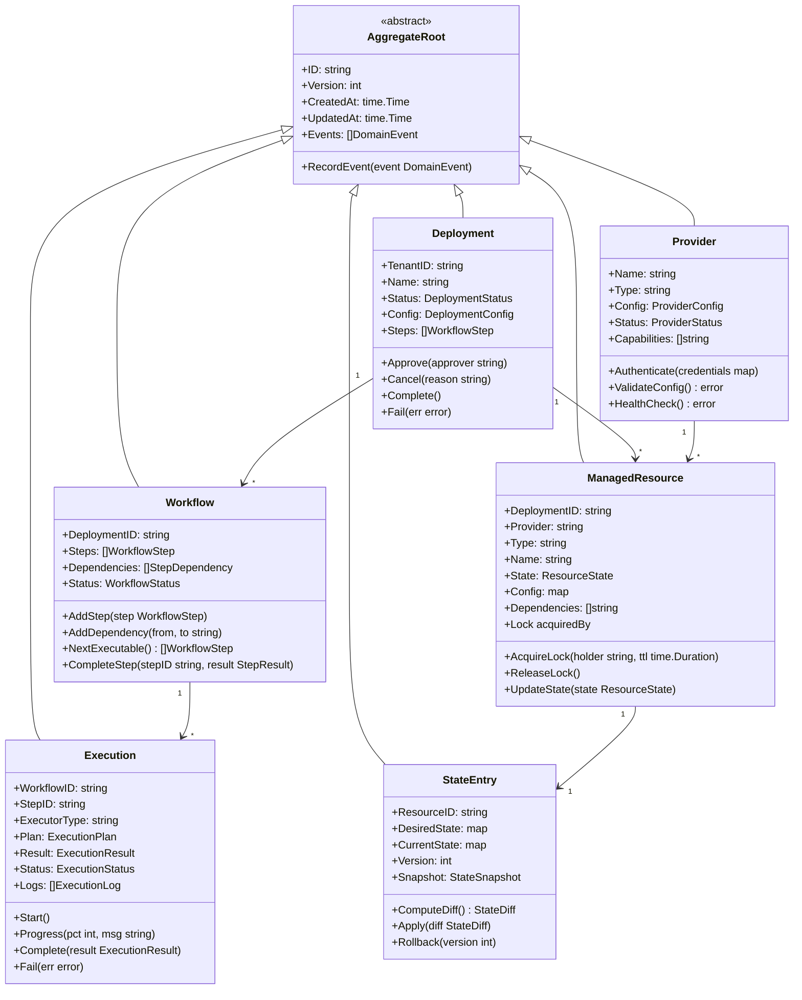
```mermaid
classDiagram
    class AggregateRoot {
        <<abstract>>
        +ID: string
        +Version: int
        +CreatedAt: time.Time
        +UpdatedAt: time.Time
        +Events: []DomainEvent
        +RecordEvent(event DomainEvent)
    }

    class Deployment {
        +TenantID: string
        +Name: string
        +Status: DeploymentStatus
        +Config: DeploymentConfig
        +Steps: []WorkflowStep
        +Approve(approver string)
        +Cancel(reason string)
        +Complete()
        +Fail(err error)
    }

    class Workflow {
        +DeploymentID: string
        +Steps: []WorkflowStep
        +Dependencies: []StepDependency
        +Status: WorkflowStatus
        +AddStep(step WorkflowStep)
        +AddDependency(from, to string)
        +NextExecutable() []WorkflowStep
        +CompleteStep(stepID string, result StepResult)
    }

    class Execution {
        +WorkflowID: string
        +StepID: string
        +ExecutorType: string
        +Plan: ExecutionPlan
        +Result: ExecutionResult
        +Status: ExecutionStatus
        +Logs: []ExecutionLog
        +Start()
        +Progress(pct int, msg string)
        +Complete(result ExecutionResult)
        +Fail(err error)
    }

    class ManagedResource {
        +DeploymentID: string
        +Provider: string
        +Type: string
        +Name: string
        +State: ResourceState
        +Config: map
        +Dependencies: []string
        +Lock acquiredBy
        +AcquireLock(holder string, ttl time.Duration)
        +ReleaseLock()
        +UpdateState(state ResourceState)
    }

    class StateEntry {
        +ResourceID: string
        +DesiredState: map
        +CurrentState: map
        +Version: int
        +Snapshot: StateSnapshot
        +ComputeDiff() StateDiff
        +Apply(diff StateDiff)
        +Rollback(version int)
    }

    class Provider {
        +Name: string
        +Type: string
        +Config: ProviderConfig
        +Status: ProviderStatus
        +Capabilities: []string
        +Authenticate(credentials map)
        +ValidateConfig() error
        +HealthCheck() error
    }

    AggregateRoot <|-- Deployment
    AggregateRoot <|-- Workflow
    AggregateRoot <|-- Execution
    AggregateRoot <|-- ManagedResource
    AggregateRoot <|-- StateEntry
    AggregateRoot <|-- Provider

    Deployment "1" --> "*" Workflow
    Workflow "1" --> "*" Execution
    Deployment "1" --> "*" ManagedResource
    ManagedResource "1" --> "1" StateEntry
    Provider "1" --> "*" ManagedResource
```

### 5.2 State Machine — Deployment Lifecycle

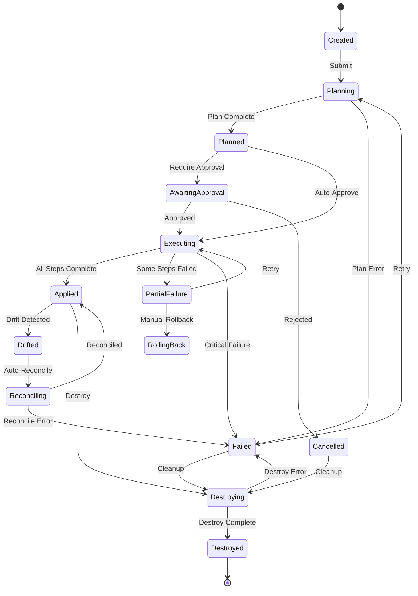
```mermaid
stateDiagram-v2
    [*] --> Created
    Created --> Planning : Submit
    Planning --> Planned : Plan Complete
    Planning --> Failed : Plan Error
    Planned --> AwaitingApproval : Require Approval
    Planned --> Executing : Auto-Approve
    AwaitingApproval --> Executing : Approved
    AwaitingApproval --> Cancelled : Rejected
    Executing --> Applied : All Steps Complete
    Executing --> PartialFailure : Some Steps Failed
    Executing --> Failed : Critical Failure
    PartialFailure --> Executing : Retry
    PartialFailure --> RollingBack : Manual Rollback
    Applied --> Drifted : Drift Detected
    Applied --> Destroying : Destroy
    Drifted --> Reconciling : Auto-Reconcile
    Reconciling --> Applied : Reconciled
    Reconciling --> Failed : Reconcile Error
    Failed --> Planning : Retry
    Failed --> Destroying : Cleanup
    Destroying --> Destroyed : Destroy Complete
    Destroying --> Failed : Destroy Error
    Cancelled --> Destroying : Cleanup
    Destroyed --> [*]
```

### 5.3 State Machine — Resource Lifecycle

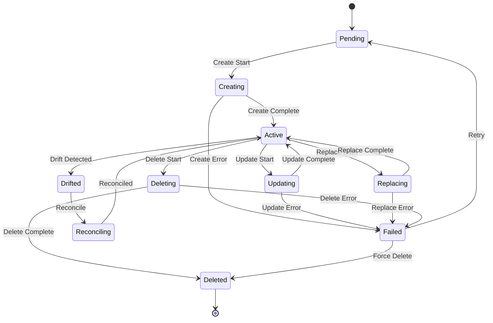
```mermaid
stateDiagram-v2
    [*] --> Pending
    Pending --> Creating : Create Start
    Creating --> Active : Create Complete
    Creating --> Failed : Create Error
    Active --> Updating : Update Start
    Updating --> Active : Update Complete
    Updating --> Failed : Update Error
    Active --> Replacing : Replace Start
    Replacing --> Active : Replace Complete
    Replacing --> Failed : Replace Error
    Active --> Deleting : Delete Start
    Deleting --> Deleted : Delete Complete
    Deleting --> Failed : Delete Error
    Active --> Drifted : Drift Detected
    Drifted --> Reconciling : Reconcile
    Reconciling --> Active : Reconciled
    Failed --> Pending : Retry
    Failed --> Deleted : Force Delete
    Deleted --> [*]
```

---

## 6. Go Interfaces

### 6.1 Core Domain Interfaces

```go
// ─── Shared Kernel ──────────────────────────────────────────────────────

package domain

import "time"

// AggregateRoot is the base for all aggregates.
type AggregateRoot struct {
    ID        string        `json:"id"`
    Version   int           `json:"version"`
    CreatedAt time.Time     `json:"createdAt"`
    UpdatedAt time.Time     `json:"updatedAt"`
    events    []DomainEvent `json:"-"`
}

// DomainEvent represents a state change in the domain.
type DomainEvent interface {
    EventID() string
    EventType() string
    AggregateID() string
    AggregateType() string
    OccurredAt() time.Time
    Payload() interface{}
}

// ─── Executor Interface ─────────────────────────────────────────────────

package domain

import "context"

// ExecutorType identifies the IaC tool.
type ExecutorType string

const (
    ExecutorTerraform     ExecutorType = "terraform"
    ExecutorPulumi        ExecutorType = "pulumi"
    ExecutorHelm          ExecutorType = "helm"
    ExecutorDocker        ExecutorType = "docker"
    ExecutorKubernetes    ExecutorType = "kubernetes"
    ExecutorCloudFormation ExecutorType = "cloudformation"
    ExecutorCrossplane    ExecutorType = "crossplane"
    ExecutorAnsible       ExecutorType = "ansible"
    ExecutorScript        ExecutorType = "script"
)

// ExecutionPlan is the parsed plan before apply.
type ExecutionPlan struct {
    ResourcesToAdd    []PlannedResource
    ResourcesToUpdate []PlannedResource
    ResourcesToDelete []PlannedResource
    Warnings          []string
    EstimatedCost     *CostEstimate
}

// ExecutionResult is the outcome of an execution.
type ExecutionResult struct {
    Success     bool
    Resources   []ResourceResult
    Outputs     map[string]interface{}
    Duration    time.Duration
    PlanFileID  string   // reference to stored plan in MinIO
    Error       error
}

// ResourceResult is the result for a single resource.
type ResourceResult struct {
    Address  string
    Action   string // create, update, delete, no-op
    Status   string
    Message  string
    Duration time.Duration
}

// Executor is the interface all IaC executors must implement.
type Executor interface {
    // Type returns the executor type identifier.
    Type() ExecutorType

    // Init initializes the executor (e.g., terraform init).
    Init(ctx context.Context, workDir string, config map[string]string) error

    // Validate validates the configuration.
    Validate(ctx context.Context, workDir string) ([]ValidationError, error)

    // Plan generates an execution plan.
    Plan(ctx context.Context, workDir string, vars map[string]string) (*ExecutionPlan, error)

    // Apply executes the plan.
    Apply(ctx context.Context, workDir string, planID string) (*ExecutionResult, error)

    // Destroy destroys all managed resources.
    Destroy(ctx context.Context, workDir string) (*ExecutionResult, error)

    // Show returns the current state as JSON.
    Show(ctx context.Context, workDir string) (string, error)

    // Import imports an existing resource into state.
    Import(ctx context.Context, workDir string, addr, id string) error

    // Output returns the output values.
    Output(ctx context.Context, workDir string) (map[string]interface{}, error)

    // WorkspaceCreate creates a new workspace.
    WorkspaceCreate(ctx context.Context, workDir, name string) error

    // WorkspaceSelect selects a workspace.
    WorkspaceSelect(ctx context.Context, workDir, name string) error

    // WorkspaceDelete deletes a workspace.
    WorkspaceDelete(ctx context.Context, workDir, name string) error

    // Version returns the executor version.
    Version(ctx context.Context) (string, error)
}

// ─── Provider Interface ─────────────────────────────────────────────────

package domain

import "context"

// ProviderType identifies the cloud/SaaS provider.
type ProviderType string

const (
    ProviderAWS          ProviderType = "aws"
    ProviderAzure        ProviderType = "azure"
    ProviderGCP          ProviderType = "gcp"
    ProviderOracle       ProviderType = "oracle"
    ProviderHetzner      ProviderType = "hetzner"
    ProviderDigitalOcean ProviderType = "digitalocean"
    ProviderCloudflare   ProviderType = "cloudflare"
    ProviderGitHub       ProviderType = "github"
    ProviderGitLab       ProviderType = "gitlab"
    ProviderVercel       ProviderType = "vercel"
    ProviderRailway      ProviderType = "railway"
    ProviderSupabase     ProviderType = "supabase"
)

// ProviderAuth holds authentication credentials.
type ProviderAuth struct {
    Type       string            // api_key, oauth2, service_account
    Credentials map[string]string
    Expiry     *time.Time
}

// ProviderCapability describes what a provider can do.
type ProviderCapability string

const (
    CapProvision   ProviderCapability = "provision"
    CapDestroy     ProviderCapability = "destroy"
    CapImport      ProviderCapability = "import"
    CapList        ProviderCapability = "list"
    CapCost        ProviderCapability = "cost_estimate"
    CapDrift       ProviderCapability = "drift_detection"
)

// Provider is the interface all cloud/SaaS providers must implement.
type Provider interface {
    // Type returns the provider type.
    Type() ProviderType

    // Name returns the human-readable provider name.
    Name() string

    // Authenticate validates and stores credentials.
    Authenticate(ctx context.Context, auth ProviderAuth) error

    // Capabilities returns what this provider supports.
    Capabilities() []ProviderCapability

    // ValidateConfig validates provider configuration.
    ValidateConfig(config map[string]string) error

    // HealthCheck verifies the provider is accessible.
    HealthCheck(ctx context.Context) error

    // ListResources lists all resources of a given type.
    ListResources(ctx context.Context, resourceType string) ([]ResourceInfo, error)

    // GetResource returns details of a specific resource.
    GetResource(ctx context.Context, resourceType, resourceID string) (*ResourceInfo, error)

    // EstimateCost estimates the cost of a resource configuration.
    EstimateCost(ctx context.Context, resourceType string, config map[string]string) (*CostEstimate, error)

    // GetPricing returns pricing information for a resource type.
    GetPricing(ctx context.Context, resourceType string, region string) (*PricingInfo, error)
}

// ─── Hook Interface ─────────────────────────────────────────────────────

package domain

import "context"

// HookType determines when the hook fires.
type HookType string

const (
    HookPrePlan      HookType = "pre_plan"
    HookPostPlan     HookType = "post_plan"
    HookPreApply     HookType = "pre_apply"
    HookPostApply    HookType = "post_apply"
    HookPreDestroy   HookType = "pre_destroy"
    HookPostDestroy  HookType = "post_destroy"
    HookOnError      HookType = "on_error"
    HookOnRollback   HookType = "on_rollback"
)

// HookContext provides context to hook implementations.
type HookContext struct {
    DeploymentID string
    ResourceID   string
    ExecutorType ExecutorType
    ProviderType ProviderType
    Data         map[string]interface{}
}

// HookResult is the outcome of a hook execution.
type HookResult struct {
    Allowed bool
    Message string
    Data    map[string]interface{}
}

// Hook is the interface for lifecycle hooks.
type Hook interface {
    // Type returns when this hook fires.
    Type() HookType

    // Name returns the hook name.
    Name() string

    // Execute runs the hook.
    Execute(ctx context.Context, hookCtx HookContext) (*HookResult, error)
}

// ─── Policy Interface ───────────────────────────────────────────────────

package domain

import "context"

// PolicyDecision is the outcome of policy evaluation.
type PolicyDecision struct {
    Allowed  bool
    Message  string
    Violations []PolicyViolation
}

// PolicyViolation describes a policy violation.
type PolicyViolation struct {
    Rule      string
    Severity  string // critical, high, medium, low
    Message   string
    Resource  string
}

// Policy is the interface for OPA/custom policy evaluation.
type Policy interface {
    // Name returns the policy name.
    Name() string

    // Evaluate evaluates the policy against a deployment.
    Evaluate(ctx context.Context, deployment *Deployment, resources []*ManagedResource) (*PolicyDecision, error)

    // Validate validates the policy definition.
    Validate() error
}

// ─── Repository Interfaces (Ports) ──────────────────────────────────────

package domain

import "context"

// DeploymentRepository is the port for deployment persistence.
type DeploymentRepository interface {
    Create(ctx context.Context, deployment *Deployment) error
    GetByID(ctx context.Context, id string) (*Deployment, error)
    Update(ctx context.Context, deployment *Deployment) error
    Delete(ctx context.Context, id string) error
    List(ctx context.Context, tenantID string, filter DeploymentFilter) ([]*Deployment, int, error)
    GetByStatus(ctx context.Context, status DeploymentStatus) ([]*Deployment, error)
}

// WorkflowRepository is the port for workflow persistence.
type WorkflowRepository interface {
    Create(ctx context.Context, workflow *Workflow) error
    GetByID(ctx context.Context, id string) (*Workflow, error)
    Update(ctx context.Context, workflow *Workflow) error
    GetByDeploymentID(ctx context.Context, deploymentID string) (*Workflow, error)
}

// ExecutionRepository is the port for execution persistence.
type ExecutionRepository interface {
    Create(ctx context.Context, execution *Execution) error
    GetByID(ctx context.Context, id string) (*Execution, error)
    Update(ctx context.Context, execution *Execution) error
    ListByWorkflowID(ctx context.Context, workflowID string) ([]*Execution, error)
}

// ResourceRepository is the port for resource persistence.
type ResourceRepository interface {
    Create(ctx context.Context, resource *ManagedResource) error
    GetByID(ctx context.Context, id string) (*ManagedResource, error)
    Update(ctx context.Context, resource *ManagedResource) error
    Delete(ctx context.Context, id string) error
    ListByDeploymentID(ctx context.Context, deploymentID string) ([]*ManagedResource, error)
    ListByProvider(ctx context.Context, provider ProviderType) ([]*ManagedResource, error)
}

// StateRepository is the port for state persistence.
type StateRepository interface {
    Create(ctx context.Context, state *StateEntry) error
    GetByResourceID(ctx context.Context, resourceID string) (*StateEntry, error)
    Update(ctx context.Context, state *StateEntry) error
    GetVersion(ctx context.Context, resourceID string, version int) (*StateEntry, error)
    ListVersions(ctx context.Context, resourceID string) ([]StateVersion, error)
}

// EventStore is the port for event persistence.
type EventStore interface {
    Append(ctx context.Context, events ...DomainEvent) error
    GetByAggregateID(ctx context.Context, aggregateID string, afterVersion int) ([]DomainEvent, error)
    GetByType(ctx context.Context, eventType string, limit int) ([]DomainEvent, error)
}

// ─── Plugin Registry ────────────────────────────────────────────────────

package plugin

import "github.com/cloudbuilder/provision-engine/internal/domain"

// Registry manages plugin registration and lookup.
type Registry struct {
    executors map[domain.ExecutorType]domain.Executor
    providers map[domain.ProviderType]domain.Provider
    hooks     map[domain.HookType][]domain.Hook
    policies  []domain.Policy
}

// Register adds a plugin to the registry.
func (r *Registry) RegisterExecutor(e domain.Executor) { ... }
func (r *Registry) RegisterProvider(p domain.Provider) { ... }
func (r *Registry) RegisterHook(h domain.Hook) { ... }
func (r *Registry) RegisterPolicy(p domain.Policy) { ... }

// Lookup retrieves a plugin from the registry.
func (r *Registry) GetExecutor(t domain.ExecutorType) (domain.Executor, bool) { ... }
func (r *Registry) GetProvider(t domain.ProviderType) (domain.Provider, bool) { ... }
func (r *Registry) GetHooks(hookType domain.HookType) []domain.Hook { ... }
func (r *Registry) GetPolicies() []domain.Policy { ... }
```

---

## 7. Provisioning Flow

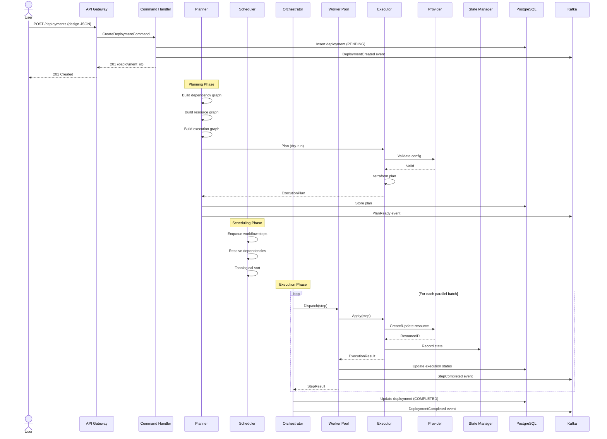
```mermaid
sequenceDiagram
    actor User
    participant API as API Gateway
    participant CMD as Command Handler
    participant PLANNER as Planner
    participant SCHED as Scheduler
    participant ORCH as Orchestrator
    participant WORKER as Worker Pool
    participant EXEC as Executor
    participant PROV as Provider
    participant STATE as State Manager
    participant DB as PostgreSQL
    participant KAFKA as Kafka

    User->>API: POST /deployments (design JSON)
    API->>CMD: CreateDeploymentCommand
    CMD->>DB: Insert deployment (PENDING)
    CMD->>KAFKA: DeploymentCreated event
    CMD-->>API: 201 {deployment_id}
    API-->>User: 201 Created

    Note over PLANNER: Planning Phase
    PLANNER->>PLANNER: Build dependency graph
    PLANNER->>PLANNER: Build resource graph
    PLANNER->>PLANNER: Build execution graph
    PLANNER->>EXEC: Plan (dry-run)
    EXEC->>PROV: Validate config
    PROV-->>EXEC: Valid
    EXEC->>EXEC: terraform plan
    EXEC-->>PLANNER: ExecutionPlan
    PLANNER->>DB: Store plan
    PLANNER->>KAFKA: PlanReady event

    Note over SCHED: Scheduling Phase
    SCHED->>SCHED: Enqueue workflow steps
    SCHED->>SCHED: Resolve dependencies
    SCHED->>SCHED: Topological sort

    Note over ORCH: Execution Phase
    loop For each parallel batch
        ORCH->>WORKER: Dispatch(step)
        WORKER->>EXEC: Apply(step)
        EXEC->>PROV: Create/Update resource
        PROV-->>EXEC: ResourceID
        EXEC->>STATE: Record state
        EXEC-->>WORKER: ExecutionResult
        WORKER->>DB: Update execution status
        WORKER->>KAFKA: StepCompleted event
        WORKER-->>ORCH: StepResult
    end

    ORCH->>DB: Update deployment (COMPLETED)
    ORCH->>KAFKA: DeploymentCompleted event
```

---

## 8. Rollback Flow

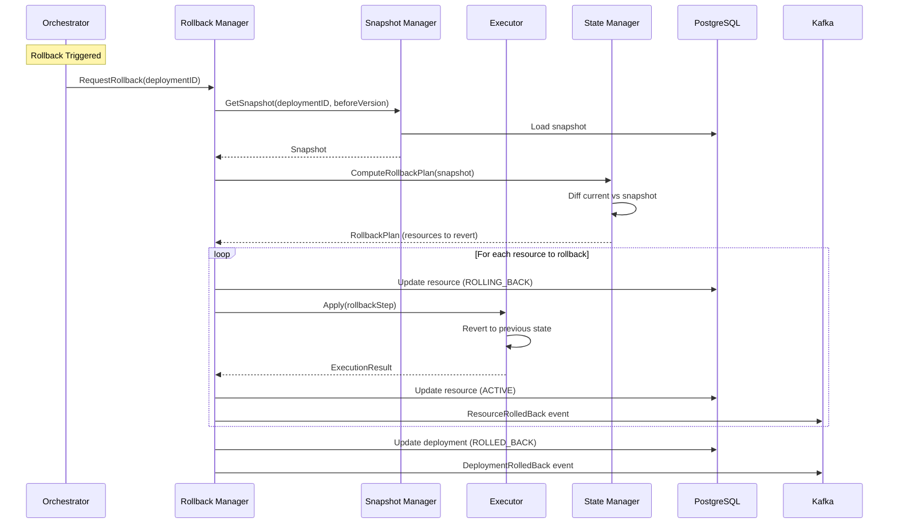
```mermaid
sequenceDiagram
    participant ORCH as Orchestrator
    participant RB as Rollback Manager
    participant SNAP as Snapshot Manager
    participant EXEC as Executor
    participant STATE as State Manager
    participant DB as PostgreSQL
    participant KAFKA as Kafka

    Note over ORCH: Rollback Triggered
    ORCH->>RB: RequestRollback(deploymentID)

    RB->>SNAP: GetSnapshot(deploymentID, beforeVersion)
    SNAP->>DB: Load snapshot
    SNAP-->>RB: Snapshot

    RB->>STATE: ComputeRollbackPlan(snapshot)
    STATE->>STATE: Diff current vs snapshot
    STATE-->>RB: RollbackPlan (resources to revert)

    loop For each resource to rollback
        RB->>DB: Update resource (ROLLING_BACK)
        RB->>EXEC: Apply(rollbackStep)
        EXEC->>EXEC: Revert to previous state
        EXEC-->>RB: ExecutionResult
        RB->>DB: Update resource (ACTIVE)
        RB->>KAFKA: ResourceRolledBack event
    end

    RB->>DB: Update deployment (ROLLED_BACK)
    RB->>KAFKA: DeploymentRolledBack event
```

---

## 9. Drift Detection Flow

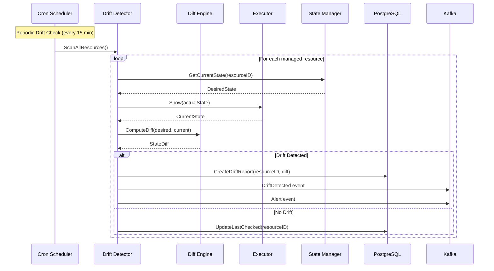
```mermaid
sequenceDiagram
    participant CRON as Cron Scheduler
    participant DD as Drift Detector
    participant DIFF as Diff Engine
    participant EXEC as Executor
    participant STATE as State Manager
    participant DB as PostgreSQL
    participant KAFKA as Kafka

    Note over CRON: Periodic Drift Check (every 15 min)
    CRON->>DD: ScanAllResources()

    loop For each managed resource
        DD->>STATE: GetCurrentState(resourceID)
        STATE-->>DD: DesiredState

        DD->>EXEC: Show(actualState)
        EXEC-->>DD: CurrentState

        DD->>DIFF: ComputeDiff(desired, current)
        DIFF-->>DD: StateDiff

        alt Drift Detected
            DD->>DB: CreateDriftReport(resourceID, diff)
            DD->>KAFKA: DriftDetected event
            DD->>KAFKA: Alert event
        else No Drift
            DD->>DB: UpdateLastChecked(resourceID)
        end
    end
```

---

## 10. Parallel Execution Flow

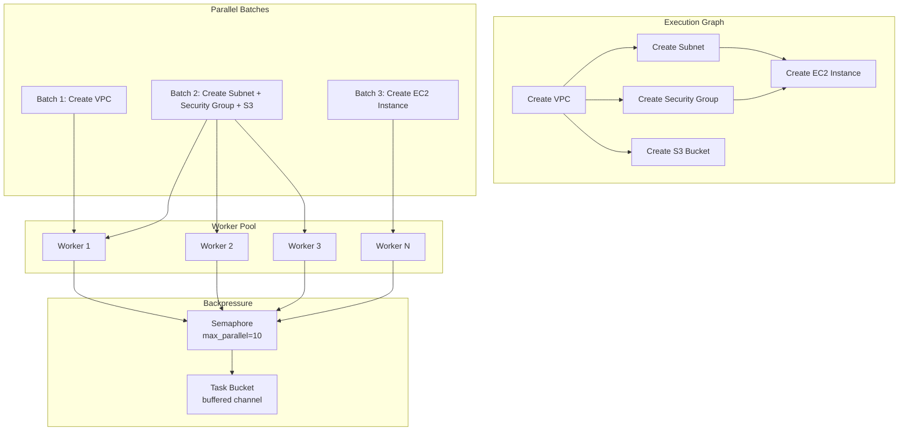
```mermaid
graph TB
    subgraph "Execution Graph"
        A[Create VPC] --> B[Create Subnet]
        A --> C[Create Security Group]
        B --> D[Create EC2 Instance]
        C --> D
        A --> E[Create S3 Bucket]
    end

    subgraph "Parallel Batches"
        B1["Batch 1: Create VPC"] 
        B2["Batch 2: Create Subnet + Security Group + S3"]
        B3["Batch 3: Create EC2 Instance"]
    end

    subgraph "Worker Pool"
        W1[Worker 1]
        W2[Worker 2]
        W3[Worker 3]
        W4[Worker N]
    end

    B1 --> W1
    B2 --> W1 & W2 & W3
    B3 --> W4

    subgraph "Backpressure"
        SEM[Semaphore<br/>max_parallel=10]
        BUCKET[Task Bucket<br/>buffered channel]
    end

    W1 & W2 & W3 & W4 --> SEM
    SEM --> BUCKET
```

**Parallel Execution Algorithm:**

1. Build dependency graph from workflow steps
2. Compute topological ordering
3. Group into parallel batches (steps with no inter-dependencies)
4. For each batch:
   a. Dispatch all steps to worker pool concurrently
   b. Wait for all steps in batch to complete
   c. If any step fails, decide: retry, skip, or abort
   d. Record results in execution log
   e. Move to next batch

---

## 11. C4 Diagrams

### 11.1 System Context (Level 1)

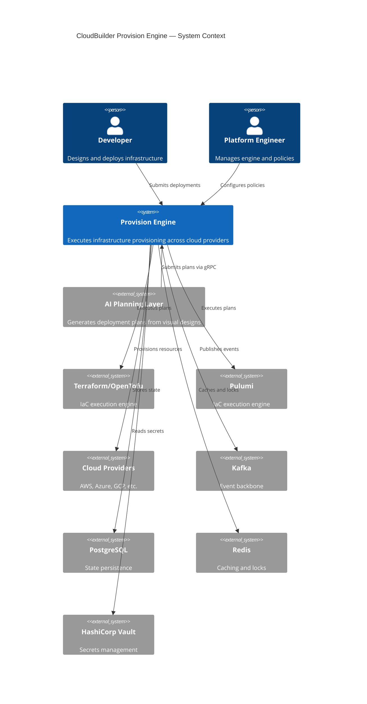
```mermaid
C4Context
    title CloudBuilder Provision Engine — System Context

    Person(developer, "Developer", "Designs and deploys infrastructure")
    Person(platform, "Platform Engineer", "Manages engine and policies")

    System(pe, "Provision Engine", "Executes infrastructure provisioning across cloud providers")

    System_Ext(ai, "AI Planning Layer", "Generates deployment plans from visual designs")
    System_Ext(terraform, "Terraform/OpenTofu", "IaC execution engine")
    System_Ext(pulumi, "Pulumi", "IaC execution engine")
    System_Ext(clouds, "Cloud Providers", "AWS, Azure, GCP, etc.")
    System_Ext(kafka, "Kafka", "Event backbone")
    System_Ext(postgres, "PostgreSQL", "State persistence")
    System_Ext(redis, "Redis", "Caching and locks")
    System_Ext(vault, "HashiCorp Vault", "Secrets management")

    Rel(developer, pe, "Submits deployments")
    Rel(platform, pe, "Configures policies")
    Rel(ai, pe, "Submits plans via gRPC")
    Rel(pe, terraform, "Executes plans")
    Rel(pe, pulumi, "Executes plans")
    Rel(pe, clouds, "Provisions resources")
    Rel(pe, kafka, "Publishes events")
    Rel(pe, postgres, "Stores state")
    Rel(pe, redis, "Caches and locks")
    Rel(pe, vault, "Reads secrets")
```

### 11.2 Container Diagram (Level 2)

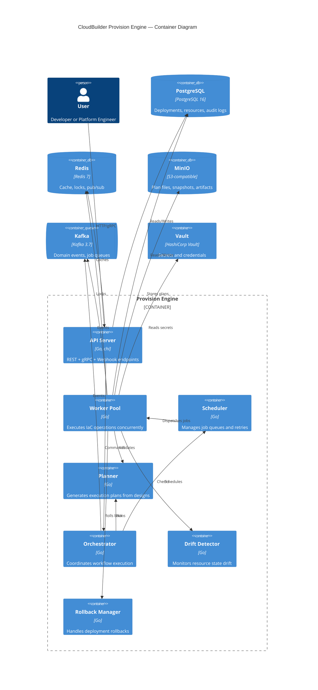
```mermaid
C4Container
    title CloudBuilder Provision Engine — Container Diagram

    Person(user, "User", "Developer or Platform Engineer")

    Container_Boundary(engine, "Provision Engine") {
        Container(api, "API Server", "Go, chi", "REST + gRPC + Webhook endpoints")
        Container(worker, "Worker Pool", "Go", "Executes IaC operations concurrently")
        Container(scheduler, "Scheduler", "Go", "Manages job queues and retries")
        Container(planner, "Planner", "Go", "Generates execution plans from designs")
        Container(orchestrator, "Orchestrator", "Go", "Coordinates workflow execution")
        Container(drift, "Drift Detector", "Go", "Monitors resource state drift")
        Container(rollback, "Rollback Manager", "Go", "Handles deployment rollbacks")
    }

    ContainerDb(pg, "PostgreSQL", "PostgreSQL 16", "Deployments, resources, audit logs")
    ContainerDb(redis, "Redis", "Redis 7", "Cache, locks, pub/sub")
    ContainerDb(minio, "MinIO", "S3-compatible", "Plan files, snapshots, artifacts")
    ContainerQueue(kafka, "Kafka", "Kafka 3.7", "Domain events, job queues")
    Container(vault, "Vault", "HashiCorp Vault", "Secrets and credentials")

    Rel(user, api, "HTTP/gRPC")
    Rel(api, orchestrator, "Commands")
    Rel(orchestrator, planner, "Plans")
    Rel(orchestrator, scheduler, "Schedules")
    Rel(scheduler, worker, "Dispatches jobs")
    Rel(worker, planner, "Validates")
    Rel(worker, drift, "Checks")
    Rel(worker, rollback, "Rolls back")
    Rel(api, pg, "Reads/Writes")
    Rel(worker, pg, "Reads/Writes")
    Rel(api, redis, "Caches")
    Rel(worker, redis, "Locks")
    Rel(orchestrator, kafka, "Events")
    Rel(worker, kafka, "Events")
    Rel(worker, minio, "Stores plans")
    Rel(worker, vault, "Reads secrets")
```

### 11.3 Component Diagram (Level 3) — API Server

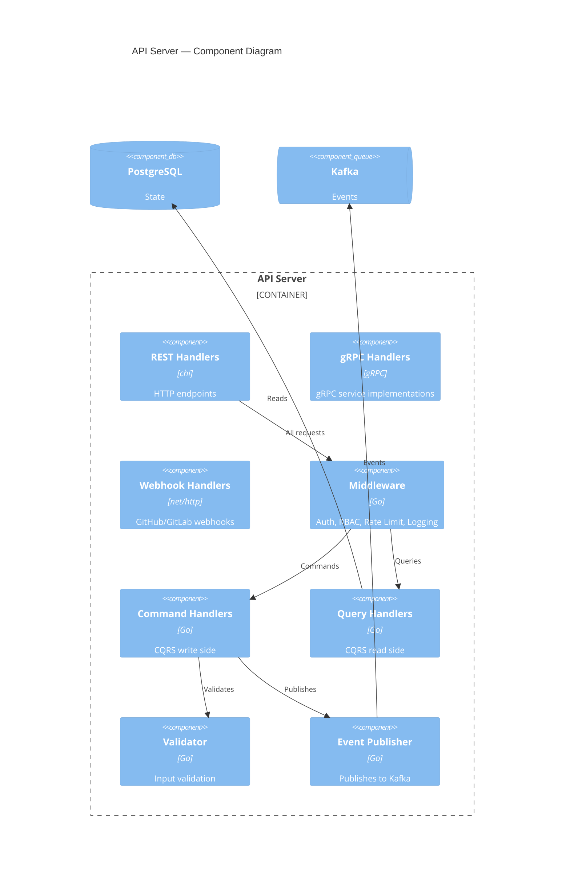
```mermaid
C4Component
    title API Server — Component Diagram

    Container_Boundary(api, "API Server") {
        Component(rest, "REST Handlers", "chi", "HTTP endpoints")
        Component(grpcH, "gRPC Handlers", "gRPC", "gRPC service implementations")
        Component(webhook, "Webhook Handlers", "net/http", "GitHub/GitLab webhooks")
        Component(mw, "Middleware", "Go", "Auth, RBAC, Rate Limit, Logging")
        Component(cmdH, "Command Handlers", "Go", "CQRS write side")
        Component(queryH, "Query Handlers", "Go", "CQRS read side")
        Component(validator, "Validator", "Go", "Input validation")
        Component(eventPub, "Event Publisher", "Go", "Publishes to Kafka")
    }

    ComponentDb(pg, "PostgreSQL", "", "State")
    ComponentQueue(kafka, "Kafka", "", "Events")

    Rel(rest, mw, "All requests")
    Rel(mw, cmdH, "Commands")
    Rel(mw, queryH, "Queries")
    Rel(cmdH, validator, "Validates")
    Rel(cmdH, eventPub, "Publishes")
    Rel(eventPub, kafka, "Events")
    Rel(queryH, pg, "Reads")
```

### 11.4 Code Diagram (Level 4) — Deployment Aggregate

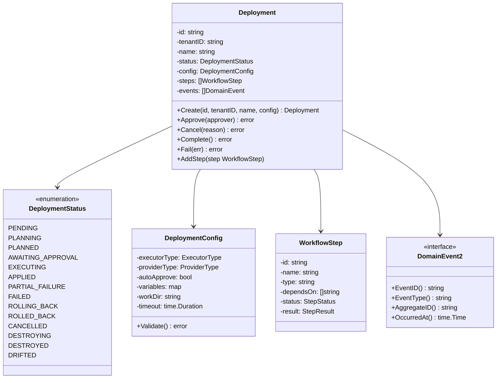
```mermaid
classDiagram
    class Deployment {
        -id: string
        -tenantID: string
        -name: string
        -status: DeploymentStatus
        -config: DeploymentConfig
        -steps: []WorkflowStep
        -events: []DomainEvent
        +Create(id, tenantID, name, config) Deployment
        +Approve(approver) error
        +Cancel(reason) error
        +Complete() error
        +Fail(err) error
        +AddStep(step WorkflowStep)
    }

    class DeploymentStatus {
        <<enumeration>>
        PENDING
        PLANNING
        PLANNED
        AWAITING_APPROVAL
        EXECUTING
        APPLIED
        PARTIAL_FAILURE
        FAILED
        ROLLING_BACK
        ROLLED_BACK
        CANCELLED
        DESTROYING
        DESTROYED
        DRIFTED
    }

    class DeploymentConfig {
        -executorType: ExecutorType
        -providerType: ProviderType
        -autoApprove: bool
        -variables: map
        -workDir: string
        -timeout: time.Duration
        +Validate() error
    }

    class WorkflowStep {
        -id: string
        -name: string
        -type: string
        -dependsOn: []string
        -status: StepStatus
        -result: StepResult
    }

    class DomainEvent2 {
        <<interface>>
        +EventID() string
        +EventType() string
        +AggregateID() string
        +OccurredAt() time.Time
    }

    Deployment --> DeploymentStatus
    Deployment --> DeploymentConfig
    Deployment --> WorkflowStep
    Deployment --> DomainEvent2
```

---

## 12. Sequence Diagrams

### 12.1 REST API — Create Deployment

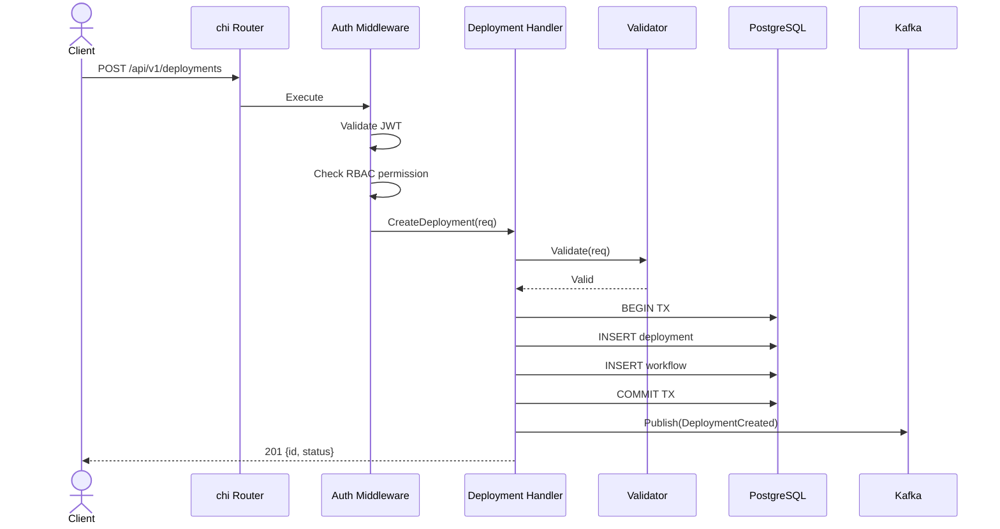
```mermaid
sequenceDiagram
    actor Client
    participant Chi as chi Router
    participant MW as Auth Middleware
    participant H as Deployment Handler
    participant V as Validator
    participant DB as PostgreSQL
    participant K as Kafka

    Client->>Chi: POST /api/v1/deployments
    Chi->>MW: Execute
    MW->>MW: Validate JWT
    MW->>MW: Check RBAC permission
    MW->>H: CreateDeployment(req)
    H->>V: Validate(req)
    V-->>H: Valid
    H->>DB: BEGIN TX
    H->>DB: INSERT deployment
    H->>DB: INSERT workflow
    H->>DB: COMMIT TX
    H->>K: Publish(DeploymentCreated)
    H-->>Client: 201 {id, status}
```

### 12.2 gRPC — Stream Execution Logs

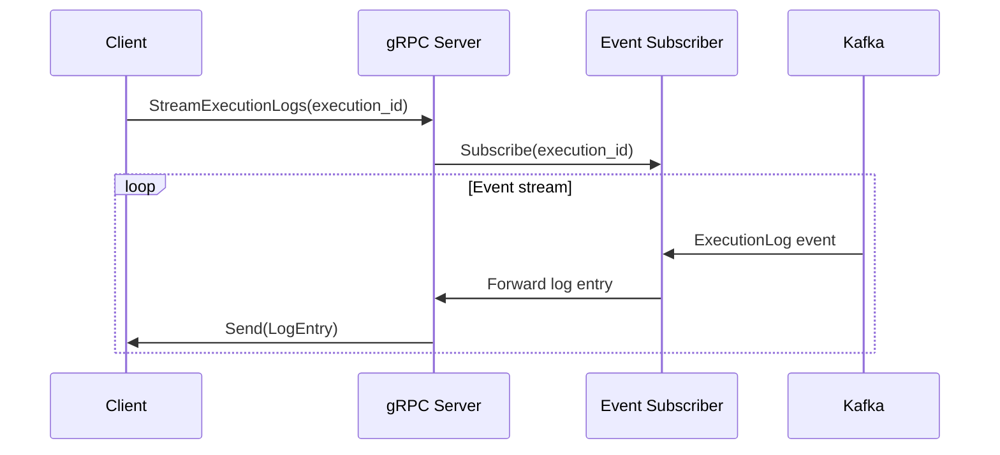
```mermaid
sequenceDiagram
    participant Client
    participant gRPC as gRPC Server
    participant ES as Event Subscriber
    participant K as Kafka

    Client->>gRPC: StreamExecutionLogs(execution_id)
    gRPC->>ES: Subscribe(execution_id)
    loop Event stream
        K->>ES: ExecutionLog event
        ES->>gRPC: Forward log entry
        gRPC->>Client: Send(LogEntry)
    end
```

---

## 13. Event Model

### 13.1 Event Types

| Category | Event Type | Description |
|----------|-----------|-------------|
| **Deployment** | `deployment.created` | New deployment created |
| | `deployment.approved` | Deployment approved |
| | `deployment.cancelled` | Deployment cancelled |
| | `deployment.completed` | All steps completed |
| | `deployment.failed` | Deployment failed |
| | `deployment.destroyed` | Resources destroyed |
| **Workflow** | `workflow.started` | Workflow execution started |
| | `workflow.step.completed` | Individual step completed |
| | `workflow.step.failed` | Individual step failed |
| | `workflow.completed` | All steps done |
| **Execution** | `execution.started` | Executor started |
| | `execution.progress` | Progress update |
| | `execution.completed` | Executor finished |
| | `execution.failed` | Executor error |
| **Resource** | `resource.created` | Resource provisioned |
| | `resource.updated` | Resource modified |
| | `resource.deleted` | Resource removed |
| | `resource.drifted` | Drift detected |
| **State** | `state.changed` | State transition |
| | `state.snapshot` | Snapshot created |
| **Audit** | `audit.action` | Security action logged |

### 13.2 Event Schema

```json
{
  "eventId": "evt-uuid",
  "eventType": "deployment.completed",
  "aggregateId": "dep-uuid",
  "aggregateType": "Deployment",
  "tenantId": "tenant-uuid",
  "version": 5,
  "occurredAt": "2026-07-15T10:30:00Z",
  "correlationId": "corr-uuid",
  "causationId": "evt-uuid-previous",
  "payload": {
    "deploymentId": "dep-uuid",
    "status": "COMPLETED",
    "resourcesCreated": 12,
    "resourcesUpdated": 3,
    "duration": "2m30s"
  },
  "metadata": {
    "userId": "user-uuid",
    "userAgent": "provision-engine/2.0",
    "ipAddress": "10.0.0.1"
  }
}
```

### 13.3 Kafka Topics

| Topic | Partitions | Retention | Purpose |
|-------|-----------|-----------|---------|
| `deployment.events` | 12 | 7 days | Deployment lifecycle events |
| `workflow.events` | 12 | 7 days | Workflow step events |
| `execution.events` | 12 | 7 days | Execution progress events |
| `resource.events` | 12 | 30 days | Resource state events |
| `state.events` | 6 | 90 days | State change events |
| `audit.events` | 6 | 365 days | Audit trail events |
| `commands` | 6 | 24 hours | Command queue (CQRS) |
| `dlq.events` | 3 | 30 days | Dead letter queue |

---

## 14. Database Model

### 14.1 Entity-Relationship Diagram

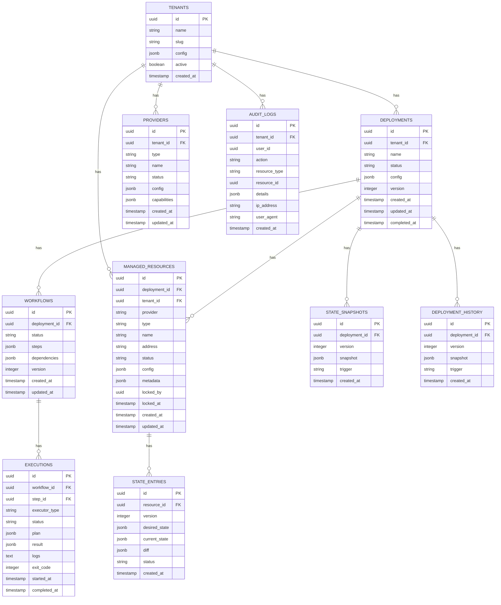
```mermaid
erDiagram
    TENANTS {
        uuid id PK
        string name
        string slug
        jsonb config
        boolean active
        timestamp created_at
    }

    DEPLOYMENTS {
        uuid id PK
        uuid tenant_id FK
        string name
        string status
        jsonb config
        integer version
        timestamp created_at
        timestamp updated_at
        timestamp completed_at
    }

    WORKFLOWS {
        uuid id PK
        uuid deployment_id FK
        string status
        jsonb steps
        jsonb dependencies
        integer version
        timestamp created_at
        timestamp updated_at
    }

    EXECUTIONS {
        uuid id PK
        uuid workflow_id FK
        uuid step_id FK
        string executor_type
        string status
        jsonb plan
        jsonb result
        text logs
        integer exit_code
        timestamp started_at
        timestamp completed_at
    }

    MANAGED_RESOURCES {
        uuid id PK
        uuid deployment_id FK
        uuid tenant_id FK
        string provider
        string type
        string name
        string address
        string status
        jsonb config
        jsonb metadata
        uuid locked_by
        timestamp locked_at
        timestamp created_at
        timestamp updated_at
    }

    STATE_ENTRIES {
        uuid id PK
        uuid resource_id FK
        integer version
        jsonb desired_state
        jsonb current_state
        jsonb diff
        string status
        timestamp created_at
    }

    STATE_SNAPSHOTS {
        uuid id PK
        uuid deployment_id FK
        integer version
        jsonb snapshot
        string trigger
        timestamp created_at
    }

    PROVIDERS {
        uuid id PK
        uuid tenant_id FK
        string type
        string name
        string status
        jsonb config
        jsonb capabilities
        timestamp created_at
        timestamp updated_at
    }

    AUDIT_LOGS {
        uuid id PK
        uuid tenant_id FK
        uuid user_id
        string action
        string resource_type
        uuid resource_id
        jsonb details
        string ip_address
        string user_agent
        timestamp created_at
    }

    DEPLOYMENT_HISTORY {
        uuid id PK
        uuid deployment_id FK
        integer version
        jsonb snapshot
        string trigger
        timestamp created_at
    }

    TENANTS ||--o{ DEPLOYMENTS : has
    TENANTS ||--o{ MANAGED_RESOURCES : has
    TENANTS ||--o{ PROVIDERS : has
    TENANTS ||--o{ AUDIT_LOGS : has
    DEPLOYMENTS ||--o{ WORKFLOWS : has
    DEPLOYMENTS ||--o{ MANAGED_RESOURCES : has
    DEPLOYMENTS ||--o{ STATE_SNAPSHOTS : has
    DEPLOYMENTS ||--o{ DEPLOYMENT_HISTORY : has
    WORKFLOWS ||--o{ EXECUTIONS : has
    MANAGED_RESOURCES ||--o{ STATE_ENTRIES : has
```

### 14.2 Key Indexes

```sql
-- Deployment lookups
CREATE INDEX idx_deployments_tenant_status ON deployments(tenant_id, status);
CREATE INDEX idx_deployments_created ON deployments(created_at DESC);

-- Resource lookups
CREATE INDEX idx_resources_deployment ON managed_resources(deployment_id);
CREATE INDEX idx_resources_tenant_provider ON managed_resources(tenant_id, provider);
CREATE INDEX idx_resources_status ON managed_resources(status);
CREATE INDEX idx_resources_locked ON managed_resources(locked_by) WHERE locked_by IS NOT NULL;

-- State lookups
CREATE INDEX idx_state_resource_version ON state_entries(resource_id, version DESC);

-- Audit queries
CREATE INDEX idx_audit_tenant_created ON audit_logs(tenant_id, created_at DESC);
CREATE INDEX idx_audit_resource ON audit_logs(resource_type, resource_id);

-- Event store
CREATE INDEX idx_events_aggregate ON event_store(aggregate_id, version);
CREATE INDEX idx_events_type ON event_store(event_type, created_at);
```

---

## 15. Queue Model

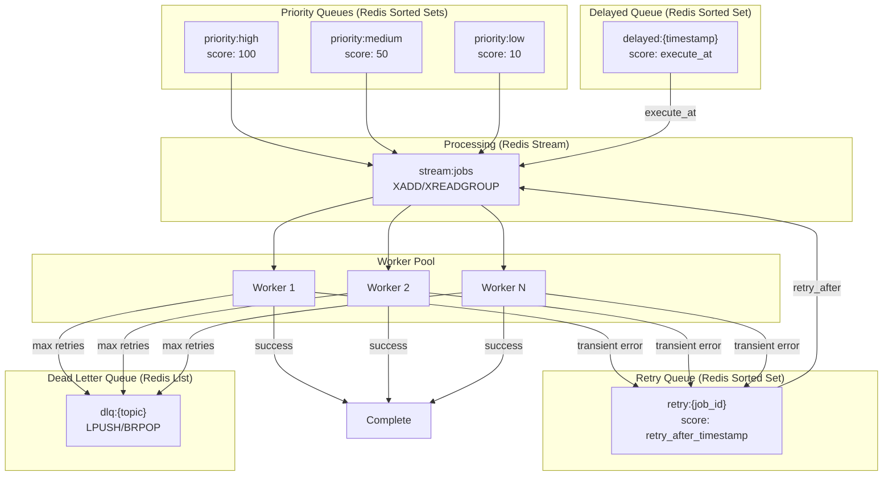
```mermaid
graph TB
    subgraph "Priority Queues (Redis Sorted Sets)"
        PQ_HIGH["priority:high<br/>score: 100"]
        PQ_MED["priority:medium<br/>score: 50"]
        PQ_LOW["priority:low<br/>score: 10"]
    end

    subgraph "Retry Queue (Redis Sorted Set)"
        RQ["retry:{job_id}<br/>score: retry_after_timestamp"]
    end

    subgraph "Delayed Queue (Redis Sorted Set)"
        DQ["delayed:{timestamp}<br/>score: execute_at"]
    end

    subgraph "Dead Letter Queue (Redis List)"
        DLQ["dlq:{topic}<br/>LPUSH/BRPOP"]
    end

    subgraph "Processing (Redis Stream)"
        PROC["stream:jobs<br/>XADD/XREADGROUP"]
    end

    subgraph "Worker Pool"
        W1[Worker 1]
        W2[Worker 2]
        W3[Worker N]
    end

    PQ_HIGH & PQ_MED & PQ_LOW --> PROC
    PROC --> W1 & W2 & W3
    W1 & W2 & W3 -->|success| DONE[Complete]
    W1 & W2 & W3 -->|transient error| RQ
    W1 & W2 & W3 -->|max retries| DLQ
    RQ -->|retry_after| PROC
    DQ -->|execute_at| PROC
```

### Queue Operations

| Operation | Redis Command | Description |
|-----------|--------------|-------------|
| Enqueue | `XADD stream:jobs * payload {...}` | Add job to stream |
| Dispatch | `XREADGROUP GROUP workers STREAMS stream:jobs >` | Worker claims job |
| Ack | `XACK stream:jobs {group} {id}` | Acknowledge completion |
| Retry | `ZADD retry:{topic} {retry_after} {job}` | Schedule retry |
| Dead Letter | `LPUSH dlq:{topic} {job}` | Move to DLQ |
| Priority | `ZADD priority:{level} {score} {job}` | Enqueue with priority |

---

## 16. gRPC Contracts

```protobuf
syntax = "proto3";
package provision.v1;
option go_package = "github.com/cloudbuilder/provision-engine/proto/provision/v1";

service ProvisionService {
  // Deployment CRUD
  rpc CreateDeployment(CreateDeploymentRequest) returns (CreateDeploymentResponse);
  rpc GetDeployment(GetDeploymentRequest) returns (GetDeploymentResponse);
  rpc ListDeployments(ListDeploymentsRequest) returns (ListDeploymentsResponse);
  rpc ApproveDeployment(ApproveDeploymentRequest) returns (ApproveDeploymentResponse);
  rpc CancelDeployment(CancelDeploymentRequest) returns (CancelDeploymentResponse);
  rpc DestroyDeployment(DestroyDeploymentRequest) returns (stream DestroyEvent);

  // Execution
  rpc ExecuteWorkflow(ExecuteWorkflowRequest) returns (stream ExecutionEvent);
  rpc GetExecution(GetExecutionRequest) returns (GetExecutionResponse);

  // State
  rpc GetState(GetStateRequest) returns (GetStateResponse);
  rpc RefreshState(RefreshStateRequest) returns (RefreshStateResponse);
  rpc ImportResource(ImportResourceRequest) returns (ImportResourceResponse);

  // Drift
  rpc DetectDrift(DetectDriftRequest) returns (DetectDriftResponse);
  rpc ReconcileDrift(ReconcileDriftRequest) returns (stream ReconcileEvent);

  // Streaming
  rpc WatchEvents(WatchEventsRequest) returns (stream EngineEvent);
  rpc StreamLogs(StreamLogsRequest) returns (stream LogEntry);
}

message CreateDeploymentRequest {
  string tenant_id = 1;
  string name = 2;
  DeploymentConfig config = 3;
  repeated WorkflowStepInput steps = 4;
}

message DeploymentConfig {
  string executor_type = 1;  // terraform, pulumi, helm, etc.
  string provider_type = 2;  // aws, azure, gcp, etc.
  bool auto_approve = 3;
  map<string, string> variables = 4;
  string workspace_dir = 5;
  int64 timeout_seconds = 6;
}

message WorkflowStepInput {
  string name = 1;
  string type = 2;
  string resource_type = 3;
  map<string, string> config = 4;
  repeated string depends_on = 5;
}

message EngineEvent {
  string event_id = 1;
  string event_type = 2;
  string aggregate_id = 3;
  string aggregate_type = 4;
  string status = 5;
  int32 progress = 6;
  string message = 7;
  string timestamp = 8;
}
```

---

## 17. REST/OpenAPI Contracts

```yaml
openapi: 3.1.0
info:
  title: CloudBuilder Provision Engine API
  version: 2.0.0
  description: Enterprise infrastructure provisioning engine

servers:
  - url: http://localhost:8080/api/v1

paths:
  /deployments:
    post:
      summary: Create a new deployment
      tags: [Deployments]
      security:
        - bearerAuth: []
      requestBody:
        content:
          application/json:
            schema:
              $ref: '#/components/schemas/CreateDeploymentRequest'
      responses:
        '201':
          description: Deployment created
          content:
            application/json:
              schema:
                $ref: '#/components/schemas/Deployment'
        '400': { description: Invalid request }
        '401': { description: Unauthorized }
        '403': { description: Forbidden }

    get:
      summary: List deployments
      tags: [Deployments]
      parameters:
        - name: status
          in: query
          schema: { type: string }
        - name: page
          in: query
          schema: { type: integer, default: 1 }
        - name: limit
          in: query
          schema: { type: integer, default: 20 }
      responses:
        '200':
          description: Deployment list

  /deployments/{id}:
    get:
      summary: Get deployment details
      parameters:
        - name: id
          in: path
          required: true
          schema: { type: string, format: uuid }

  /deployments/{id}/approve:
    post:
      summary: Approve a deployment
      requestBody:
        content:
          application/json:
            schema:
              type: object
              properties:
                approved_by: { type: string }

  /deployments/{id}/cancel:
    post:
      summary: Cancel a deployment

  /deployments/{id}/destroy:
    post:
      summary: Destroy deployment resources

  /deployments/{id}/rollback:
    post:
      summary: Rollback a deployment
      requestBody:
        content:
          application/json:
            schema:
              type: object
              properties:
                target_version: { type: integer }

  /deployments/{id}/drift:
    get:
      summary: Check for drift

  /resources:
    get:
      summary: List managed resources
      parameters:
        - name: provider
          in: query
          schema: { type: string }
        - name: type
          in: query
          schema: { type: string }

  /resources/{id}:
    get:
      summary: Get resource details

  /resources/{id}/state:
    get:
      summary: Get resource state history

  /executions:
    get:
      summary: List executions

  /executions/{id}:
    get:
      summary: Get execution details
    get:
      summary: Stream execution logs
      operationId: streamExecutionLogs
      responses:
        '200':
          description: SSE stream of log entries

  /providers:
    get:
      summary: List configured providers
    post:
      summary: Register a new provider

  /providers/{id}/health:
    get:
      summary: Check provider health

  /audit:
    get:
      summary: List audit log entries
      parameters:
        - name: action
          in: query
        - name: resource_type
          in: query
        - name: from
          in: query
          schema: { type: string, format: date-time }
        - name: to
          in: query
          schema: { type: string, format: date-time }

components:
  schemas:
    Deployment:
      type: object
      properties:
        id: { type: string, format: uuid }
        tenant_id: { type: string }
        name: { type: string }
        status: { type: string, enum: [PENDING, PLANNING, PLANNED, EXECUTING, APPLIED, FAILED, ROLLING_BACK, CANCELLED, DESTROYED] }
        config: { $ref: '#/components/schemas/DeploymentConfig' }
        created_at: { type: string, format: date-time }
        updated_at: { type: string, format: date-time }

    CreateDeploymentRequest:
      type: object
      required: [name, config, steps]
      properties:
        name: { type: string }
        config: { $ref: '#/components/schemas/DeploymentConfig' }
        steps: { type: array, items: { $ref: '#/components/schemas/WorkflowStepInput' } }

  securitySchemes:
    bearerAuth:
      type: http
      scheme: bearer
      bearerFormat: JWT
```

---

## 18. Security Architecture

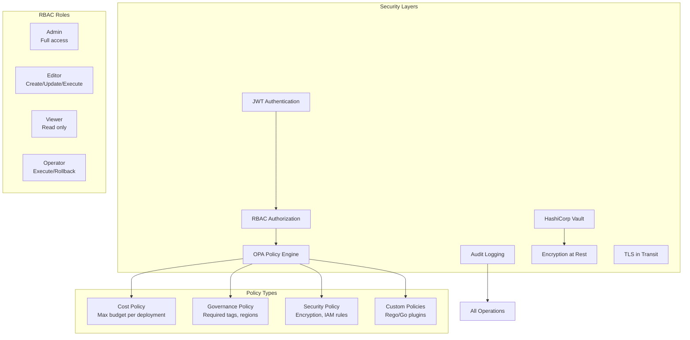
```mermaid
graph TB
    subgraph "Security Layers"
        JWT[JWT Authentication]
        RBAC[RBAC Authorization]
        OPA[OPA Policy Engine]
        VAULT[HashiCorp Vault]
        AUDIT[Audit Logging]
        ENCRYPT[Encryption at Rest]
        TLS[TLS in Transit]
    end

    subgraph "RBAC Roles"
        ADMIN[Admin<br/>Full access]
        EDITOR[Editor<br/>Create/Update/Execute]
        VIEWER[Viewer<br/>Read only]
        OPERATOR[Operator<br/>Execute/Rollback]
    end

    subgraph "Policy Types"
        COST[Cost Policy<br/>Max budget per deployment]
        GOV[Governance Policy<br/>Required tags, regions]
        SEC[Security Policy<br/>Encryption, IAM rules]
        CUSTOM[Custom Policies<br/>Rego/Go plugins]
    end

    JWT --> RBAC
    RBAC --> OPA
    OPA --> COST & GOV & SEC & CUSTOM
    VAULT --> ENCRYPT
    AUDIT --> ALL[All Operations]
```

### Security Controls

| Layer | Control | Implementation |
|-------|---------|---------------|
| **Authentication** | JWT tokens | RS256, 24h expiry, refresh tokens |
| **Authorization** | RBAC | Role-based, tenant-scoped |
| **Policy** | OPA/Rego | Cost limits, governance rules, security policies |
| **Secrets** | Vault | Dynamic secrets, auto-rotation |
| **Encryption** | AES-256-GCM | State files, plan files at rest |
| **Transport** | mTLS | gRPC inter-service, API gateway |
| **Audit** | Immutable log | All actions recorded with user, time, IP |
| **Network** | Network policies | Kubernetes NetworkPolicy, firewall rules |

---

## 19. Observability Architecture

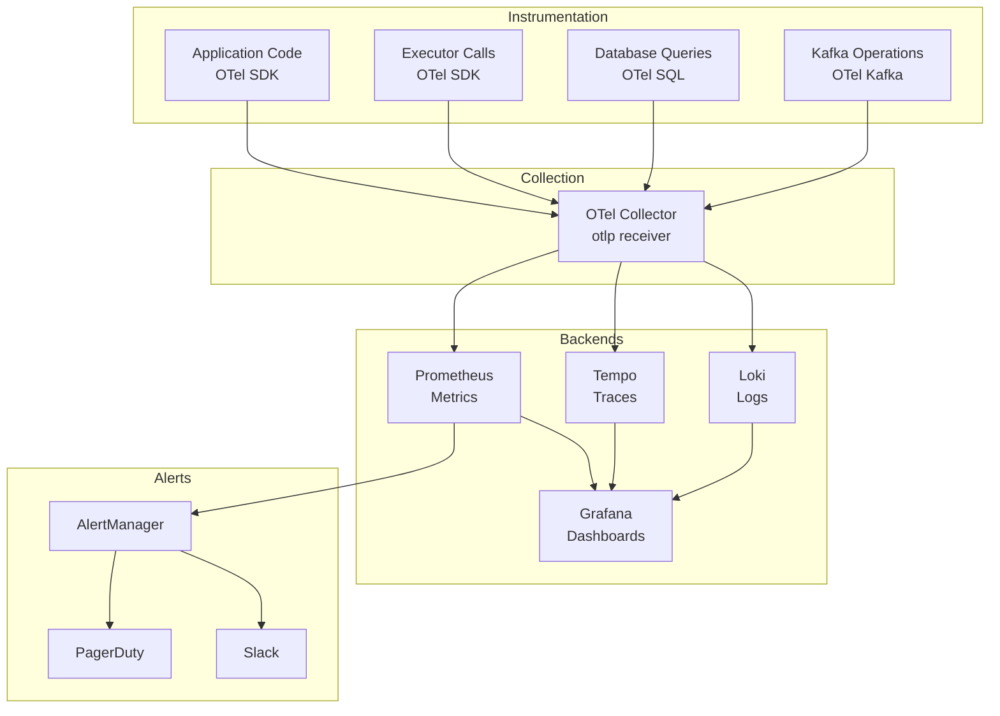
```mermaid
graph TB
    subgraph "Instrumentation"
        APP[Application Code<br/>OTel SDK]
        EXEC2[Executor Calls<br/>OTel SDK]
        DB3[Database Queries<br/>OTel SQL]
        KAFKA3[Kafka Operations<br/>OTel Kafka]
    end

    subgraph "Collection"
        COLLECTOR[OTel Collector<br/>otlp receiver]
    end

    subgraph "Backends"
        PROM2[Prometheus<br/>Metrics]
        TEMPO2[Tempo<br/>Traces]
        LOKI2[Loki<br/>Logs]
        GRAF2[Grafana<br/>Dashboards]
    end

    subgraph "Alerts"
        ALERT[AlertManager]
        PAGERDUTY[PagerDuty]
        SLACK[Slack]
    end

    APP & EXEC2 & DB3 & KAFKA3 --> COLLECTOR
    COLLECTOR --> PROM2 & TEMPO2 & LOKI2
    PROM2 --> ALERT
    ALERT --> PAGERDUTY & SLACK
    PROM2 & TEMPO2 & LOKI2 --> GRAF2
```

### Key Metrics

| Category | Metric | Type | Description |
|----------|--------|------|-------------|
| **Deployment** | `deployments_total` | Counter | Total deployments by status |
| | `deployments_duration_seconds` | Histogram | Deployment duration |
| | `deployments_in_progress` | Gauge | Active deployments |
| **Execution** | `executions_total` | Counter | Total executions by executor |
| | `executions_duration_seconds` | Histogram | Execution duration |
| | `executions_failed_total` | Counter | Failed executions |
| **Resource** | `resources_managed_total` | Gauge | Resources under management |
| | `resources_drifted_total` | Gauge | Resources with drift |
| **Queue** | `queue_depth` | Gauge | Jobs in queue |
| | `queue_latency_seconds` | Histogram | Time job waits in queue |
| **Worker** | `worker_active` | Gauge | Active workers |
| | `worker_idle` | Gauge | Idle workers |
| **API** | `http_requests_total` | Counter | HTTP requests |
| | `http_request_duration_seconds` | Histogram | HTTP latency |
| | `grpc_requests_total` | Counter | gRPC calls |

### SLO Definitions

| Service | SLI | SLO | Error Budget |
|---------|-----|-----|--------------|
| API Server | Availability | 99.99% | 4.32 min/month |
| API Server | Latency (p99) | < 200ms | — |
| Worker Pool | Throughput | > 1000 jobs/min | — |
| State Manager | Durability | 99.9999% | — |
| Drift Detector | Completeness | 100% scan daily | — |

---

## 20. Testing Strategy

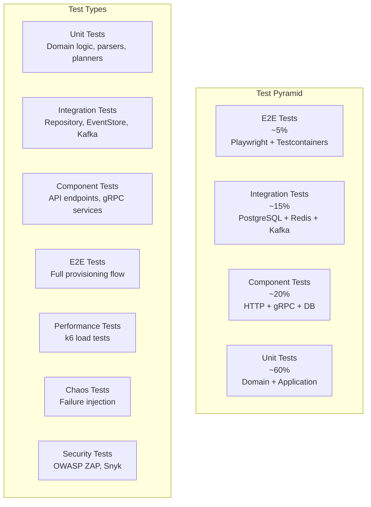
```mermaid
graph TB
    subgraph "Test Pyramid"
        E2E["E2E Tests<br/>~5%<br/>Playwright + Testcontainers"]
        INT["Integration Tests<br/>~15%<br/>PostgreSQL + Redis + Kafka"]
        COMP["Component Tests<br/>~20%<br/>HTTP + gRPC + DB"]
        UNIT["Unit Tests<br/>~60%<br/>Domain + Application"]
    end

    subgraph "Test Types"
        UNIT2["Unit Tests<br/>Domain logic, parsers, planners"]
        INT2["Integration Tests<br/>Repository, EventStore, Kafka"]
        COMP2["Component Tests<br/>API endpoints, gRPC services"]
        E2E2["E2E Tests<br/>Full provisioning flow"]
        PERF["Performance Tests<br/>k6 load tests"]
        CHAOS["Chaos Tests<br/>Failure injection"]
        SEC["Security Tests<br/>OWASP ZAP, Snyk"]
    end
```

### Test Coverage Targets

| Layer | Coverage Target | Tool |
|-------|----------------|------|
| Domain | 90%+ | go test |
| Application | 85%+ | go test |
| Infrastructure | 70%+ | go test + Testcontainers |
| API | 80%+ | go test + httptest |
| E2E | Critical paths | Playwright + Testcontainers |

### Test Infrastructure

```yaml
# docker-compose.test.yml
services:
  postgres-test:
    image: postgres:16-alpine
    environment:
      POSTGRES_DB: cloudbuilder_test
    tmpfs:
      - /var/lib/postgresql/data

  redis-test:
    image: redis:7-alpine
    command: redis-server --save ""

  kafka-test:
    image: bitnami/kafka:3.7
    environment:
      KAFKA_CFG_NODE_ID: 0
      KAFKA_CFG_PROCESS_ROLES: controller,broker

  minio-test:
    image: minio/minio
    command: server /data --console-address ":9001"
```

---

## 21. Scalability Strategy

### Horizontal Scaling

```mermaid
graph TB
    subgraph "Load Balancer"
        LB[NGINX / ALB]
    end

    subgraph "API Servers (N replicas)"
        API1[API 1]
        API2[API 2]
        API3[API N]
    end

    subgraph "Worker Pool (M replicas)"
        W1[Worker 1]
        W2[Worker 2]
        W3[Worker M]
    end

    subgraph "Scheduler (1 leader)"
        SCHED_L[Scheduler Leader]
        SCHED_F[Scheduler Follower]
    end

    subgraph "Shared State"
        PG3[(PostgreSQL<br/>Primary + Replicas)]
        REDIS3[(Redis<br/>Cluster)]
        KAFKA3[Kafka<br/>Cluster]
    end

    LB --> API1 & API2 & API3
    API1 & API2 & API3 --> PG3
    SCHED_L --> REDIS3
    W1 & W2 & W3 --> KAFKA3
    W1 & W2 & W3 --> PG3
```

### Scaling Dimensions

| Component | Scaling Strategy | Trigger |
|-----------|-----------------|---------|
| **API Server** | Horizontal (replicas) | CPU > 70%, RPS > threshold |
| **Worker Pool** | Horizontal (replicas) | Queue depth > threshold |
| **Scheduler** | Leader election (1 active) | Failover only |
| **PostgreSQL** | Read replicas + connection pooling | Read latency |
| **Redis** | Cluster mode (6+ shards) | Memory > 80% |
| **Kafka** | Partition scaling | Consumer lag |

### Capacity Planning

| Metric | Small | Medium | Large | Enterprise |
|--------|-------|--------|-------|------------|
| Deployments/day | 100 | 1,000 | 10,000 | 100,000 |
| Resources managed | 1,000 | 10,000 | 100,000 | 1,000,000 |
| API replicas | 1 | 2-3 | 5-10 | 10-20 |
| Worker replicas | 1 | 3-5 | 10-20 | 20-50 |
| PostgreSQL | Single | Primary+1 | Primary+3 | Primary+5 + PgBouncer |
| Redis | Single | Sentinel | Cluster(3) | Cluster(6+) |
| Kafka brokers | 1 | 3 | 5 | 7+ |

---

## 22. Multi-Tenant Strategy

```mermaid
graph TB
    subgraph "Tenant Isolation"
        MW2[Request Middleware]
        TENANT[Extract tenant_id from JWT]
        FILTER[Tenant Filter<br/>All queries scoped]
    end

    subgraph "Data Isolation"
        PG4[(PostgreSQL<br/>Shared DB, tenant_id column<br/>Row-Level Security)]
    end

    subgraph "Resource Isolation"
        WORKER2[Worker Pool<br/>Shared, tenant-aware]
        QUEUE2[Job Queues<br/>Per-tenant priority]
    end

    subgraph "Security Isolation"
        RBAC3[RBAC<br/>Tenant-scoped roles]
        VAULT2[Vault<br/>Tenant namespace]
    end

    MW2 --> TENANT --> FILTER --> PG4
    WORKER2 --> QUEUE2
    RBAC3 --> VAULT2
```

### Multi-Tenant Implementation

| Aspect | Strategy |
|--------|----------|
| **Data Isolation** | Shared database with `tenant_id` column + PostgreSQL RLS |
| **Query Scoping** | Middleware injects `tenant_id` into all queries |
| **Resource Limits** | Per-tenant quotas (max deployments, max resources) |
| **Secrets** | Vault namespaced per tenant |
| **Audit** | Audit logs scoped per tenant |
| **Rate Limiting** | Per-tenant rate limits via Redis |

### Tenant Configuration

```yaml
tenant:
  id: "tenant-uuid"
  name: "Acme Corp"
  plan: "enterprise"
  limits:
    max_deployments: 1000
    max_resources: 100000
    max_workers: 10
    max_concurrent: 50
    storage_gb: 100
  features:
    drift_detection: true
    auto_rollback: true
    cost_estimation: true
    audit_logging: true
```

---

## 23. High Availability Strategy

```mermaid
graph TB
    subgraph "Region A (Primary)"
        LB_A[Load Balancer]
        API_A1[API 1]
        API_A2[API 2]
        WORKER_A1[Worker 1]
        WORKER_A2[Worker 2]
        PG_A[(PostgreSQL Primary)]
        REDIS_A[(Redis Primary)]
        KAFKA_A[Kafka Broker 1-3]
    end

    subgraph "Region B (DR)"
        LB_B[Load Balancer]
        API_B1[API 1]
        API_B2[API 2]
        WORKER_B1[Worker 1]
        PG_B[(PostgreSQL Replica)]
        REDIS_B[(Redis Replica)]
        KAFKA_B[Kafka Broker 4-6]
    end

    PG_A -->|async replication| PG_B
    REDIS_A -->|replication| REDIS_B
    KAFKA_A -->|mirror maker| KAFKA_B
```

### HA Components

| Component | HA Strategy | RPO | RTO |
|-----------|------------|-----|-----|
| **API Server** | Multi-replica behind LB | 0 | < 5s (auto-heal) |
| **Worker Pool** | Multi-replica with lease | 0 | < 30s (re-queue) |
| **PostgreSQL** | Streaming replication + Patroni | < 1s | < 60s (failover) |
| **Redis** | Sentinel or Cluster | < 1s | < 10s (failover) |
| **Kafka** | Multi-broker + replication factor 3 | 0 | < 30s (ISR failover) |
| **MinIO** | Erasure coding (4+2) | 0 | < 30s |
| **Scheduler** | Leader election (pg_advisory_lock) | 0 | < 15s (re-elect) |

### Leader Election

```go
// PostgreSQL-based leader election for Scheduler
func (s *Scheduler) AcquireLeadership(ctx context.Context, instanceID string) (bool, error) {
    // Try to acquire advisory lock with 30s timeout
    var acquired bool
    err := s.db.QueryRowContext(ctx,
        `SELECT pg_try_advisory_lock($1)`,
        schedulerLockKey,
    ).Scan(&acquired)
    if err != nil {
        return false, err
    }
    return acquired, nil
}
```

---

## 24. Failover Strategy

### Failover Scenarios

| Scenario | Detection | Response | Recovery |
|----------|-----------|----------|----------|
| **API Server crash** | Health check failure | LB removes from pool | Auto-restart via K8s |
| **Worker crash** | Lease expiry (30s) | Re-queue incomplete jobs | Auto-restart, resume |
| **PostgreSQL primary down** | Patroni failover | Promote replica | Rebuild old primary |
| **Redis down** | Sentinel failover | Promote replica | Rebuild old primary |
| **Kafka broker down** | ISR shrinks | Replicate to remaining | Add new broker |
| **Provider API down** | HTTP 5xx / timeout | Circuit breaker open | Retry with backoff |
| **Executor failure** | Non-zero exit code | Retry (3x) then DLQ | Manual investigation |

### Circuit Breaker

```go
type CircuitBreaker struct {
    failures    int
    threshold   int           // 5 failures
    timeout     time.Duration // 30s
    state       State         // Closed, Open, HalfOpen
    lastFailure time.Time
}

func (cb * CircuitBreaker) Execute(fn func() error) error {
    if cb.state == Open && time.Since(cb.lastFailure) > cb.timeout {
        cb.state = HalfOpen
    }
    if cb.state == Open {
        return ErrCircuitOpen
    }
    err := fn()
    if err != nil {
        cb.failures++
        cb.lastFailure = time.Now()
        if cb.failures >= cb.threshold {
            cb.state = Open
        }
        return err
    }
    cb.failures = 0
    cb.state = Closed
    return nil
}
```

---

## 25. Plugin Architecture

```mermaid
graph TB
    subgraph "Plugin System"
        REGISTRY[Plugin Registry]
        LOADER[Plugin Loader]
        SANDBOX[Plugin Sandbox]
    end

    subgraph "Plugin Types"
        EP2[Executor Plugin<br/>IaC tool adapter]
        PP2[Provider Plugin<br/>Cloud/SaaS adapter]
        HP2[Hook Plugin<br/>Lifecycle hook]
        POL2[Policy Plugin<br/>OPA/Go policy]
    end

    subgraph "Plugin SDK"
        SDK_EXEC[Executor SDK<br/>Interface + Helpers]
        SDK_PROV[Provider SDK<br/>Interface + Helpers]
        SDK_HOOK[Hook SDK<br/>Interface + Helpers]
        SDK_POL[Policy SDK<br/>Interface + Helpers]
    end

    LOADER --> REGISTRY
    REGISTRY --> EP2 & PP2 & HP2 & POL2
    SDK_EXEC --> EP2
    SDK_PROV --> PP2
    SDK_HOOK --> HP2
    SDK_POL --> POL2
    SANDBOX --> EP2 & PP2
```

### Plugin Loading Strategy

| Strategy | Pros | Cons | Use Case |
|----------|------|------|----------|
| **Go interfaces** | Type-safe, fast | Requires recompilation | Core plugins |
| **Go plugins** | Dynamic loading | Platform-specific, unsafe | Community plugins |
| **gRPC plugins** | Language-agnostic, sandboxed | Network overhead | Third-party |
| **WASM plugins** | Sandbox, portable | Limited ecosystem | Untrusted plugins |

**Decision**: Use **Go interfaces** for core plugins (bundled) and **gRPC plugins** for third-party extensions. WASM sandboxing as a future option.

### Plugin Interface Contracts

```go
// Plugin metadata returned by all plugins
type PluginInfo struct {
    Name    string
    Version string
    Type    string // "executor", "provider", "hook", "policy"
    Author  string
}

// Plugin lifecycle
type Plugin interface {
    Info() PluginInfo
    Init(config map[string]string) error
    Shutdown() error
    HealthCheck(ctx context.Context) error
}
```

---

## 26. Implementation Roadmap

### Phase 1: Foundation (Weeks 1-4)

| Week | Deliverable | Priority |
|------|------------|----------|
| 1 | Domain models, interfaces, shared kernel | P0 |
| 1 | PostgreSQL schema + migrations | P0 |
| 1 | Configuration system (12-Factor) | P0 |
| 2 | REST API (Deployment CRUD) | P0 |
| 2 | gRPC API (Deployment + Streaming) | P0 |
| 2 | JWT auth + RBAC middleware | P0 |
| 3 | Terraform executor implementation | P0 |
| 3 | Workflow planner (dependency graph) | P0 |
| 3 | Scheduler (priority queue) | P0 |
| 4 | Worker pool (basic) | P0 |
| 4 | Event publishing (Kafka) | P0 |
| 4 | OpenTelemetry integration | P0 |

### Phase 2: Core Engine (Weeks 5-8)

| Week | Deliverable | Priority |
|------|------------|----------|
| 5 | Orchestrator (parallel execution) | P0 |
| 5 | State manager (desired vs current) | P0 |
| 5 | Diff engine | P0 |
| 6 | Rollback manager | P0 |
| 6 | Snapshot manager | P0 |
| 6 | Version manager | P0 |
| 7 | Drift detection (periodic) | P1 |
| 7 | Drift reconciliation | P1 |
| 7 | Resource locking (Redis) | P1 |
| 8 | Retry engine + DLQ | P1 |
| 8 | Idempotency guards | P1 |
| 8 | Audit logging | P1 |

### Phase 3: Providers & Executors (Weeks 9-12)

| Week | Deliverable | Priority |
|------|------------|----------|
| 9 | Provider SDK + Registry | P0 |
| 9 | AWS provider | P0 |
| 9 | Azure provider | P1 |
| 10 | GCP provider | P1 |
| 10 | Pulumi executor | P1 |
| 10 | Helm executor | P1 |
| 11 | Docker executor | P2 |
| 11 | Kubernetes executor | P2 |
| 11 | CloudFormation executor | P2 |
| 12 | Crossplane executor | P2 |
| 12 | Ansible executor | P2 |
| 12 | Script executor | P2 |

### Phase 4: Enterprise Features (Weeks 13-16)

| Week | Deliverable | Priority |
|------|------------|----------|
| 13 | Plugin SDK (public) | P1 |
| 13 | Plugin loader (gRPC) | P1 |
| 14 | OPA policy engine | P1 |
| 14 | Vault integration | P1 |
| 14 | MinIO integration | P1 |
| 15 | Multi-tenant isolation | P1 |
| 15 | Per-tenant quotas | P1 |
| 16 | Grafana dashboards | P1 |
| 16 | Alert rules | P1 |
| 16 | Load testing (k6) | P1 |

### Phase 5: Hardening (Weeks 17-20)

| Week | Deliverable | Priority |
|------|------------|----------|
| 17 | HA: PostgreSQL replication | P0 |
| 17 | HA: Redis Sentinel/Cluster | P1 |
| 17 | HA: Kafka multi-broker | P1 |
| 18 | Leader election (scheduler) | P1 |
| 18 | Circuit breaker | P1 |
| 18 | Graceful degradation | P1 |
| 19 | E2E test suite | P1 |
| 19 | Chaos testing | P2 |
| 20 | Performance benchmarks | P1 |
| 20 | Security audit | P0 |

### Phase 6: Remaining Providers (Weeks 21-24)

| Week | Deliverable | Priority |
|------|------------|----------|
| 21 | Oracle Cloud provider | P2 |
| 21 | Hetzner provider | P2 |
| 22 | DigitalOcean provider | P2 |
| 22 | Cloudflare provider | P2 |
| 23 | GitHub provider | P2 |
| 23 | GitLab provider | P2 |
| 24 | Vercel, Railway, Supabase | P2 |
| 24 | Provider marketplace | P2 |

### Phase 7: Production Readiness (Weeks 25-28)

| Week | Deliverable | Priority |
|------|------------|----------|
| 25 | Kubernetes Helm chart | P1 |
| 25 | Docker Compose production config | P1 |
| 26 | CI/CD pipeline (GitHub Actions) | P1 |
| 26 | Release automation (GoReleaser) | P1 |
| 27 | Documentation (API, Architecture, ADRs) | P1 |
| 27 | Runbooks | P1 |
| 28 | Beta release | P0 |

---

## Appendix A: Technology Decisions

| Decision | Choice | Rationale |
|----------|--------|-----------|
| Language | Go 1.24 | Performance, concurrency, ecosystem |
| HTTP Router | chi | Lightweight, stdlib-compatible |
| gRPC | google.golang.org/grpc | Industry standard |
| ORM | None (sqlx) | Full control, no magic |
| Config | Viper + env vars | 12-Factor compliant |
| Logging | zerolog | Structured, fast |
| Metrics | Prometheus client_golang | Industry standard |
| Tracing | OpenTelemetry | Vendor-neutral |
| Queue | Redis Streams + Kafka | Flexibility, Kafka for persistence |
| Cache | Redis | Speed, pub/sub, distributed locks |
| Object Storage | MinIO | S3-compatible, self-hosted |
| Secrets | HashiCorp Vault | Enterprise standard |
| Policy | OPA/Rego | CNCF standard |
| Container | Docker + Kubernetes | Industry standard |
| CI/CD | GitHub Actions | Native integration |
| Load Testing | k6 | Modern, scriptable |

---

## Appendix B: Configuration Reference

```yaml
# config.yaml — Full configuration reference
server:
  grpc:
    host: "0.0.0.0"
    port: 50051
  http:
    host: "0.0.0.0"
    port: 8080
  webhook:
    host: "0.0.0.0"
    port: 8081

database:
  postgres:
    host: "localhost"
    port: 5432
    database: "cloudbuilder"
    username: "cloudbuilder"
    password: "${DB_PASSWORD}"
    pool:
      max_open: 25
      max_idle: 5
      max_lifetime: "5m"
  redis:
    host: "localhost"
    port: 6379
    password: "${REDIS_PASSWORD}"
    database: 0
  minio:
    endpoint: "localhost:9000"
    access_key: "${MINIO_ACCESS_KEY}"
    secret_key: "${MINIO_SECRET_KEY}"
    bucket: "cloudbuilder"

messaging:
  kafka:
    brokers: ["localhost:9092"]
    enabled: true
    consumer_group: "provision-engine"
  nats:
    url: "nats://localhost:4222"
    enabled: false

security:
  jwt:
    secret: "${JWT_SECRET}"
    expiry: "24h"
  vault:
    address: "http://localhost:8200"
    token: "${VAULT_TOKEN}"
  opa:
    url: "http://localhost:8181"

engine:
  workers:
    count: 4
    max_concurrent: 10
  scheduler:
    poll_interval: "1s"
    lock_ttl: "30s"
  drift:
    scan_interval: "15m"
  retry:
    max_attempts: 3
    backoff: "exponential"
    initial_delay: "5s"
    max_delay: "5m"

observability:
  otel:
    endpoint: "http://localhost:4317"
    service_name: "provision-engine"
  metrics:
    port: 9090
    path: "/metrics"
  logging:
    level: "info"
    format: "json"

plugins:
  directory: "/etc/provision-engine/plugins"
  sandbox: false
  timeout: "30s"
```

---

*End of Architecture Document*
