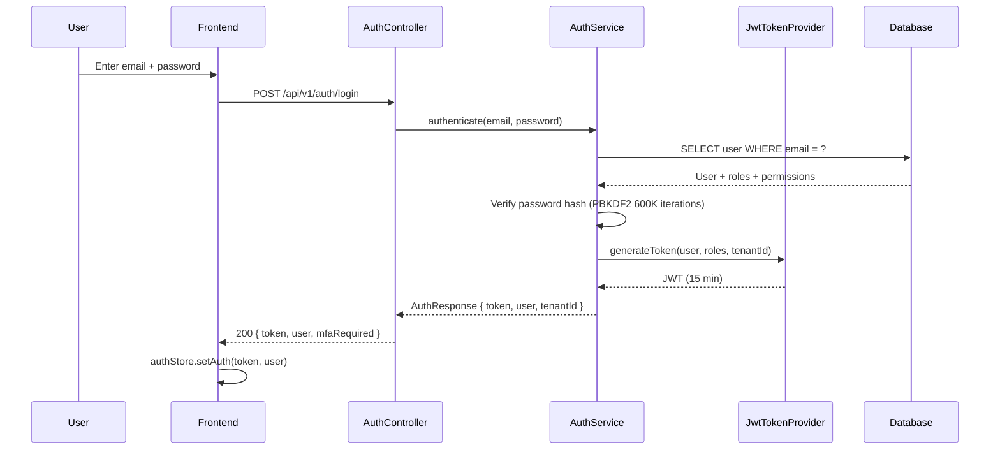
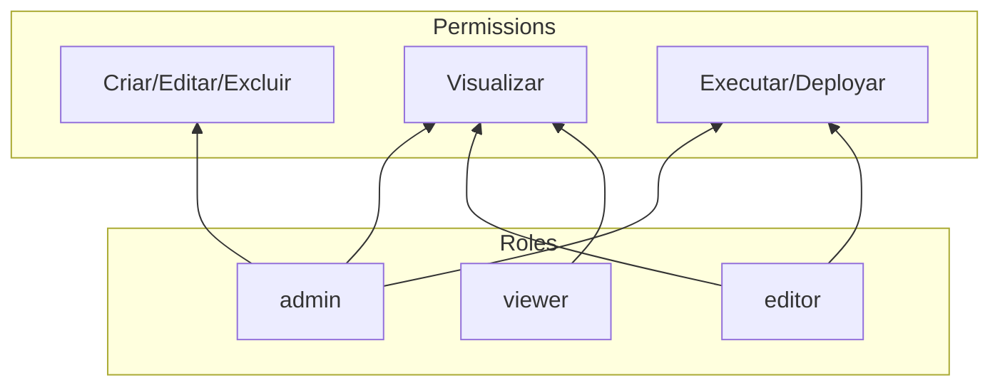
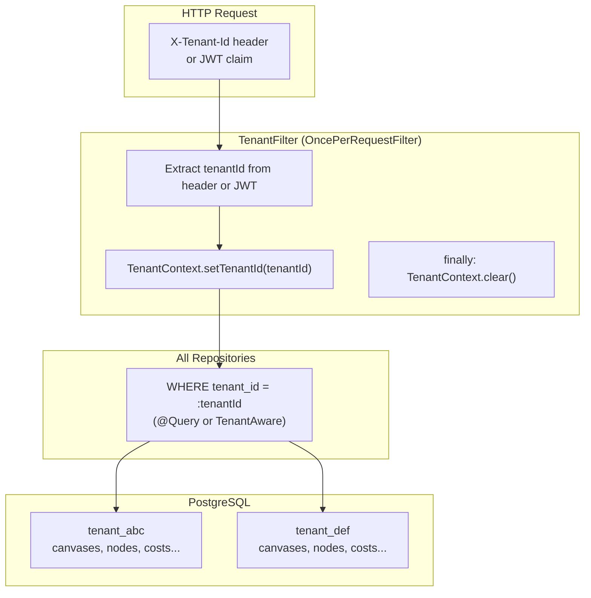
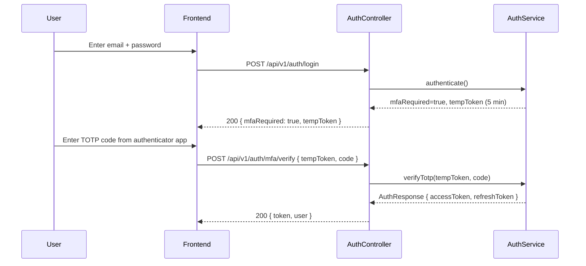
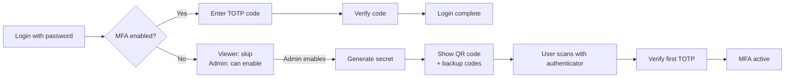
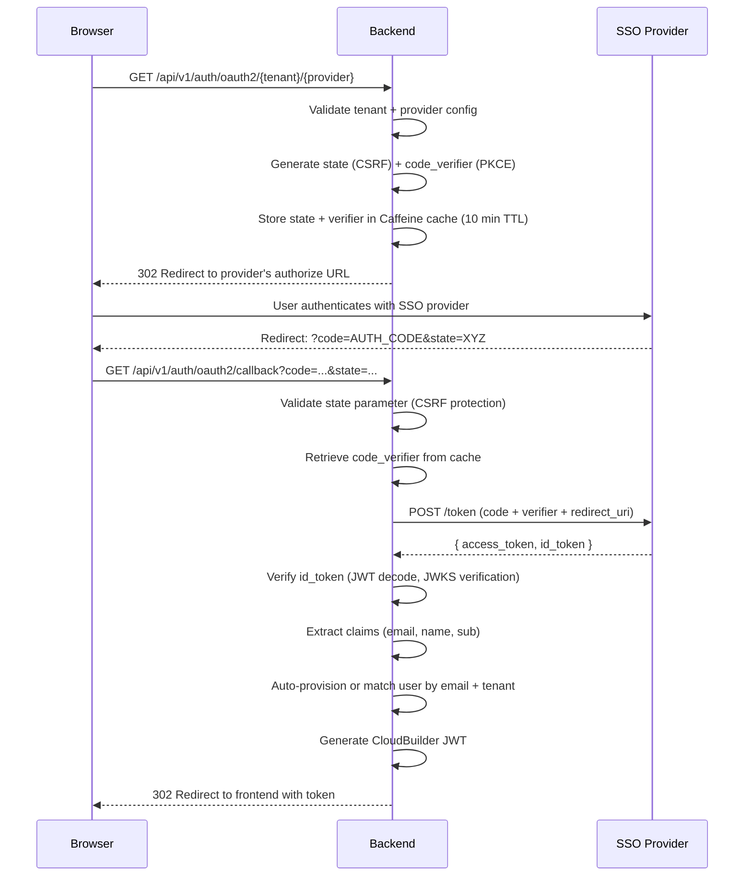
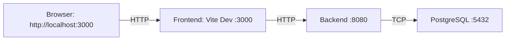
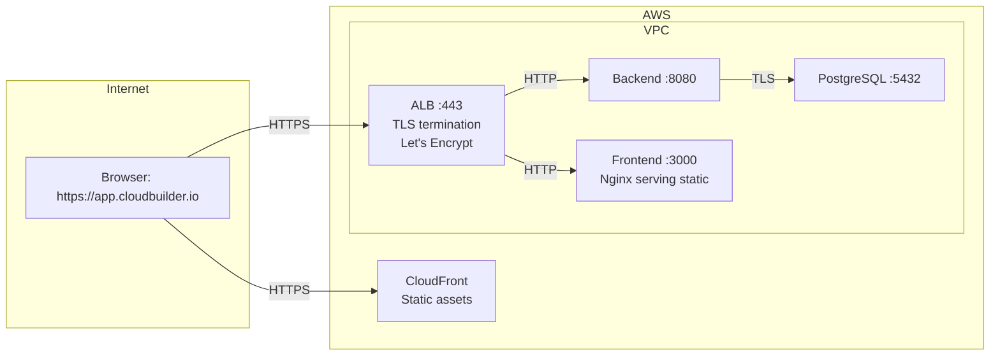

# CloudBuilder — Security Architecture

**Version**: 1.0.0  
**Date**: 2026-06-28  
**Authority**: Principal Security Architect  
**Stack**: Java 21 + Spring Boot 3.4.4 + Spring Security + jjwt 0.12.6

---

> *"Security is not a feature. Security is a property of the system."*
>
> This document defines the security architecture of CloudBuilder — covering authentication, authorization, secrets management, session security, network security, CI/CD security, and compliance with OWASP Top 10.

---

## Table of Contents

1. [Security Posture Overview](#1-security-posture-overview)
2. [Authentication](#2-authentication)
3. [Authorization (RBAC)](#3-authorization-rbac)
4. [Multi-Tenant Isolation](#4-multi-tenant-isolation)
5. [Multi-Factor Authentication (TOTP)](#5-multi-factor-authentication-totp)
6. [SSO / OAuth2 + PKCE](#6-sso--oauth2--pkce)
7. [Secrets Management](#7-secrets-management)
8. [Session Security](#8-session-security)
9. [API Security](#9-api-security)
10. [Network Security & TLS](#10-network-security--tls)
11. [CI/CD Security (SAST/DAST)](#11-cicd-security-sastdast)
12. [Audit & Compliance](#12-audit--compliance)
13. [Threat Model](#13-threat-model)
14. [OWASP Top 10 Coverage](#14-owasp-top-10-coverage)
15. [Security Roadmap](#15-security-roadmap)

---

## 1. Security Posture Overview

### Current Assessment

| Domain | Status | ADR |
|--------|--------|-----|
| Authentication (JWT) | ✅ Complete | ADR-018 |
| Authorization (RBAC) | ✅ Complete | — |
| Multi-Tenant Isolation | ✅ Complete | — |
| MFA (TOTP) | ✅ Complete | ADR-018 |
| SSO (OAuth2 + PKCE) | ✅ Complete | ADR-025 |
| Secrets Encryption | ✅ Complete | ADR-028 |
| JWT Refresh Rotation | ✅ Complete | ADR-018 |
| Audit Logging | ✅ Complete | — |
| Session Management (httpOnly cookies) | 🔧 Proposed | ADR-028 |
| Rate Limiting | 🔧 Proposed | ADR-028 |
| SAST/DAST Pipeline | 📝 Planned | ADR-028 |
| TLS Everywhere | 📝 Planned | ADR-028 |
| Zero Trust Architecture | 📝 Future | — |

### Core Security Principles

1. **Defense in Depth**: Multiple security layers — network, transport, application, data
2. **Least Privilege**: Every user and service has the minimum permissions required
3. **Secure by Default**: Security features enabled by default, opt-out only with explicit risk acceptance
4. **Zero Trust**: Verify every request, regardless of source network
5. **Privacy by Design**: Personal data minimized, encrypted, and never logged unnecessarily

---

## 2. Authentication

### JWT Strategy

CloudBuilder uses **signed JWTs** (jjwt 0.12.6, HMAC-SHA256) for stateless authentication:

```java
// JwtTokenProvider — token generation (simplified)
public String generateToken(User user, List<String> roles, String tenantId) {
    return Jwts.builder()
        .subject(user.getId())
        .claim("roles", roles)
        .claim("tenantId", tenantId)
        .issuedAt(new Date())
        .expiration(new Date(System.currentTimeMillis() + ACCESS_TOKEN_EXPIRATION))
        .signWith(hmacKey)
        .compact();
}
```

**Token claims**:

| Claim | Type | Description |
|-------|------|-------------|
| `sub` | String | User ID (UUID v4) |
| `roles` | String[] | Role names (admin, editor, viewer) |
| `tenantId` | String | Tenant context for multi-tenancy |
| `iat` | Date | Issued at (prevent replay after rotation) |
| `exp` | Date | Expiration (15 minutes) |

### Authentication Flow



### Password Storage

- **Algorithm**: PBKDF2WithHmacSHA256
- **Iterations**: 600,000 (current best practice)
- **Salt**: 16-byte random per password
- **Storage**: `password_hash TEXT` column in `users` table
- **Never**: Plaintext, MD5, SHA-1, unsalted hashes

### Token Validation Filter

Every authenticated request passes through `JwtAuthenticationFilter`:

```
Request → SecurityContextHolder.clearContext()
        → Extract token (Authorization: Bearer or httpOnly cookie)
        → JwtTokenProvider.validateToken(token)
            → Parse + verify signature → extract claims
            → Check expiration → check if revoked (iat ≤ lastPasswordChange)
        → Set SecurityContext (userId, roles, tenantId)
        → Set TenantContext (tenantId in ThreadLocal)
        → Proceed to controller
        → Finally: clear SecurityContext + TenantContext
```

---

## 3. Authorization (RBAC)

### Role Hierarchy



### Module Access Matrix

| Module | admin | editor | viewer |
|--------|-------|--------|--------|
| Design (canvas, nodes, edges) | ✅ | ✅ | ✅ |
| Provision (generate, deploy) | ✅ | ✅ | ✅ (view only) |
| Observe (health, alerts, drift) | ✅ | ✅ | ✅ |
| Cost (budgets, optimization) | ✅ | ✅ | ✅ |
| Platform (catalog, marketplace) | ✅ | ✅ | ✅ |
| AIOps (incidents, chat) | ✅ | ✅ | ✅ |
| Audit (event log) | ✅ | ❌ | ❌ |
| IAM (users, roles, tenants) | ✅ | ❌ | ❌ |
| Settings (system config) | ✅ | ✅ | ✅ |

### Implementation

Authorization is enforced at two levels:

1. **API Gateway** (Spring Security + `@PreAuthorize`):
```java
@PreAuthorize("hasRole('ADMIN')")
@DeleteMapping("/api/v1/canvases/{id}")
public ResponseEntity<Void> deleteCanvas(@PathVariable String id) { ... }
```

2. **Frontend Gating** (conditional rendering):
```tsx
// Module-level gate
<ProtectedContent roles={['admin']}>
  <AuditModule />
</ProtectedContent>

// Action-level gate
<ProtectedAction roles={['admin', 'editor']}>
  <button onClick={handleDeploy}>Confirmar Deploy</button>
</ProtectedAction>
```

### Design Decisions

- **No ABAC (Attribute-Based Access Control)** — RBAC is simpler and sufficient for current scale. ABAC can be layered on top when fine-grained resource-level permissions are needed (Q1 2027).
- **Feature Flags are AND with RBAC** — a flag never overrides RBAC. If a user has `admin` role but the module flag is disabled, the module is hidden.
- **No permission inheritance across tenants** — each tenant is fully isolated.

---

## 4. Multi-Tenant Isolation

### Architecture



### Implementation

- **TenantContext**: ThreadLocal propagated through the entire request lifecycle
- **TenantFilter**: `OncePerRequestFilter` that extracts tenantId from JWT or `X-Tenant-Id` header
- **All tables**: Include `tenant_id VARCHAR(64) NOT NULL` column
- **All queries**: Include `WHERE tenant_id = ?` — either via Spring Data's `@Query` or automaticTenantFilter
- **Cross-tenant access**: Impossible by design — tenantId is never user-configurable in queries
- **Admin override**: Dedicated admin endpoints can query across tenants (audit, billing)

### Tenant Resolution Order

1. JWT `tenantId` claim (for authenticated users)
2. `X-Tenant-Id` header (for API keys / service accounts)
3. Default tenant (for unauthenticated public endpoints like signup)

---

## 5. Multi-Factor Authentication (TOTP)

### Overview

MFA is implemented via **TOTP (RFC 6238)** — Time-based One-Time Password — using `javax.crypto.Mac` with HmacSHA1, compatible with Google Authenticator, Authy, Microsoft Authenticator, and 1Password.

### Key Design Decisions

- **No SMS OTP**: ~R$0.10/message cost; phishing vulnerability; unreliable delivery in Brazil
- **No WebAuthn**: Browser support still fragmented; complex UX setup
- **No external dependency**: Pure JDK crypto + base32 encoding (inline, no library dependency)
- **8 backup codes**: SHA-256 hashed in database; shown once during MFA setup

### MFA Flow



### MFA Setup



### Security Properties

- **TOTP window**: 30 seconds with ±1 step tolerance (90-second window)
- **Secret storage**: Encrypted at rest via `SecretEncryptionConverter`
- **Backup codes**: 8 codes, single-use, SHA-256 hashed
- **Rate limiting**: 5 attempts per minute per user (prevents brute force)

---

## 6. SSO / OAuth2 + PKCE

### Overview

Single Sign-On supports any OAuth2/OIDC provider (Google Workspace, Azure AD, Okta, etc.) using the **Authorization Code flow with PKCE (RFC 7636)**.

### Architecture



### Provider Configuration

Stored in `SsoProviderConfig` entity:

| Field | Description |
|-------|-------------|
| `id` | UUID (string) |
| `tenantId` | Tenant association |
| `providerType` | GOOGLE, AZURE_AD, OKTA, GENERIC_OIDC |
| `clientId` | OAuth2 client ID |
| `clientSecret` | 🔒 Encrypted (AES-256-GCM) |
| `allowedDomains` | Email domains for auto-provisioning |
| `enabled` | Flag to enable/disable |
| `issuerUri` | OIDC issuer URI (for JWKS discovery) |

### Conditional Activation

SSO is disabled by default via `@ConditionalOnProperty(name = "cloudbuilder.sso.enabled", havingValue = "true")`. When disabled:
- `/api/v1/auth/oauth2/*` endpoints return 404
- SSO login button hidden in frontend
- Only username/password authentication available

### User Provisioning

On successful SSO callback, the backend:

1. Extracts claims from the ID token (email, name, `sub`)
2. Looks up user by email in the tenant context
3. **If user exists**: Validates they belong to the tenant; logs them in
4. **If user does not exist**: Auto-creates with `viewer` role (configurable)
5. **Domain filter**: Only email addresses matching `allowedDomains` are auto-provisioned

---

## 7. Secrets Management

### Approach

All secrets are encrypted at rest using **AES-256-GCM** via Spring Crypto's `TextEncryptor`, implemented as a JPA `AttributeConverter`.

### Encryption Architecture

```mermaid
flowchart LR
    subgraph Application
        ENT[Entity<br/>SsoProviderConfig<br/>Credential<br/>NotificationChannel]
        CONV[SecretEncryptionConverter<br/>AttributeConverter]
        KEY[Master Key<br/>CLOUDBUILDER_ENCRYPTION_KEY]
    end

    subgraph Database
        COL[encrypted_client_secret TEXT<br/>encrypted_access_key TEXT<br/>encrypted_config TEXT]
    end

    ENT -->|@Convert| CONV
    CONV -->|encrypt/decrypt| KEY
    CONV -->|AES-256-GCM + base64| COL
```

### Implementation

```java
@Converter
public class SecretEncryptionConverter implements AttributeConverter<String, String> {
    private final TextEncryptor encryptor = Encryptors.text(
        masterKey,  // 256-bit key from CLOUDBUILDER_ENCRYPTION_KEY
        masterSalt  // hex-encoded salt
    );
    
    @Override
    public String convertToDatabaseColumn(String plaintext) {
        return plaintext == null ? null : encryptor.encrypt(plaintext);
    }
    
    @Override
    public String convertToEntityAttribute(String ciphertext) {
        return ciphertext == null ? null : encryptor.decrypt(ciphertext);
    }
}
```

### Protected Fields

| Entity | Encrypted Field | Sensitivity |
|--------|----------------|-------------|
| `SsoProviderConfig` | `clientSecret` | 🔴 Critical |
| `Credential` | `accessKey`, `secretKey` | 🔴 Critical |
| `Credential` | `secretKey` | 🔴 Critical |
| `NotificationChannel` | `config` (webhook URLs) | 🟡 Sensitive |
| `User` | `totpSecret` | 🟡 Sensitive |

### Master Key Management

```yaml
cloudbuilder:
  security:
    encryption-key: ${CLOUDBUILDER_ENCRYPTION_KEY}  # 256-bit hex, NEVER in config
    master-salt: ${CLOUDBUILDER_ENCRYPTION_SALT}     # hex-encoded salt
```

- **Never**: Stored in config files, committed to git, or hardcoded
- **Source**: Environment variable or secret manager (SSM Parameter Store in production)
- **Rotation**: `KeyRotationService` — offline maintenance tool that re-encrypts all secrets with a new key

### Key Rotation Procedure

1. Generate new 256-bit key + salt
2. Run `KeyRotationService.rotateKey(newKey, newSalt)`:
   - Read all encrypted fields using old encryptor
   - Write back using new encryptor
3. Update environment variable
4. Verify application starts successfully
5. Destroy old key material

---

## 8. Session Security

### Current State

JWTs are stored in **localStorage** with the following characteristics:

- **Access token**: 15 minute expiry, stateless HMAC-SHA256
- **Refresh token**: 7 days, stored in `refresh_tokens` table, with rotation
- **Storage**: localStorage (client-side)

### Refresh Token Rotation

```mermaid
flowchart TD
    A[Access token expires] --> B[POST /api/v1/auth/refresh]
    B --> C{Refresh token valid?}
    C -->|Yes| D[Revoke old refresh token]
    D --> E[Issue new access + refresh tokens]
    E --> F[Return 200]
    C -->|Revoked (theft detected)| G[Return 401]
    G --> H[Force re-login]
    C -->|Expired| G
```

### Planned Improvements (ADR-028)

| Current | Target | Rationale |
|---------|--------|-----------|
| localStorage JWT | httpOnly + Secure + SameSite cookies | XSS protection |
| Manual token header | Auto-sent by browser | Reduced XSS surface |
| Bearer Authorization header | Cookie-based | CSRF mitigated by SameSite=Strict |

### Logout

```typescript
// authStore
logout: async () => {
    await api.post('/api/v1/auth/logout', { refreshToken });
    localStorage.removeItem('cloudbuilder_token');
    localStorage.removeItem('cloudbuilder_user');
    // Alternative: clear httpOnly cookie server-side
    window.location.href = '/login';
}
```

### Token Revocation

- **Per-token**: Revoke specific refresh token (immediate)
- **Per-user**: Increment `token_version` on user entity (invalidates all JWTs with old `iat`)
- **Global**: Emergency `POST /api/v1/auth/revoke-all` (admin) — changes signing key version

---

## 9. API Security

### Request Security Pipeline

```mermaid
flowchart LR
    REQ[HTTP Request] --> RATE[Rate Limiting<br/>In-process Caffeine]
    RATE --> TLS[TLS Termination<br/>Nginx or Embedded]
    TLS --> CORS[CORS Filter<br/>Per-environment]
    CORS --> AUTH[JwtAuthenticationFilter]
    AUTH --> TENANT[TenantFilter]
    TENANT --> LOG[Audit Logging<br/>AuditEvent]
    LOG --> PRE[PreAuthorize<br/>Role check]
    PRE --> CTRL[Controller<br/>@Valid DTO]
    CTRL --> SRV[Service]
```

### Rate Limiting

| Endpoint Group | Limit | Window | Rationale |
|---------------|-------|--------|-----------|
| `/api/v1/auth/login` | 10 | 1 min | Brute force protection |
| `/api/v1/auth/refresh` | 20 | 1 min | Token abuse prevention |
| `/api/v1/auth/oauth2/*` | 10 | 1 min | SSO abuse prevention |
| `/api/v1/scim/v2/*` | 100 | 1 min | Enterprise provisioning |
| `/api/v1/aiops/query` | 30 | 1 min | LLM API cost protection |
| `/api/v1/*` (default) | 100 | 1 min | General API usage |

Implementation: In-process Caffeine cache keyed by `IP + endpoint`. Resets on application restart — acceptable for current scale. Production will use distributed rate limiting (Redis or Nginx).

### Input Validation

- **All DTOs**: `@Valid` with Jakarta Bean Validation annotations (`@NotBlank`, `@Email`, `@Size`, `@Pattern`)
- **SQL Injection**: Prevented by JPA parameterized queries (no string concatenation)
- **XSS**: Output encoding in frontend (React auto-escapes); Content Security Policy headers
- **Path Traversal**: DocScannerService validates paths against allowed base directories
- **JSON Injection**: Jackson default typing disabled; strict DTOs

### CORS Configuration

```yaml
cloudbuilder:
  cors:
    allowed-origins: ${CLOUDBUILDER_CORS_ORIGINS:http://localhost:3000}
    allowed-methods: GET,POST,PUT,DELETE,PATCH,OPTIONS
    allowed-headers: Authorization,Content-Type,X-Tenant-Id
    max-age: 3600
```

Per-profile configuration:
- **dev**: `http://localhost:3000` (Vite dev server)
- **prod**: Production domain

### API Versioning

Header-based versioning to avoid breaking clients:

```
Accept: application/vnd.cloudbuilder.v1+json
```

---

## 10. Network Security & TLS

### Current (Dev)



No TLS in development. All services on localhost.

### Planned (Production)



### TLS Strategy

| Environment | Approach | Certificate |
|-------------|----------|-------------|
| Development | Self-signed (optional nginx sidecar) | Manual generation |
| Production | Let's Encrypt + cert-manager | Auto-renewed |
| Inter-service | Internal network (VPC) | No TLS needed |

### Secrets in Transit

- **Frontend → Backend**: HTTPS (production), HTTP (dev)
- **Backend → PostgreSQL**: TLS (production), no TLS (dev container)
- **Backend → Go Engine**: gRPC over localhost (no TLS needed)

---

## 11. CI/CD Security (SAST/DAST)

### Pipeline

```yaml
# .github/workflows/ci.yml — security steps
security-scan:
  runs-on: ubuntu-latest
  steps:
    - uses: actions/checkout@v4
    
    - name: Secret Scanning
      uses: gitleaks/gitleaks-action@v2
    
    - name: SAST (Semgrep)
      run: semgrep --config=auto --error .
    
    - name: Dependency Check
      uses: dependency-check/Dependency-Check_Action@main
      with:
        project: 'cloudbuilder'
        path: 'backend/pom.xml'
        format: 'HTML'
    
    - name: CodeQL Analysis
      uses: github/codeql-action/analyze@v3
      with:
        languages: java-kotlin, javascript-typescript
        queries: security-extended,security-and-quality
```

### Coverage

| Tool | Type | Detects |
|------|------|---------|
| **Gitleaks** | Secret scanning | Hardcoded passwords, API keys, tokens in git |
| **Semgrep** | SAST | OWASP Top 10 patterns, SQL injection, XSS, insecure crypto |
| **OWASP Dependency Check** | SCA | Known CVEs in Maven dependencies |
| **GitHub CodeQL** | SAST | Security vulnerabilities in Java + TypeScript |
| **ZAP Baseline** | DAST (nightly) | Runtime vulnerabilities in staging |

### Security Gates

- **Push**: Secret scanning (critical) + Semgrep (critical rules)
- **PR**: Full SAST + Dependency Check + CodeQL
- **Nightly**: DAST (ZAP) against staging
- **Release**: Full security report must pass

---

## 12. Audit & Compliance

### Audit Event Model

Every security-relevant action is recorded as an `AuditEvent`:

```java
@Entity
@Table(name = "audit_events")
public class AuditEvent {
    @Id private String id;
    private String tenantId;
    private String userId;
    private String action;       // LOGIN, LOGOUT, MFA_ENABLE, ROLE_CHANGE, etc.
    private String resourceType; // USER, CANVAS, DEPLOYMENT, etc.
    private String resourceId;
    @Column(columnDefinition = "TEXT")
    private String details;      // JSON with request context
    private String ipAddress;
    private String userAgent;
    private String outcome;      // SUCCESS, FAILURE
    private Instant timestamp;
}
```

### Security-Relevant Events

| Event | Logged | Retention |
|-------|--------|-----------|
| Login (success) | ✅ | 1 year |
| Login (failure) | ✅ | 1 year |
| Logout | ✅ | 1 year |
| MFA enabled/disabled | ✅ | 1 year |
| Password change | ✅ | 1 year |
| Role change | ✅ | 2 years |
| SSO login | ✅ | 1 year |
| API key creation/deletion | ✅ | 1 year |
| Failed authorization | ✅ | 1 year |
| Rate limit triggered | ✅ | 30 days |
| Secret key rotation | ✅ | 2 years |
| Tenant configuration change | ✅ | 2 years |

### Audit API

```
GET /api/v1/audit/events?action=LOGIN&from=2026-06-01&to=2026-06-28&page=0&size=50
```

Filtered by `tenantId` (automatic), with admin override for cross-tenant queries.

---

## 13. Threat Model

### Assets

| Asset | Criticality | Description |
|-------|-------------|-------------|
| User credentials | 🔴 Critical | Password hashes, TOTP secrets |
| Cloud credentials | 🔴 Critical | AWS/Azure/GCP access keys |
| JWT signing key | 🔴 Critical | HMAC secret for token signing |
| Encryption master key | 🔴 Critical | AES-256 key for secrets |
| Canvas designs | 🟡 High | Infrastructure topology data |
| Deployment plans | 🟡 High | Infrastructure change plans |
| Audit logs | 🟡 High | Compliance-relevant event data |
| Session tokens | 🟡 High | Active user sessions |

### Threat Scenarios

| ID | Threat | Likelihood | Impact | Mitigation |
|----|--------|-----------|--------|------------|
| T1 | Credential theft via XSS | Medium | 🔴 Critical | httpOnly cookies, CSP headers |
| T2 | JWT token theft | Medium | 🔴 Critical | Short expiry, refresh rotation |
| T3 | SQL injection | Low | 🔴 Critical | Parameterized queries (JPA) |
| T4 | Cross-tenant data access | Low | 🔴 Critical | TenantFilter, tenantId in every query |
| T5 | Brute force login | Medium | 🟡 High | Rate limiting, account lockout |
| T6 | SSRF to internal services | Low | 🟡 High | Outbound request validation |
| T7 | Dependency vulnerability | Medium | 🟡 High | Dependabot + OWASP Dependency Check |
| T8 | Supply chain (npm/Maven) | Low | 🟡 High | Package lock, integrity checks |
| T9 | Insecure direct object reference | Low | 🟡 High | Ownership validation in services |
| T10 | Session fixation | Low | 🟡 Medium | New session on login, refresh rotation |

---

## 14. OWASP Top 10 Coverage

| OWASP 2021 | Coverage | Details |
|------------|----------|---------|
| **A01: Broken Access Control** | ✅ Complete | `@PreAuthorize` on every endpoint, RBAC, TenantFilter |
| **A02: Cryptographic Failures** | ✅ Complete | AES-256-GCM for secrets, PBKDF2 for passwords, JWT HMAC |
| **A03: Injection** | ✅ Complete | `@Valid` DTOs, JPA parameterized queries, CSP headers |
| **A04: Insecure Design** | ✅ Complete | MFA (ADR-018), SSO (ADR-025), rate limiting proposals |
| **A05: Security Misconfiguration** | ⚠️ Partial | Profile-based CORS exists. TLS not yet in dev |
| **A06: Vulnerable Components** | ⚠️ Partial | Dependabot configured. CodeQL + Semgrep proposed |
| **A07: ID & Auth Failures** | ⚠️ Partial | JWT in localStorage → httpOnly cookies proposed |
| **A08: Software/Data Integrity** | ⚠️ Partial | SAST pipeline designed but not fully integrated |
| **A09: Security Logging & Monitoring** | ✅ Complete | AuditEvent for all security-relevant actions |
| **A10: SSRF** | 📝 Planned | Outbound request validation needed for webhook/callback features |

---

## 15. Security Roadmap

### Q2 2026 (Current) — Foundation ✅

- [x] JWT authentication (jjwt 0.12.6) with HMAC-SHA256
- [x] RBAC with 3 roles (admin, editor, viewer)
- [x] Multi-tenant isolation (TenantFilter + tenantId column)
- [x] Password hashing (PBKDF2 600K iterations)
- [x] Audit logging for security events

### Q3 2026 — Hardening 🔧

- [x] TOTP MFA (ADR-018)
- [x] JWT refresh token rotation (ADR-018)
- [x] SSO OAuth2 + PKCE (ADR-025)
- [x] Secrets encryption (AES-256-GCM) (ADR-028)
- [ ] httpOnly cookies for session storage
- [ ] Rate limiting interceptor
- [ ] CI/CD security pipeline (CodeQL + Gitleaks + Dependency Check)

### Q4 2026 — Production

- [ ] TLS everywhere (Let's Encrypt)
- [ ] CSP (Content Security Policy) headers
- [ ] SAST/DAST pipeline integrated
- [ ] Penetration testing
- [ ] Security documentation for users
- [ ] API key management for service accounts

### Q1 2027 — Enterprise

- [ ] SCIM provisioning (ADR-026)
- [ ] Zero Trust architecture
- [ ] Vault for secrets management (if scale requires)
- [ ] SOC 2 compliance preparation
- [ ] LGPD compliance (Brazil)
- [ ] Security information and event management (SIEM) integration

---

## References

- **ADRs**: ADR-018 (MFA + JWT Refresh), ADR-025 (SSO), ADR-028 (Security Hardening)
- **Files**: `JwtTokenProvider.java`, `SecurityConfig.java`, `AuthController.java`, `AuthService.java`, `SecretEncryptionConverter.java`, `SsoAuthController.java`, `SsoAuthService.java`, `MfaService.java`, `AuditService.java`
- **Standards**: OWASP Top 10 (2021), RFC 6238 (TOTP), RFC 7636 (PKCE), RFC 7519 (JWT)
- **Practices**: Spring Security Reference, jjwt 0.12.6 docs, PBKDF2 best practices (OWASP)
- **Architecture Manifesto**: Principle 10 — Security by Design, Principle 9 — Platform Engineering
- **Brazilian Context**: LGPD compliance (Lei 13.709/2018), SMS delivery risks in Brazil (TOTP preferred)
