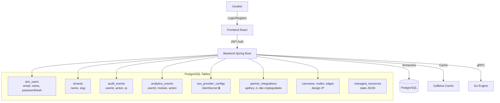

# LGPD Compliance Assessment — CloudBuilder

**Data**: 2026-06-23
**Versão**: 1.0
**Classificação**: Interno — Legal/Compliance
**Aprovadores necessários**: DPO, CTO, Legal

---

## 1. Escopo

Este documento avalia a conformidade da plataforma CloudBuilder com a Lei Geral de Proteção de Dados (LGPD — Lei 13.709/2018), incluindo as alterações da Medida Provisória 1.317/2025 (que transformou a ANPD em agência reguladora independente) e o Mapa de Prioridades de Fiscalização 2026-2027 da ANPD.

### 1.1 Aplicabilidade

CloudBuilder **deve** cumprir a LGPD porque:
- Processa dados de indivíduos localizados no Brasil (art. 3º, I)
- Oferece serviços para empresas brasileiras (fintechs, enterprises) (art. 3º, II)
- Dados são coletados em território brasileiro (art. 3º, III)
- **Não há limite mínimo de faturamento** — todas as organizações estão sujeitas

**Risco regulatório**: Multas de até 2% do faturamento no Brasil (limitadas a R$ 50 milhões por infração), além de suspensão de atividades, bloqueio de dados, e publicização da violação.

---

## 2. Inventário de Dados

### 2.1 Mapeamento completo de dados pessoais e sensíveis

| Categoria | Dados | Onde está | Base Legal | Sensibilidade | Retenção Atual |
|-----------|-------|-----------|------------|---------------|----------------|
| **Identificação** | email, name, passwordHash (bcrypt) | `iam_users` | Contrato (art. 7º, V) / Consentimento (art. 7º, I) | Média | Indeterminada (vitalícia da conta) |
| **Autenticação** | JWT tokens (contêm email, roles, tenantId, sub) | Em trânsito (header Authorization) | Contrato / Legítimo Interesse (art. 7º, V/IX) | Média | 15 min (access) / 7 dias (refresh) |
| **Controle de Acesso** | roles, permissions, tenantId | `iam_users`, `iam_roles`, `iam_permissions`, `tenant_users` | Contrato | Baixa | Indeterminada |
| **Tenant** | name, slug, settings | `tenants` | Contrato | Baixa | Indeterminada |
| **Cloud Credentials** | API keys, client secrets (AES-256-GCM) | `sso_provider_configs`, `partner_integrations` | Contrato / Legítimo Interesse | **Alta** | Indeterminada |
| **Designs de Infra** | Canvas nodes, edges, properties, metadados | `canvases`, `canvas_nodes`, `canvas_edges`, `canvas_versions` | Contrato / Legítimo Interesse | Média (PI) | Indeterminada |
| **Recursos Gerenciados** | state JSON, properties, tags | `managed_resources`, `environments`, `deploy_plans` | Contrato | Média | Indeterminada |
| **Auditoria** | userId, tenantId, action, resourceType, resourceId, ipAddress, details | `audit_events` | Obrigação Legal (art. 7º, II) / Legítimo Interesse | Média | Indeterminada |
| **Analytics** | eventType, userId, module, action, metadata, sessionId | `analytics_events`, `analytics_user_rollup_daily`, `analytics_rollup_daily`, `analytics_rollup_monthly` | Consentimento (art. 7º, I) / Legítimo Interesse | Média | Indeterminada |
| **Métricas** | metric points, resource metrics | `metrics` | Legítimo Interesse | Baixa | Indeterminada |
| **SSO** | clientSecret (criptografado), clientId, allowedDomains | `sso_provider_configs` | Contrato | **Alta** | Indeterminada |
| **Partner Integrations** | apiKeyEncrypted (NÃO criptografado), apiEndpoint, configuration | `partner_integrations` | Contrato | **Alta** | Indeterminada |
| **Password Reset** | reset tokens (temporário) | `password_reset_tokens` | Contrato | Alta | 1 hora (expira) |
| **Sessões/MFA** | session info, MFA secrets | `sessions`, `user_mfa` | Contrato | Média | Indeterminada |

### 2.2 Fluxo de Dados

### 2.3 Dados por Perfil de Usuário

| Papel | Dados Acessíveis | Dados Coletados |
|-------|-----------------|-----------------|
| **Admin** | Todos os dados do tenant | email, name, roles, audit trail |
| **Editor** | Designs, provisionamento, custos | email, name, roles, analytics |
| **Viewer** | Leitura de designs, dashboards | email, name, roles, analytics |
| **Usuário SSO** | Conforme papel + SSO provider | email, name, ssoProvider, ssoOnly flag |

---

## 3. Bases Legais Aplicáveis (Art. 7º LGPD)

### 3.1 Execução de Contrato (Art. 7º, V)

**Aplicação**: Dados necessários para operação da plataforma
- **Dados de cadastro** (email, name): necessários para criar e manter conta
- **Credenciais cloud**: necessárias para provisionar infraestrutura
- **Designs**: conteúdo criado pelo usuário sob os Termos de Serviço

**Requisito**: Termos de Serviço devem descrever claramente quais dados são necessários para quais funcionalidades.

### 3.2 Obrigação Legal (Art. 7º, II)

**Aplicação**:
- **Audit logs**: retenção obrigatória para compliance (Marco Civil da Internet, LGPD)

**Requisito**: Definir política de retenção mínima de 6 meses para audit logs.

### 3.3 Legítimo Interesse (Art. 7º, IX)

**Aplicação**:
- **Analytics de uso**: melhorias de produto
- **Métricas de performance**: operação da plataforma
- **Drift detection**: segurança da infraestrutura dos usuários

**Requisito**: Realizar Legitimate Interest Assessment (LIA) documentada para cada uso.

### 3.4 Consentimento (Art. 7º, I)

**Aplicação**:
- **Cookies não essenciais**: analytics tracking
- **Marketing/newsletters**
- **Compartilhamento com terceiros**

**Requisito**: Implementar banner de consentimento com opt-in afirmativo para cookies não essenciais (conforme ANPD Cookie Guidelines, out/2022).

### 3.5 Exercício Regular de Direitos (Art. 7º, VI)

**Aplicação**:
- **Audit logs**: necessários para defesa em processos judiciais/administrativos
- **Compliance rules**: evidência para SOC 2 / ISO 27001

---

## 4. Política de Retenção de Dados — Recomendação

### 4.1 Tabela de Retenção Proposta

| Categoria | Prazo de Retenção | Justificativa | Ação Após Prazo |
|-----------|-------------------|---------------|-----------------|
| **Cloud Credentials** | Até exclusão pelo usuário ou 90 dias de inatividade | Segurança — limite de exposição | Exclusão segura (DELETE + zerar) |
| **Canvas Designs** | Até exclusão pelo usuário, máx. 1 ano após encerramento da conta | PI do usuário; período de reativação | Notificar antes de excluir |
| **Audit Logs** | **6 meses** (mínimo LGPD) | Obrigação legal; defesa em processos | Anonimizar ou excluir |
| **Analytics (identificados)** | 90 dias | Melhoria de produto; limite de utilidade | Anonimizar (aggregate only) |
| **Analytics (anonimizados)** | Indeterminado (agregados) | Não se aplica LGPD (dados anonimizados) | — |
| **Password Reset Tokens** | 1 hora (expiração automática) | Segurança | TTL do token |
| **Sessões/MFA** | Até logout ou 30 dias de inatividade | Experiência do usuário | Exclusão automática |
| **Account Data (email, name)** | Até exclusão da conta | Contrato | Exclusão completa |
| **Métricas de Performance** | 90 dias (rollup mensal: 1 ano) | Operação; troubleshooting | Rollup → descartar detalhes |

### 4.2 Implementação Técnica Necessária

| Requisito | Prioridade | Complexidade |
|-----------|-----------|--------------|
| Job scheduler para limpeza de dados expirados | **Alta** | Média |
| Anonimização de analytics após 90 dias | **Alta** | Baixa (UPDATE com hash) |
| Notificação pré-exclusão (30 dias) | Média | Média |
| Política de backup compatível com retenção | Média | Baixa |
| TTL automático para tokens de reset | ✅ Já implementado | — |
| Auditoria de exc
