# CloudBuilder — Complete Diagram Reference

All Mermaid diagrams for the CloudBuilder platform. Organized by domain.

---

## 1. System Architecture

### High-Level System Overview

```mermaid
flowchart TB
    User([Developer])

    subgraph CloudBuilder
        UI["Frontend"]
        Gateway["API Gateway"]
        Integration["Cloud Integration Platform"]
        Credential["Credential Manager"]
        Secret["Secret Manager (Vault)"]
        Discovery["Discovery Engine"]
        Provision["Provision Engine"]
        Deploy["Deployment Engine"]
        EventBus[(Kafka)]
    end

    subgraph Providers
        AWS
        Azure
        GCP
        Cloudflare
        DigitalOcean
        Vercel
        Netlify
        Railway
        Render
        FlyIO["Fly.io"]
        Supabase
        Neon
        PlanetScale
        MongoDBAtlas["MongoDB Atlas"]
        Upstash
        Stripe
        GitHub
        GitLab
        Bitbucket
    end

    User --> UI
    UI --> Gateway
    Gateway --> Integration
    Integration --> Credential
    Integration --> Secret
    Integration --> Discovery
    Integration --> Provision
    Integration --> Deploy

    Provision --> EventBus
    Deploy --> EventBus

    Integration --> AWS
    Integration --> Azure
    Integration --> GCP
    Integration --> Cloudflare
    Integration --> DigitalOcean
    Integration --> Vercel
    Integration --> Netlify
    Integration --> Railway
    Integration --> Render
    Integration --> FlyIO
    Integration --> Supabase
    Integration --> Neon
    Integration --> PlanetScale
    Integration --> MongoDBAtlas
    Integration --> Upstash
    Integration --> Stripe
    Integration --> GitHub
    Integration --> GitLab
    Integration --> Bitbucket
```

### Platform Components

```mermaid
flowchart TB
    CloudBuilder[CloudBuilder]
    CloudBuilder --> Identity[Identity]
    CloudBuilder --> Workspace[Workspace]
    CloudBuilder --> CredentialMgr[Credential Manager]
    CloudBuilder --> ProviderReg[Provider Registry]
    CloudBuilder --> DiscoveryEng[Discovery Engine]
    CloudBuilder --> AIArchitect[AI Architect]
    CloudBuilder --> ProvisionEng[Provision Engine]
    CloudBuilder --> DeployEng[Deployment Engine]
    CloudBuilder --> Observability[Observability]
    CloudBuilder --> FinOps[FinOps]

    ProviderReg --> AWS
    ProviderReg --> Azure
    ProviderReg --> GCP
    ProviderReg --> Kubernetes
    ProviderReg --> Vercel
    ProviderReg --> Railway
    ProviderReg --> Render
    ProviderReg --> FlyIO
    ProviderReg --> Netlify
    ProviderReg --> Cloudflare
    ProviderReg --> Supabase
    ProviderReg --> Neon
    ProviderReg --> PlanetScale
    ProviderReg --> MongoDBAtlas
    ProviderReg --> Upstash
    ProviderReg --> GitHub
    ProviderReg --> GitLab
    ProviderReg --> Bitbucket
    ProviderReg --> Stripe
```

---

## 2. Integration Platform

### Integration API Flow

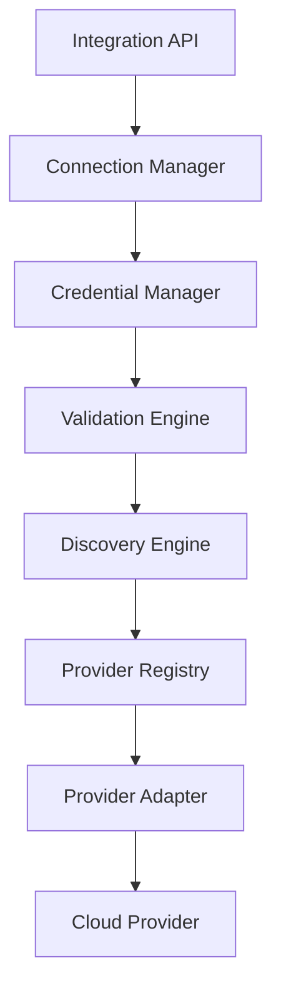

### Connection Sequence

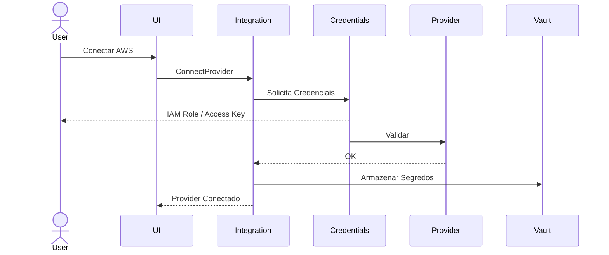

### Provider Interface Lifecycle

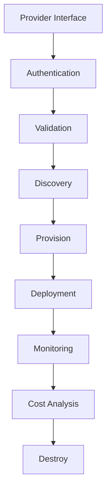

### Integration Platform Directory Structure

```
integration-platform/
├── provider-registry
├── credential-manager
├── vault-integration
├── oauth-service
├── discovery-engine
├── resource-inventory
├── provider-sdk
├── provider-marketplace
├── webhook-engine
├── synchronization-engine
├── event-publisher
├── audit-service
└── policy-enforcer
```

---

## 3. Provider Registry

### Provider Registry Plugins

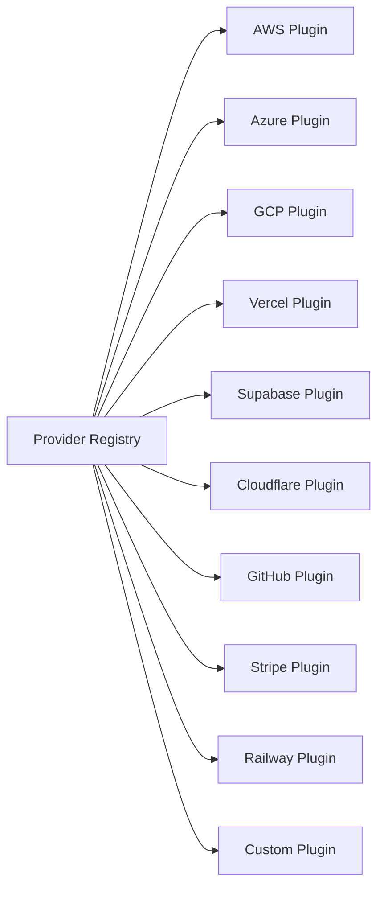

### Hexagonal Architecture

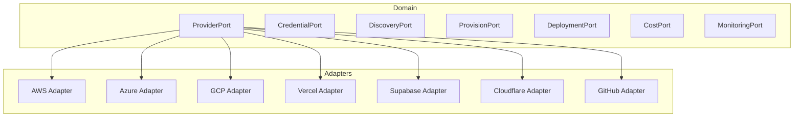

---

## 4. Provider Ecosystem

### AWS Adapter

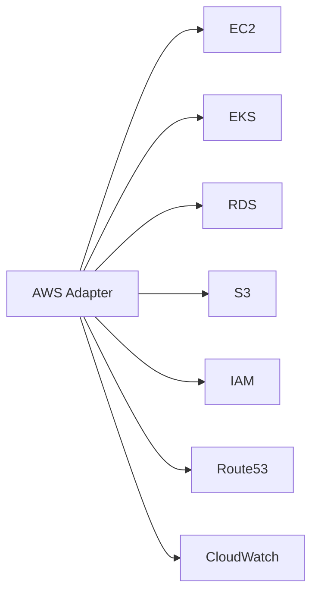

### Azure Adapter

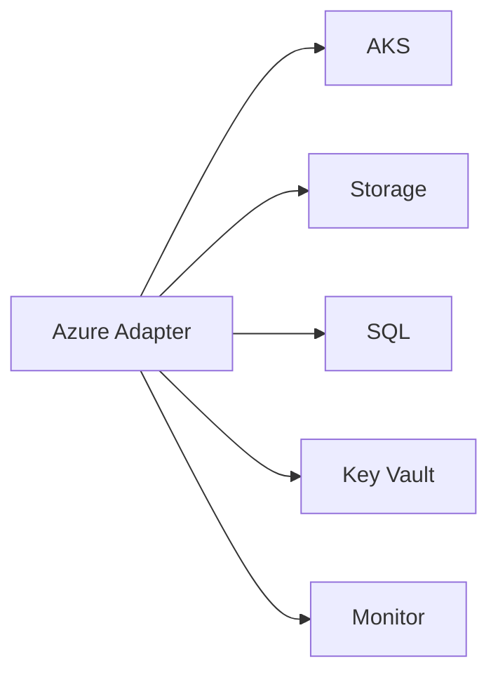

### GCP Adapter

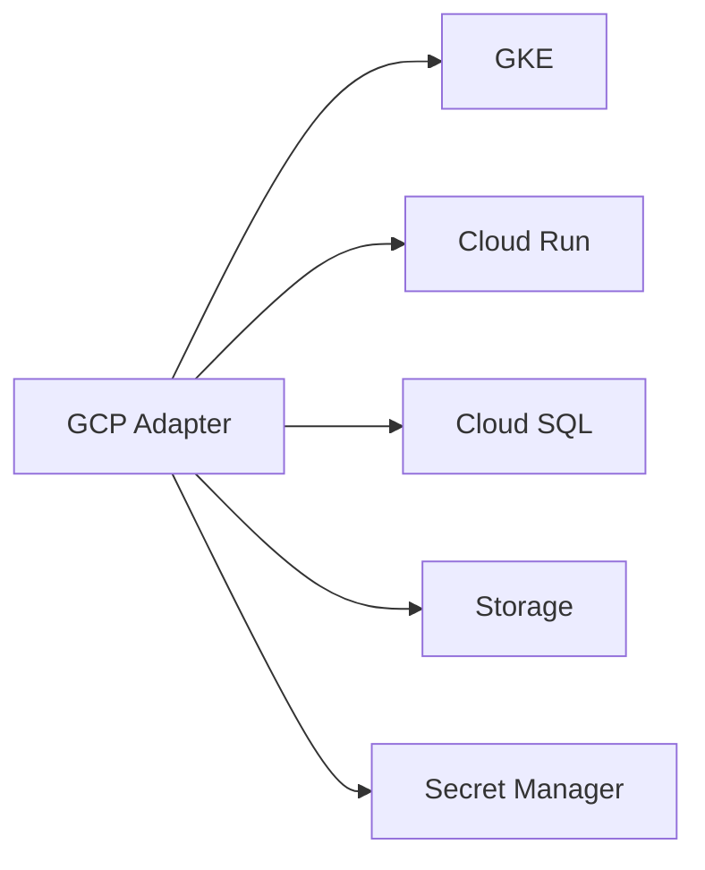

### PaaS Adapter

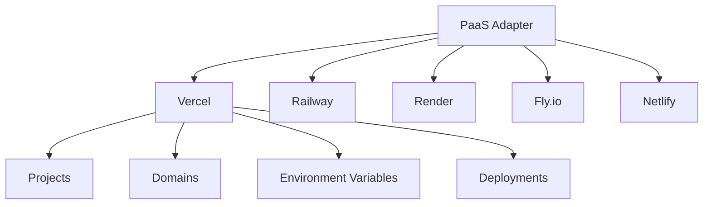

### Database Adapter

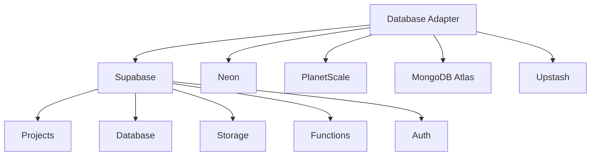

### Git Adapter

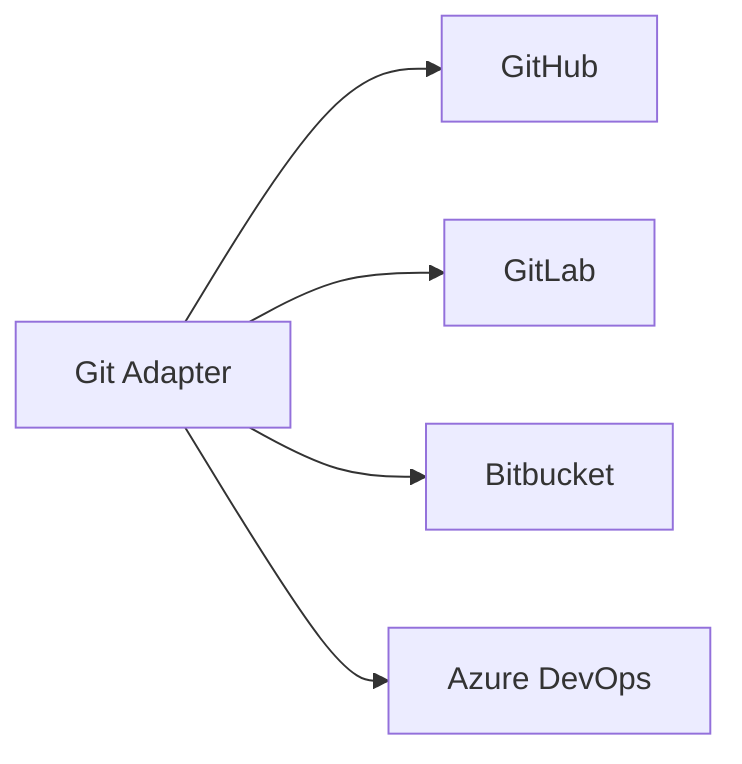

---

## 5. Discovery Engine

### Discovery Engine Flow

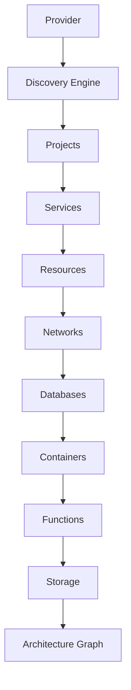

### Discovery Pipeline

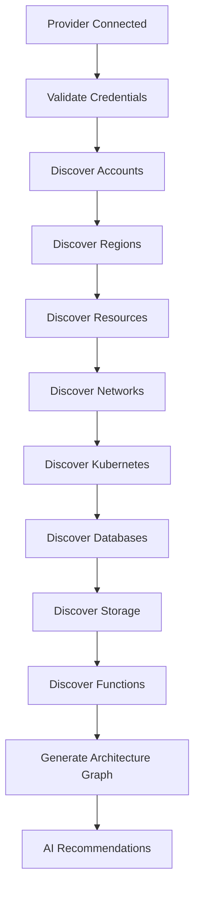

---

## 6. Collaboration Platform

### Collaboration System

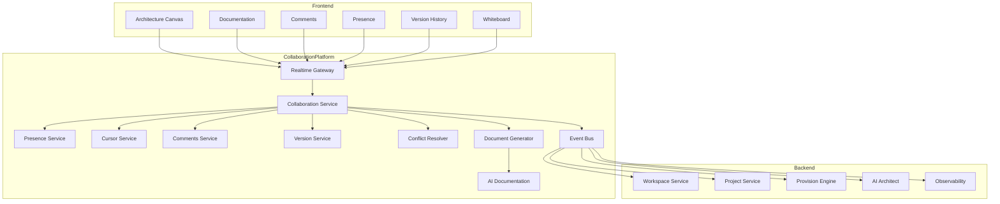

### Realtime Collaboration Flow

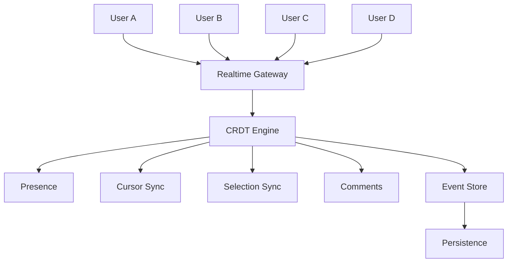

### Cursor Sync Sequence

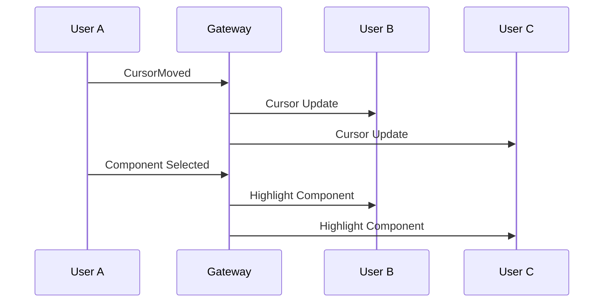

### Drag & Drop Realtime Flow

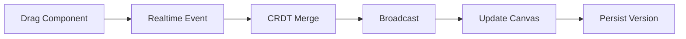

---

## 7. Organization & Teams

### Organization Hierarchy

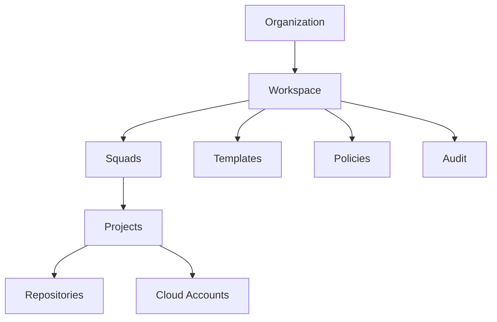

### Team Structure

```mermaid
flowchart TB
    Organization[Organization]

    Organization --> PlatformTeam[Platform Team]
    Organization --> BackendTeam[Backend Team]
    Organization --> FrontendTeam[Frontend Team]
    Organization --> DevOpsTeam[DevOps Team]
    Organization --> SecurityTeam[Security Team]
    Organization --> ProductTeam[Product Team]

    PlatformTeam --> Members1[Members]
    BackendTeam --> Members2[Members]
    FrontendTeam --> Members3[Members]
    DevOpsTeam --> Members4[Members]
    SecurityTeam --> Members5[Members]
    ProductTeam --> Members6[Members]
```

### RBAC Roles

```mermaid
flowchart LR
    Owner[Owner]
    Admin[Admin]
    PlatformEng[Platform Engineer]
    TechLead[Tech Lead]
    Developer[Developer]
    Viewer[Viewer]

    Owner --> Policies[Políticas]
    Admin --> Settings[Settings]
    PlatformEng --> Provision[Provision]
    Developer --> Canvas[Canvas]
    Viewer --> Documentation[Documentation]
```

---

## 8. Canvas & Design

### Canvas Layout (Wireframe)

```
+-----------------------------------------------------------------------------------+
| Top Navigation                                                                    |
|-----------------------------------------------------------------------------------|
| Logo | Projeto | Ambiente | Branch | Search | AI | Notifications | Profile       |
+-----------------------------------------------------------------------------------+

+-------------+------------------------------------------------------+-------------+
|             |                                                      |             |
|             |                                                      |             |
| Componentes |                 Canvas                              | Properties  |
|             |                                                      |             |
|             |                                                      |             |
|-------------|------------------------------------------------------|-------------|
| Templates   |                                                      | Inspector   |
| Marketplace |                                                      | Variables   |
| Cloud       |                                                      | Policies    |
| Kubernetes  |                                                      | Tags        |
| Terraform   |                                                      | Metrics     |
+-------------+------------------------------------------------------+-------------+

+-----------------------------------------------------------------------------------+
| AI Chat | Documentation | Logs | Events | Console | Git | History               |
+-----------------------------------------------------------------------------------+
```

### Workspace Hierarchy

```mermaid
flowchart LR
    Workspace[Workspace]
    Pages[Pages]
    Boards[Boards]
    Layers[Layers]
    Components[Components]
    Connections[Connections]
    Annotations[Annotations]
    Documentation[Documentation]
    ArchGraph[Architecture Graph]

    Workspace --> Pages
    Pages --> Boards
    Boards --> Layers
    Layers --> Components
    Components --> Connections
    Connections --> Annotations
    Annotations --> Documentation
    Documentation --> ArchGraph
```

### Canvas Layers

```mermaid
flowchart TB
    Canvas[Canvas]
    Background[Background]
    Grid[Grid]
    InfraLayer[Infrastructure Layer]
    AppLayer[Application Layer]
    NetworkLayer[Network Layer]
    SecurityLayer[Security Layer]
    Annotations[Annotations]
    CommentsLayer[Comments]
    SelectionLayer[Selection Layer]
    RealtimeLayer[Realtime Layer]

    Canvas --> Background
    Canvas --> Grid
    Canvas --> InfraLayer
    Canvas --> AppLayer
    Canvas --> NetworkLayer
    Canvas --> SecurityLayer
    Canvas --> Annotations
    Canvas --> CommentsLayer
    Canvas --> SelectionLayer
    Canvas --> RealtimeLayer
```

### Component Library

```mermaid
flowchart TB
    CompLib[Component Library]

    CompLib --> AWS
    CompLib --> Azure
    CompLib --> GCP
    CompLib --> Kubernetes
    CompLib --> Docker
    CompLib --> Terraform
    CompLib --> Databases
    CompLib --> Messaging
    CompLib --> Networking
    CompLib --> Security
    CompLib --> Monitoring
    CompLib --> CustomComponents[Custom Components]
```

### Component Workflow

```mermaid
flowchart LR
    DragComp[Drag Component]
    Drop[Drop]
    Configure[Configure]
    Connect[Connect]
    Validate[Validate]
    Save[Save]
    GenDocs[Generate Documentation]
    GenTerraform[Generate Terraform]

    DragComp --> Drop
    Drop --> Configure
    Configure --> Connect
    Connect --> Validate
    Validate --> Save
    Save --> GenDocs
    Save --> GenTerraform
```

### Component Types

```mermaid
flowchart LR
    Service[Service]
    API[API]
    Queue[Queue]
    Database[Database]
    Cache[Cache]
    Storage[Storage]
    Monitoring[Monitoring]
```

### Properties Panel

```mermaid
flowchart TB
    SelectedComp[Selected Component]
    General[General]
    CloudProvider[Cloud Provider]
    Environment[Environment]
    Variables[Variables]
    Secrets[Secrets]
    Tags[Tags]
    Policies[Policies]
    Observability[Observability]
    Cost[Cost]
    DocProp[Documentation]

    SelectedComp --> General
    SelectedComp --> CloudProvider
    SelectedComp --> Environment
    SelectedComp --> Variables
    SelectedComp --> Secrets
    SelectedComp --> Tags
    SelectedComp --> Policies
    SelectedComp --> Observability
    SelectedComp --> Cost
    SelectedComp --> DocProp
```

---

## 9. AI Features

### AI Chat Flow

```mermaid
flowchart TB
    Canvas[Canvas]
    AIChat[AI Chat]

    AIChat --> GenComponent[Generate Component]
    AIChat --> GenArchitecture[Generate Architecture]
    AIChat --> ExplainArch[Explain Architecture]
    AIChat --> OptimizeCost[Optimize Cost]
    AIChat --> SecurityReview[Security Review]
    AIChat --> GenTerraform[Generate Terraform]
    AIChat --> GenK8s[Generate Kubernetes]
    AIChat --> GenDocs[Generate Documentation]

    Canvas --> AIChat
```

### AI Canvas Full Stack

```mermaid
flowchart LR
    Canvas[Canvas]
    ArchGraph[Architecture Graph]
    AIContext[AI Context Builder]
    LLM[LLM]
    Suggestions[Suggestions]
    AutoLayout[Auto Layout]
    DocsAI[Documentation]
    TerraformAI[Terraform]
    Provision[Provision]

    Canvas --> ArchGraph
    ArchGraph --> AIContext
    AIContext --> LLM
    LLM --> Suggestions
    Suggestions --> AutoLayout
    Suggestions --> DocsAI
    Suggestions --> TerraformAI
    TerraformAI --> Provision
```

### AI Recommendations

```mermaid
flowchart TB
    ArchGraph[Architecture Graph]
    AIContextBuilder[AI Context Builder]
    LLM[LLM]
    Recommendations[Recommendations]

    InfraImprovements[Infrastructure Improvements]
    SecurityImprovements[Security Improvements]
    CostOptimizations[Cost Optimizations]
    DeployStrategy[Deployment Strategy]
    Observability[Observability]

    ArchGraph --> AIContextBuilder --> LLM --> Recommendations

    Recommendations --> InfraImprovements
    Recommendations --> SecurityImprovements
    Recommendations --> CostOptimizations
    Recommendations --> DeployStrategy
    Recommendations --> Observability
```

### AI Architecture Flow

```mermaid
flowchart TB
    Canvas[Canvas]
    AIChat[AI Chat]
    AIGen[Generate Architecture]
    AIExplain[Explain Architecture]
    AIOptimize[Optimize Cost]
    AISecurity[Security Review]
    AITerraform[Generate Terraform]
    AIK8s[Generate Kubernetes]
    AIDocs[Generate Documentation]

    Canvas --> AIChat
    AIChat --> AIGen
    AIChat --> AIExplain
    AIChat --> AIOptimize
    AIChat --> AISecurity
    AIChat --> AITerraform
    AIChat --> AIK8s
    AIChat --> AIDocs
```

---

## 10. Documentation Engine

### Documentation from Canvas

```mermaid
flowchart TB
    CanvasEvent[Canvas Event]
    DocEngine[Documentation Engine]
    README[README]
    Architecture[Architecture]
    C4[C4]
    Mermaid[Mermaid]
    ADR[ADR]
    OpenAPI[OpenAPI]
    Runbook[Runbook]
    GitCommit[Git Commit]

    CanvasEvent --> DocEngine
    DocEngine --> README
    DocEngine --> Architecture
    DocEngine --> C4
    DocEngine --> Mermaid
    DocEngine --> ADR
    DocEngine --> OpenAPI
    DocEngine --> Runbook
    DocEngine --> GitCommit
```

### Documentation Sync Flow

```mermaid
flowchart LR
    Canvas[Canvas]
    Save[Save]
    Event[Event]
    AI[AI]
    GenDocs[Generate Docs]
    GitCommit[Git Commit]
    GitHubWiki[GitHub Wiki]
    PullRequest[Pull Request]

    Canvas --> Save
    Save --> Event
    Event --> AI
    AI --> GenDocs
    GenDocs --> GitCommit
    GitCommit --> GitHubWiki
    GenDocs --> PullRequest
```

### Documentation Generation Pipeline

```mermaid
flowchart LR
    Canvas[Canvas]
    RealtimeEngine[Realtime Engine]
    CRDT[CRDT]
    EventStore[Event Store]
    SnapshotEngine[Snapshot Engine]
    DocGen[Document Generator]
    GitInt[Git Integration]
    NotifSvc[Notification Service]
    SearchIdx[Search Index]
    KnowledgeGraph[Knowledge Graph]

    Canvas --> RealtimeEngine
    RealtimeEngine --> CRDT
    CRDT --> EventStore
    EventStore --> SnapshotEngine
    SnapshotEngine --> DocGen
    DocGen --> GitInt
    DocGen --> NotifSvc
    DocGen --> SearchIdx
    DocGen --> KnowledgeGraph
```

### Generated Documentation

```mermaid
flowchart TB
    ArchGraph[Architecture Graph]
    ContextBuilder[Context Builder]
    LLMGen[LLM]
    Generate[Generate]

    READMEGen[README]
    ADRGen[ADR]
    C4Gen[C4]
    MermaidGen[Mermaid]
    TerraformDocsGen[Terraform Docs]
    OpenAPIDocsGen[OpenAPI Docs]
    DeployDocsGen[Deployment Docs]

    ArchGraph --> ContextBuilder --> LLMGen --> Generate

    Generate --> READMEGen
    Generate --> ADRGen
    Generate --> C4Gen
    Generate --> MermaidGen
    Generate --> TerraformDocsGen
    Generate --> OpenAPIDocsGen
    Generate --> DeployDocsGen
```

### Project Documentation Structure

```
Project/
├── README.md
├── Architecture.md
├── ADR/
│   ├── ADR-001
│   ├── ADR-002
│   └── ADR-003
│
├── Diagrams/
│   ├── Context/
│   ├── Containers/
│   ├── Components/
│   ├── Sequence/
│   ├── Infrastructure/
│   └── Deployment/
│
├── APIs/
│
├── Events/
│
├── Runbooks/
│
└── Troubleshooting/
```

---

## 11. Version & State Management

### Version State Diagram

```mermaid
stateDiagram-v2
    Draft --> Saved
    Saved --> Published
    Published --> Review
    Review --> Approved
    Review --> Rejected
    Approved --> Version2[Version 2]
    Version2 --> Published
```

### Version History Flow

```mermaid
flowchart LR
    Canvas[Canvas]
    Snapshots[Snapshots]
    DiffEngine[Diff Engine]
    RestoreVersion[Restore Version]
    Publish[Publish]

    Canvas --> Snapshots
    Snapshots --> DiffEngine
    DiffEngine --> RestoreVersion
    RestoreVersion --> Publish
```

---

## 12. Knowledge Graph

### Architecture Knowledge Graph

```mermaid
flowchart TB
    Architecture[Architecture]
    Components[Components]
    Services[Services]
    APIs[APIs]
    Events[Events]
    Databases[Databases]
    Infrastructure[Infrastructure]
    Teams[Teams]
    Owners[Owners]

    Architecture --> Components
    Architecture --> Services
    Architecture --> APIs
    Architecture --> Events
    Architecture --> Databases
    Architecture --> Infrastructure
    Architecture --> Teams
    Architecture --> Owners

    Components --> KG[Knowledge Graph]
    Services --> KG
    APIs --> KG
    Events --> KG
    Databases --> KG
    Infrastructure --> KG
    Teams --> KG
    Owners --> KG

    KG --> AI[AI]
```

### Canvas to Knowledge Graph

```mermaid
flowchart TB
    Canvas[Canvas]
    RealtimeEng[Realtime Engine]
    CRDT[CRDT]
    EventStore[Event Store]
    SnapshotEngine[Snapshot Engine]
    DocGen[Document Generator]
    GitInt[Git Integration]
    NotifSvc[Notification Service]
    SearchIdx[Search Index]
    KnowledgeGraph[Knowledge Graph]

    Canvas --> RealtimeEng
    RealtimeEng --> CRDT
    CRDT --> EventStore
    EventStore --> SnapshotEngine
    SnapshotEngine --> DocGen
    DocGen --> GitInt
    DocGen --> NotifSvc
    DocGen --> SearchIdx
    DocGen --> KnowledgeGraph
```

---

## 13. Full Canvas Pipeline

### Canvas Platform Full Pipeline

```mermaid
flowchart TB
    Workspace[Workspace]
    Projects[Projects]
    Canvas[Canvas]
    RTCollab[Realtime Collaboration]
    Docs[Documentation]
    KnowledgeGraph[Knowledge Graph]
    AIArch[AI Architect]
    ProvisionEng[Provision Engine]
    DeployEng[Deployment Engine]
    Observability[Observability]
    FinOps[FinOps]
    ArchPortal[Architecture Portal]

    Workspace --> Projects
    Projects --> Canvas
    Canvas --> RTCollab
    Canvas --> Docs
    Docs --> KnowledgeGraph
    KnowledgeGraph --> AIArch
    AIArch --> ProvisionEng
    ProvisionEng --> DeployEng
    DeployEng --> Observability
    DeployEng --> FinOps
    Observability --> ArchPortal
    FinOps --> ArchPortal
```

### Canvas Full Stack

```mermaid
flowchart TB
    subgraph Frontend
        CanvasUI[Canvas UI]
        Toolbar[Toolbar]
        LeftSidebar[Left Sidebar]
        PropertiesPanel[Properties Panel]
        AIAssistant[AI Assistant]
        Documentation[Documentation]
        Comments[Comments]
        VersionHistory[Version History]
        MiniMap[MiniMap]
        Search[Search]
        CommandPalette[Command Palette]
    end

    subgraph Backend
        CanvasSvc[Canvas Service]
        RealtimeSvc[Realtime Service]
        CRDTEngine[CRDT Engine]
        AIArchitect[AI Architect]
        DocEngine[Documentation Engine]
        ProvisionEng[Provision Engine]
        TemplateEngine[Template Engine]
        KnowledgeGraph[Knowledge Graph]
        SearchEngine[Search Engine]
        EventBus[Event Bus]
    end

    CanvasUI --> RealtimeSvc
    CanvasUI --> CanvasSvc
    CanvasUI --> AIArchitect
    CanvasUI --> DocEngine
    CanvasUI --> ProvisionEng
    CanvasUI --> EventBus
    Comments --> RealtimeSvc
    VersionHistory --> CanvasSvc
    Documentation --> DocEngine
    Search --> SearchEngine
    AIAssistant --> AIArchitect
    PropertiesPanel --> CanvasSvc
```

---

## 14. Journey — Zero to Production

### Journey Overview

```mermaid
journey
    title CloudBuilder - Zero to Production Journey

    section Conta
        Criar Conta: 5: User
        Confirmar Email: 5: User
        Configurar MFA: 4: User

    section Organização
        Criar Organização: 5: User
        Criar Workspace: 5: User
        Convidar Time: 4: User

    section Cloud
        Conectar AWS/Azure/GCP: 5: User
        Validar Credenciais: 5: CloudBuilder
        Testar Permissões: 5: CloudBuilder

    section Desenvolvimento
        Conectar GitHub: 5: User
        Selecionar Repositório: 5: User
        Mapear Projeto: 5: CloudBuilder
        Gerar Arquitetura: 5: AI

    section Infraestrutura
        Revisar Infraestrutura: 5: User
        Provisionar: 5: CloudBuilder
        Deploy: 5: CloudBuilder

    section Operação
        Observabilidade: 5: User
        Custos: 4: User
        Otimizações IA: 5: AI
```

### First Access Flow

```mermaid
flowchart TB
    Start([Primeiro Acesso])

    Start --> Register[Registrar Conta]
    Register --> Email[Confirmar Email]
    Email --> Login[Login]
    Login --> CreateOrganization[Criar Organização]
    CreateOrganization --> CreateWorkspace[Criar Workspace]
    CreateWorkspace --> InviteMembers[Convidar Membros]
    InviteMembers --> CloudCredentials[Credenciais Cloud]
    CloudCredentials --> GithubIntegration[Integração GitHub]
    GithubIntegration --> RepositoryDiscovery[Descoberta de Repositórios]
    RepositoryDiscovery --> ProjectAnalysis[Análise do Projeto]
    ProjectAnalysis --> ArchitectureMapping[Mapeamento de Arquitetura]
    ArchitectureMapping --> InfrastructureSuggestion[Sugestão de Infraestrutura]
    InfrastructureSuggestion --> ProvisionReview[Revisão de Provisionamento]
    ProvisionReview --> Provision[Provisionar]
    Provision --> Deployment[Deploy]
    Deployment --> Observability[Observabilidade]
    Observability --> Dashboard[Dashboard]
```

### Progress Steps

```mermaid
flowchart LR
    Step1[Passo 1: Conta]
    Step2[Passo 2: Organização]
    Step3[Passo 3: Cloud]
    Step4[Passo 4: GitHub]
    Step5[Passo 5: Projeto]
    Step6[Passo 6: Arquitetura]
    Step7[Passo 7: Infraestrutura]
    Step8[Passo 8: Provisionamento]
    Step9[Passo 9: Deploy]
    Step10[Passo 10: Dashboard]

    Step1 --> Step2
    Step2 --> Step3
    Step3 --> Step4
    Step4 --> Step5
    Step5 --> Step6
    Step6 --> Step7
    Step7 --> Step8
    Step8 --> Step9
    Step9 --> Step10
```

### Full Pipeline

```mermaid
flowchart TB
    Conta[Conta]
    Org[Organização]
    Workspace[Workspace]
    Cloud[Cloud]
    GitHub[GitHub]
    AutoMap[Mapeamento Automático]
    Arq[Arquitetura]
    AI[AI]
    Terraform[Terraform]
    ProvisionEngine[Provision Engine]
    DeployEngine[Deployment Engine]
    GitOps[GitOps]
    Observabilidade[Observabilidade]
    FinOps[FinOps]
    Dash[Dashboard]

    Conta --> Org --> Workspace --> Cloud --> GitHub --> AutoMap
    AutoMap --> Arq --> AI --> Terraform --> ProvisionEngine
    ProvisionEngine --> DeployEngine --> GitOps
    GitOps --> Observability
    GitOps --> FinOps
    Observability --> Dash
    FinOps --> Dash
```

---

## 15. Account & Organization

### Account Settings

```mermaid
flowchart LR
    Conta[Conta]
    Perfil[Perfil]
    Idioma[Idioma]
    Tema[Tema]
    MFA[MFA]
    APITokens[API Tokens]
    SSHKeys[SSH Keys]
    Sessoes[Sessões]
    Notificacoes[Notificações]

    Conta --> Perfil
    Conta --> Idioma
    Conta --> Tema
    Conta --> MFA
    Conta --> APITokens
    Conta --> SSHKeys
    Conta --> Sessoes
    Conta --> Notificacoes
```

### Organization Management

```mermaid
flowchart TB
    Organization[Organização]
    Workspace[Workspace]
    Squads[Squads]
    Usuarios[Usuários]
    Papeis[Papéis]
    Billing[Billing]
    Politicas[Políticas]
    FeatureFlags[Feature Flags]
    Auditoria[Auditoria]

    Organization --> Workspace
    Workspace --> Squads
    Squads --> Usuarios
    Squads --> Papeis
    Workspace --> Billing
    Workspace --> Politicas
    Workspace --> FeatureFlags
    Workspace --> Auditoria
```

---

## 16. Cloud & Environments

### Cloud Accounts

```mermaid
flowchart TB
    CloudAccounts[Cloud Accounts]

    CloudAccounts --> AWS
    CloudAccounts --> Azure
    CloudAccounts --> GCP

    AWS --> IAMRole[IAM Role]
    AWS --> OIDC[OIDC]
    AWS --> AccessKeys[Access Keys]

    Azure --> ServicePrincipal[Service Principal]

    GCP --> ServiceAccount[Service Account]

    IAMRole --> Validation[Validação]
    OIDC --> Validation
    AccessKeys --> Validation
    ServicePrincipal --> Validation
    ServiceAccount --> Validation

    Validation --> CredentialStore[Credential Store]
```

### Environments

```mermaid
flowchart LR
    NovoAmbiente[Novo Ambiente]
    Development[Development]
    Staging[Staging]
    Production[Production]

    NovoAmbiente --> Development
    NovoAmbiente --> Staging
    NovoAmbiente --> Production

    Development --> Variaveis[Variáveis]
    Development --> Secrets[Secrets]
    Development --> Policies[Políticas]
    Development --> CloudAccount[Cloud Account]

    Production --> Approval[Approval]
    Production --> Policies
```

---

## 17. GitHub & Discovery

### GitHub Integration

```mermaid
flowchart TB
    GitHubOAuth[GitHub OAuth]
    SelectOrg[Selecionar Organização]
    SelectRepo[Selecionar Repositório]
    SelectBranch[Selecionar Branch]
    SelectDir[Selecionar Diretório]
    Perms[Permissões]
    SaveInt[Salvar Integração]

    GitHubOAuth --> SelectOrg --> SelectRepo --> SelectBranch --> SelectDir --> Perms --> SaveInt
```

### Project Discovery

```mermaid
flowchart TB
    Repository[Repositório]

    Repository --> CloneRepo[Clone Repository]
    CloneRepo --> LangDetect[Language Detection]
    CloneRepo --> FrameworkDetect[Framework Detection]
    CloneRepo --> PackageDetect[Package Detection]
    CloneRepo --> DepGraph[Dependency Graph]
    CloneRepo --> DockerDetect[Docker Detection]
    CloneRepo --> CIDetect[CI Detection]
    CloneRepo --> InfraDetect[Infrastructure Detection]
    CloneRepo --> K8sDetect[Kubernetes Detection]
    CloneRepo --> TerraformDetect[Terraform Detection]
    CloneRepo --> SecretsDetect[Secrets Detection]

    LangDetect --> ArchDiscovery[Architecture Discovery]
    FrameworkDetect --> ArchDiscovery
    PackageDetect --> ArchDiscovery
    DepGraph --> ArchDiscovery
    DockerDetect --> ArchDiscovery
    CIDetect --> ArchDiscovery
    InfraDetect --> ArchDiscovery
    K8sDetect --> ArchDiscovery
    TerraformDetect --> ArchDiscovery
    SecretsDetect --> ArchDiscovery

    ArchDiscovery --> AIAnalysis[AI Analysis]
    AIAnalysis --> ProjectReport[Project Report]
```

### Project Scanning

```mermaid
flowchart TB
    Repository[Repositório]
    SourceScanner[Source Scanner]

    Repository --> SourceScanner

    SourceScanner --> ASTParser[AST Parser]
    SourceScanner --> DependencyScanner[Dependency Scanner]
    SourceScanner --> DockerScanner[Docker Scanner]
    SourceScanner --> TerraformScanner[Terraform Scanner]
    SourceScanner --> KubernetesScanner[Kubernetes Scanner]
    SourceScanner --> GitHubActionsScanner[GitHub Actions Scanner]
    SourceScanner --> EnvironmentScanner[Environment Scanner]
    SourceScanner --> SecretsScanner[Secrets Scanner]

    ASTParser --> ArchBuilder[Architecture Builder]
    DependencyScanner --> ArchBuilder
    DockerScanner --> ArchBuilder
    TerraformScanner --> ArchBuilder
    KubernetesScanner --> ArchBuilder
    GitHubActionsScanner --> ArchBuilder
    EnvironmentScanner --> ArchBuilder
    SecretsScanner --> ArchBuilder

    ArchBuilder --> AIRecEngine[AI Recommendation Engine]
```

---

## 18. Architecture Components

### Repository Architecture

```mermaid
flowchart LR
    Repository[Repositório]
    Backend[Backend]
    Frontend[Frontend]
    Infrastructure[Infrastructure]
    CICD[CI/CD]
    Containers[Containers]
    Kubernetes[Kubernetes]
    Terraform[Terraform]
    Monitoring[Monitoring]
    Documentation[Documentation]

    Repository --> Backend
    Repository --> Frontend
    Repository --> Infrastructure
    Repository --> CICD
    Repository --> Containers
    Repository --> Kubernetes
    Repository --> Terraform
    Repository --> Monitoring
    Repository --> Documentation

    Backend --> ArchGraph[Architecture Graph]
    Frontend --> ArchGraph
    Infrastructure --> ArchGraph
    CICD --> ArchGraph
    Containers --> ArchGraph
    Kubernetes --> ArchGraph
    Terraform --> ArchGraph
    Monitoring --> ArchGraph
    Documentation --> ArchGraph
```

---

## 19. Imported Project

### Project Summary

```mermaid
flowchart TB
    Imported[Projeto Importado]
    Summary[Resumo]

    Summary --> Tech[Tecnologias]
    Summary --> Arch[Arquitetura]
    Summary --> Deps[Dependências]
    Summary --> Infra[Infraestrutura]
    Summary --> Issues[Problemas]
    Summary --> AIRec[Recomendações IA]
    Summary --> MigrationPlan[Plano de Migração]
    Summary --> Provision[Provisionamento]

    Imported --> Summary
```

### Dashboard Terminal

```
+------------------------------------------------------------------+
| CloudBuilder                                                     |
+------------------------------------------------------------------+
| Projeto: cloudbuilder-api                                        |
| Branch: main                                                     |
| Ambiente: Production                                             |
+------------------------------------------------------------------+
| ✔ Arquitetura Detectada                                          |
| ✔ Kubernetes Detectado                                           |
| ✔ Docker Detectado                                               |
| ✔ Terraform Detectado                                            |
| ✔ GitHub Actions Detectado                                       |
| ✔ Observabilidade Detectada                                      |
+------------------------------------------------------------------+
| Recomendações da IA                                              |
| • Migrar Deployment para ArgoCD                                  |
| • Adicionar HPA                                                   |
| • Habilitar OpenTelemetry                                         |
| • Criar Redis Cache                                               |
| • Aplicar Naming Convention                                       |
+------------------------------------------------------------------+
| [Provisionar] [Gerar Terraform] [Deploy] [Abrir Canvas]          |
+------------------------------------------------------------------+
```

---

## 20. Comments Flow

```mermaid
flowchart TB
    SelectComp[Selecionar Componente]
    NewComment[Novo Comentário]
    Mention[Mention]
    Resolve[Resolver]
    History[Histórico]

    SelectComp --> NewComment
    NewComment --> Mention
    Mention --> Resolve
    Resolve --> History
```
