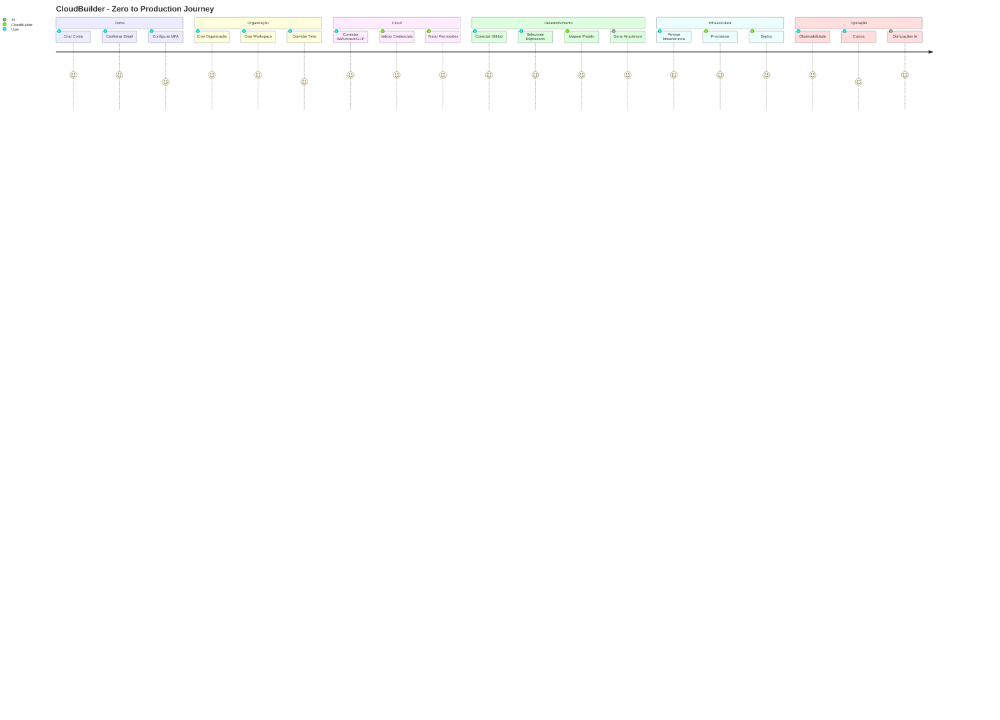
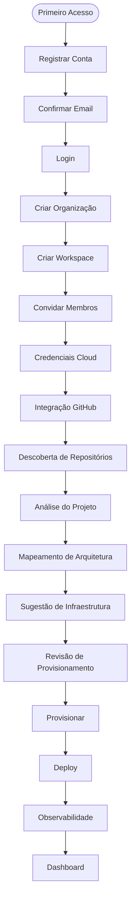
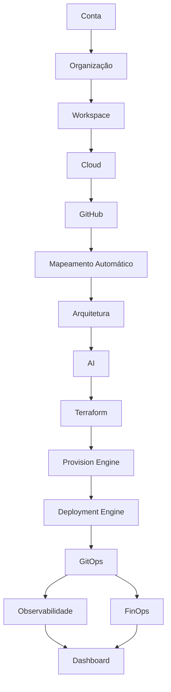

# Zero to Production Journey

## Overview

```mermaid
journey
    title CloudBuilder - Zero to Production Journey

    section Conta
        Criar Conta: 5: User
        Confirmar Email: 5: User
        Configurar MFA: 4: User

    section Organização
        Criar Organização: 5: User
        Criar Workspace: 5: User
        Convidar Time: 4: User

    section Cloud
        Conectar AWS/Azure/GCP: 5: User
        Validar Credenciais: 5: CloudBuilder
        Testar Permissões: 5: CloudBuilder

    section Desenvolvimento
        Conectar GitHub: 5: User
        Selecionar Repositório: 5: User
        Mapear Projeto: 5: CloudBuilder
        Gerar Arquitetura: 5: AI

    section Infraestrutura
        Revisar Infraestrutura: 5: User
        Provisionar: 5: CloudBuilder
        Deploy: 5: CloudBuilder

    section Operação
        Observabilidade: 5: User
        Custos: 4: User
        Otimizações IA: 5: AI
```

## First Access Flow

```mermaid
flowchart TB
    Start([Primeiro Acesso])

    Start --> Register[Registrar Conta]
    Register --> Email[Confirmar Email]
    Email --> Login[Login]
    Login --> CreateOrganization[Criar Organização]
    CreateOrganization --> CreateWorkspace[Criar Workspace]
    CreateWorkspace --> InviteMembers[Convidar Membros]
    InviteMembers --> CloudCredentials[Credenciais Cloud]
    CloudCredentials --> GithubIntegration[Integração GitHub]
    GithubIntegration --> RepositoryDiscovery[Descoberta de Repositórios]
    RepositoryDiscovery --> ProjectAnalysis[Análise do Projeto]
    ProjectAnalysis --> ArchitectureMapping[Mapeamento de Arquitetura]
    ArchitectureMapping --> InfrastructureSuggestion[Sugestão de Infraestrutura]
    InfrastructureSuggestion --> ProvisionReview[Revisão de Provisionamento]
    ProvisionReview --> Provision[Provisionar]
    Provision --> Deployment[Deploy]
    Deployment --> Observability[Observabilidade]
    Observability --> Dashboard[Dashboard]
```

## Progress Steps

```mermaid
flowchart LR
    Step1[Passo 1: Conta]
    Step2[Passo 2: Organização]
    Step3[Passo 3: Cloud]
    Step4[Passo 4: GitHub]
    Step5[Passo 5: Projeto]
    Step6[Passo 6: Arquitetura]
    Step7[Passo 7: Infraestrutura]
    Step8[Passo 8: Provisionamento]
    Step9[Passo 9: Deploy]
    Step10[Passo 10: Dashboard]

    Step1 --> Step2
    Step2 --> Step3
    Step3 --> Step4
    Step4 --> Step5
    Step5 --> Step6
    Step6 --> Step7
    Step7 --> Step8
    Step8 --> Step9
    Step9 --> Step10
```

## Full Pipeline

```mermaid
flowchart TB
    Conta[Conta]
    Org[Organização]
    Workspace[Workspace]
    Cloud[Cloud]
    GitHub[GitHub]
    AutoMap[Mapeamento Automático]
    Arq[Arquitetura]
    AI[AI]
    Terraform[Terraform]
    ProvisionEngine[Provision Engine]
    DeployEngine[Deployment Engine]
    GitOps[GitOps]
    Observabilidade[Observabilidade]
    FinOps[FinOps]
    Dash[Dashboard]

    Conta --> Org --> Workspace --> Cloud --> GitHub --> AutoMap
    AutoMap --> Arq --> AI --> Terraform --> ProvisionEngine
    ProvisionEngine --> DeployEngine --> GitOps
    GitOps --> Observabilidade
    GitOps --> FinOps
    Observabilidade --> Dash
    FinOps --> Dash
```
