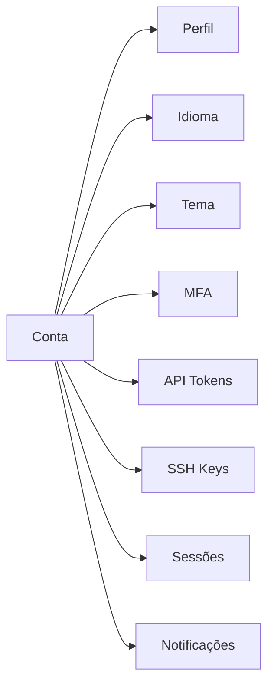
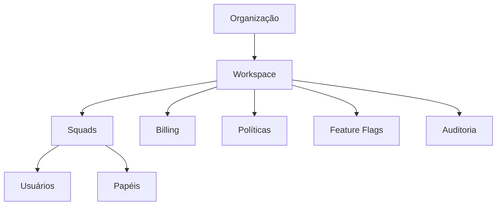

# Conta & Organização

## Account Settings

```mermaid
flowchart LR
    Conta[Conta]
    Perfil[Perfil]
    Idioma[Idioma]
    Tema[Tema]
    MFA[MFA]
    APITokens[API Tokens]
    SSHKeys[SSH Keys]
    Sessoes[Sessões]
    Notificacoes[Notificações]

    Conta --> Perfil
    Conta --> Idioma
    Conta --> Tema
    Conta --> MFA
    Conta --> APITokens
    Conta --> SSHKeys
    Conta --> Sessoes
    Conta --> Notificacoes
```

## Organization Management

```mermaid
flowchart TB
    Organization[Organização]
    Workspace[Workspace]
    Squads[Squads]
    Usuarios[Usuários]
    Papeis[Papéis]
    Billing[Billing]
    Politicas[Políticas]
    FeatureFlags[Feature Flags]
    Auditoria[Auditoria]

    Organization --> Workspace
    Workspace --> Squads
    Squads --> Usuarios
    Squads --> Papeis
    Workspace --> Billing
    Workspace --> Politicas
    Workspace --> FeatureFlags
    Workspace --> Auditoria
```
