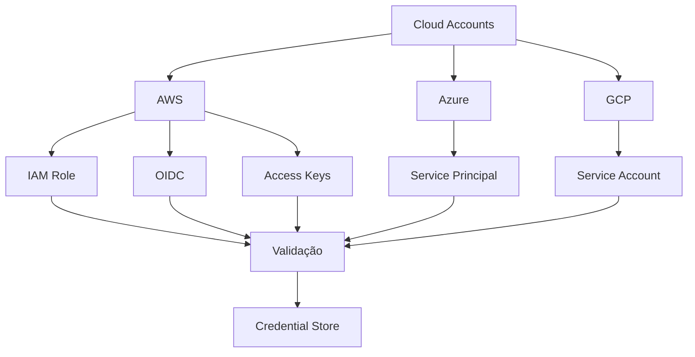
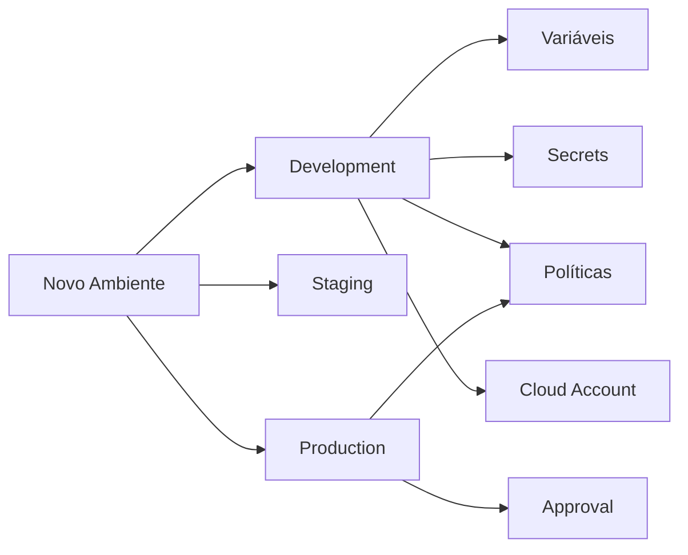

# Cloud & Ambientes

## Cloud Accounts

```mermaid
flowchart TB
    CloudAccounts[Cloud Accounts]

    CloudAccounts --> AWS
    CloudAccounts --> Azure
    CloudAccounts --> GCP

    AWS --> IAMRole[IAM Role]
    AWS --> OIDC[OIDC]
    AWS --> AccessKeys[Access Keys]

    Azure --> ServicePrincipal[Service Principal]

    GCP --> ServiceAccount[Service Account]

    IAMRole --> Validation[Validação]
    OIDC --> Validation
    AccessKeys --> Validation
    ServicePrincipal --> Validation
    ServiceAccount --> Validation

    Validation --> CredentialStore[Credential Store]
```

## Environments

```mermaid
flowchart LR
    NovoAmbiente[Novo Ambiente]
    Development[Development]
    Staging[Staging]
    Production[Production]

    NovoAmbiente --> Development
    NovoAmbiente --> Staging
    NovoAmbiente --> Production

    Development --> Variaveis[Variáveis]
    Development --> Secrets[Secrets]
    Development --> Policies[Políticas]
    Development --> CloudAccount[Cloud Account]

    Production --> Approval[Approval]
    Production --> Policies
```
