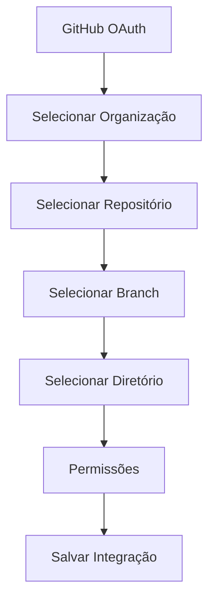
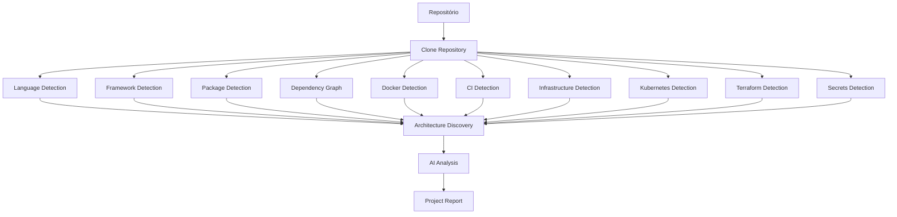
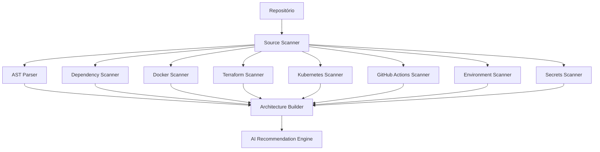

# GitHub & Descoberta

## GitHub Integration

```mermaid
flowchart TB
    GitHubOAuth[GitHub OAuth]
    SelectOrg[Selecionar Organização]
    SelectRepo[Selecionar Repositório]
    SelectBranch[Selecionar Branch]
    SelectDir[Selecionar Diretório]
    Perms[Permissões]
    SaveInt[Salvar Integração]

    GitHubOAuth --> SelectOrg --> SelectRepo --> SelectBranch --> SelectDir --> Perms --> SaveInt
```

## Project Discovery

```mermaid
flowchart TB
    Repository[Repositório]

    Repository --> CloneRepo[Clone Repository]
    CloneRepo --> LangDetect[Language Detection]
    CloneRepo --> FrameworkDetect[Framework Detection]
    CloneRepo --> PackageDetect[Package Detection]
    CloneRepo --> DepGraph[Dependency Graph]
    CloneRepo --> DockerDetect[Docker Detection]
    CloneRepo --> CIDetect[CI Detection]
    CloneRepo --> InfraDetect[Infrastructure Detection]
    CloneRepo --> K8sDetect[Kubernetes Detection]
    CloneRepo --> TerraformDetect[Terraform Detection]
    CloneRepo --> SecretsDetect[Secrets Detection]

    LangDetect --> ArchDiscovery[Architecture Discovery]
    FrameworkDetect --> ArchDiscovery
    PackageDetect --> ArchDiscovery
    DepGraph --> ArchDiscovery
    DockerDetect --> ArchDiscovery
    CIDetect --> ArchDiscovery
    InfraDetect --> ArchDiscovery
    K8sDetect --> ArchDiscovery
    TerraformDetect --> ArchDiscovery
    SecretsDetect --> ArchDiscovery

    ArchDiscovery --> AIAnalysis[AI Analysis]
    AIAnalysis --> ProjectReport[Project Report]
```

## Project Scanning

```mermaid
flowchart TB
    Repository[Repositório]
    SourceScanner[Source Scanner]

    Repository --> SourceScanner

    SourceScanner --> ASTParser[AST Parser]
    SourceScanner --> DependencyScanner[Dependency Scanner]
    SourceScanner --> DockerScanner[Docker Scanner]
    SourceScanner --> TerraformScanner[Terraform Scanner]
    SourceScanner --> KubernetesScanner[Kubernetes Scanner]
    SourceScanner --> GitHubActionsScanner[GitHub Actions Scanner]
    SourceScanner --> EnvironmentScanner[Environment Scanner]
    SourceScanner --> SecretsScanner[Secrets Scanner]

    ASTParser --> ArchBuilder[Architecture Builder]
    DependencyScanner --> ArchBuilder
    DockerScanner --> ArchBuilder
    TerraformScanner --> ArchBuilder
    KubernetesScanner --> ArchBuilder
    GitHubActionsScanner --> ArchBuilder
    EnvironmentScanner --> ArchBuilder
    SecretsScanner --> ArchBuilder

    ArchBuilder --> AIRecEngine[AI Recommendation Engine]
```
