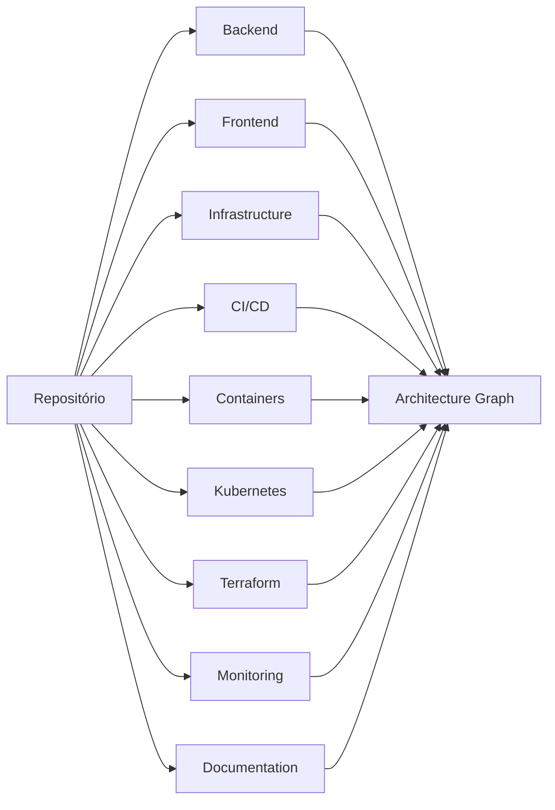
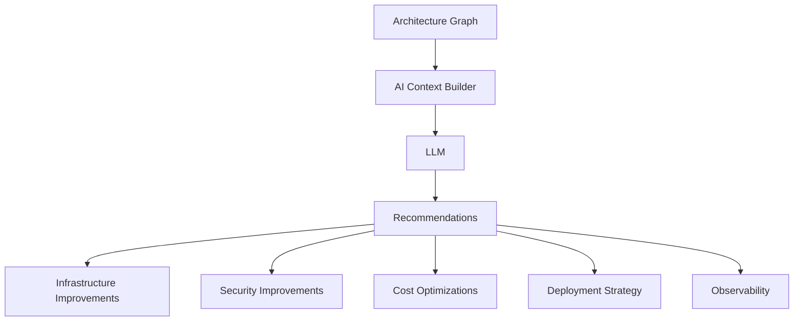

# Arquitetura & IA

## Architecture Components

```mermaid
flowchart LR
    Repository[Repositório]
    Backend[Backend]
    Frontend[Frontend]
    Infrastructure[Infrastructure]
    CICD[CI/CD]
    Containers[Containers]
    Kubernetes[Kubernetes]
    Terraform[Terraform]
    Monitoring[Monitoring]
    Documentation[Documentation]

    Repository --> Backend
    Repository --> Frontend
    Repository --> Infrastructure
    Repository --> CICD
    Repository --> Containers
    Repository --> Kubernetes
    Repository --> Terraform
    Repository --> Monitoring
    Repository --> Documentation

    Backend --> ArchGraph[Architecture Graph]
    Frontend --> ArchGraph
    Infrastructure --> ArchGraph
    CICD --> ArchGraph
    Containers --> ArchGraph
    Kubernetes --> ArchGraph
    Terraform --> ArchGraph
    Monitoring --> ArchGraph
    Documentation --> ArchGraph
```

## AI Recommendations

```mermaid
flowchart TB
    ArchGraph[Architecture Graph]
    AIContextBuilder[AI Context Builder]
    LLM[LLM]
    Recommendations[Recommendations]

    InfraImprovements[Infrastructure Improvements]
    SecurityImprovements[Security Improvements]
    CostOptimizations[Cost Optimizations]
    DeployStrategy[Deployment Strategy]
    Observability[Observability]

    ArchGraph --> AIContextBuilder --> LLM --> Recommendations

    Recommendations --> InfraImprovements
    Recommendations --> SecurityImprovements
    Recommendations --> CostOptimizations
    Recommendations --> DeployStrategy
    Recommendations --> Observability
```
