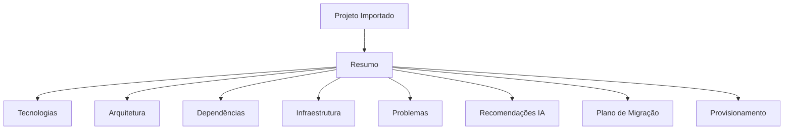

# Projeto Importado

## Project Summary



## Dashboard Terminal

```
+------------------------------------------------------------------+
| CloudBuilder                                                     |
+------------------------------------------------------------------+
| Projeto: cloudbuilder-api                                        |
| Branch: main                                                     |
| Ambiente: Production                                             |
+------------------------------------------------------------------+
| ✔ Arquitetura Detectada                                          |
| ✔ Kubernetes Detectado                                           |
| ✔ Docker Detectado                                               |
| ✔ Terraform Detectado                                            |
| ✔ GitHub Actions Detectado                                       |
| ✔ Observabilidade Detectada                                      |
+------------------------------------------------------------------+
| Recomendações da IA                                              |
| • Migrar Deployment para ArgoCD                                  |
| • Adicionar HPA                                                   |
| • Habilitar OpenTelemetry                                         |
| • Criar Redis Cache                                               |
| • Aplicar Naming Convention                                       |
+------------------------------------------------------------------+
| [Provisionar] [Gerar Terraform] [Deploy] [Abrir Canvas]          |
+------------------------------------------------------------------+
```
