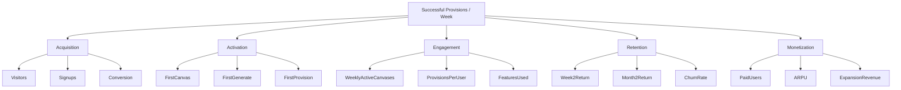

# North Star Metric

> Status: Draft | Owner: Product | Last Updated: 2026-08-14

## North Star Metric

**Successful provisions per week.**

### Why This Metric

| Criterion | Assessment |
|-----------|-----------|
| **Measures value delivery** | A successful provision means the user got real infrastructure from a visual design |
| **Captures activation** | User must complete the full workflow to provision |
| **Indicates retention** | Users who provision regularly are getting ongoing value |
| **Correlates with revenue** | More provisions = more resources = higher tier |
| **Not gameable** | Can't inflate by doing meaningless actions |
| **Actionable** | Every team can influence this metric |

### What It Represents

Each successful provision represents:
1. User designed infrastructure visually (canvas value)
2. Code was generated correctly (generation value)
3. Credentials were managed securely (security value)
4. Infrastructure was deployed successfully (execution value)
5. User received real cloud resources (outcome value)

### Counter-Metrics

| Counter-Metric | Why |
|---------------|-----|
| Failed provisions | High failure rate indicates product problems |
| Time to provision | Long times indicate friction |
| provisions per user | Ensure we're not dependent on power users |
| Revenue per provision | Ensure provisions convert to revenue |

## Metric Tree



## Supporting Metrics

### Acquisition

| Metric | Definition | Target |
|--------|-----------|--------|
| Website visitors | Unique visitors per month | 5,000 |
| GitHub stars | Repository stars | 1,000 |
| Signup conversion | Visitors → Signups | > 5% |

### Activation

| Metric | Definition | Target |
|--------|-----------|--------|
| First canvas created | User creates canvas with 2+ nodes | > 30% of signups |
| First generation | User generates Terraform code | > 25% of signups |
| First provision | User provisions infrastructure | > 20% of signups |
| Time to first provision | Minutes from signup to provision | < 30 min |

### Engagement

| Metric | Definition | Target |
|--------|-----------|--------|
| Weekly active canvases | Canvases modified per week | Growing |
| Provisions per user | Average provisions per active user | > 2/week |
| Feature adoption | % using 3+ features | > 40% |

### Retention

| Metric | Definition | Target |
|--------|-----------|--------|
| Week 2 return | % returning after 7 days | > 40% |
| Month 2 return | % returning after 30 days | > 25% |
| Logo churn | % of paid users who cancel | < 5%/month |

### Monetization

| Metric | Definition | Target |
|--------|-----------|--------|
| Free → Paid conversion | % upgrading to paid | > 5% |
| ARPU | Average revenue per user | $150/month |
| Expansion revenue | Revenue from upgrades | > 20% |
| NRR | Net revenue retention | > 110% |

## How to Measure

### Event Tracking

```json
{
  "event": "provision_succeeded",
  "properties": {
    "canvas_id": "uuid",
    "provider": "gcp",
    "resource_count": 4,
    "engine": "terraform",
    "duration_ms": 45000
  },
  "user_id": "uuid",
  "tenant_id": "uuid"
}
```

### Dashboard

Track daily/weekly/monthly:
- Total successful provisions
- Failed provisions
- Unique users provisioning
- Average time to provision
- Revenue per provision

## Decision Framework

When evaluating features or changes, ask:

> Will this increase successful provisions per week?

- **Yes, directly** → High priority
- **Yes, indirectly** (by improving activation/retention) → Medium priority
- **No** → Lower priority (unless P0 security/reliability)
