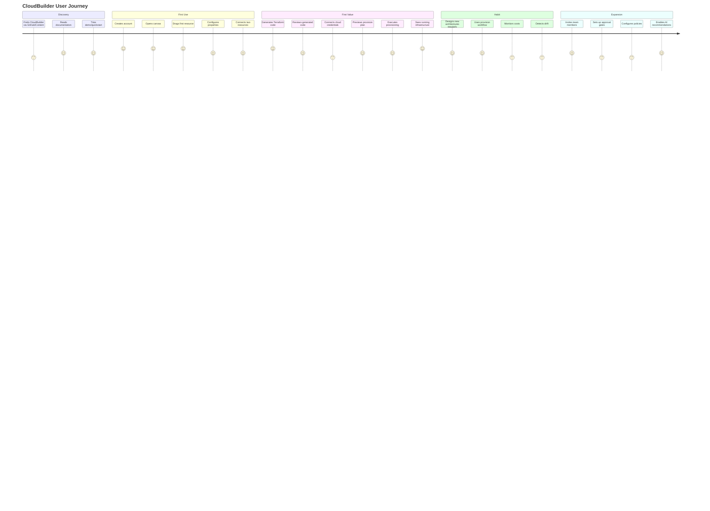

# Product Vision

> Status: Draft | Owner: Product | Last Updated: 2026-08-14

## Vision

CloudBuilder is the environment where engineering teams go from infrastructure intent to running, observed, cost-optimized cloud infrastructure — all within a single visual workspace.

## Product Principles

### 1. Visual First, Code Available
The default experience is visual (canvas). Power users can drop to code (Terraform, YAML) at any point. Visual and code representations are always in sync.

### 2. Safe by Default
Every action shows consequences before execution. Destructive actions require explicit confirmation. Policies validate before provisioning.

### 3. Progressive Complexity
Start with a blank canvas and drag a single resource. Complexity grows naturally as the user adds resources, connections, environments, and automation.

### 4. One Source of Truth
The canvas is the desired state. The cloud is the actual state. CloudBuilder reconciles the two, showing drift and enabling correction.

### 5. Provider-Agnostic Core
CloudBuilder works across AWS, GCP, Azure, and Kubernetes. Provider-specific behavior is encapsulated in adapters, not leaked into the core experience.

## Personas

### Platform Paulo
- **Role:** Platform Engineer at a 30-person SaaS startup
- **Goal:** Provide self-service infrastructure to developers without becoming a bottleneck
- **Current tools:** Terraform + GitHub Actions + AWS Console + Datadog + Slack
- **Pain:** 60% of his time goes to infrastructure requests instead of building the platform
- **CloudBuilder value:** Developers can visually design their infrastructure and self-serve provisioning

### DevOps Diana
- **Role:** DevOps Engineer at a 15-person startup
- **Goal:** Manage infrastructure across multiple environments with limited time
- **Current tools:** Terraform + CLI + spreadsheets for cost tracking
- **Pain:** No single view of infrastructure across staging and production
- **CloudBuilder value:** Unified canvas showing all environments, with drift detection and cost visibility

### CTO Carlos
- **Role:** CTO at a Series A startup (40 engineers)
- **Goal:** Understand infrastructure cost, security posture, and deployment status
- **Current tools:** AWS Cost Explorer + monthly reports from engineering
- **Pain:** No real-time visibility into infrastructure health and cost
- **CloudBuilder value:** Dashboard showing infrastructure status, cost trends, and policy compliance

## Jobs To Be Done

### Primary JTBDs

| When... | I want to... | So I can... |
|---------|-------------|------------|
| Designing a new service | Visually lay out infrastructure components | Communicate the design and catch gaps before coding |
| Design is approved | Generate production-ready Terraform automatically | Skip hours of manual HCL authoring |
| Terraform is generated | Preview what will be created/changed/destroyed | Understand impact before execution |
| Ready to provision | Execute with the right credentials and policies | Deploy safely without manual CLI steps |
| Infrastructure is running | Monitor health, cost, and drift | Detect and resolve issues proactively |

### Secondary JTBDs

| When... | I want to... | So I can... |
|---------|-------------|------------|
| Reviewing costs | See cost per resource and per environment | Identify optimization opportunities |
| Onboarding a new team | Import existing infrastructure into the canvas | Start managing without rebuilding |
| Approving a change | Review a plan with impact analysis | Make informed approval decisions |
| Debugging an incident | Understand what changed recently | Correlate changes with issues |
| Planning capacity | Project future costs based on growth | Budget accurately |

## User Journey

## Activation & Aha Moments

### Technical Activation
User successfully creates a canvas with at least 2 connected resources.

### Product Activation
User generates Terraform code from a canvas design and reviews the output.

### Aha Moment
User provisions real cloud infrastructure from a visual design and sees it running in their cloud console. This is the moment: **"I designed this visually, and now it's real infrastructure."**

### Business Activation
User provisions infrastructure for a real service (not a test) and returns to modify the design.

## Retention Drivers

| Driver | How it works |
|--------|-------------|
| **Stored designs** | Canvas designs accumulate over time, becoming the team's infrastructure knowledge base |
| **Provisioned state** | Running infrastructure managed through CloudBuilder creates ongoing engagement |
| **Cost visibility** | Cost tracking provides daily value even when not provisioning |
| **Drift detection** | Automated monitoring keeps users coming back to check status |
| **Team collaboration** | Multi-user designs create network effects within the organization |
| **Version history** | Design versioning creates a record of infrastructure evolution |

## Anti-Personas

| Anti-Persona | Why they're not the target |
|-------------|---------------------------|
| Solo hobbyist | Doesn't have the budget or infrastructure complexity to justify the tool |
| Enterprise with 500+ engineers | Has dedicated platform teams building custom IDPs |
| Non-technical founder | Needs a simpler solution than visual infrastructure design |
| AWS-only shop using CloudFormation | Already has provider-native tooling that works |

## Non-Goals

- **CI/CD pipeline management** — We generate infrastructure, not application deployments
- **Kubernetes cluster management** — We manage K8s resources, not clusters themselves
- **Log aggregation platform** — We integrate with observability tools, don't replace them
- **Cloud cost optimization platform** — We provide cost visibility, not a FinOps platform
- **General-purpose AI assistant** — Our AI is infrastructure-specific, not a chatbot
- **Multi-cloud cost optimization** — Too broad; focus on design → provision first

## Success Metrics

| Metric | Definition | Target |
|--------|-----------|--------|
| Time to first provision | Time from signup to first successful provisioning | < 30 minutes |
| Weekly active canvases | Number of canvases modified per week | Growth indicator |
| Provision success rate | % of provision attempts that succeed | > 90% |
| Return rate (week 2) | % of users who return after first provision | > 40% |
| Team adoption | % of users who invite team members | > 20% |
